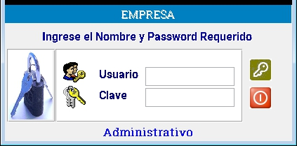

---

### **Documentación del Formulario de Inicio de Sesion**

#### **1. Descripción General**
El formulario de inicio de sesión es la puerta de entrada al sistema administrativo. Permite a los usuarios autenticarse ingresando sus credenciales (usuario y contraseña). Además, incluye dos botones: "Aceptar" para validar las credenciales y "Cancelar" para limpiar los campos y cerrar el formulario.

---

#### **2. Campos del Formulario**

##### **2.1. Campo de Usuario**
- **Etiqueta**: "Usuario"
- **Tipo de Campo**: Texto
- **Descripción**: El usuario debe ingresar su nombre de usuario o correo electrónico registrado en el sistema.
- **Requisitos**:
  - El campo es obligatorio.
  - No distingue entre mayúsculas y minúsculas.
  - Longitud máxima: 50 caracteres.
- **Validación**:
  - No puede estar vacío.
  - Debe coincidir con un usuario registrado en la base de datos.

##### **2.2. Campo de Contraseña**
- **Etiqueta**: "Contraseña"
- **Tipo de Campo**: Contraseña (texto oculto)
- **Descripción**: El usuario debe ingresar su contraseña.
- **Requisitos**:
  - El campo es obligatorio.
  - Distingue entre mayúsculas y minúsculas.
  - Longitud máxima: 20 caracteres.
- **Validación**:
  - No puede estar vacío.
  - Debe coincidir con la contraseña asociada al usuario.

---

#### **3. Botones del Formulario**

##### **3.1. Botón "Aceptar"**
- **Etiqueta**: "Aceptar"
- **Acción**:
  - Valida que los campos de usuario y contraseña no estén vacíos.
  - Verifica que las credenciales coincidan con los registros en la base de datos.
  - Si las credenciales son válidas, redirige al usuario al dashboard o página principal del sistema.
  - Si las credenciales son incorrectas, muestra un mensaje de error: "Usuario o contraseña incorrectos".
- **Comportamiento**:
  - Deshabilita el botón después de hacer clic para evitar múltiples intentos.
  - Muestra un indicador de carga mientras se procesa la solicitud.

##### **3.2. Botón "Cancelar"**
- **Etiqueta**: "Cancelar"
- **Acción**:
  - Limpia los campos de usuario y contraseña.
  - Cierra el formulario (si está en una ventana emergente) o redirige a la página de inicio.
- **Comportamiento**:
  - No realiza validaciones ni envía datos al servidor.

---

#### **4. Mensajes de Error y Validación**
- **Usuario vacío**: "Por favor, ingrese su nombre de usuario."
- **Contraseña vacía**: "Por favor, ingrese su contraseña."
- **Credenciales incorrectas**: "Usuario o contraseña incorrectos. Intente nuevamente."
- **Usuario no encontrado**: "El usuario no está registrado en el sistema."

---

#### **5. Ejemplo de Interfaz**
A continuación, se muestra un ejemplo visual del formulario:

---

#### **6. Flujo de Trabajo**
1. El usuario ingresa su nombre de usuario en el campo correspondiente.
2. El usuario ingresa su contraseña en el campo correspondiente.
3. El usuario hace clic en "Aceptar" para iniciar sesión.
   - Si las credenciales son válidas, se redirige al usuario al sistema.
   - Si las credenciales son incorrectas, se muestra un mensaje de error.
4. Si el usuario hace clic en "Cancelar", se limpian los campos y se cierra el formulario.

---

#### **7. Requisitos Técnicos**
- **Tecnología**: HTML, CSS, JavaScript (para validaciones del lado del cliente).
- **Backend**: Validación de credenciales en la base de datos (por ejemplo, usando SQL o un servicio de autenticación).
- **Seguridad**:
  - La contraseña debe transmitirse de manera segura (usar HTTPS).
  - Almacenar contraseñas encriptadas en la base de datos (usar algoritmos como bcrypt).

---

#### **8. Pruebas**
- **Caso 1**: Ingresar credenciales válidas y hacer clic en "Aceptar". Resultado esperado: Inicio de sesión exitoso.
- **Caso 2**: Ingresar credenciales incorrectas y hacer clic en "Aceptar". Resultado esperado: Mensaje de error.
- **Caso 3**: Hacer clic en "Cancelar". Resultado esperado: Limpiar campos y cerrar el formulario.

---
