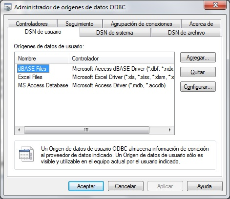

# Introducción
En este documento se describe brevemente el proceso de instalación y configuración del driver ODBC de Multibase en arquitectura cliente-servidor.

El driver de Multibase no lleva el Sql embebido, por ello es obligatorio tener instalado el motor CTSQL.
## **PROCESO DE INSTALACIÓN DEL DRIVER ODBC.**
Los pasos a seguir en la instalación del driver son los siguientes:

Desde el CD de instalación de Cosmos, solo para licencias de tipo Enterprise, podrá seleccionar la instalación del driver ODBC de 32 o del 64 bits.

1\.- Seleccionar el driver a instalar.

2\.- Seleccionar el idioma de instalación y pulsar el botón de "Aceptar".

3\.- La siguientes ventana que se muestra dependerá del driver que ha seleccionado.

a) Si el driver que se está instalando es el de 64 bits, la imagen mostrada será la Figura 1 

b) Si el driver que se está instalando es el de 32 bits, la imagen mostrada será la Figura 2 

4\.- Pulsar el botón "Siguiente" y seguir las instrucciones que se muestran en la pantalla.
## **CONFIGURACIÓN DEL DRIVER ODBC**
Pasos a seguir para configurar el driver ODBC de Multibase.
### *Crear origen de datos*
En la siguiente imagen se muestra el Origen de datos de los drivers de 64 bits. Desde aquí no se podrán ver los drivers de 32 bits instalados.

                     

En la siguiente imagen se muestra el Origen de datos de los drivers de 32 bits

Desde la pestaña DSN de usuario o de sistema se crea el nuevo origen de datos.

Pulsar el botón "Agregar"

Seleccionar el driver y pulsar el botón "Finalizar".

En la siguiente imagen deben rellenarse los siguientes campos.

![ref1]

**Data Source Name**: Indica el nombre que se va a dar al nuevo origen de datos y posteriormente se utilizará desde el cliente ODBC. Este valor es obligatorio.

**Description**: Breve descripción del origen de datos.

**Database Name**: Nombre de la base de datos CTSQL. Este campo es obligatorio.

**OEM to Ansi**: Este check debe marcarse solo si la base de datos CTSQL utilizada en la conexión fue creada con el set caracteres OEM. 

  
### *Definir variables de entorno*
Una vez creado el origen de datos hay que definir las variables de entorno necesarias para establecer una conexión cliente-servidor.

Para poder definirlas pulse el botón «Environmnet» .

![ref1]

En esta pantalla deben rellenarse al menos las siguientes variables de entorno:

**DBHOST**: Dirección IP o nombre del servidor donde se encuentra la base de datos

**DBPATH**: Ruta donde se encuentra la base de datos.

**DBUSER**: Usuario de conexión a la base de datos.

**DBPASSWD**: Contraseña del usuario de conexión a la base de datos

**DBSERVICE**: Nombre o número de puerto del servicio CTSQL

|**Valor** |**Gestor de BD** |
| :- | :- |
|ctsql |CTSQL (Cosmos) |
|gwinformix|Informix|
|gworacle|Oracle|

**XDBTEMP**: Ruta del directorio temporal del servidor

[ref1]: Aspose.Words.d6583dc3-1632-4b3e-9dc7-8959e4311be3.009.jpeg
