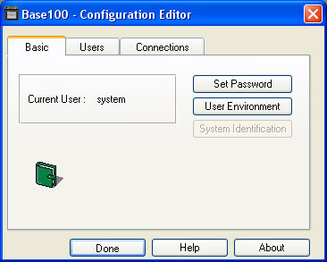
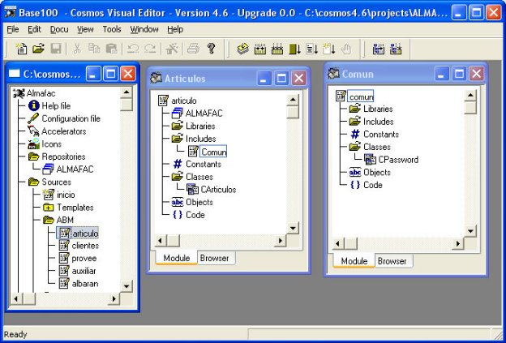
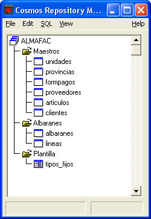
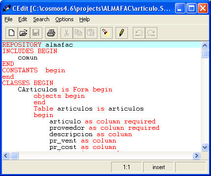
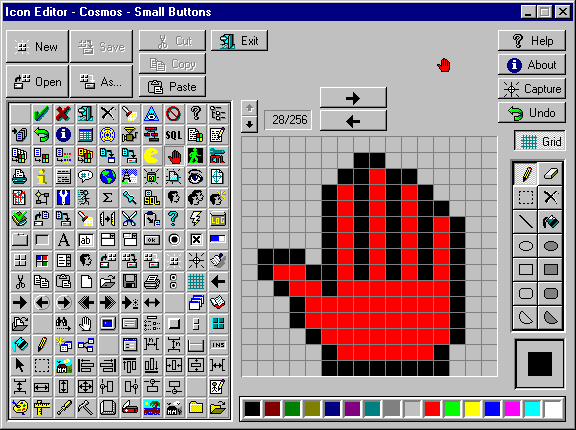
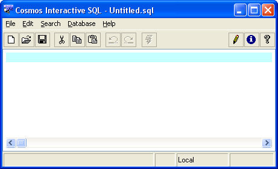
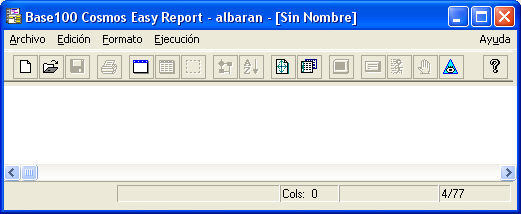
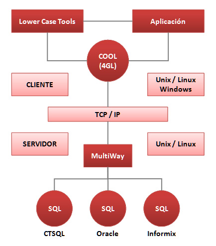
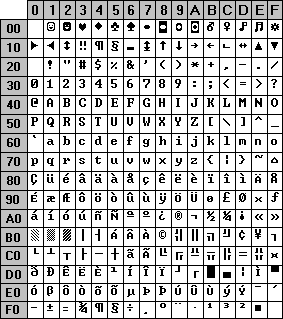
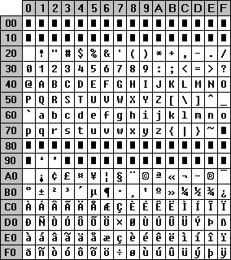

# Introducción
El presente capítulo proporciona una visión general de Cosmos a través de los elementos más significativos que componen el producto. 

Cosmos (COrporate Support MultiBase Object System) es una herramienta de programación visual orientada a objetos indicada para el desarrollo de aplicaciones de gestión, tanto en ámbitos corporativos de tipo cliente-servidor como para instalaciones departamentales y personales. 

Cosmos constituye una herramienta completa tanto para el desarrollo de aplicaciones de misión crítica como para el desarrollo de grandes proyectos y paquetes de software estándar. 

Cosmos incluye un entorno «RAD» (Rapid Application Development) de gran productividad, un lenguaje de cuarta generación orientado a objetos (COOL) y un gestor de base de datos relacional con interfaz SQL (CTSQL), todo ello complementado con un conjunto de herramientas auxiliares (editor de configuración, editor de código, editor de iconos, EasyReport, etc.). 

En los siguientes apartados de este capítulo se explica brevemente cada uno de los componentes de Cosmos. 
# COOL: Lenguaje de programación
El núcleo de Cosmos está constituido por un lenguaje de cuarta generación orientado a objetos, denominado COOL (Cosmos Object Oriented Language). Dicho lenguaje es el utilizado en la generación automática de código y el que se deberá utilizar para complementar el código escrito por el sistema. 

COOL incluye una serie de clases predefinidas, además de proporcionar al programador las herramientas necesarias para definir sus propias clases y facilitar la programación de aplicaciones. 

Algunas de las clases predefinidas en COOL resuelven por sí mismas muchos de los problemas más frecuentes de los programadores: «Form», «Page», «Menu», «Stream», «SqlStatement», «SqlCursor», entre otras. 

La clase «Form» será la clase «padre» de las diferentes clases de formato de pantalla que defina el programador. Una vez definida una clase de tipo «Form», el programador podrá definir objetos de esta clase en su programa. La clase «Form» tiene predefinidos una serie de métodos que permiten realizar tareas sencillas, como añadir, borrar o modificar filas de una tabla sin necesidad de programarlas, o tareas más complejas, como pueda ser el «Query\_by\_forms» o el mantenimiento de estructuras más complicadas, como una relación de 1 a «N» entre dos tablas. 

La clase «Page» permite la creación de páginas de impresora. por su parte la clase PrnDocument nos permite enviar estas páginas a impresora o bien mostrarlas en pantalla ("preview"). 

La clase «Menú» permite la definición de cualquiera de los diferentes tipos de menús soportados por Windows. Asimismo, se pueden definir menús asociados a un Form, para que formen parte de su interfaz de usuario. 

La sintaxis en COOL para ejecutar un método sobre un objeto sigue la secuencia «objeto.método(parámetros)», similar a otros lenguajes orientados a objetos. 

Al disponer de un conjunto de clases predefinidas, especializadas en las tareas más comunes de una aplicación Windows, COOL proporciona al programador toda la funcionalidad necesaria para el desarrollo de aplicaciones con una productividad elevada. 

La arquitectura modular de COOL permite la encapsulación de clases y objetos a los que se puede hacer referencia desde otros módulos. 

Con el fin de facilitar el desarrollo, el mantenimiento y la depuración de aplicaciones, COOL dispone de un depurador interactivo. 

Algunas de las características más importantes del COOL son las siguientes: 

- Orientado a objetos. 
- Modular: Una aplicación Cosmos estará compuesta por tantos módulos como se desee. Dichos módulos se cargarán dinámicamente en tiempo de ejecución. 
- Estructurado. 
- SQL con perfecto acoplamiento de tipos y estructuras (baja «impedance mistmatch»). 
- Moderno interfaz de usuario caracterizado por el empleo de distintos tipos de menús («pulldown», «Pop-Up», de botones), cajas de diálogo, ayuda en línea sensible al contexto, colores, ventanas, etc. 
- Comunicación entre programas por medio de librerías e «includes». 
- Depurador interactivo. 
- Funcionamiento transparente en arquitecturas cliente-servidor contra distintos SQLs. 
# CTSQL: Gestor de base de datos 
Cosmos dispone de un gestor de base de datos con interfaz SQL que le proporciona una total autonomía. El gestor de base de datos cumple con el estándar XOPEN-ISAM, mientras el interfaz SQL cumple con el estándar ANSI-SQL2.

CTSQL puede funcionar tanto en modo local como en modo cliente-servidor, y en ambos casos tiene capacidad multi-servidor, es decir, una misma instancia del lenguaje de cuarta generación COOL puede mantener abiertas simultáneamente varias bases de datos a través de una única instancia de CTSQL.

Estas características permiten a Cosmos el desarrollo de aplicaciones en modo local, independientemente de la arquitectura del sistema en el que la aplicaci n será finalmente ejecutada.

Entre las extensiones más significativas del CTSQL podemos citar, entre otras, las siguientes:

- Integridad de diccionario: En la definición de una columna de la base de datos no sólo se indica cuál es su nombre, su tipo y longitud, sino que, además, se puede definir también una serie de atributos de la columna que mantiene el propio gestor de la base de datos, entre los que podemos destacar: formato, máscara, lista de valores posibles, requerido (NOT NULL), tipo de letra (mayúscula, minúscula), etc.
- Integridad referencial: Se mantiene a través de la definición de claves primarias y referenciales.
- Secuencia de ordenación: En el momento de definir una base de datos se puede establecer también cuál será la secuencia de ordenación de caracteres. Con ello se consigue que en las ordenaciones, caracteres como la «ñ» o las vocales acentuadas aparezcan en el lugar que alfabéticamente les corresponde.
- Cursores bidireccionales: Por regla general, los cursores mantenidos por diferentes lenguajes SQL son unidireccionales, es decir, una vez abiertos sólo permiten lecturas hacia adelante. CTSQL permite lecturas adelante y atrás por medio de las instrucciones FETCH, FETCH PREVIOUS, FETCH FIRST y FETCH LAST.
- «Views» multitabla actualizables: Normalmente no se permite la actualización de tablas de la base de datos a través de «views» cuando en la definición de estas últimas estén involucradas más de una tabla. CTSQL sí permite este tipo de actualizaciones siempre que se cumplan ciertos requisitos de integridad referencial y claves primarias. 
# El editor de configuración
El editor de configuración permite modificar un [**fichero de configuración**](#chmtopic5) (por ejemplo: «COSMOS.INI») sin necesidad de recurrir a un editor de textos, pudiendo de esta forma editar entornos, definir usuarios y conexiones (local o remota), así como modificar el valor de las variables de entorno. El [**fichero de configuración**](#chmtopic5) «COSMOS.INI» se encuentra en el subdirectorio «etc» del directorio donde se haya instalado Cosmos. 

*Ventana principal del editor de configuración.*
# El editor visual 
Cosmos se apoya en un editor visual altamente intuitivo y de manejo muy sencillo. Este editor visual permite la creación de componentes y objetos de un proyecto por medio del mecanismo elemental de «arrastrar y soltar». 

Los elementos y objetos se incorporan desde sus paletas o repositorios al programa en construcción por medio del ratón. 

El editor visual dispone de todas las herramientas necesarias para la edición de cualquier componente software a incluir en un proyecto, incluyendo paletas que permiten la programación de un alto porcentaje de la aplicación arrastrando objetos hacia un lugar determinado del programa. 

Otra de las características del editor visual es su capacidad para clasificar los objetos de un proyecto en función de las necesidades del programador. Esto permite añadir nuevas categorías de clasificación al proyecto y redefinir las ya existentes de forma dinámica. 

*Ventana principal de editor visual.*
# El editor de repositorios 
Cosmos dispone de un editor de repositorios que automatiza el diseño de estructuras de datos. Estos repositorios, una vez definidos, pueden ser utilizados como paletas dentro del editor visual. 

El editor de repositorios permite la definición del tipo de interfaz gráfico para cada una de las columnas de la base de datos: en el momento de arrastrar una columna desde una paleta de repositorio hasta un diálogo, esta columna aparecerá en el diálogo con el interfaz gráfico que se haya definido. 

El editor de repositorios permite tanto la importación de esquemas de bases de datos desde una base de datos ya creada como el proceso inverso, esto es, la generación de un fichero SQL que incluya todas las instrucciones necesarias para la creación de una base de datos a partir de un repositorio determinado. 

Asimismo, permite directamente la creación o actualización de una base de datos a partir de la información contenida en el repositorio y viceversa. 

*Ventana principal del editor de repositorios.*
# El editor de código
Cosmos incluye un editor de código fuente, de nombre «CEdit», que permite la edición de ficheros de texto. Si bien su manejo es similar al de otros editores existentes para Windows, «CEdit» incorpora, además, algunas técnicas de edición propias. 

*Ventana principal del editor de código.*
# El editor de iconos
El editor de iconos permite añadir, borrar, modificar y editar ficheros de iconos. Estos ficheros podrán ser usados como paletas dentro del editor visual. Se pueden arrastrar iconos sobre las opciones de un menú, sobre controles de tipo «botón» y sobre algunos otros controles de una «screen» de un «Form» o una página de impresión. 

El editor de iconos permite crear dibujos sencillos o elaborados a color. 

*Ventana principal de editor de iconos.*
# El SQL interactivo 
El SQL interactivo permite generar y ejecutar ficheros con extensión «.sql» que contienen instrucciones pertenecientes al CTSQL.

El SQL interactivo es una herramienta que permite un interfaz directo con una base de datos tipo MultiWay u ODBC. Se puede utilizar para crear, modificar o consultar bases de datos tanto locales como remotas (en red local o cliente-servidor). Asimismo, a través del «gateway» apropiado, podrá acceder a otras bases de datos de distintos fabricantes.

Por otra parte, el SQL interactivo permite también la realización de ciertas operaciones relativas al tratamiento de ficheros SQL, como por ejemplo:

- Crear ficheros SQL.
- Trabajar con ficheros SQL existentes.
- Ejecutar ficheros SQL.
- Seleccionar la base de datos.
- Establecer conexiones. 

*Ventana principal del SQL interactivo.*
# EasyReport: Generación de informes
EasyReport es una herramienta que permite al usuario final definir sus propios informes a partir de la información contenida en una base de datos sin necesidad de conocer su estructura interna.

La conexión de EasyReport a través de MultiWay le permite el acceso en modo cliente-servidor tanto a bases de datos Cosmos como a las bases de datos más extendidas del mercado.

EasyReport está especialmente diseñado para realizar las siguientes tareas:

1. Obtención dinámica de informes de la base de datos.
1. Facilitar el acceso a esta información a un usuario no experto.
1. Ocultar la estructura interna de la base de datos al usuario final (nombres de tablas, columnas, etc.)
1. Generar y catalogar informes parametrizables para su posterior ejecución.

*Ventana principal de EasyReport.*
# **Editor de Instalaciones Cosmos. Introducción.**
El Editor de Instalaciones de Cosmos permite generar los ficheros de instalación de una aplicación o proyecto Cosmos. A partir de esos ficheros se podrá instalar la aplicación de una forma cómoda y rápida en cualquier equipo, sin más que invocar a un programa de setup. Esto facilita la distribución de la aplicación, puesto que una vez generada la instalación, ésta se puede copiar en CD-ROM, o bien se puede poner en una unidad de red, de modo que el usuario final pueda instalarla desde uno de estos soportes.

El Editor de Instalaciones parte de un proyecto Cosmos, y copia todos los ficheros que integran ese proyecto (fichero de configuración, repositorios, módulos fuente, módulos externos, y ficheros de mensajes) en un directorio de instalación suministrado por el usuario. En ese directorio se copiarán también una serie de ficheros ejecutables y dlls, que serán los encargados de llevar a cabo la instalación, así como un fichero setup.isf, que contendrá el ‘script’ de instalación, en el cual se indica qué se va instalar y cómo. Uno de los ejecutables será el fichero setup.exe que se encargará de interpretar el script de instalación y llevará ésta a cabo.
# Editor de páginas de impresión
El Editor de Páginas de impresión (pagedit.exe) , es una herramienta que permite diseñar las plantillas de las páginas (ficheros con extension .pag) para crear los impresos, formularios y listados de una aplicación. 

Utilizando este editor podrá: 

1. Añadir, borrar y modificar los controles de impresión. 
1. Editar y modificar las propiedades de un control de impresión. 
1. Mover, alinear, centrar, ajustar, espaciar y redimensionar un grupo de controles. 
1. Distribuir los controles en la página de impresión. 
1. Bloquear el movimiento de los controles de la página de impresión activa. Esta opción es útil aplicarla cuando se quiere seleccionar un control o un grupo de controles y no se desea que al seleccionarlo el control cambie de posición o tamaño. 
1. Asociar iconos a cierto tipo de controles. 
1. Utilizar diferentes colores. 
1. Utilizar diferentes tipos de fuentes. 
1. Definir el orden en el que se dibujarán los controles dentro de la página de impresión o de su control padre. 
1. Definir un control como padre de un grupo de controles. 
1. Realizar una presentación preliminar para ver el aspecto que tendrá una página de impresión cuando se imprima. 

Este editor de páginas tambien permite editar ficheros .drw. Los ficheros con extensión drw contienen los cuadros de diálogo utilizados por los distintos comandos de Cosmos. 
# Monitor del SQL
En monitor del SQL permite llevar un control de los accesos al motor SQL y de la actividad de los procesos existentes en el servidor. También podremos tener un control sobre los usuarios que acceden a las bases de datos. Restringiendo el acceso al servidor por la variable DBUSER o por la dirección IP desde la que se conecten los clientes.

La monitorización de los CTSQL-s se puede hacer desde la propia máquina servidora con el monitor en modo local, o de forma remota, con el monitor activado para el servidor deseado.

Esta versión incorpora un servicio TCP/IP denominado MONSER situado en el puerto 1099 del servidor CTSQL. Es accesible abriendo una conexión remota de cualquier máquina que soporte TCP/IP.
# ActiveX Scanner
El programa ActiveX Scanner permite obtener la siguiente información de las clases que hay dentro de un control ActiveX:

- Métodos : Da información de su nombre, clase de retorno, argumentos.
- Propiedades : Da información de su nombre, clase correspondiente en Cosmos.
- Eventos : Da información de su nombre y argumentos.
- Fichero de ayuda.

Esta información se puede obtener a partir de:

- CLSID del control ActiveX. 
- Fichero que contiene el control ActiveX (\*.olb, \*.tlb, \*.dll, \*.ocx, \*.exe). 
- ProgID del control ActiveX.
# Introducción
Antes de proceder a la instalación es aconsejable comprobar que ha recibido todos los elementos que constituyen la Licencia de Cosmos. Salvo casos excepcionales, una Licencia de Desarrollo deberá incluir: 

- Disco compacto (CD).
# Requisitos previos
Los requisitos de software y hardware necesarios para el correcto funcionamiento de Cosmos son los siguientes: 

**Instalaciones en monopuesto y red local (Cosmos y Cosmos/WG):** 

- Ordenador personal compatible con procesador x86/x64 compatible. 
- Microsoft Windows. 
- 150 Mbytes libres en el disco fijo (instalación completa). 
- Lector de discos compactos (CDs). 
- Ratón u otro dispositivo de puntero compatible. 
- Asimismo, será preciso disponer de espacio suficiente en disco duro para la creación de los ficheros temporales de Cosmos. 
- Las Licencias para red local precisarán, además, del software de red y de su correspondiente tarjeta. 

**Instalaciones en cliente-servidor:** 

En este tipo de instalaciones deberá disponer, además, de los siguientes elementos: 

- Una Licencia de Cosmos instalada en cada una de las máquinas «clientes». 
- Tarjeta de red.
- Las máquinas «clientes» Windows deberán cumplir asimismo los requisitos indicados anteriormente para la versión local (tipo de máquina, espacio en disco fijo, versión de Windows, etc.). 

**Instalaciones con «gateways»:** 

Este módulo es instalable únicamente en arquitecturas cliente-servidor. La máquina «servidor» deberá ser necesariamente UNIX, mientras que las máquinas «cliente» podrán ser DOS, Windows o también UNIX. 

Además de los requisitos expuestos anteriormente para la versión en modo cliente-servidor, será preciso disponer también del gestor de base de datos sobre el que se desee trabajar: 

INFORMIX: 

- La máquina «servidor» precisará una Licencia Run-Time con el correspondiente «gateway». 
- Servidor de la base de datos Informix: Informix-OnLine, versión hasta la 12. 
- Informix-ESQL Embedded Languages Runtime Facility. 

ORACLE: 

- La máquina «servidor» precisará una Licencia Run-Time con el correspondiente «gateway». 
- Servidor de la base de datos Oracle, versión 6.0 , 7.0. 8i, 9i 10g, 11g o 12c.
# Diferencias entre versiones
Cosmos está disponible en las siguientes versiones: 

- Cosmos: Licencia monousuario de Desarrollo. 
- Cosmos/WG: Licencia de Desarrollo hasta 3 usuarios. 
- Cosmos/SQL-Desk: Licencia Run-Time. 
- Cosmos/SQL-WG: Licencia Run-Time a partir de 3 usuarios. 
- Cosmos/SQL-Enterprise: Licencia Run-Time para instalaciones en cliente-servidor a partir de 3 usuarios. 

Las diferencias fundamentales entre las versiones de Desarrollo y las de Run-Time son las siguientes: 

1. Las versiones Run-Time no incorporan los compiladores ni el entorno de desarrollo.. 
1. Las versiones Run-Time no incluyen el compilador **cosmsg.** En las versiones de Desarrollo este comando se encuentra en el subdirectorio «bin» de Cosmos. Su función es compilar los ficheros de mensajes. 
1. Las versiones Run-Time incluyen únicamente el programa **cosrun** para permitir la ejecución de aplicaciones desarrolladas con Cosmos, así como el SQL interactivo, el editor de iconos, el editor de configuración, el editor de código y el EasyReport. 
# Instalación cliente-servidor
Antes de comenzar la instalación lea detenidamente los [**requisitos previos**](#chmtopic17). 

El funcionamiento en este tipo de arquitecturas consiste básicamente en lo siguiente: El lenguaje de programación de Cosmos (COOL) junto con los programas de la aplicación residen en la máquina «cliente» Windows, mientras que el gestor de la base de datos (CTSQL de MultiBase, Oracle e Informix), junto a la propia base de datos, se encuentran en el servidor UNIX/LINUX o Windows con soporte para instalar servicios . 

El procedimiento de instalación se realiza de acuerdo a las siguientes fases: 

- Puesta a punto de TCP/IP en el servidor. 
- Puesta a punto de la máquina «cliente» Windows. 
- Comprobación de comunicación entre ambas máquinas. 
- Instalación de un Run-Time para el gestor de base de datos en el servidor. 
- Instalación de Cosmos en la máquina «cliente». 

Todos los ejemplos que se exponen en estas fases se refieren al gestor de base de datos de MultiBase (CTSQL). La forma de operar con otros gestores se explica en la siguiente sección de este mismo capítulo (Gateways). 
## **1. PUESTA A PUNTO DE TCP/IP EN EL SERVIDOR**
Modificar los siguientes ficheros del servidor: «hosts», «services» y «inetd.conf» (sólo para UNIX): 

- Fichero «hosts»: Este fichero se encuentra en el directorio «/etc» para UNIX o «DIRECTORIOWINDOWS/system32/drivers/etc» para Windows. Se deberán incluir todos los nombres y direcciones tanto del servidor como de las máquinas «cliente». Una vez realizada esta operación, el fichero deberá presentar un aspecto similar al siguiente: 

127\.0.0.0 local localhosts 
125\.0.0.1 nombre\_servidor sinónimo\_servidor 
125\.0.0.2 nombre\_cliente1 sinónimo\_cliente1 
125\.0.0.3 nombre\_cliente2 sinónimo\_cliente2 
125\.0.0.4 nombre\_cliente3 sinónimo\_cliente3 

NOTA: La modificación del fichero hosts no será necesaria si el nombre del servidor es resuelto por el servidor de DNS o si se accede al mismo mediante dirección IP.

- Fichero «inetd.conf» (solo UNIX/LINUX): Este fichero se encuentra en el directorio «/etc» y es utilizado por el proceso «inetd», que es el encargado de invocar al gestor de base de datos cuando éste es requerido por algún «cliente» de la red. En este fichero se deberá añadir la siguiente línea: 

ctsql stream tcp nowait root $TRANSDIR/lib/ctsql ctsql system 3.6 0.0 NET 

Debiendo sustituir «$TRANSDIR» por el nombre del directorio donde esté instalado el Run-Time para el gestor de base de datos en este servidor. 

En estos casos no existe el fichero "inetd.conf". En su lugar existe un directorio, denominado "xinetd.d", donde se encuentran todos los servicios definidos, y en el que será necesario añadir un nuevo servicio (fichero) denominado "ctsql", que disponga de los mismos permisos que el resto de los ficheros de ese directorio. Para ello indicaremos: 

cd /etc
cd /xinetd.d
vi ctsql 

Una vez editado el fichero (este proceso debe realizarse como usuario "ctl" en modo superusuario) hay que añadir las siguientes líneas: 

\# default: on
\# description: The telnet server serves telnet sessions; it uses \
\# unencrypted username/password pairs for authentication.
service ctsql
{
`    `socket\_type = stream
`    `protocol = tcp
`    `wait = no
`    `instances = 100
`    `user = root
`    `server = $TRANSDIR/lib/ctsql
`    `server\_args = system 3.6 TRANSDIR/etc/ctsql.ini NET
`    `log\_on\_failure += USERID
`    `port = 5555
}

El puerto se debe sustituir por el puerto asignado al servicio "ctsql" en el fichero "services", tanto en el cliente como en el servidor. 

- Fichero «services»: Este fichero se encuentra en el directorio «/etc» para UNIX o «DIRECTORIOWINDOWS/system32/drivers/etc» para Windows. En él se indica el nombre del gestor de la base de datos (por ejemplo «CTSQL») junto al número de servicio que será común a «servidor» y «cliente». En este fichero habrá que añadir la siguiente línea: ctsql número/tcp ctsql El «número» debe ser único en todo el fichero «services», y deberá coincidir necesariamente con el de la máquina «cliente» que solicita el servicio. 
- Si el servidor es Windows se realizarán también los siguientes pasos: 
1. Crear un usuario. El usuario que arranca el servicio debe ser un usuario del grupo administradores del dominio local de la máquina servidor (no el "administrador"), y se recomienda que su contraseña sea perpetua, pues en caso contrario cada vez que caduque deberá activarse de nuevo el servicio. La longitud del nombre del usuario no debe exceder en ningún caso de 8 caracteres y, además, deber tener activadas las directivas de seguridad que se indican a continuación: 
   1. Actuar como parte del sistema operativo.
   1. Iniciar sesión como proceso por lotes.
   1. Iniciar sesión como servicio.

NOTA: El nombre del usuario no debe superar los 8 caracteres.

2. Instalar y activar el servicio. Ejecutar aplicación [**mwlisten.exe**](Mwlisten.chm::/Mwlisten.htm).
2. Activar el monitor si la versión del gestor CTSQL lo requiere.
## **2. PUESTA A PUNTO EN LA MÁQUINA «CLIENTE» WINDOWS** 
### *Modificación de los ficheros hosts y services de Windows*
- Fichero «hosts»: En este fichero se deberán incluir las direcciones y los nombres de cada una de las máquinas que intervienen en la red («servidores» y «clientes»). El aspecto del fichero será prácticamente idéntico al comentado para UNIX: 125.0.0.1 nombre\_servidor sinónimo\_servidor 125.0.0.2 nombre\_cliente1 sinónimo\_cliente1 125.0.0.3 nombre\_cliente2 sinónimo\_cliente2 125.0.0.4 nombre\_cliente3 sinónimo\_cliente3 Las direcciones y nombres asignados deberán coincidir en los ficheros equivalentes de todas las máquinas que conforman la red. 

NOTA: La modificación del fichero hosts no será necesaria si el nombre del servidor es resuelto por el servidor de DNS o si se accede al mismo mediante dirección IP.

- Fichero «services». La modificación que habrá que realizar es similar a la descrita para este mismo fichero en la fase de instalación en el servidor, consistente en añadir la siguiente línea: ctsql número/tcp ctsql El número asignado a este servicio debe ser único en todo el fichero, debiendo coincidir asimismo con el número asignado al mismo servicio en la máquina «servidor». 

NOTA: La modificación del fichero service no será necesaria si se accede al servicio por el número del puerto en lugar del alias.
## **3. COMPROBACIÓN DE COMUNICACIÓN ENTRE AMBAS MÁQUINAS**
Para comprobar que la instalación del paquete de comunicaciones (TCP/IP en UNIX o Windows) se ha realizado de manera satisfactoria, puede ejecutar el comando **ping** seguido del nombre de la máquina (el que se haya definido en el fichero «hosts»). Para mayor seguridad, ejecute dicho comando tanto en el servidor (UNIX) como en el «cliente» (Windows). 

A continuación, compruebe si existe comunicación entre ambas máquinas («servidor» y «cliente»). Para ello podrá utilizar también el comando **ping** seguido del nombre de la máquina («servidor» si lo ejecuta desde la máquina «cliente» o viceversa). 

En la máquina «cliente» Windows se podrá utilizar también el comando telnet para comprobar si la comunicación es correcta o no: telnet <dirección IP> <número del puerto>
## **4. INSTALACIÓN DE COSMOS EN LA MÁQUINA «CLIENTE»** 
Para instalar Cosmos en Windows consulte la guía de instalación. 
# Instalación de gateways (MultiWay)
Esta información está disponible a través de la página web de BASE 100 en el documento: [**Acceso desde MultiBase y Cosmos a los gestores de base de datos de Oracle e Informix**](https://www.base100.com/es/notastec/pdf/NT_multiway_v6.pdf). 
# Organización de directorios
Cosmos se organiza en distintos directorios y subdirectorios dentro de la partición elegida para su instalación. Esta organización es común tanto para las Licencias de Desarrollo como para las de Run-Time, existiendo no obstante algunas diferencias que se indican en cada caso. 

Los diferentes directorios y subdirectorios en los que se estructura Cosmos son los siguientes: «bin», «drw», «etc», «msg», «projects» y «samples». A continuación se comenta la información contenida en cada uno de ellos: 

1. Directorio «bin»: Dentro de este directorio se encuentran todos los ficheros ejecutables correspondientes a los distintos comandos de Cosmos: 

   |ceasyrep|Para la realización de informes a partir de la información contenida en una base de datos. |
   | :- | :- |
   |cedit|Editor de código fuente. |
   |cosbooks|Este programa es un visualizador de ficheros de ayuda.|
   |coscds|Editor de Esquemas Conceptuales de Datos. |
   |cosconf|Editor de configuración. |
   |cosicons|Editor de iconos. |
   |cosinfo|Genera un listado con las propiedades, los métodos y eventos predefinidos en Cosmos. |
   |cosmake|Compilador del lenguaje orientado a objetos de cuarta generación COOL (disponible únicamente en versiones de Desarrollo). |
   |coscom|ActiveX scanner.|
   |cosmos|Editor visual. |
   |cosmoswebserver|Servidor Web.|
   |cosmsg|Compilador de ficheros de mensajes (disponible únicamente en versiones de Desarrollo). |
   |cosrep|Editor de repositorios. |
   |cosrun|Ejecutor de programas Cosmos. |
   |csql|Sql Interactivo. |
   |monitor|Monitor del SQL.|
   |pageedit|Editor de páginas de impresión.|
   |tchkidx|«Chequeador» de tablas de la base de datos. |
   |tcollcom|Compilador de ficheros de secuencias de ordenación para el gestor de bases de datos (disponible únicamente en versiones de Desarrollo). |
   |tlisterr|Monitorización de posibles errores en las tablas de la base de datos. |
   |trepidx|Reparador de tablas defectuosas de la base de datos. |
   |tttools|Chequeador y reparador de base de datos.|

2. Directorio «drw» y subdirectorios: Dentro de este directorio se encuentran todos los ficheros con extensión «.drw» que contienen los cuadros de diálogo utilizados por los distintos comandos de Cosmos. 
2. Directorio «etc»: En este directorio se incluyen ficheros de iconos (con extensión «.bmp») y el fichero de configuración de Cosmos [**«COSMOS.INI»**](#chmtopic5). 
2. Directorio «msg» y subdirectorios: Incluyen los ficheros de mensajes de Cosmos, respectivamente, así como los ficheros de ayuda en línea. 
2. Directorio «projects» y subdirectorios: Incluyen los programas fuentes de la aplicación de demostración y la base de datos utilizada por la misma. 
2. Directorio «samples»: Incluye otros ejemplos de demostración utilizados por la ayuda en línea. 
# Ficheros empleados por Cosmos
Cosmos genera y utiliza una serie de ficheros identificados por sus extensiones. Estas extensiones y sus correspondientes significados son los siguientes: 

«\*.prj» 
Fichero binario donde se guarda la estructura y configuración del proyecto (nombres de los módulos, librerías, «includes», fichero de mensajes, etc.). 

«\*.pws» 
Este fichero guarda el estado de ejecución del proyecto abierto (ventanas abiertas, minimizadas, etc.) en un fichero binario con el mismo nombre que el proyecto y extensión «.pws». Dicho estado se recupera cuando se vuelve a ejecutar el editor visual. Este fichero se crea cuando se guarda el proyecto por primera vez y se actualiza cada vez que se vuelve a guardar posteriormente cuando se realiza alguna modificación. 

«\*.smd» 
Fichero ASCII que contiene el código fuente de un programa, una librería o un «include». 

«\*.omd» 
Ficheros objeto generados por el compilador de Cosmos (**cosmake**). Durante el desarrollo de una aplicación estos ficheros tienen que encontrarse en el mismo directorio que los módulos fuente (ficheros con extensión «.smd»). 

«\*.shl» (source help file) 
Ficheros fuente que contienen los mensajes del usuario. Estos ficheros son de tipo ASCII, y por tanto editables con cualquier editor de textos. Durante el desarrollo de una aplicación estos ficheros tienen que encontrarse en el mismo directorio que los módulos fuente (ficheros con extensión «.smd»). 

«\*.ohl» (object help file) 
Ficheros de mensajes compilados con **cosmsg**. Durante el desarrollo de una aplicación estos ficheros tienen que encontrarse en el mismo directorio que los ficheros fuente (ficheros con extensión «.shl»). 

«\*.oms» (object help file) 
Similar a los anteriores, pero empleando la opción «-s» en el comando **cosmsg**. 

«\*.crf» 
Ficheros binarios donde se guarda la estructura de los repositorios. Estos ficheros son generados por el editor de repositorios (programa «cosrep.exe»). 

«\*.bmp»
Ficheros de iconos generados con el editor de iconos «cosicons.exe». 

«\*.scs» (source collating sequence) 
Estos ficheros se encargan de componer el orden de caracteres en la tabla ASCII para utilizarla en las operaciones de comparación y ordenación, y son asignados a la base de datos cuando ésta se genera con la instrucción CREATE DATABASE y la cláusula «COLLATING». Por defecto, Cosmos incluye un fichero «spanish.scs» como ejemplo, cuyas características se han comentado anteriormente en este mismo volumen. 

«\*.ocs» (objects collating sequence) 
Ficheros objetos generados por el compilador de ficheros de ordenación (**tcollcom**). 

«\*.sql» (structured query language) 
Ficheros ASCII que incluyen instrucciones del SQL. La forma de ejecutar estos ficheros es mediante el SQL interactivo (programa «csql.exe»), o bien con los m todos «SqlFile» y «SqlToFile» de la clase «SqlServer» predefinida en el lenguaje de Cosmos. 

«\*.unl» (unload) 
Ficheros ASCII generados al descargar una tabla. Estos ficheros contienen todas las filas de la tablas descargadas en formato ASCII, y su estructura es la generada por la instrucción UNLOAD: Cada línea del fichero corresponde con una fila de la tabla, diferenciando los campos mediante un separador que, por defecto, es la barra vertical (carácter ASCII 124 «|»). 

«\*.dbs» (database) 
Directorio que representa la base de datos creada por el CTSQL. Las tablas de la base de datos se almacenarán en este directorio. 

«\*.dat» (data)
Fichero binario que contendrá los datos de una base de datos. La única forma de acceso a este fichero es mediante instrucciones del CTSQL. Este fichero tiene que estar siempre en el mismo directorio que su respectivo «\*.idx». 

«\*.idx» (index) 
Fichero binario que contendrá la estructura de todos los índices relativos a una tabla de la base de datos. Este fichero tiene que estar siempre en el mismo directorio que su respectivo «\*.dat». La elección del índice por el cual se desea acceder a los datos depende de la optimización de la instrucción SELECT del CTSQL (cláusulas «WHERE» y «ORDER BY»). 

NOTA: No editar nunca los ficheros de extensión «\*.dat» e «\*.idx». 

**Ficheros específicos de EasyReport (comando ceasyrep):**

«\*.trw» 
Ficheros que contienen la especificación completa de un Esquema Conceptual de Datos. 

«\*.orw» 
Ficheros generados por EasyReport cada vez que el usuario guarda un informe, siendo «informe» el nombre asignado por el usuario. 

«\*.crw» 
Fichero que contiene el catálogo correspondiente a un Esquema Conceptual de Datos. Este fichero incluirá los nombres y las descripciones de los informes guardados por el usuario. 

«\*.eps»
Ficheros generados por EasyReport con la información del estilo que se mostrará en los informes tipo estandard gráfico.

**PageEditor**

«\*.pag»
Fichero generados por el PageEditor. Ficheros de impresión. Para manejar estas hojas de impresión se debe utilizar la dll prnpag32. 

**IMPORTANTE**

*Los ficheros de extensión «orw» guardan (en formato no editable) no sólo la información correspondiente al informe generado, sino también la estructura completa del ECD con el que se creó. Por lo tanto, una modificación en un ECD posterior a la creación de un informe no afecta en absoluto a éste. Al modificar el informe le aparecerá al usuario la estructura del ECD con la que se creó por primera vez el informe.* 
# Fichero de configuración «Cosmos.ini» 
El fichero de configuración «COSMOS.INI» contiene algunas de las características con las que deberán arrancar las aplicaciones que lo utilizan. Este fichero se encuentra en el subdirectorio «etc» del directorio donde se encuentre instalado Cosmos.

El fichero «COSMOS.INI» está especialmente diseñado para facilitar la definici n de usuarios y entornos (de usuario y de conexión local o remota), ficheros de iconos, etc.

Cualquier línea de comentario en el fichero de configuración deberá comenzar siempre por un punto y coma («;»).

Este fichero de configuración es utilizado por el «editor de configuración» de Cosmos.

Las secciones que componen el fichero «COSMOS.INI» son las siguientes:

- [**Sección \[Passwords**](#chmtopic23)].
- [**Sección \[Cosmos\]**](#chmtopic24).
- [**Sección \[Connections\]**](#chmtopic25).
- [**Sección \[Environment\]**](#chmtopic26).
- [**Sección \[Icons\]**](#chmtopic27).
- [**Sección \[Cosmos Visual Editor\]**](#chmtopic28)
- [**Sección \[Custom Colors\]**](#chmtopic29)

En los siguientes apartados se comenta en detalle cada una de estas secciones.
# Sección [Passwords]
En esta sección se definen los usuarios que pueden acceder a las aplicaciones Cosmos que utilizan el fichero de configuración. Contendrá una línea y sólo una por cada usuario definido. La sintaxis de un elemento de esta sección es la siguiente: 

[Passwords] 
usuario=contraseña\_encriptada\_por\_el\_editor\_de\_configuración. 

Donde: 

Usuario
Nombre con el que se desea identificar al usuario de las aplicaciones Cosmos.

Contraseña
Contraseña encriptada del usuario. 

En esta sección debe estar siempre definido el usuario «system», que será el administrador del sistema. Por ejemplo: 

[Passwords] 
system=:$x}wamgzkes{\*) 
# Sección [Cosmos]
Esta sección contendrá entradas genéricas para todas las aplicaciones Cosmos que utilizan el fichero de configuración. 

En esta sección se define el usuario que van a utilizar por defecto las aplicaciones Cosmos al arrancar. Dicho usuario tiene que estar definido en la sección «Passwords». 

La sintaxis de esta sección es la siguiente: 

[Cosmos] 
USER=nombre 

Donde: 

Nombre
Identifica el nombre del usuario con el que van a arrancar las aplicaciones Cosmos por defecto. 

Si esta entrada aparece no se preguntará por el usuario, aunque sí por la contraseña si ésta no es nula. Por ejemplo: 

[Cosmos] 
USER=system 
# Sección [Connections]
En esta sección se definen las conexiones locales o remotas para facilitar la utilización de otros gestores de base de datos. Su sintaxis es la siguiente: 

[Connections] 
nombre=tipo 

Donde: 

Nombre
Indica el nombre con el que se desea identificar la conexión.

Tipo
Tipo de la conexión anterior. Puede tener los siguientes valores: 

Local
Para conexiones locales.

Remote
Para conexiones remotas (cliente-servidor). 

Ejemplo: 

[Connections] 
oracle=remote
local=local 
# Sección [Environment]
El valor inicial de las variables de entorno se guardará en el fichero «COSMOS.INI» en varias secciones. Estas secciones son las siguientes: 

[Environment]
Contiene las variables de entorno cuyos valores son comunes a todos los usuarios. 

[Environment nombre]
Contiene las variables de entorno definidas para «nombre», pudiendo ser éste el nombre de un usuario definido en la sección «Passwords», el nombre de una conexión definida en la sección «Connections» o un nombre arbitrario para definir un entorno independiente. 

La sintaxis de estas secciones es la siguiente: 

variable=valor 

Donde: 

Variable
Nombre de la variable de entorno que se desea definir para el «nombre» indicado anteriormente.

Valor
Valor que se desea asignar a la variable de entorno (puede ser vacío). 

Cada grupo «variable-valor» puede ocupar una línea como máximo. Por ejemplo: 

Entorno GLOBAL: 

[Environment] 
DBPATH=c:\mbdemo 
DBEDIT=c:\cosmos\bin\wedit
TRWPATH=c:\mbdemo 
DBTEMP=c:\tmp

Entorno del usuario «system»: 

[Environment system] 
DBDATE=MDY2 
DBDELIM=| 

Entorno de conexión con Oracle: 

[Environment oracle] 
DBHOST=unix 
DBUSER=clientes 
DBSERVICE=ctsql 
DBPASSWD=hola 

NOTA: Para comentar una variable de entorno utilizar el carácter «;»
# Sección [Icons]
En esta sección se definen los ficheros de iconos que utilizarán las aplicaciones.

La sintaxis de un elemento de esta sección es la siguiente: 

[Icons] 
Nombre\_lógico=nombre\_fichero, ancho\_botón, alto\_botón, color\_fondo 

Donde: 

Nombre\_lógico 
Identificador del fichero de iconos.

Nombre\_fichero 
«Path» completo o relativo al subdirectorio «etc» del directorio donde se haya instalado Cosmos. 

Ancho\_botón 
Ancho en «pixels» de los iconos.

Alto\_botón 
Alto en «pixels» de los iconos.

Color\_fondo 
Puede ser RGB (rojo, verde, azul) o cualquier nombre de color reconocido por Cosmos. 
# Sección [Cosmos Visual Editor]
En esta sección se define el modo de trabajo del editor visual: 

- Monousuario.
- Multiusuario. 

La sintaxis de esta sección es la siguiente:

[Cosmos Visual Editor]
MultiUser=TRUE

Si MultiUser=TRUE se trabaja en modo multiusuario y si es FALSE se trabaja en modo monousuario.

También se puede definir el modo de trabajo en la [**línea de comandos del editor visual**](#chmtopic30).
# Sección [Custom Colors]
Esta sección contendrá el nombre de la propiedad y valor de los colores utilizados en la personalización de los controles de un Form.

Las propiedades que se describen a continuación se deben definir en el sección **[Custom Colors]** del fichero de configuración de Cosmos o del proyecto.

El color podrá asignarse mediante:

a. La expresión Rgb (rojo, verde, azul), siendo rojo, verde y azul los tonos de color en base 10.

b. Con el valor en hexadecimal que representa el color, usando una expresión en el siguiente formato: #RRGGBB, siendo RR, GG y BB el valor hexadecimal correspondiente a rojo, verde y azul respectivamente.

3. La palabra clave "TRANSPARENT". Este valor solo se podrá asignar a la propiedad *Background* de un control.

A partir de la versión 7.6 de Cosmos se podrán definir las siguientes características:

- El texto y el color de fondo de los controles Panel y Bar de manera independiente. 
- El color del borde de los controles tipo Box, Radio, Check, Panel y Bar.
- El color de fondo y del texto de un control de edición cuando se selecciona texto.
- El color del borde y el color de texto de un control de edición.
- Transparencia en el color de fondo de los controles. Si a la propiedad *Background*se le asigna la palabra clave "TRANSPARENT" en lugar de indicar un valor RGB, los controles tendrán un fondo transparente, es decir, se mostrarán sobre el color que tenga definido el control padre.

Ejemplo:

#Aux Button
Color\_Text\_AuxButton=#000
Color\_Text\_AuxButton\_Disabled=Rgb(128,128,128)
Color\_Text\_AuxButton\_Hot=#000
Color\_Text\_AuxButton\_Pressed=#000
Color\_Text\_AuxButton\_Focused=#000
Color\_Back\_AuxButton\_Hot=#f9f9f9
Color\_Back\_AuxButton\_Pressed=#f9f9f9
Color\_Back\_AuxButton\_Focused=#f9f9f9
Color\_Back\_AuxButton=#f9f9f9
Color\_Back\_AuxButton\_Disabled=#d2d2d2
Color\_Border\_AuxButton\_Disabled=#d2d2d2

**Colores de fondo en controles BOX**

|Color\_Text\_Box|Indica el color del texto de la etiqueta de la caja. La propiedad [**LABELFORECOLOR**](#chmtopic31) de la sección [**Custom Controls**](#chmtopic31) prevalecerá sobre ésta.|
| :- | :- |
|Color\_Back\_Box |Indica el color de fondo de la caja.|
|Color\_Border\_Box|Indica el color del borde la caja y el será el utilizado por la propiedad [**DRAWHEADER**](#chmtopic31) de la sección [**Custom Controls**](#chmtopic31).|

**Colores del texto y de fondo de cabecera en controles GRID y LIST**

|Color\_Text\_Header|Indica el color del texto de la cabecera del control.|
| :- | :- |
|Color\_Text\_Header\_Disabled|Indica el color del texto de la cabecera cuando el control está deshabilitado.|
|Color\_Text\_Header\_Hot |Indica el color del texto cuando el puntero del ratón está en la cabecera.|
|Color\_Text\_Header\_Pressed|Indica el color del texto al presionar la cabecera.|
|Color\_Back\_Header |Indica el color del fondo de la cabecera del control.|
|Color\_Back\_Header\_Disabled |Indica el color del fondo de la cabecera cuando el control está deshabilitado.|
|Color\_Back\_Header\_Hot|Indica el color del fondo cuando el puntero del ratón está en la cabecera.|
|Color\_Back\_Header\_Pressed|Indica el color del texto al hacer clic en la cabecera.|

**Colores del texto, de fondo y bordes en controles BUTTON**

|Color\_Text\_Button|Indica el color del texto.|
| :- | :- |
|Color\_Text\_Button\_Disabled|Indica el color del texto cuando el botón está deshabilitado.|
|Color\_Text\_Button\_Hot|Indica el color del texto cuando el puntero del ratón está encima del botón.|
|Color\_Text\_Button\_Pressed|Indica el color del texto cuando el puntero del ratón está encima del botón.|
|Color\_Text\_Button\_Focused|Indica el color del texto cuando el foco está en el control.|
|Color\_Back\_Button |Indica el color de fondo del botón.|
|Color\_Back\_Button\_Disabled |Indica el color de fondo cuando el botón está deshabilitado.|
|Color\_Back\_Button\_Hot |Indica el color de fondo del control cuando el puntero del ratón está encima del botón.|
|Color\_Back\_Button\_Pressed |Indica el color de fondo del control cuando el botón está presionado.|
|Color\_Back\_Button\_Focused|Indica el color de fondo del control cuando éste recibe el foco.|
|Color\_Border\_Button\_Disabled|Indica el color del borde del control cuando está deshabilitado.|
|Color\_Border\_Button|Indica el color del borde del control.|
|Color\_Border\_Button\_Hot |Indica el color del borde del control cuando el ratón está encima del botón.|
|Color\_Border\_Button\_Pressed|Indica el color del borde del control cuando el botón está presionado.|
|Color\_Border\_Button\_Focused|Indica el color de fondo del control cuando éste recibe el foco.|

` `**Colores de fondo, texto y bordes de botones auxiliares de controles SPIN, EDIT FIELD con combo, DROP LIST y DROP EDIT**

|Color\_Text\_AuxButton|Indica el color del icono del botón auxiliar del control.  En el caso de los Edit field solo si tienen asignado el icono por defecto.|
| :- | :- |
|Color\_Text\_AuxButton\_Disabled|Indica el color del icono del botón auxiliar cuando éste está deshabilitado. En el caso de los Edit field solo si tienen asignado el icono por defecto.|
|Color\_Text\_AuxButton\_Hot|Indica el color del icono del botón auxiliar cuando el puntero del ratón esté posicionado encima del botón. En el caso de los Edit field solo si tienen asignado el icono por defecto.|
|Color\_Text\_AuxButton\_Pressed|Indica el color del icono del botón auxiliar cuando está presionado. En el caso de los Edit field solo si tienen asignado el icono por defecto.|
|Color\_Text\_AuxButton\_Focused|Indica el color del icono del botón auxiliar cuando éste recibe el foco.  En el caso de los Edit field solo si tienen asignado el icono por defecto.|
|Color\_Back\_AuxButton |Indica el color de fondo del botón auxiliar del control.|
|Color\_Back\_AuxButton\_Disabled|Indica el color de fondo del botón auxiliar cuando está deshabilitado.|
|Color\_Back\_AuxButton\_Hot|Indica el color de fondo del botón auxiliar cuando el puntero del ratón está posicionado sobre él.|
|Color\_Back\_AuxButton\_Pressed|Indica el color de fondo del botón auxiliar cuando está presionado.|
|Color\_Back\_AuxButton\_Focused|` `Indica el color de fondo del botón auxiliar cuando éste recibe el foco.|

` `**Colores de fondo y de bordes en controles TAB**

|Color\_Text\_Tab |Indica el color del texto del control.|
| :- | :- |
|Color\_Back\_Tab|Indica el color de fondo del control.|
|Color\_Border\_Tab|Indica el color del borde del control Tab.|
|Color\_Flap\_Tab|Indica el color a las pestañas no seleccionadas del control Tab.|

**Controles TEXT**

|Color\_Text\_Text |Indica el color del texto del control.|
| :- | :- |
|Color\_Text\_Text\_Disabled|Indica el color del texto cuando el control está deshabilitado.|
|Color\_Border\_Text|Indica el color del borde de la caja.|

**Control RADIO**

|Color\_Text\_Radio|Indica el color del texto del control. La propiedad [**LABELFORECOLOR**](#chmtopic31) de la sección [**Custom Controls**](#chmtopic31) prevalecerá sobre ésta.|
| :- | :- |
|Color\_Text\_Radio\_Disabled|Indica el color del texto del control cuando está deshabilitado.|
|Color\_Border\_Radio|Indica el color del borde de la caja y el será el utilizado por la propiedad [**DRAWHEADER**](#chmtopic31) de la sección [**Custom Controls**](#chmtopic31).|

**Control CHECK**

|Color\_Text\_Check|Indica el color del texto del control.|
| :- | :- |
|Color\_Text\_Check\_Disabled|Indica el color del texto del control cuando está deshabilitado.|
|Color\_Border\_Check|Indica el color del borde de la caja.|

**Colores del texto y de fondo en controles HIGHLIGHT (Push Button, con propiedad Highlight y Tab con pestañas no seleccionadas)**

|Color\_Text\_Highlight|Indica el color del texto de control.|
| :- | :- |
|Color\_Text\_Highlight\_Hot|Indica el color del texto cuando el ratón está encima del botón o de las pestañas del control Tab.|
|Color\_Text\_Highlight\_Pressed |Indica el color del texto del control cuando está presionado.|
|Color\_Text\_Highlight\_Warm|Indica el color de texto del botón no activo de un Split button cuando el puntero del ratón se encuentra sobre el botón.|
|Color\_Back\_Highlight\_Hot |Indica el color de fondo del control cuando el ratón está posicionado sobre él.|
|Color\_Back\_Highlight\_Pressed |Indica el color de fondo cuando el control está presionado o seleccionado.|
|Color\_Back\_Highlight\_Warm |Indica el color del botón no activo de un Split button cuando el puntero del ratón se encuentra sobre el botón.|

**Control Panel**

|Color\_Border\_Panel|Indica el color del borde de la caja.|
| :- | :- |

**Control Bar**

|Color\_Border\_Bar|Indica el color del borde de la caja.|
| :- | :- |

**Control Edit Field**

|Color\_Selected\_Text\_Edit|Indica el color de texto del control de edición cuando se selecciona texto.|
| :- | :- |
|Color\_Selected\_Back\_Edit|Indica el color de fondo del control  de edición cuando se selecciona texto.|
|Color\_Text\_Edit|Indica el color del texto del control  de edición.|
|Color\_Back\_Edit|Indica el color de fondo del control  de edición.|
|Color\_Border\_Edit|Indica el color del borde de la caja.|

**Control Drop Edit**

|Color\_Selected\_Text\_DropEdit|Indica el color de texto del control de edición cuando se selecciona texto.|
| :- | :- |
|Color\_Selected\_Back\_DropEdit|Indica el color de fondo del control de edición cuando se selecciona texto.|
|Color\_Text\_DropEdit|Indica el color del texto del control.|
|Color\_Back\_DropEdit|Indica el color de fondo del control.|
|Color\_Border\_DropEdit|Indica el color del borde de la caja.|

**Control Drop List**

|Color\_Selected\_Text\_DropList|Indica el color de texto del control cuando se selecciona texto.|
| :- | :- |
|Color\_Selected\_Back\_DropList|Indica el color de fondo del control cuando se selecciona texto.|
|Color\_Text\_DropList|Indica el color del texto del control.|
|Color\_Back\_DropList|Indica el color de fondo del control.|
|Color\_Border\_DropList|Indica el color del borde de la caja.|

**NOTA**: Implementado en la versión 7.0 de Cosmos.

Los valores por defecto que Cosmos asigna a cada propiedad son:

|**Propiedad**|**Valor por defecto**|
| :-: | :- |
|Color\_Back\_Header |#f5f5f5|
|Color\_Back\_Header\_Disabled |#c0c0c0|
|Color\_Back\_Header\_Hot|#e8eef8|
|Color\_Back\_Header\_Pressed|#c4c2c2|
|Color\_Back\_Button |Color del control padre|
|Color\_Border\_Button|Color del control padre|
|Color\_Back\_Button\_Disabled|#c0c0c0 |
|Color\_Border\_Button\_Disabled|#b0b0b0|
|Color\_Back\_Button\_Hot|#e6e6e6|
|Color\_Border\_Button\_Hot|#e6e6e6 |
|Color\_Back\_Button\_Pressed|#d4d4d4|
|Color\_Border\_Button\_Pressed|#d4d4d4|
|Color\_Back\_Button\_Focused|#a6a6a6|
|Color\_Border\_Button\_Focused|#a6a6a6|
|Color\_Back\_Tab|#ebebeb|
|Color\_Back\_Box|#f5f5f5|
|Color\_Text\_Tab |#333333|
|Color\_Text\_Header|#555555|
|Color\_Text\_Disabled\_Header|Blanco sombreado|
|Color\_Text\_Hot\_Header|#555555|
|Color\_Text\_Down\_Header|#555555|
|Color\_Text\_Button|#555555|
|Color\_Text\_Button\_Disabled|Blanco sombreado|
|Color\_Text\_Button\_Hot|#555555|
|Color\_Text\_Text|#555555|
|Color\_Text\_Disabled\_Text|Blanco sombreado|
|Color\_Text\_Radio|#555555|
|Color\_Text\_Disabled\_Radio|Blanco sombreado|
|Color\_Text\_Check|#555555|
|Color\_Text\_Disabled\_Check |Blanco sombreado|
|Color\_Text\_Box |#2b3e50|
|Color\_Back\_Highlight\_Hot|#e8eef8|
|Color\_Back\_Highlight\_Warm|#656565 |
|Color\_Back\_Highlight\_Pressed|#c4c2c2|
|Color\_Border\_Tab|#c3c3c3|
|Color\_Text\_Highlight\_Hot|#555555|
|Color\_Text\_Highlight|#555555|
|Color\_Text\_Highlight\_Pressed|#555555|
|Color\_Text\_Highlight\_Warm|#656565|
|Color\_Text\_Button\_Pressed|#555555|
|Color\_Text\_Button\_Focused|#555555|
|Color\_Border\_Auxbutton|Color del control padre|
|Color\_Back\_Auxbutton|Color del control padre|
|Color\_Border\_Auxbutton\_Disabled|#d2d2d2|
|Color\_Back\_Auxbutton\_Disabled|#d2d2d2|
|Color\_Border\_Auxbutton\_Hot|#f9f9f9 |
|Color\_Back\_Auxbutton\_Hot|#f9f9f9|
|Color\_Border\_Auxbutton\_Pressed|#f9f9f9 |
|Color\_Back\_Auxbutton\_Pressed|#f9f9f9|
|Color\_Border\_Auxbutton\_Focused|Color del control padre|
|Color\_Back\_Auxbutton\_Focused|Color del control padre|
|Color\_Text\_Auxbutton|#000000|
|Color\_Text\_Auxbutton\_Disabled|Blanco sombreado|
|Color\_Text\_Auxbutton\_Hot |Color de texto de botón por defecto del sistema|
|Color\_Text\_Auxbutton\_Pressed|#000000|
|Color\_Text\_Auxbutton\_Focused|#000000|

**NOTAS:**  

- Esta sección se creó con la verisón 7.0 de Cosmos.
- Esta sección podrá definirse en un fichero independiente y cargarse en ejecución con el método LoadCustomColors de la clase Module. Se podrán definir varios ficheros y cambiar la configuración tantas veces como se desee. Cada vez que se modifique el fichero habrá que llamar al método Refresh.
- Se podrá ignorar con el método IgnoreCustomColors de la clase SimpleControl.
- Las características aquí definidas se mostrarán en ejecución y no en diseño.
#### TEMAS RELACIONADOS
[**COSMOSVISUALMODE**](ventorno.chm::/COSMOSVISUALMODE.htm)
# Sección [Custom Controls]
En esta sección se definirán algunas características de los controles de los Form de Cosmos. Estas características son: estética de las etiquetas, bordes del control, forma de las esquinas (redondeadas o cuadradas) y su relieve (normal, bajo y sobre relieve). 

El aspecto del control se modificará cuando se defina alguno de los atributos de los que se detallan a continuación, y afectará a todos los controles de la aplicación.

Los controles afectados son: EDIT, DROPLIST, DROPEDIT, BOX, RADIO, CHECK, TEXT y PANEL

Sintaxis:

<TIPO\_DE\_CONTROL>="<atributo\_1:valor\_atributo\_1;atributo\_2:valor\_atributo\_2;...>"

Ejemplo:

[Custom Controls]

EDIT="BORDERS:BOTTOM"

DROPEDIT="BORDERS:BOTTOM"

DROPLIST="BORDERS:BOTTOM"

BOX="CORNERRADIUS:10;BORDERS:LEFT,RIGHT,TOP,BOTTOM;DRAWHEADER;LABELFORECOLOR:Rgb(255,255,255);LABELALIGNMENT:RIGHT;BORDERSTYLE:etched"

RADIO="CORNERRADIUS:20;BORDERS:BOTTOM,LEFT,RIGHT,TOP;DRAWHEADER;LABELFORECOLOR:Rgb(128,255,255);LABELALIGNMENT:CENTER;BORDERSTYLE:etched"

PANEL="BORDERS:;BORDERSTYLE:etched;"

Características que se podrán modificar:

|BORDERS|
Indica qué bordes del control se desean dibujar. Si no se define esta variable se dibujarán los cuatro bordes. Si se define pero no se asigna ningún valor no se dibujará ninguno. Sus posibles valores son: TOP, BOTTOM, LEFT y RIGHT.

Este atributo se podrá definir para los controles de tipo EDIT, DROPEDIT, DROPLIST, BOX, RADIO BUTTON, CHECK y TEXT.
|
| :- | :- |
|CORNERRADIUS|
Indica el radio en píxeles de la circunferencia del borde de los controles. Si no se define esta variable los bordes se dibujarán cuadrados. Su valor es un número entero. 

Sólo se aplica si el frame del control tiene activa el atributo ETCHED.

Esta propiedad se podrá definir para los controles de tipo BOX, CHECK y RADIO BUTTON.
|
|**DRAWHEADER**|
Al definir este atributo, el área donde se muestra la etiqueta tendrá un color de fondo distinto al resto del control. Este color será el indicado en el atributo BORDERS de la sección [***Custom Colors***](#chmtopic29) del control. El color por defecto es el RGB(160,160,160).

El atributo se podrá definir para los controles de tipo BOX y RADIO BUTTON.
|
|**LABELFORECOLOR**|
Indica el color con el que se dibujará el texto de la etiqueta del control.

El atributo podrá definirse para los controles de tipo BOX y RADIO BUTTON.

Si no se define, la etiqueta se dibujará con el color indicado en el atributo Foreground del font del control o con la indicada en el atributo Color\_Text del control de la sección [***Custom Colors**](#chmtopic29)*.*

Valores posibles. Definición del color en formato RGB usando uno de estos métodos:

a) La expresión Rgb(rojo, verde, azul).

b) Con el valor en hexadecimal que representa el color, usando una expresión en el siguiente formato: #RRGGBB, siendo RR, GG y BB el valor hexadecimal correspondiente a rojo, verde y azul respectivamente.
|
|LABELALIGNMENT|
Indica la alineación del texto de la etiqueta del control. Si no se define esta variable, la alineación de la etiqueta será a la izquierda. Sus valores posibles son: LEFT, CENTER y RIGHT.

El atributo podrá definirse para los controles de tipo BOX y RADIO BUTTON.
|
|BORDERSTYLE|
Indica el tipo de borde del control que se dibujará para los controles del tipo indicado. Si no se define esta variable, el tipo de borde del control con el que se dibujará el control será el indicado en tiempo de diseño. Sus valores posibles son: UP, DOWN y ETCHED.

El atributo puede definirse para los controles de tipo BOX, RADIO BUTTON, CHECK y TEXT.
|

Tabla de atributos por control.

|EDIT|BORDERS|
| :- | :- |
|DROPEDIT |BORDERS|
|DROPLIST |BORDERS|
|BOX |BORDERS, CORNERRADIUS, LABELALIGNMENT, DRAWHEADER, LABELFORECOLOR y BORDERSTYLE.|
|RADIO|BORDERS, CORNERRADIUS, LABELALIGNMENT, DRAWHEADER, LABELFORECOLOR y BORDERSTYLE.|
|CHECK |BORDERS, CORNERRADIUS y BORDERSTYLE.|
|TEXT|BORDERS, CORNERRADIUS y BORDERSTYLE.|
|PANEL|BORDERS, CORNERRADIUS y BORDERSTYLE.|

**NOTA:**  

- Esta sección se creó con la verisón 7.6 de Cosmos.
- En la versión 7.6.1 de Cosmos se ha añadido el control tipo PANEL a la configuración esta sección.
- Esta sección podrá definirse en un fichero independiente y cargarse en ejecución con el método LoadCustomControls de la clase Module. Se podrán definir varios ficheros y cambiar la configuración tantas veces como se desee. Cada vez que se modifique el fichero habrá que llamar al método Refresh.
- Para activar esta sección la variable de entorno COSMOSVISUALMODE tiene que estar definida. 
- Se podrá ignorar con el método IgnoreCustomColors de la clase SimpleControl.
- Las características aquí definidas se mostrarán en ejecución y no en diseño.
#### TEMAS RELACIONADOS
[**COSMOSVISUALMODE**](ventorno.chm::/COSMOSVISUALMODE.htm)
# Sección Custom Fonts
En esta sección se podrá definir la fuente de los controles de pantalla. A cada tipo de control se le podrá asignará una fuente. Esta sección se puede definir en el fichero de configuración del proyecto o en un fichero externo.
### *¿Cómo funciona?*
Para activar esta opción es necesario definir la variable de entorno [**COSMOSUSECUSTOMFONTS**](ventorno.chm::/COSMOSUSECUSTOMFONTS.htm). 

La fuente asignada a cada tipo de control se podrá cambiar si se carga otro fichero con el método LoadCustomFonts de la Module. 

Para respetar la fuente original de un control en concreto se utilizará el método IgnoreCustomFonts de la clase SimpleControl. Cuando se necesite utilizar una fuente distinta en un control determinado se podrá emplear el método SetProperty de la clase Control.

Solo se modifican las propiedades de las fuentes que se indiquen en el fichero.

Lista de variables:

|FONT\_BUTTON|Permite definir la fuente de los botones.|
| :- | :- |
|FONT\_BOX|Permite definir la fuente de los controles BOX.|
|FONT\_BOXGROUP|Permite definir la fuente de los controles  BOXGROUP.|
|FONT\_BUTTONGROUP|Permite definir la fuente de los controles BUTTONGROUP|
|FONT\_CHECK\_TEXT|Permite definir la fuente de los controles CHECK|
|FONT\_DROPEDIT|Permite definir la fuente de los controles DROPEDIT|
|FONT\_DROPLIST|Permite definir la fuente de los controles DROPLIST|
|FONT\_EDIT|Permite definir la fuente de los controles EDIT|
|FONT\_GRID|Permite definir la fuente de los controles GRID|
|FONT\_LISTBOX|Permite definir la fuente de los controles LISTBOX|
|FONT\_MENU|Permite definir la fuente de los controles MENU|
|FONT\_PANEL|Permite definir la fuente de los controles PANEL|
|FONT\_RADIO\_BUTTON\_TEXT|Permite definir la fuente de los controles RADIO\_BUTTON\_TEXT|
|FONT\_TAB|Permite definir la fuente de los controles TAB|
|FONT\_TEXT|Permite definir la fuente de los controles TEXT|

Sintaxis:

VARIABLE="<Fuente>;<Tamaño>;<Cursiva>;<tachado de la fuente>;<negirta>;<charset>"

Pasibles valores:

Cursiva: italic, noitalic

tachado de la fuente: strikeout, nostrikeout

negrita: bold, nobold

Charset. Posibles valores:

- `   `Ansi
- `   `Arabic
- `   `Baltic
- `   `Chinesebig5
- `   `Default
- `   `Easteurope
- `   `Gb2312
- `   `Greek
- `   `HangulHangeu
- `   `Hebrew
- `   `Mac
- `   `Oem
- `   `Russian
- `   `Shiftjis
- `   `Symbol
- `   `Turkish
- `   `Johab
- `   `Vietnamese
- `   `Thai 

Ejemplos:

Solo se modificará el tipo de letra. El resto se respeta:

[Custom Fonts]

FONT\_BUTTON="Arial;Size=11"

FONT\_TEXT="Arial;Size=11"

FONT\_RADIO\_BUTTON\_TEXT="Arial;Size=11"

FONT\_CHECK\_TEXT="Arial;Size=11"

FONT\_BOX="Arial;Size=11"

FONT\_TAB="Arial;Size=11"

FONT\_PANEL="Arial;Size=11"

FONT\_BUTTONGROUP="Arial;Size=11"

FONT\_BOXGROUP="Arial;Size=11"

FONT\_GRID="Arial;Size=11"

FONT\_EDIT="Arial;Size=11"

FONT\_DROPLIST="Arial;Size=11"

FONT\_DROPEDIT="Arial;Size=11"

FONT\_MENU="Arial;Size=11"

FONT\_LISTBOX="Arial;Size=11"

Modificar tipo de letra, cursiva, línea horizontal de tachado, negrita y set de caracteres.

[Custom Fonts]

FONT\_RADIO\_BUTTON\_TEXT="Arial;Size=11;italic;strikeout;bold;charset=russian"

Eliminar alguna propiedad de la fuente. 

[Custom Fonts]

FONT\_RADIO\_BUTTON\_TEXT="Arial;Size=11;noitalic;nostrikeout;nobold;charset=ansi"

**La llamada al método LoadCustomFonts tendrá que hacerse antes de que se cree el objeto Form. Si el objeto Form está definido en la función main, o la sección objects del módulo la llamada a este método se tendrá que hace en el módulo llamante.**

**Las propiedades aquí definidas se mostrarán en ejecución y no en diseño.**

**El runtime no modificará el tamaño del control.**
# Ejemplo de fichero de configuración 
[Icons]
Small Buttons=tbu16x15.bmp, 16, 15, RGB(192,192,192)
Mini Buttons=TBUT8X8.BMP, 8, 8, RGB(192,192,192)
Icons Office=ICOOFFIC.BMP, 32, 32, RGB(192,192,192)
Country Flags=ICOFLAGS.BMP, 32, 20, RGB(192,192,192)
Icon Message Simbols=ICOSIMBO.BMP, 32, 32, RGB(192,192,192)
Icons Arrows=ICOARROW.BMP, 32, 32, RGB(192,192,192)
Icon Hardware=ICOHARD.BMP, 32, 32, RGB(192,192,192)
List Icons=listicon.bmp, 16, 15, RGB(255,255,255)
Windows 95 Icons=IcoWin95.BMP, 32, 32, RGB( 0,128,128)
Cosmos Icons=cosicons.BMP, 32, 32, RGB(192,192,192)

[Cosmos]
; El usuario por defecto es System
USER=system

[Passwords]
; usuarios definidos system y PRUEBAS
system=010XQ\~ryh~ptb~
PRUEBAS={[)!(.$?!8#;9ul

[Environment]
; definición del entorno global
DBEDIT= c:\cosmos\bin\cedit
DBCHARSET=ANSI
DBTEMP=C:\tmp
[Environment system]
; definición del entorno de system
MBISFILES=30
DBDATE=MDY2
DBDELIM=|

; Se definen dos conexiones
[Connections]
oracle=remote
local=local

[Environment oracle]
; definición del entorno para la conexión Oracle
DBHOST=hal
DBSERVICE=gworacle
DBUSER=mb
ORACLE\_UID=ang/ang
DBPASSWD=mipass

[Environment local]
; definición del entorno para la conexión local
DBPATH=c:\mbdemo 
# Comandos de Cosmos
En el presente capítulo se explican todos los comandos disponibles en Cosmos, incluyendo sus correspondientes opciones. 

Dichos comandos son los siguientes: 

<table><tr><th colspan="2"><b>Comandos</b></th></tr>
<tr><td>ceasyrep</td><td>cosprj</td></tr>
<tr><td>cedit</td><td>cosrep</td></tr>
<tr><td>cosbooks</td><td>cosrun</td></tr>
<tr><td>coscds</td><td>csql</td></tr>
<tr><td>cosconf</td><td>pagedit</td></tr>
<tr><td>cosicons</td><td>repconv </td></tr>
<tr><td>cosinfo</td><td>tchkidx</td></tr>
<tr><td>cosmake</td><td>tcollcom</td></tr>
<tr><td>cosmos</td><td>tlisterr</td></tr>
<tr><td>cosmoswebserver</td><td>trepidx</td></tr>
<tr><td>cosmsg</td><td>tttools</td></tr>
</table>

# Comando «Ceasyrep»
Permite arrancar la utilidad EasyReport incluida en Cosmos. Su sintaxis es la siguiente: 

**ceasyrep** [opciones] [nombre\_ecd] 

Donde: 

opciones
Podrá ser cualquiera de las siguientes: 

|-h |Muestra esta lista de opciones. |
| :- | :- |
|-v|Muestra la versión del comando, así como su «upgrade». |
|-o informe|Ejecuta directamente el informe indicado. |
|-f fichero |Envía la salida del informe al fichero indicado. |
|-print |Envía la salida del informe a la impresora seleccionada por defecto en el Administrador de Impresión de Windows. |
|-r programa |Envía la salida al programa indicado (no disponible en esta versión). |
|-d base\_datos |Ejecuta EasyReport sobre la base de datos indicada. |
|-p parámetro |Envía el «parámetro» indicado al informe. Esta opción se deberá incluir tantas veces en la línea de comando como parámetros tenga el informe. El paso de parámetros vendrá determinado por el orden en que se encuentren en la cláusula «WHERE» de la sección «.VTABLE». |
|-fp desde\_pág |Ejecuta el informe desde la página indicada. |
|-tp hasta\_pág |Ejecuta el informe hasta la página indicada. |
|-pl long\_pág |Ajusta la longitud de página al valor indicado. |
|-doc "texto" |Incluye el «texto» indicado como título de cabecera del informe. Dicho texto deberá ir entre comillas. |
|-cat catálogo |Ejecuta sin ECD utilizando únicamente el «catálogo». Por tanto, el usuario no podrá crear informes nuevos, sino que sólo podrá ejecutar y modificar los ya existentes en ese catálogo. |
|-i privilegio |Ejecuta EasyReport concediendo al usuario un privilegio igual al indicado. El usuario sólo tendrá acceso a aquellas tablas y columnas que tengan un privilegio igual o inferior al suyo propio. El valor por defecto de un privilegio es cero, siendo el valor máximo 32.767. |
|-err errfile |Escribe en el fichero «errfile» los errores detectados al leer el ECD (fichero «.trw»). |
|-var variable valor |Asigna el «valor» indicado a la variable de entorno especificada en «variable». |
|-env entorno |Carga el entorno definido en el fichero de configuración. Si desea acumular varios entornos a la vez, puede repetir esta opción. |
|-con conexión |Carga el entorno de conexión definido en el fichero de configuración. Si dicho entorno no tuviera definida la variable DBHOST la conexión sería local. Si la variable DBHOST está definida, pero no así DBPASSWD o DBUSER, se pedirá la contraseña y el usuario para la conexión mediante un elemento de diálogo. Si las variables DBHOST, DBUSER y DBPASSWD están definidas, se enviará la contraseña al establecer la conexi n al inicio de la ejecución. Si la variable DBPASSWD se define vacía en el entorno de conexión no se necesita contraseña para establecer la conexión. |
|-pas password |Contraseña de la conexión. Asigna a la variable DBPASSWD el valor pasado en «password». |
|-tit "title" |Incluye el texto definido en «title» como título de la ventana principal del EasyReport. Si «title» consta de varias palabras debe ir entre comillas dobles. |
|-pf fichero |Fichero del que se leerán el resto de los parámetros. El fichero debe ser de una sola línea de 1.024 caracteres como máximo donde se indique la lista de parámetros. |
|nombre\_ecd |Indica el nombre del ECD con el que se quiere trabajar. Se puede incluir el «path» completo o relativo al indicado en la variable TRWPATH. Es un parámetro opcional. |

# Comando «Cedit»
Este comando permite ejecutar el editor de código incluido en Cosmos. Su sintaxis es la siguiente: 

**cedit** [opciones] [nombre\_fichero] 

Donde: 

opciones
Podrá ser cualquiera de las siguientes: 

|-l "frase" |Edita el fichero y posiciona el cursor en el primer carácter de la «frase» encontrada. Si en «frase» sólo se indica una palabra no será necesario ponerla entre comillas. |
| :- | :- |
|-m |Abre el Editor con la ventana maximizada. |
|-x extensión |Añade la extensión indicada al tipo de ficheros que puede utilizar el Editor. Dicha extensión será la que se utilice por defecto al abrir un fichero. |
|-v |Muestra la versión del Editor, así como su «upgrade». |
|-ro (Read Only) |Abre el fichero sólo para lectura, pudiendo no obstante modificarlo y salvarlo con otro nombre. |
|-view |Abre el fichero sólo para lectura y no permite modificarlo. |
|nombre\_fichero |Nombre del fichero que se desea editar. Si el fichero indicado no existe lo crea. |

Tanto las opciones como el nombre del fichero pueden indicarse en el orden que el usuario desee. 
# Comando «Cosbooks»
Este comando es un visualizador de ficheros de ayuda. Su sintaxis es la siguiente: 

**cobooks** nombre\_fichero 

Donde: 

nombre\_fichero
Nombre de fichero sin «path» en el que se encuentra la lista de ficheros con extensión «.cnt» que se desean visualizar. Los ficheros «\*.cnt» contienen la tabla de contenidos de los ficheros de ayuda que se desean visualizar con este programa. 
# Comando «Coscds»
Este comando permite ejecutar el Entorno de Desarrollo de ECDs de EasyReport. Su sintaxis es la siguiente: 

**coscds** [-v] [ -d base\_datos] [ nombre\_fichero.trw ] 

Donde:

-v
Muestra la versión del comando, así como su «upgrade».

base\_datos
Nombre de la base de datos sobre la que se desea construir el [**ECD**](#chmtopic39). Este parámetro es opcional.

fichero.trw
Indica el nombre del fichero, de extensión «trw», con el que se quiere trabajar. Se puede incluir el «path» completo o relativo. Este parámetro es opcional.
# Comando «Cosconf»
Este comando ejecuta el editor de configuración de Cosmos. Su sintaxis es la siguiente: 

**cosconf** [-h] [-v] [fichero] 

Donde: 

-h
Muestra esta lista de opciones.

-v
Muestra la versión del comando, así como su «upgrade».

fichero
Nombre del fichero de configuración que se desea editar. Este nombre se indicará con su «path» completo y su extensión. 
# Comando «Cosicons» 
Este comando ejecuta el editor de iconos de Cosmos. Su sintaxis es la siguiente:

cosicons -v | -h | [-f iconfile -ini inifile]

Donde:

-v
Muestra la versión del comando, así como su "upgrade".

-h
Muestra en una ventana los parámetros de la línea de comando.

inifile
Nombre del fichero de configuración que se desea utilizar. Si no se indica este parámetro se utilizará el fichero [**«COSMOS.INI».**](#chmtopic5)

iconfile
Nombre lógico del fichero de iconos. Es el identificador del fichero de iconos en las herramientas de desarrollo. Este fichero deberá ser alguno de los existentes en la [**sección \[Icons\]**](#chmtopic27) del fichero de configuración «inifile».
# Comando «Cosinfo» 
Este comando genera un listado de todas las propiedades, los métodos y eventos predefinidos en Cosmos. Su sintaxis es la siguiente:

cosinfo nombre\_fichero

Donde:

nombre\_fichero
Nombre del fichero que se desea generar con el resultado del listado, pudiendo indicar su «path» completo u omitirlo para generarlo en el directorio en curso.
# Comando «Cosinsed»
El editor de instalaciones es el programa 'cosinsed.exe', que podrá encontrar junto a los demás ejecutables de Cosmos. Su línea de comandos admite los siguientes parámetros: 

cosinsed.exe [-prj ProjectName] [-v] 

Donde:

-prj ProjectName
ProjectName sería la especificación del proyecto del cual queremos generar la instalación. Si usamos este parámetro, el programa arrancará con su primera ventana, pero teniendo ésta el campo de 'Project' rellenado con lo que le hayamos pasado.

-v
Si invocamos a cosinsed con este parametro obtendremos una ventana con información sobre la versión del programa. 
# Comando «Cosmake» 
Este comando es el encargado de compilar los ficheros de código fuente de Cosmos (identificados por la extensión «.smd»). Su sintaxis es la siguiente:

cosmake [-prj <projects.prj>] [-pf <fichero>] [-smd <f1.smd> - smd <f2.smd> ... [-all] [-reb] [-com] [-grp <label>] [-dbg] [-err <fichero\_errores>] [-stu | -st]

Donde:

-prj <projects.prj>
Nombre del proyecto (con extension «.prj») al que pertenece el módulo que se desea compilar.

-pf <fichero>
Fichero del que se leerán el resto de parámetros.

-smd <f1.smd> ...
Nombre del programa o programas del proyecto (<projects.prj>) que se desean compilar. Este nombre se indicará sin «path» y sin extensión.

-grp <label>
Ejecuta el comando cosmake para todos los módulos del grupo <label> del proyecto.

-all
Ejecuta el comando cosmake para todos los módulos del proyecto. Esta opción no tiene en cuenta las opciones «-grp» y «-smd».

-reb
Compila todos los módulos indicados con las tres opciones anteriores y todas sus dependencias («includes» y librerías no externos que forman parte de los m dulos). Un módulo externo incluido en el proyecto es un módulo compilado de otra aplicación Cosmos. Un módulo externo (extensión «.omd») no se puede compilar al no disponerse del código fuente. No obstante, se comprueban sus dependencias y se compilan los «includes» y las librerías no externos de dicho módulo que se encuentran en el proyecto.

-err <fichero\_errores>
Fichero donde se graban los errores.

-stu
Muestra el cuadro de diálogo de progreso de la compilación con actualizaciones.

-st
Muestra el cuadro de diálogo de progreso de la compilación.

-dbg
Compila con información de depuración

-com
Compila los módulos indicados con las tres opciones anteriores y las dependencias que hagan falta.

Si no se indican las opciones «-reb» ni «-com»:

- Se compilarán los módulos indicados que no lo hayan sido previamente o cuya fecha de su fichero fuente («\*.smd») sea posterior a la del fichero compilado («\*.omd») o a la de cualquiera de sus dependencias.
- Se compilarán todas las dependencias que no lo hayan sido previamente o cuya fecha de su fichero fuente («\*.smd») sea posterior a la del fichero compilado («\*.omd»).

Tanto las opciones como el nombre del fichero pueden indicarse en el orden que el usuario desee.

NOTAS:

- Para realizar la comprobación de dependencias asegúrese de que la fecha y la hora se han establecido correctamente en su ordenador. Si la fecha y la hora no son correctas, la comprobación de dependencias no funcionará adecuadamente. 
# Comando «Cosmos» 
Este comando ejecuta el editor visual de Cosmos presentando en pantalla el último proyecto editado (excepto cuando se ejecuta por vez primera, en cuyo caso mostrará la pantalla del Editor vacía). Su sintaxis es la siguiente: 

cosmos [-v] [-n] [nombre\_proyecto] [-nmu]

Donde:

-v
Muestra la versión del comando, así como su «upgrade».

-n
Este parámetro ignora el último proyecto editado, presentando vacía la pantalla del editor visual (igual que sucede cuando se ejecuta el comando por primera vez).

-nmu
Ejecuta el editor visual en modo monousuario. Por defecto se trabaja en modo multiusuario.
Esta opción tambien se puede definir en la sección Cosmos Visual Editor del fichero COSMOS.INI.

nombre\_proyecto
Nombre del proyecto que se desea editar. El nombre indicado deberá corresponder necesariamente con el de algún proyecto existente. Este parámetro es incompatible con la opción «-n» anterior.

Tanto las opciones como el nombre del proyecto pueden indicarse en el orden que el usuario desee.
# Comando «Cosmsg» 
Este comando permite compilar ficheros de mensajes con código fuente (ficheros con extensión «.shl»). El resultado de la ejecución de este comando es un fichero cuya extensión es «.ohl». Su sintaxis es la siguiente: 

cosmsg [-sms <source\_path>] [-oms <object\_path>] [-cod <code>] [-hex] [-err <errfile>]

Donde:

-sms <source\_path>
«Path» del fichero de mensajes que contiene los textos de los mensajes utilizados por la aplicación.

-oms <object \_path>
«Path» del fichero que contendrá el resultado de la compilación.

-cod <code>
Permite consultar el texto definido para el código de mensaje code.

-hex
Indica que los códigos se expresan en formato hexadecimal.

-err <errfile>
«Path» del fichero donde se grabarán los errores.
# Comando «Cosmoswebserver»
Este comando permite arrancar Cosmos como proveedor de servicios web.
### *Cosmos WebServer como aplicación.*
cosmoswebserver -ini <ruta del fichero de configuración>

Parámetro:

ini 
Ruta del fichero de configuración.
### *Cosmos WebServer como servicio.*
Cosmoswebserver.exe [–install|start|stop|remove] [servicio] [–user .\<usuario> -passwd <password>]

Parámetros:

install|start|stop|remove
Instala, inicia, para o elimina el servicio.

servicio 
indicará el nombre del servicio Windows no existente, y que será el que se identificará al servicio de Cosmos WebServer.

user
Indica el usuario que arrancan el servicio.

passwd
La contraseña del usuario que arranca el servicio.

***Si no se indican estos parámetros (user y passwd), el servicio se arrancará con una cuenta de sistema local.***

# Comando «Cosprj» 
Este comando permite volcar un proyecto de binario a ASCII y viceversa. Su sintaxis es la siguiente:

cosprj -exp | -imp -prj proyecto\_binario -srj proyecto\_ascii

Donde:

-exp
Vuelca de binario a ASCII.

-imp
Carga de ASCII a binario.

proyecto\_binario
Nombre del proyecto en formato binario con su path completo y su extensión «.prj».

proyecto\_ascii
Nombre del proyecto en formato ASCII con su path completo y su extensión «.srj».
# Comando «Cosrep» 
Este comando ejecuta el editor de repositorios de Cosmos. Su sintaxis es la siguiente:

cosrep [-h] [-v] [-crf nombre\_repositorio.crf] [-db base\_datos] [-con conexión] [-upd] [-online] [-sql] [-f sqlfile] [-ini inifile] [-noshowsqlwindow] [-nodividealtertables] [ -sqlserver servidorsql] [-logfile <ruta fichero de log>] 

Los posibles parámetros en la ejecución del comando son:

-h
Muestra en una ventana los parámetros de la línea de comando.

-v
Muestra la versión del comando, así como su "upgrade".

-crf nombre\_repositorio.crf
Nombre del repositorio con el que desea trabajar.

-db base\_datos
Base de datos a la que se desea conectar para comparar y/o actualizar el repositorio con la base de datos.

-con conexión
Nombre de la conexión definida en el fichero de configuración Cosmos.ini.

-upd
Para actualizar la base de datos con el repositorio.

-online
Actualiza directamente sin pedir confirmación para las diferencias encontradas. No genera el fichero SQL con las diferencias encontradas.

-sql
Para escribir en un fichero SQL las diferencias encontradas entre el repositotrio y la base de datos.

-f sqlfile
Fichero SQL donde grabar las diferencias.

-ini inifile
Nombre del fichero de configuración que se desea utilizar. Si no se indica este parámetro se utilizará el fichero [**«COSMOS.INI».**](#chmtopic5)

-noshowsqlwindow
Este parámetro permite que no se muestre la ventana en la que aparece la información de la sentencia Sql a ejecutar o bien las diferencias encontradas entre el repositorio y la base de datos.

-nodividealtertables
Permite elegir que los "alter table" de una tabla se agrupen en uno solo.

-sqlserver servidorsql
Evita que se muestre la ventana de selección de formato SQL para el que se va a generar el SQL de creación de la base de datos a partir del repositorio. Los valores son: MultiBase, Informix, Oracle, SQL Server. Este parámetro debe indicarse junto con el noshowsqlwindow.

-logfile <ruta fichero de log>
Permite ejecutar el comando de manera silenciosa. El resultado de la ejecución queda registrada en el fichero que recibe como parámetro.

Tanto las opciones como el nombre del fichero pueden indicarse en el orden que el usuario desee. 
# Comando «Cosrun» 
Este comando se utiliza para la ejecución de programas compilados de Cosmos. Su sintaxis es la siguiente:

cosrun [-prj <projects.prj>] [-pf <paramfile>] [-omd <omdfile>] [-dbg] [-arg <argument>] [[-input <inputfile>] [-output <outputfile>]] | [-socket <id\_socket>]

Donde:

projects.prj
Nombre del proyecto con extensión «.prj» al que pertenece el módulo que desea compilar.

paramfile
Fichero del que se leerán el resto de los parámetros.
omdfile
Nombre del fichero binario resultado de la compilación del módulo del proyecto. Este nombre se indicará sin path y sin extensión. Si no se indica este parámetro, se asume por defecto el módulo principal ("Main Module") del proyecto por que es el módulo que inicia la aplicación.

dbg
Permite ejecutar el programa en modo depuración.

argument
Argumento pasado a la función Main del módulo que arranca, va entre comillas.

inputfile
Fichero (con su path y su extensión) que se utilizará como entrada estándar.

outputfile
Fichero (con su path y su extensión) que se utilizará como salida estándar.

id\_socket
Identificador del socket que se utilizará como entrada y salida estándar.

Todas las opciones pueden indicarse en cualquier orden.
# Comando «cossetlicence»
Para facilitar las instalación de las licencias de Cosmos en los clientes finales, a partir de la versión 7.4.2 de Cosmos es posible licenciar un directorio *bin* con una licencia y clave de instalación partiendo de otro directorio *bin* con un número de licencia distinto, tomando como origen los archivos del directorio *bin* de la instalación original.

El licenciador tiene una funcionalidad similar a la del Setup de Cosmos, aunque solo creará el directorio *bin*. Los demás directorios deberán copiarse con una herramienta externa. La ventaja de esta utilidad respecto al Setup es que permite generar un proceso de licenciamiento desatendido, por ejemplo, creando un fichero bat.
### *Requisitos*
1. La versión de Cosmos debe ser igual o superior a la 7.4.2.
1. Las licencias origen y destino de Cosmos deben coincidir en tipo y versión.
1. Ningún ejecutable de Cosmos debe estar en uso, como por ejemplo *cosmos.exe, cosrun.exe, cosrep.exe* o *cosmoswebsever.exe*.
### *Cómo funciona*
Partiendo de un directorio origen bin de Cosmos, el licenciador creará un nuevo directorio bin con una licencia distinta (no se creará la estructura de directorios completa).

Si se produjera algún error en el proceso de licenciamiento, no se creará el directorio destino y el proceso se cancelará.
### *Pasos a seguir*
Primer paso. Instalar una licencia de Cosmos en un PC.

Segundo paso. Disponer de una licencia de Cosmos con clave de instalación de la versión 7.4.2 o superior.

Tercer paso. Ejecutar el siguiente comando:

.\cossetlicence.exe -licence<new\_licence> -installkey<install\_key>

-cosmosbindir<cosmos\_bin\_origen> -outbindir<cosmos\_bin\_destino> -logfile <outputlogfile>

Donde:

licencia
Número de licencia del cliente final.

inistallkey
Clave de instalación de la licencia.

cosmosbindir
Directorio origen. Este será el directorio *bin* de una instalación de Cosmos ya existen.

outbindir
Directorio destino. En el se copiarán y licenciarán todos los ejecutables de Cosmos correspondientes al número de licencia y clave de instalación.

logfile
Fichero de log.

# Comando «cossetlicencecon»
Para facilitar las instalación de las licencias de Cosmos en los clientes finales, a partir de la versión 7.4.2 de Cosmos es posible licenciar un directorio *bin* con una licencia y clave de instalación partiendo de otro directorio *bin* con un número de licencia distinto, tomando como origen los archivos del directorio *bin* de la instalación original.

El licenciador tiene una funcionalidad similar a la del Setup de Cosmos, aunque solo creará el directorio *bin*. Los demás directorios deberán copiarse con una herramienta externa. La ventaja de esta utilidad respecto al Setup es que permite generar un proceso de licenciamiento desatendido, por ejemplo, creando un fichero bat.
### *Requisitos*
1. La versión de Cosmos debe ser igual o superior a la 7.4.2.
1. Las licencias origen y destino de Cosmos deben coincidir en tipo y versión.
1. Ningún ejecutable de Cosmos debe estar en uso, como por ejemplo *cosmos.exe, cosrun.exe, cosrep.exe* o *cosmoswebsever.exe*.

### *Cómo funciona*
Partiendo de un directorio origen *bin* de Cosmos, el licenciador creará un nuevo directorio *bin* con una licencia distinta (no se creará la estructura de directorios completa).

Si se produjera algún error en el proceso de licenciamiento, no se creará el directorio destino y el proceso se cancelará.
### *Pasos a seguir*
Primer paso. Instalar una licencia de Cosmos en un PC.

Segundo paso. Disponer de una licencia de Cosmos con clave de instalación de la versión 7.4.2 o superior.

Tercer paso. Ejecutar el siguiente comando:

.\cossetlicencecon.exe -licence<new\_licence> -installkey<install\_key>

-cosmosbindir<cosmos\_bin\_origen> -outbindir<cosmos\_bin\_destino> -logfile <outputlogfile>

Donde:

licencia
Número de licencia del cliente final.

inistallkey
Clave de instalación de la licencia.

cosmosbindir
Directorio origen. Este será el directorio *bin* de una instalación de Cosmos ya existen.

outbindir
Directorio destino. En el se copiarán y licenciarán todos los ejecutables de Cosmos correspondientes al número de licencia y clave de instalación.

logfile
Fichero de log.
# Comando «Csql» 
Este comando se utiliza para la ejecución del SQL interactivo, y su sintaxis es la siguiente:

csql [fichero] [-ini inifile] [file.sql -runscript –connection <connexion>  -database <base de datos>]

Donde:

fichero
Nombre del fichero «.sql» con el que se desea trabajar.

inifile
Nombre del fichero de configuración que se desea utilizar. Si no se indica este parámetro se utilizará el fichero [**«COSMOS.INI».**](#chmtopic5)

runscript
Ejecuta el script sql sin esperar a que el usuario pulse el botón de ejecutar. 

-connection <conexion> Abre  la  conexión  indicada.  Esta  conexión  debe  existir  en  el  fichero de configuración que se pasa en el parámetro “–ini”. Parámetro obligatorio.

-database <bbdd>Abre la base de datos indicada. Parámetro obligatorio. 

Ejemplo:

c:\cosmos\bin\csql.exe -ini c:\almafac\almafac.ini c:\almafac\sql\load.sql -runscript -connection almafac -database almafac 
# Comando «Pagedit»
El editor de páginas de impresión (pagedit.exe) , es una herramienta que permite diseñar las plantillas de las páginas (ficheros con extension .pag) para crear los impresos, formularios y listados de una aplicación. Este Editor de páginas tambien permite editar ficheros .drw. Los ficheros con extensión drw contienen los cuadros de diálogo utilizados por los distintos comandos de Cosmos. 

La sintaxis de este comando es la siguiente:

pagedit.exe [-d drw\_file]

Donde:

drw\_file
Fichero con extensión «.drw» que se desea editar. 
# Comando «Repconv» 
Este comando permite volcar un repositorio de binario a ASCII y viceversa. Su sintaxis es la siguiente:

repconv -exp | -imp -crf repositorio\_binario -srf repositorio\_ascii

Donde:

-exp
Vuelca de binario a ASCII.

-imp
Carga de ASCII a binario.

repositorio\_binario
Nombre del repositorio en formato binario con su path completo y su extensión «.crf».

repositorio\_ascii
Nombre del repositorio en formato ASCII con su path completo y su extensión «.srf».
# Comando «Tchkidx»
Este comando comprueba el estado del fichero de índices de una tabla de la base de datos. Su sintaxis es la siguiente:

tchkidx [-v] | base\_datos {tabla | -all}

Donde:

-v
Muestra la versión del comando, así como su «upgrade».

base\_datos
Nombre de la base de datos, sin extensión «.dbs», a la que pertenece(n) la(s) tabla(s) a chequear. Esta base de datos tiene que encontrarse en el directorio en curso o bien especificar su «path» completo.

tabla
Nombre de la tabla de la que se desea comprobar la integridad de sus índices con respecto a los datos. Esta tabla debe pertenecer a la base de datos indicada en el parámetro anterior.
-all
Indica que todas las tablas de la base de datos especificada en el parámetro anterior van a ser chequeadas. 

En caso de que este comando encuentre errores para una tabla determinada, añadirá una entrada para dicha tabla a un fichero de catálogo nuevo, de nombre «syserror». En este caso, el CTSQL revisará este fichero cada vez que le llegue una instrucción de apertura de una base de datos (instrucciones DATABASE, START DATABASE). Si encontrase errores para alguna de las tablas de dicha base de datos, enviará un aviso al lenguaje de cuarta generación (COOL), que lo mostrará en pantalla, recomendando la no utilización de la base de datos hasta su reparación.

Si a pesar de la recomendación el operador decide continuar trabajando sobre la base de datos, COOL escribirá una entrada en un nuevo fichero de catálogo, de nombre «sysmonitor», indicando el nombre del usuario, la fecha, la hora y el programa/módulo ejecutado a pesar del aviso.

Ejemplos del comando tchkidx:

a) Reparar la tabla «provincias» de la base de datos «almacen»:

tchkidx almacen provincias

b) Chequear todas las tablas de la base de datos «almacen»: 

tchkidx almacen -all
# Comando «Tcollcom»
Este comando compila ficheros con secuencias de ordenación («collating sequence»). Dichos ficheros se identifican por la extensión «.scs». Por su parte, los ficheros generados por la ejecución de este comando tendrán la extensión «.ocs». La sintaxis del comando es la siguiente: 

**tcollcom** [-v] | [-t] fichero\_ordenación 

Donde: 

-v
Muestra la versión del comando, así como su «upgrade».

-t
Representa la tabla de caracteres con la secuencia a emplear por el lenguaje de cuarta generación COOL. En dicha representación aparece tanto la secuencia de ordenación por defecto como la generada por el fichero de «collating sequence».

fichero\_ordenación
Nombre del fichero que contiene la secuencia de ordenación de la tabla de caracteres a emplear por el lenguaje COOL (fichero con extensión «.scs»). Dicha extensión no hay que especificarla en la sintaxis del comando. 

Cosmos incluye a modo de ejemplo un fichero de secuencia de ordenación, de nombre «spanish.scs», cuyas características se comentan en el siguiente apartado. 
# Comando «Tlisterr»
Este comando permite listar los ficheros «syserror» y «sysmonitor» generados por los comandos **tchkidx** y **trepidx.** Estos ficheros contienen la lista de accesos realizados a una base de datos con algún fichero de índices corrupto, así como la lista de los errores reportados por el comando **tchkidx** y la lista de las comprobaciones y regeneraciones de índices realizadas sobre las tablas corruptas. Su sintaxis es la siguiente: 

**tlisterr** -v | base\_datos [-m] [-e] [-c] 

Donde: 

-v
Muestra la versión del comando, así como su «upgrade».

base\_datos
Nombre de la base de datos, sin extensión «.dbs», de la que se desea obtener información. Esta base de datos tiene que encontrarse en el directorio en curso o bien especificar su «path» completo.

-m
Esta opción indica la lista de accesos realizados a la base de datos indicada en el parámetro anterior con algún fichero de índices corrupto.

-e
Indica la lista de errores reportados por el comando **tchkidx.

-c
Lista de las comprobaciones y regeneraciones de ficheros de índices realizadas sobre las tablas de la base de datos.** 

**En caso de no especificar ninguna de las tres últimas opciones, el comando tlisterr reportará por defecto la información generada por cada una de ellas.** 

**Ejemplo: Listar toda la documentación generada por los comandos de comprobación de los índices de las tablas:** 

**tlisterr almacen** 
# Comando «Trepidx»
Este comando regenera el fichero de índices de una tabla de la base de datos a partir de las tablas del catálogo (tablas «sys\*»). Asimismo, realiza una compactación de la tabla («\*.dat») para la que se regenera el fichero de índices. Su sintaxis es la siguiente: 

**trepidx** [-dl ][-ndl ] [-v] | [-y] base\_datos [tabla / -all]

Donde: 

-dl
El fichero de índices se genera con límite de duplicados. El límite de duplicados es de 32 KB.

-ndl
El fichero de índices se genera sin límite de duplicados.

-v
Muestra la versión del comando, así como su «upgrade».

-y
No pregunta nada al operador.

base\_datos
Nombre de la base de datos, sin extensión «.dbs», a la que pertenece(n) la(s) tabla(s) a reparar. Esta base de datos tiene que encontrarse en el directorio en curso o bien especificar su «path» completo.

-all
Repara todas las tablas de la base de datos.

tabla
Nombre de la tabla cuyos índices se van a reparar. Esta tabla debe pertenecer a la base de datos indicada en el parámetro anterior. 

Este comando siempre supone que la información contenida en el catálogo del sistema (exactamente en las tablas «systables», «syscolumns» y «sysindexes») es correcta, es decir, que el contenido del fichero de datos «tabla.dat» es consistente con la información del catálogo. 

Ejemplo: Reparar la tabla «provincias» de la base de datos «almacen»: 

trepidx almacen provincias 

**IMPORTANTE**

*No reparar NUNCA las tablas «systables», «syscolumns» y «sysindexes», ya que este comando utiliza la información contenida en ellas para la corrección de índices.*
# Comando «tttools
La herramienta de reparación está basada en las herramientas heredadas de multibase para chequear y reparar bases de datos que permiten mantener los índices de las tablas consistentes. La peculiaridad de esta herramienta es que permite reparar bases de datos completas y trabajar indistintamente con tablas con o sin índices duplicados.

Podemos pasarle los siguientes argumentos a la herramienta:

TTTools [ -ndl | -dl ] [ dbpath ]

Donde:

|-ndl|Regenera los índices sin límite de duplicados. |
| :- | :- |
|-dl|Regenera los índices con límite de duplicados. |
|dbpath|Directorio de la base de datos. |

**IMPORTANTE**

*Si no se indican las opciones -ndl o -dl se generán los índices tal y como estaban en la base de datos.*
# «spanish.scs»: Secuencia de ordenación
Este fichero y su compilado («spanish.ocs») se encuentran en el subdirectorio «msg» de Cosmos. Su finalidad es establecer el orden de caracteres en castellano para la tabla ASCII, con el fin de poder utilizarla en las operaciones de comparación y ordenación. Estos ficheros se identifican por su extensión («.scs» y «.ocs», respectivamente). 

Dos casos típicos en los que es preciso recurrir a esta funcionalidad son el de las vocales acentuadas y el de la letra «ñ». Gracias a la utilización del fichero «spanish.scs», cuando se recuperen o comparen datos que incluyan estos caracteres, el resultado que se obtendrá estará en consonancia con el orden lexicográfico español y no con el de la tabla ASCII del juego de caracteres «GCS#2» de IBM. 

Asimismo, y para conformar dicho orden lexicográfico, se tendrán en cuenta mayúsculas y minúsculas, incluso en aquellos campos que no tengan definido el atributo UPSHIFT o DOWNSHIFT. 

El contenido del fichero «spanish.scs» es el siguiente: 

0x80 > 'C' Cedilla mayúscula 
0x87 > 'c' Cedilla minúscula 
0x81 > 'u' u con diéresis 
0xA0 > 'a' a acentuada 
0x82 > 'e' e acentuada 
0xA1 > 'i' i acentuada 
0xA2 > 'o' o acentuada 
0xA3 > 'u' u acentuada 
0xA4 > 'n' eñe minúscula 
0xA5 > 'N' eñe mayúscula 

Por su parte, el formato de este fichero, que como mínimo deberá contener una línea, es el siguiente: 

lista\_caracteres operador referencia comentarios 

Donde: 

lista\_caracteres
Lista de uno o más caracteres que van a recolocarse dentro de la tabla. Éstos se pueden especificar en formato carácter, hexadecimal y octal, o una combinación de caracteres y números octales. Si se especifican en formato carácter o en una lista, deberán ir entre comillas. Asimismo, se pueden especificar rangos del tipo: «[char1:char2]», siendo éste un intervalo creciente.

operador
Indica la posición/valoración de la lista de caracteres respecto al carácter de referencia. Los operadores posibles son:
`    `>  Los caracteres indicados irán a continuación de la referencia.
`    `<  Los caracteres indicados irán inmediatamente antes de la referencia.

referencia
Carácter de referencia en relación al cual se van a colocar los caracteres definidos en «lista\_caracteres».

comentarios
Cualquier texto incluido en la línea a partir de este punto será considerado como un comentario. 

Cada nueva línea de definición recompone el «set» de caracteres, esto es, las modificaciones se realizan en modo incremental. 

Cada vez que se modifique este fichero hay que compilarlo mediante el comando **tcollcom** para obtener el respectivo compilado, por ejemplo «spanish.ocs». Esta compilación tiene que hacerse en el directorio donde se encuentre el fichero fuente de secuencias de ordenación, o bien indicando su «path» absoluto o relativo. 

La instrucción del CTSQL que accederá al nuevo «set» de caracteres es CREATE DATABASE, a la que se añade la cláusula «collating fichero». El nombre del fichero tiene que indicarse con o sin «path», según esté o no disponible en el directorio en curso y sin extensión. Por ejemplo: 

create database prueba collating "\cosmos\msg\spanish" 

Es importante la definición de esta secuencia en la base de datos, ya que en la construcción de índices, ésta será la que esté vigente. Una vez asignada, s lo es posible alterarla descargando las tablas y generando una nueva base de datos con una instrucción similar a la arriba indicada, pero referenciando a otro fichero de secuencia de ordenación. 
# Conexión a una base de datos
El gestor de base de datos de Cosmos (CTSQL) puede funcionar tanto en modo local como en cliente-servidor, disponiendo en ambos casos de capacidad «multiservidor». Es decir, una misma instancia del lenguaje de cuarta generación COOL puede mantener abiertas de manera simultánea varias bases de datos a través de una única instancia del CTSQL. 

Cosmos dispone de dos mecanismos diferentes de conectividad. El primero de ellos, a través del estándar ODBC de Microsoft, asegura un intercambio de datos con otras aplicaciones en los entornos gráficos más actuales. El segundo, MultiWay, permite la conexión en cliente-servidor tanto con bases de datos propias de Base100 (MultiBase y Cosmos) como con las bases de datos con interfaz SQL más extendidas del mercado. Este tipo de conexión a través de MultiWay presenta la ventaja de no necesitar modificación alguna en los programas fuentes. 

MultiWay es una tecnología desarrollada por Base100 que dota a Cosmos de unas extraordinarias prestaciones en instalaciones con arquitectura cliente-servidor. 

MultiWay es una capa de software que permite al lenguaje de cuarta generación de Cosmos (COOL), y por tanto a cualquier aplicación desarrollada con él, el acceso transparente a diferentes gestores de bases de datos. Dicho acceso puede hacerse en modo local (COOL y servidor de base de datos en una misma máquina) o en modo cliente-servidor (COOL y servidor de base de datos en máquinas distintas). 

Para ello, MultiWay se apoya en diferentes estándares del mercado, el SQL como lenguaje de interfaz con bases de datos relacionales, el TCP/IP como protocolo de comunicaciones.

La arquitectura del sistema es sencilla y muy ligera, no exigiendo, entre otras cosas, el soporte de red proporcionado por el correspondiente fabricante del gestor de base de datos. 

Esta capa de software, que se sitúa al lado del servidor de la base de datos, hace a Cosmos independiente de otras capas de software de red de otros fabricantes de bases de datos, permitiendo la conexión remota y el enlace lógico entre el lenguaje de cuarta generación COOL y el SQL de distintos fabricantes. 

MultiWay se encarga de proporcionar una visión homogénea de cualquier SQL que se conecte al lenguaje de cuarta generación de Cosmos, ofreciendo un único «set» de tipos de datos entre los diferentes «sets» de los distintos gestores de base de datos y una única gramática, al tiempo que se encarga de que cualquier conversión de tipo sea realizada de forma ortogonal. 

Por último, MultiWay se encarga de la traducción de sentencias de SQL entre los distintos gestores de bases de datos soportados. 

Los gestores de bases de datos soportados por MultiWay son los siguientes: 

- [**CTSQL de Base100**](#chmtopic62).
- Oracle.
- Informix-OnLine e Informix-SE-

La forma de [**instalar Cosmos**](#chmtopic20) con cada uno de estos gestores de bases de datos se ha explicado en este mismo volumen. 

En este capítulo trataremos de las particularidades y diferencias existentes en Cosmos cuando se utilice cualquiera de los gestores de bases de datos anteriormente citados. En los epígrafes que siguen se indican las características propias en cada caso concreto. 

NOTAS:

- Los límites de Cosmos no podrán ser superados por los «gateways» 
# Configuración en red local y en instalaciones cliente-servidor
Cosmos posee una serie de variables, denominadas «variables de entorno», que se utilizan para personalizar el sistema. El lugar donde tendremos que especificar estas variables será el correspondiente fichero de personalización. 

Todas las variables de entorno propias de Cosmos se han explicado en el capítulo 3 de este mismo volumen. No obstante, en este apartado haremos hincapié sobre aquellas variables de entorno y configuración necesarias para comenzar a trabajar con Cosmos en instalaciones de red local y en arquitecturas cliente-servidor. 

La explicación de cada tipo de configuración se ha estructurado en los siguientes apartados: 

1. [**Configuración en red local**](#chmtopic64). 
1. [**Instalaciones Cliente-Servidor. MultiWay**](#chmtopic65). 
   1. [**Ficheros de configuración en cada «gateway**](#chmtopic66)». 
   1. I[**nstrucciones específicas de MultiWay**](#chmtopic67). 
1. Configuración en instalaciones [**cliente-servidor con el gestor de base de datos CTSQL.**](#chmtopic62)
1. Configuración en instalaciones cliente-servidor con «gateways»: 
   1. [**«Gateway» contra Oracle**](#chmtopic68). 
   1. [**«Gateway» contra Informix**](#chmtopic69). 
# Configuración en red local
La configuración de Cosmos en red local precisa la definición de las siguientes variables de entorno: 

|**DBPATH**|Lista de directorios del servidor de red donde existen o se pueden crear bases de datos. Si no se define esta variable se asumirá por defecto el directorio de trabajo. |
| :- | :- |
|**DBUSER**|Nombre de usuario de la base de datos que será utilizado para otorgar o revocar privilegios de acceso a la misma. |
|**STRANSDIR**|Directorio del servidor de la red donde está instalado Cosmos. |

Defina con el editor de configuración («cosconf.exe») las variables de entorno indicadas anteriormente en un entorno de conexión del fichero de configuración [**«COSMOS.INI»**](#chmtopic5). 

Ejemplo del fichero de configuración [**«COSMOS.INI»**](#chmtopic5) en las máquinas «clientes»: 

[connections]
local=local

[environment local] 
DBTEMP=h:\tmp 
DBPATH=h:\apli1\almacen 
DBUSER=pedro 
STRANSDIR=h:\cosmos 

Estos ficheros indican lo siguiente: 

- El nombre de usuario para acceder a la base de datos se denomina «pedro». 
- Cosmos se encuentra instalado en el servidor en el directorio «cosmos» de la partición «h:». 
# Configuración en cliente-servidor. MultiWay
El lenguaje de cuarta generación de Cosmos, COOL, dispone de toda la gramática del SQL, de forma que cuando encuentra una sentencia (estática o dinámica) de SQL la envía al gestor de la base de datos, el cual ejecutará la sentencia y devolverá los datos (el resultado) a COOL. En el caso de tener instalado MultiWay en cliente-servidor, COOL enviará la sentencia de SQL a través de la red al servidor que contenga la base de datos indicada. Dicha sentencia la recibirá MultiWay, quien localmente se pondrá en comunicación con el correspondiente gestor de base de datos, le pasará la sentencia SQL y, una vez ejecutada por el gestor, recibirá el resultado y lo enviará por la red al COOL que realizó la petici n. Un esquema del funcionamiento del módulo MultiWay es el que se muestra en la siguiente figura. 

*Esquema de funcionamiento del módulo MultiWay.*

MultiWay está compuesto por una serie de «gateways», uno para cada gestor de base de datos. Estos «gateways» siempre ejecutan en máquinas UNIX y deberán estar dados de alta (los que se vayan a utilizar) como servicios de red de la máquina correspondiente (ver [**instalación gateways**](#chmtopic20)). 

Básicamente, las tareas que realiza MultiWay son las siguientes: 

1. Traducción: Las gramáticas de los distintos SQL del mercado, si bien todas ellas conforman los estándares ANSI e ISO, suelen tener peculiaridades y extensiones que las hacen diferir unas de otras, en unos casos ligeramente y en otros de una forma considerable. COOL utiliza la gramática de SQL que le proporciona el CTSQL. Estas sentencias son traducidas por MultiWay antes de ser enviadas al correspondiente gestor de base de datos. 
1. Conversión de tipos: Lo mismo que sucede con las gramáticas de los distintos SQL del mercado ocurre con los tipos de datos que soportan. Por ejemplo, mientras que CTSQL soporta un tipo «DATE» y un tipo «TIME», otros SQL soportan un tipo «DATETIME» que engloba ambos. MultiWay se encargará de las conversiones de tipos adecuadas en ambas direcciones (COOL-gestor y gestor-COOL). Para ello, MultiWay utiliza un catálogo propio que crea en la misma base de datos que se va a utilizar. Este catálogo será gestionado por MultiWay y está compuesto por una serie de tablas cuyos nombres comienzan por «mb» («mbtables», «mbcolumns», «mbindexes», etc.). Estas tablas guardan total simetría con las tablas de catálogo del CTSQL de Cosmos («systables», «syscolumns», «sysindexes», etc.). 

Por lo tanto y como resumen, puede decirse que MultiWay se encarga de que cualquier SQL del mercado sea visto por COOL como si fuese CTSQL. 

De esta forma, MultiWay proporciona la absoluta portabilidad de cualquier aplicación desarrollada con Cosmos. El que una aplicación funcione en modo cliente-servidor o local y que funcione sobre un determinado servidor de SQL u otro ubicado en una máquina u otra dependerá únicamente de los valores que tomen determinadas variables de entorno. 
# Ficheros de configuración en MultiWay
Los ficheros de configuración en cada uno de los «gateways» definen las variables de entorno y de configuración específicas de cada uno de los gestores de bases de datos (Oracle o Informix ). Asímismo, este fichero puede contener también información relativa al «mapping» de caracteres a realizar entre Cosmos y el servidor de base de datos, así como las funciones propias del servidor que pueden utilizarse en instrucciones CTSQL desde Cosmos. Por lo tanto, estos ficheros tienen la siguiente estructura: 

1. Definición de variables de entorno y configuración: 

   Al principio de este fichero, sin indicar ningún tipo de sección ni palabra reservada, se especifican los nombres de las variables de configuración de cada gestor de base de datos. Opcionalmente, también se podrán especificar aquellas variables de entorno propias del gestor. La variables de entorno y de configuración de cada uno de estos gestores se indican en los epígrafes siguientes dentro de este mismo capítulo. 

Ejemplo: 

ORACLE\_HOME=/usr/oracle 
#  Oracle está instalado en /usr/oracle 
ORACLE\_SID=contabilidad 
#  La base de datos Oracle se denomina "contabilidad" 
ORACLE\_UID=jose/jose123 
#  Usuario y password Oracle. 
DBSYN:conta=contabilidad 
#  Base de datos "conta" en MultiWay y "contabilidad" en Oracle. 

2. «Mapping» de caracteres: Sección «.TRANSLATIONS»: 

   Esta sección del fichero de configuración de los «gateways» permite trabajar con una base de datos que no utilice el juego de caracteres de Cosmos (el GCS#2 de IBM). Para ello se define en el fichero de configuración del «gateway» correspondiente (Informix, Oracle) la sección «.TRANSLATIONS», donde se especificarán las traducciones necesarias. En cada línea deben figurar dos parámetros: el carácter del juego de caracteres utilizado en la base de datos y su equivalente en el GCS#2 de IBM. Ambos parámetros pueden especificarse en cualquiera de los siguientes formatos: carácter entre comillas simples ('a'), hexadecimal (0x61) u octal (\141). Cualquier texto escrito después de esta definición en la misma línea será considerado como un comentario. 

Ejemplo: 

**.TRANSLATIONS** 
\341 \240 a acentuada
\351 \202 e acentuada 
\355 \241 i acentuada 
\363 \242 o acentuada 
\372 \243 u acentuada 
\361 \244 eñe minúscula 
\321 \245 eñe mayúscula 
\344 \204 a diéresis 
\353 \211 e diéresis 
\357 \213 i diéresis 
\366 \224 o diéresis 
\374 \201 u diéresis 
\272 \247 ' 
\252 \246 & 

3. Funciones del servidor: Sección «.FUNCTIONS»: 

   Existe también la posibilidad de utilizar funciones propias del servidor no reconocidas por Cosmos en frases SQL. Para ello habrá que definir en el fichero de configuración del «gateway» correspondiente (Informix u Oracle) una sección encabezada con «.FUNCTIONS» en la que se especifican las funciones del servidor que Cosmos ha de reconocer y el tipo de dato que devuelven. En cada línea debe figurar el nombre de la función y el tipo de dato CTSQL del valor devuelto, así como la longitud de éste en el caso del tipo de dato CHAR. Si el tipo de dato del valor devuelto coincide con el de algún parámetro enviado a dicha función se especificará el número de orden de ese parámetro precedido por el carácter «$». 

Ejemplo: 

**.FUNCTIONS** 
decode $3 
func integer 
subs char 20 
# Instrucciones específicas de MultiWay
Las instrucciones que se enumeran a continuación han de ejecutarse a través del método «SqlExec» de la clase «SqlServer» predefinida en Cosmos. Por ejemplo: 

Sql.SqlExec ("create multibase catalogs") 

**CREATE MULTIBASE CATALOGS** 
Esta instrucción crea el catálogo de MultiWay para la base de datos en curso. Como ya se ha indicado anteriormente, MultiWay utiliza un catálogo propio, compuesto por una serie de tablas cuyos nombres comienzan por «mb» («mbtables», «mbcolumns», «mbindexes», etc.). Estas tablas guardan total simetría con las tablas de catálogo del CTSQL de Cosmos («systables», «syscolumns», «sysindexes», etc.). 

**DROP MULTIBASE CATALOGS** 
Al contrario que la anterior, esta instrucción se encarga de borrar el catálogo de la base de datos en curso. Como ya se ha indicado, estas tablas en los «gateways» se identifican porque su nombre comienza por «mb». 

**BEGIN MAINTENANCE MODE** 
A partir de la ejecución de esta directiva, las instrucciones SQL que se ejecuten a continuación no tendrán ningún efecto sobre la base de datos, salvo el que respecta a los catálogos de MultiWay. 
Esta directiva es obligatoria para actualizar el catálogo de MultiWay cuando se han ejecutado instrucciones que afectan a la definición de la base de datos, utilizando el servidor directamente y no desde Cosmos. 

**END MAINTENANCE MODE** 
Esta instrucción finaliza el modo de mantenimiento abierto mediante la instrucción «BEGIN MAINTENANCE MODE». 

NOTA: «BEGIN MAINTENANCE MODE» y «END MAINTENANCE MODE» se utilizarán para «alimentar» las tablas del catálogo de MultiWay (tablas «mb») con la información de las tablas creadas anteriormente con el propio servidor de la base de datos. Por ejemplo, si ya existe una base de datos en cualquiera de los gestores de base de datos y se instala el módulo MultiWay, habrá que alimentar las tablas del catálogo para que éste pueda manejar dicha base de datos. Al final de este capítulo se exponen unos ejemplos prácticos sobre esta operación. 

**EXECSQL** "instrucción\_sql\_servidor"
Esta instrucción ejecuta en modo transparente la frase SQL especificada en «instrucción\_sql\_servidor». Esto significa que dicha instrucción es enviada sin analizar ni traducir al servidor de la base de datos correspondiente. Es muy necesaria cuando se quiere ejecutar desde Cosmos alguna instrucción específica del servidor, y por lo tanto no perteneciente al CTSQL (la «instrucci n\_sql\_servidor» nunca puede ser una sentencia SELECT). 
# Configuración en cliente-servidor contra el Gestor CTSQL
Además de las variables de entorno generales comentadas anteriormente, la instalación en cliente-servidor con el gestor CTSQL de MultiBase precisa, además, la configuración de las siguientes variables en las máquinas clientes:

|**DBHOST**|Nombre del servidor donde se encuentra la base de datos. |
| :- | :- |
|**DBUSER**|Nombre de usuario para la base de datos que será utilizado para otorgar o revocar privilegios de acceso a la misma. |
|**XDBTEMP**|Directorio en el servidor para la creación de ficheros temporales. |
|**DBPATH**|Directorio en el servidor para la localización de la base de datos. |
|**DBPASSWD**|Palabra clave («password») del usuario del servidor indicado en la variable de entorno DBUSER. |
|**DBSERVICE**|(Opcional). Nombre del gestor de base de datos en el servidor. Su valor por defecto es CTSQL. |

1. Configuración de las máquinas clientes: 

   Defina con el editor de configuración («cosconf.exe») las variables de entorno indicadas en un entorno de conexión del fichero de configuración «COSMOS.INI».

   Ejemplo del fichero de configuración [**COSMOS.INI**](#chmtopic5) en la máquina cliente: 

[Connections] 
ctsql=remote

[Environment ctsql]
DBSERVICE=ctsql 
DBHOST=nombre\_host 
DBUSER=user1 
DBPATH=/usr/almacen 
XDBTEMP=/tmp 
DBPASSWD=clave 

Este fichero indica las siguientes características: 

- El gestor de la base de datos es CTSQL. 
- El servidor donde se encuentran tanto la base de datos como el gestor se llama «nombre\_host». 
- El usuario «user1» debe tener permiso de acceso a la base de datos que se encuentre en el directorio indicado por DBPATH. 
- La variable de entorno DBPATH contiene un directorio de la máquina servidor denominado «/usr/almacen». 
- El directorio donde se crearán los ficheros temporales es el «/tmp» de la máquina «servidor». 
- La clave del usuario «user1» es «clave». 
2. Configuración del servidor: 

   Para trabajar con el CTSQL sólo será necesario configurar los ficheros de comunicaciones «inetd.conf» y «/etc/services». La forma de configurar estos ficheros se explica en el apartado «Procedimiento de Instalación». 
# Configuración en cliente-servidor contra el gestor de Oracle
## **CONFIGURACIÓN DE LAS MÁQUINAS CLIENTES**

|**DBSERVICE**|Nombre del «gateway» para el gestor de la base de datos Oracle. Por ejemplo: «gworacle». |
| :- | :- |
|**DBHOST**|Nombre de la máquina «servidor». Por ejemplo: «unix». |
|**DBUSER**|Nombre de usuario para la base de datos que será utilizando para otorgar o revocar privilegios de acceso a la misma. Por ejemplo: «user1». |
|**XDBTEMP**|Directorio en el servidor UNIX para la creación de ficheros temporales. Por ejemplo: «/tmp». |
|**DBPASSWD**|Palabra clave («password») del usuario UNIX incluido en la variable de entorno DBUSER. |

Defina con el editor de configuración («cosconf.exe») las variables de entorno indicadas en un entorno de conexión del fichero de configuración [**«COSMOS.INI»**](#chmtopic5). 

Ejemplo del fichero «COSMOS.INI» en las máquinas «clientes»: 

[Connections] 
oracle=remote 

[Environment oracle] 
DBSERVICE=gworacle 
DBHOST=nombre\_host 
DBUSER=user1 
XDBTEMP=/tmp 
DBPASSWD=clave 

Este fichero indica las siguientes características: 

- El gestor de la base de datos es Oracle. 
- El servidor donde se encuentran tanto la base de datos como el gestor se llama «nombre\_host». 
- El usuario «user1» debe tener permiso de acceso a la base de datos. 
- El directorio donde se crearán los ficheros temporales en el servidor es «/tmp». 
- La clave del usuario UNIX indicado en la variable DBUSER es «clave». 
## **CONFIGURACIÓN DEL SERVIDOR**
La configuración en el servidor se realiza a trav s del fichero de configuración de Oracle «gworacle.env». En este fichero podrán definirse tanto las variables de configuración como, opcionalmente, las variables de entorno que se indican a continuación, siendo en este caso prioritario el valor del entorno de usuario. 

**IMPORTANTE**

*Todas las variables que se definan en el servidor tendrán que configurarse en el fichero «gworacle.env». Asimismo, las variables ORACLE\_HOME, ORA-CLE\_UID y ORACLE\_ SID se pueden configurar desde un programa COOL en la máquina «cliente» mediante el método de la clase Module «putenv».*
## **VARIABLES DE CONFIGURACIÓN**

|**ORACLE\_PROC**|Indica al «gateway» si el gestor de Oracle permite o no la generación de procedimientos SQL. Sus posibles valores son «ON» y «OFF», siendo el primero su valor por defecto. |
| :- | :- |
|**ORACLE\_DECIMAL**|Indica el separador decimal utilizado por Oracle. Su valor por defecto es el punto decimal. |
|**DBLONGCHAR**|Esta variable indica el número máximo de caracteres que considerará Cosmos para el tipo de datos LONG de Oracle. El valor por defecto asignado a esta variable es «2.000» caracteres. |
|**MBCOMMIT**|Indica si ha de hacerse o no un «COMMIT» después de cada instrucción SQL siempre que no haya cursores «FOR UPDATE» abiertos. Los únicos valores que puede tomar son «ON» y «OFF» (por defecto «ON»). |
|**MBLOADCOMMIT**|Indica que se producirá un «COMMIT» por cada una de las filas que se inserten con la instrucción de carga de datos LOAD. Sus posibles valores son «ON», «OFF» y «n» (por defecto «OFF»). En el caso de asignar un número «n» a esta variable significará que se hará un «COMMIT» por cada «n» filas que se inserten con la instrucción LOAD. |
|**DBSYN**|Define sinónimos del nombre de la base de datos existente en Oracle. Establece la equivalencia entre el nombre de la base de datos de MultiWay con la del gestor de Oracle. |
|**DBSERVER**|Indica la versión del servidor a utilizar. Sus posibles valores son «OR60» y «OR70», siendo el primero el valor por defecto. |
## **VARIABLES DE ENTORNO**

|**ORACLE\_UID**|Indica el nombre del usuario Oracle junto con su correspondiente clave de acceso («password»).  Si el nombre del usuario Oracle y su clave de acceso coinciden con los del usuario del sistema operativo puede omitirse ORACLE\_UID, ya que, por defecto, se tomará estos. |
| :- | :- |
|**ORACLE\_SID**|Indica el nombre de la base de datos Oracle.  Para poder utilizar sinónimos de la base de datos habrá que configurar la variable DBSYN tantas veces como sinónimos existan. Si no se define ninguna de las dos variables, se considerará como valor de ORACLE\_SID el especificado en la instrucción correspondiente de conexión a la base de datos del programa Cosmos que vaya a dialogar con Oracle. |
|**ORACLE\_HOME**|Indica el directorio donde se encuentra instalado el servidor de la base de datos Oracle (obligatoria). |
|**ORACLE\_CON**|Indica el nombre del alias de la conexión existente en tnsnames.ora que se va utilizar para realizar la conexión a la base de datos. Esta variable de entorno es imprescindible a la hora de realizar conexiones del gateway en el que el servidor de BBDD Oracle y el gateway se encuentran en distintos servidores.|

Ejemplo: 

Contenido del fichero «gworacle.env» para funcionar en cliente-servidor: 

ORACLE\_HOME=/usr/oracle 
\# Oracle está instalado en /usr/oracle 
ORACLE\_SID=contabilidad
\# La base de datos Oracle se denomina "contabilidad" 
ORACLE\_UID=jose/jose123 # Usuario y password Oracle 
DBSERVER=OR70 # Versión 7.0 del gestor Oracle 
DBSYN:conta=contabilidad 
\# Base de datos "conta" en MBCosmos y "contabilidad" en Oracle 
# Portabilidad Cosmos-Oracle
Este apartado es una pequeña guía práctica de portabilidad de aplicaciones construidas con Cosmos en entornos con CTSQL a entornos con servidor Oracle versiones 6 ó 7. 
## **TIPOS DE DATOS**
Las conversiones entre los tipos de datos del CTSQL de Cosmos y los del servidor de base de datos de Oracle se realizan de forma automática según se indica en la siguiente tabla: 

<table><tr><th><b>CTSQL</b></th><th><b>Oracle</b></th></tr>
<tr><td>Si es versión 6 y «size < 256»: CHAR(size) </td><td>CHAR(size)</td></tr>
<tr><td>Si es versión 7 y «size < 2000»: CHAR(size) </td><td>VARCHAR2</td></tr>
<tr><td colspan="2">Si es versión 6 y «size > 255» o versión 7 y «size > 2000»</td></tr>
<tr><td>CHAR(size)  SMALLINT INTEGER  DECIMAL(p,s) MONEY(p,s) SERIAL DATE  TIME  ROWID </td><td>LONG SMALLINT INTEGER DECIMAL(p,s) DECIMAL(p,s) INTEGER  DATE  CHAR(11) ROWID </td></tr>
</table>

|**Oracle**|**CTSQL**|
| :-: | :-: |
|NUMBER(p) |INTEGER |
|NUMBER(p) |SMALLINT |
|NUMBER(p,s) |DECIMAL(p,s) |
|NUMBER(p,s) |MONEY(p,s)|
|CHAR(size) |CHAR(size) |
|VARCHAR2 |CHAR(size) |
|LONG |CHAR(DBLONGCHAR) |
|DATE (sin TIME) |DATE |

DBLONGCHAR es la variable de configuración (ver fichero «gworacle.env» más adelante en este capítulo) que limita la longitud del LONG para su manejo en programas Cosmos. 

El programador tendrá que tener en cuenta estas tablas si quiere actualizar el catálogo de MultiWay con una base de datos ya existente en Oracle, creando un esquema acorde con las conversiones automáticas que realiza el «gateway» (ver «Casos Prácticos» más adelante en este mismo capítulo). 
## **FUNCIONES** 
Restricciones de funcionalidad: Con la versión 6 del gestor de Oracle no se pueden utilizar las funciones contempladas por Cosmos en frases SQL (ver epígrafe 2.3 del Manual del SQL), al no existir equivalencia de las mismas en dicho gestor ni posibilidad de generarlas. 

Por el contrario, la versión 7 del gestor de Oracle sí permite la creación de funciones SQL (previa instalación de la utilidad correspondiente de Oracle) que se almacenan en la misma base de datos. En este momento, y siguiendo este procedimiento, MultiWay sólo crea la función «typelength» de forma automática, siempre y cuando la variable ORACLE\_PROC se encuentre activada. El resto podrían ser simuladas sin dificultad siguiendo el mismo mecanismo. 

Por lo que respecta a las funciones SQL propias de Oracle, éstas podrán utilzarse si se especifican adecuadamente en la sección «.FUNCTIONS» del fichero de configuración «gworacle.env». 
## **INSTRUCCIONES**
- Primera fase de traducción: 
  Algunas de las diferencias sintácticas existentes en instrucciones del CTSQL respecto a las del servidor de Oracle se resuelven por el «gateway» de forma transparente al programador en una primera fase de traducción. Por ejemplo: 
  - Las comillas dobles se traducen por comillas simples. 
  - La cláusula «MATCHES» y los metacaracteres «\*?» por LIKE «%\_». 
  - La cláusula «UNIQUE» por «DISTINCT». 
  - La cláusula «WHERE CURRENT OF 'cursor\_name'» por «WHERE ROWID = 'rowid'». 
  - «DECLARE CURSOR FOR UPDATE» por «DECLARE CURSOR FOR UPDATE OF <columnas>». 
  - En subindicaciones: «variable[n1,n2]» por «substr(varname,n1,n2-n1+1)». 
  - Un literal vacío ("") por un blanco (" "). 
  - La palabra reservada «TEXT» por «MBTX». 
  - Las expresiones «TODAY» y «NOW» por «sysdate» y «sysdate» con el formato «HH24:MI:SS». 

Las fases subsiguientes resuelven, de manera particularizada, más diferencias de este tipo, así como el resto de incompatibilidades existentes entre las instrucciones del CTSQL de Cosmos y las del servidor de Oracle.

- CREATE DATABASE, DROP DATABASE, START DATABASE y DATABASE 
  Estas instrucciones suponen la ejecución automática por parte del «gateway» de los siguientes pasos: 

CREATE DATABASE => CONNECT + CREATE MULTIBASE CATALOGS 
DROP DATABASE => DISCONNECT + DROP MULTIBASE CATALOGS 
START DATABASE => CONNECT 
DATABASE => CONNECT

Siendo CREATE MULTIBASE CATALOGS y DROP MULTIBASE CATALOGS instrucciones de MultiWay (disponibles para el programador), y CONNECT y DISCONNECT instrucciones internas para el gestor de Oracle. 

Como puede observarse, la creación como tal de la base de datos ha de realizarse previamente a través del administrador de Oracle. 

Cada una de las instrucciones anteriores asigna a la variable de entorno ORACLE\_SID el nombre de la base de datos de conexión (considerando los posibles valores de la variable de configuración DBSYN existente en «gworacle.env»). El «usuario/password» al que se conecta viene determinado por la variable de entorno ORACLE\_UID (definida en el entorno o en «gworacle.env»). 

NOTA al programador: El cambio de base de datos de Cosmos tiene su equivalente frente a Oracle en las siguientes instrucciones dentro de un programa COOL: 

Sql.SqlExec ("close database oldbname"); 
Sql.Putenv ("ORACLE\_UID = valor"); 
Sql.SqlExec ("database newdbname"); 

Siendo «oldbname» y «newdbname» los nombres de las bases de datos de Oracle (ORACLE\_SID) o sinónimos de las mismas, en cuyo caso deberán figurar como tal («DBSYN:dbsynonym=dbname») en el fichero de configuración «gworacle.env». Por su parte, «valor» es el nuevo «usuario/password» (variable de entorno ORACLE\_UID del entorno de usuario o del fichero «gworacle.env») al que se cambia. 

- CREATE TABLE. 
  Frente a la versión 6 del gestor de Oracle: 
  - El atributo NOT NULL se mantiene directamente por el SQL de Oracle. 
  - La claúsula «PRIMARY KEY» se simula de forma automática por el «gateway» a través de la creación de un índice único sobre las columnas especificadas y cuyo identificador es el nombre de la tabla precedido por «PK». 
  - El atributo DEFAULT es simulado también por el «gateway» en las operaciones de INSERT cuyos valores en «VALUES» se introduzcan a través de constantes o variables «hosts» (esto se hace extensivo al FORM). 

Restricciones de funcionalidad: 

- Respecto al atributo DEFAULT, la simulación no funciona cuando los valores se introducen a través de una instrucción SELECT, ya que no puede controlarse su resultado («INSERT. SELECT.»). 
- El resto de atributos (entre ellos CHECK) y la clave referencial se aceptan gramaticalmente, pero no funcionan a nivel de SQL. 
- No obstante, la definición de cualquier atributo queda almacenada en los catálogos de Cosmos, con lo que, a nivel de programa (FORM), muchos de ellos siguen teniendo validez (RIGHT, ZEROFILL, etc.) ya que se utiliza esta información como base. 

Frente a la versión 7 del gestor de Oracle: 

El SQL mantiene directamente los atributos CHECK y DEFAULT, además de NOT NULL. También las claúsulas PRIMARY KEY y FOREIGN KEY son manejadas automáticamente, con lo que el «gateway» ya no tiene que realizar ninguna labor de simulación para ellas. 

Restricción de funcionalidad: El resto de atributos no funcionan a nivel de SQL. 

- CREATE TEMP TABLE. 
  El empleo y manejo de tablas temporales desde programas COOL no varía a pesar de que internamente son tablas normales de usuario (y no temporales) identificadas con el número de proceso y el prefijo «MBT». Dado que en Oracle no existe este tipo de tablas, éstas son simuladas automáticamente por el «gateway», resultando invisible al programador esta carencia. Y lo mismo sucede con la tabla temporal de la instrucción «SELECT. INTO TEMP.».

  NOTA al programador: Si a lo largo de la ejecución se ha cambiado sucesivamente de base de datos, puede que al finalizar el proceso se hayan creado tablas temporales en diferentes usuarios Oracle. En estos casos, el «gateway» las borrará naturalmente para simular esta «temporalidad», pero haciendo dos supuestos a la hora de conectarse a los usuarios: Que no se haya cambiado de ORACLE\_SID y que la «password» de estos usuarios coincida con su nombre. En cualquier otro caso quedarían tablas sin borrar. 
- CREATE INDEX. 
  Restricción de funcionalidad: El atributo «DESC» no es efectivo, ya que los índices son siempre ascendentes. 

  NOTAS al programador: 
  - Las tablas y los índices han de tener identificadores distintos, dado que así lo exige Oracle, y 18 caracteres como máximo (límite de CTSQL). 
  - Si la base de datos existía en Oracle con anterioridad a su manejo con MultiWay, puede suceder que haya identificadores que superen esa longitud de 18 caracteres. El problema se soluciona fácilmente creando sinónimos en Oracle para todos esos identificadores con la longitud admitida por CTSQL. Estos nombres serán los que se manejen desde programas COOL. 
  - Si al ejecutar una frase SQL que genera, modifica o borra un objeto de la base de datos se produce un error actualizando el catálogo de Cosmos, éste puede quedar inconsistente, ya que la acción sobre el objeto no se deshace. En este caso es necesario rectificarlo para que cualquier aplicación Cosmos funcione correctamente. 
- ALTER TABLE. 
  Dado que esta instrucción es desconocida por el SQL de Oracle, el «gateway» la simula para que, de forma transparente, el programador pueda seguir usándola.

  Como información, esta instrucción supone internamente la ejecución de los pasos que se indican a continuación:

CREATE TEMP TABLE <newtable> (instrucción simulada a su vez) 
INSERT INTO <newtable> SELECT FROM <oldtable> 
DROP TABLE <oldtable> 
RENAME TABLE <newtable> TO <oldtable> 
CREATE INDEX ON. (los índices que tuviera la tabla) 

- RENAME COLUMN. 
  No funciona en esta versión. Se ha implementado en versiones posteriores.
- GRANT CONNECT.
  La sintaxis de esta instrucción en Oracle difiere de la del CTSQL. Para evitar esta incompatibilidad, el «gateway» añade al final de la misma la claúsula «IDENTIFIED BY», y como «password» sigue el criterio de utilizar el mismo identificador empleado en el nombre de usuario. 
- GRANT SELECT.
  No funciona la opción «GRANT SELECT (<columna1>, ., <columnan>) .», sino únicamente «GRANT SELECT.», sin especificación de columnas. 
- INSERT.
  La inserción automática para el tipo de dato SERIAL (inexistente en Oracle) se simula en parte gracias a una tabla creada a tal efecto («MBSERIAL»), de donde el «gateway» lee el último valor que asignó de esta forma (por cada tabla con una columna de este tipo, existe una fila con dicho valor). 
- FETCH CURSOR. 
  Restricciones de funcionalidad: 
  - En Cosmos todos los «cursores» permiten el acceso a las filas siguiente, anterior, primera y última (NEXT, PREVIOUS, FIRST, LAST). 
  - Aunque Oracle no tiene «cursores SCROLL», el «gateway» hace que esto se siga cumpliendo de forma transparente al programador, pero restringiéndolo a los «cursores» que no sean «FOR UPDATE». Para ello emplea un fichero secuencial («SCRnnnnpid.GW») donde realiza el «scroll» necesario de los registros seleccionados. 
- LOCK TABLE. 
  La instrucción LOCK TABLE será capaz de bloquear una tabla si la variable de configuración MBCOMMIT tiene el valor «OFF» (en el fichero «gworacle.env»), ya que este «COMMIT» automático después de cada instrucción SQL desbloquea las tablas cuando Cosmos funciona frente al SQL de Oracle. Lo normal es encerrar esta instrucción dentro de una transacción controlada por el programador, de manera que cuando se quiera desbloquear de verdad se finalice la transacción con «COMMIT». 
- OPEN CURSOR. 
  - Los identificadores de CURSOR tendrán como máximo 15 caracteres en lugar de 18 (máximo permitido por CTSQL para cualquier identificador de la base de datos frente a cualquier SQL). Esta restricción permite distinguir «cursores» con igual nombre en diferentes módulos COOL, aspecto éste que sólo sabe manejar el CTSQL. 
  - Si el CURSOR tiene la cláusula «FOR UPDATE», el comportamiento de esta instrucción es algo diferente frente al servidor de Oracle: 
    - Este SQL ejecuta la frase SELECT en el momento de abrir el CURSOR, bloqueando todas las filas obtenidas en la selección hasta el «COMMIT» de la transacción que la incluye. 
    - Si el usuario no controla las transacciones desde su programa, es la variable de configuración «MBCOMMIT=ON» (del fichero «gworacle.env») la que puede provocar este «COMMIT». 
    - Tanto en un caso como en otro, es necesario cerrar previamente el CURSOR, ya que el «COMMIT» sólo es enviado al SQL de Oracle por el «gateway», si no existe ningún CURSOR abierto «FOR UPDATE». 
    - Si, al abrir el CURSOR, Oracle encuentra problemas para bloquear todas las filas seleccionadas, el CURSOR permanecerá cerrado. La ejecución del programa COOL sigue su curso siempre y cuando el CURSOR haya sido definido «FOR UPDATE. NOWAIT», quedando registrado este incidente en la variable «locked», que tomará el valor «TRUE». Esto implica que, para que un programa COOL se comporte de manera equivalente cuando funcione frente al servidor de Oracle, es necesario controlar también en el «OPEN» los problemas de interbloqueo de «cursores», y no sólo en el «FETCH», como sucede en Cosmos con CTSQL.
- SELECT. FROM. 
  NOTA al programador: El «gateway» está simulando el comportamiento de CTSQL en un «SELECT {MIN,MAX,AVG,SUM}» sin «GROUP BY» (ya que Oracle devuelve una fila con valor «NULL» si el número de filas seleccionadas es cero, mientras que CTSQL no devuelve nada), con la salvedad de que el programador no puede distinguir el caso de una selección de filas con valores nulos (aunque esto no es habitual).
  Restricciones de funcionalidad: 
  - La restricción «DISTINCT/UNIQUE» NO** se puede incluir junto con la claúsula «FOR UPDATE». 
  - NO se puede emplear el «outer» en la cláusula «FROM». El «gateway» no realiza la traducción debido a la falta de equivalencia con el «outer» definido por columnas de Oracle. 
  - NO se pueden utilizar alias en las cláusulas «ORDER BY» y «GROUP BY». La solución para aquellos casos en que sea necesario su empleo (referencias a columnas compuestas: expresiones, agregados, etc.) es utilizar en su lugar los números de orden dentro de la lista de campos de la SELECT. 
- ROLLFORWARD DATABASE y UPDATE STATISTICS. 
  Al no tener equivalencia en Oracle, estas instrucciones no son enviadas a su SQL por el «gateway», con lo que sus efectos son nulos aunque se utilicen en programas COOL, favoreciendo de esta manera la compatibilidad de fuentes frente a distintos servidores de bases de datos. 
- UNLOCK TABLE. 
  Esta instrucción es ignorada por el «gateway», ya que Oracle no la contempla. Para conseguir el desbloqueo de una tabla ha de realizarse un «COMMIT» de la transacción dentro de la cual se hizo el bloqueo (para más información vea lo comentado anteriormente para la instrucción LOCK TABLE).
## **OTROS**
- Tablas compartidas:
  Para compartir una tabla entre dos bases de datos (dos usuarios Oracle) se sigue un camino similar al realizado frente al gestor CTSQL. 

El usuario A, creador de la tabla a compartir, da los permisos que considere oportunos al usuario B sobre la misma y sobre la tabla «mbserial» si existe algún campo cuyo tipo de dato es SERIAL.

El usuario B crea el sinónimo: 

**CREATE SYNONYM** nombre\_de\_tabla **FOR** usuario\_A.nombre\_de\_tabla 

Para poder utilizar el mismo nombre de tabla. Además, crea la tabla en modo mantenimiento para que su catálogo la contenga y, con una instrucción UPDATE modifica el campo «dirpath» de la fila que haya aparecido en «mbtables» para esa tabla, cambiando el valor «usuarioB» por «usuarioA» (es en A donde realmente se halla la tabla). 

Si en algún momento se altera la estructura de la tabla, hay que repetir el procedimiento anterior (ALTER en modo mantenimiento y cambio de «dirpath»). 

- Catálogo de Cosmos: Es posible romper la relación «biunívoca» existente entre bases de datos Cosmos y usuarios Oracle. 
  Si se quiere hacer corresponder una base de datos Cosmos con varios usuarios Oracle manteniendo un solo catálogo, éstos tendrían que compartir las tablas «mb\*» siguiendo el procedimiento anterior. Uno de los usuarios sería el creador real del catálogo («dador» de permisos) y los demás compartirían las tablas (creando sinónimos).

  La tabla «mbserial» no aparece en el catálogo, dada su naturaleza interna, pero sí han de poder manipularla todos, para lo cual, además de los permisos:

**EXECSQL GRANT ALL PRIVILEGES ON** mbserial **TO PUBLIC** 

Cada uno de los usuarios, excepto el creador del catálogo, necesita el siguiente sinónimo: 

**EXECSQL CREATE SYNONYM** mbserial **FOR** usuario\_creador.mbserial 

Este procedimiento podría seguirse también con las tablas del entorno de programación (tablas «ep\*») si así se desea. 
# Configuración en cliente-servidor contra el gestor de Informix
1. **Configuración de las máquinas clientes:**

|**DBSERVICE**|Nombre del «gateway» para el gestor de la base de datos Informix. Por ejemplo: «gwinformix». |
| :- | :- |
|**DBHOST**|Nombre de la máquina «servidor». Por ejemplo: «unix». |
|**DBUSER**|Nombre de usuario para la base de datos que será utilizado para otorgar o revocar privilegios de acceso a la misma. Por ejemplo: «user1». |
|**XDBTEMP**|Directorio en el servidor UNIX para la creación de ficheros temporales. Por ejemplo: «/tmp». |
|**DBPATH**|Directorio en el servidor UNIX para la localización de la base de datos en el caso de emplear Informix SE. Por ejemplo: «/usr/apli1/almacen». |
|**DBPASSWD**|Palabra clave («password») del usuario UNIX indicado en la variable DBUSER. |

Defina con el editor de configuración («cosconf.exe») las variables de entorno indicadas en un entorno de conexión del fichero de configuración «COSMOS.INI».

Ejemplo del fichero [**«COSMOS.INI»**](#chmtopic5) en las máquinas clientes: 

[Connections] 
informix=remote 
[Environment informix] 
DBSERVICE=gwinformix 
DBHOST=nombre\_host 
DBUSER=user1 
DBPASSWD=clave
DBPATH=/usr/almacen (sólo en Informix SE) 
XDBTEMP=/tmp 

Este fichero indica las siguientes características: 

- El gestor de la base de datos es Informix. 
- El servidor donde se encuentran tanto la base de datos como el gestor se llama «nombre\_host». 
- El usuario «user1» debe tener permiso de acceso a la base de datos que se encuentre en el directorio indicado en DBPATH. 
- La variable de entorno DBPATH contiene un directorio de la máquina servidor denominado «/usr/almacen». 
- El directorio donde se crearán los ficheros temporales en el servidor es «/tmp». 
- La clave del usuario UNIX indicado en la variable DBUSER es «clave». 
2. **Configuración del servidor:** La configuración en el servidor se realiza a trav s del fichero de configuración de Informix «gwinformix.env». En este fichero podrán definirse tanto las variables de configuración como, opcionalmente, las variables de entorno que se indican a continuación, siendo en este caso prioritario el valor del entorno de usuario.

   **IMPORTANTE**
   *Todas las variables que se definan en el servidor tendrán que configurarse en el fichero «gwinformix.env». Asimismo, la variable INFORMIXDIR se puede configurar desde un programa COOL en la máquina «cliente» mediante el método de la clase Module «putenv».*
- Variables de configuración: 

|**DBSERVER**|Indica la versión del servidor a utilizar. Sus posibles valores son «IX40», «IX50» e «IX70», siendo el primero el valor por defecto. |
| :- | :- |
|**DBEMBED**|Indica la versión del «embedded» utilizado por el «gateway» de Informix. Sus posibles valores son: «EIX40», «EIX50» e «EIX70». El valor por defecto dependerá del que tenga la variable de entorno DBSERVER. La relación entre sus valores es la siguiente: |

|**DBSERVER**|**DBEMBED**|
| :-: | :-: |
|IX40 |EIX40|
|IX50|EIX50|
|IX70|EIX70|

|||
| :- | :- |
|**DBSQL**|Indica si el servidor de la base de datos es Informix On-Line o Informix-SE. Sus posibles valores son «SE» o ninguno, siendo este último el valor por defecto, lo que significa que el gestor es Informix On-Line. |
|**DBSYN**|Define sinónimos del nombre de la base de datos existente en Informix. Establece la equivalencia entre el nombre de la base de datos de Cosmos con la del gestor de Informix. |

- Variable de entorno:

|**INFORMIXDIR**|Esta variable indica el «path» donde se encuentra instalado el servidor de la base de datos de Informix. Su definición es obligatoria. |
| :- | :- |

Ejemplo: Contenido del fichero «gwinformix.env» para funcionar en cliente servidor: 

INFORMIXDIR=/usr/informix 
\# Informix está instalado en /usr/informix 
DBSERVER=IX50 # Versión 5.0 del gestor Informix 
DBEMBED=EIX50 # Versión 5.0 del Embedded 
DBSYN:conta=contabilidad 
\# Base de datos "conta" en MBCosmos y contabilidad" en Informix 
# Portabilidad Cosmos-Informix
Este apartado es una pequeña guía práctica de portabilidad de aplicaciones construidas con Cosmos en entornos con CTSQL a entornos con servidor Informix-On Line (OL) o Informix-SE (SE). 
## **TIPOS DE DATOS** 
Las conversiones entre los tipos de datos del CTSQL de Cosmos y los del servidor de base de datos de Informix se realizan de forma automática según la siguiente tabla: 

|**CTSQL**|**Informix**|
| :-: | :-: |
|CHAR(size) |CHAR(size)|
|SMALLINT |SMALLINT |
|INTEGER |INTEGER |
|DECIMAL(p,s)|DECIMAL(p,s)|
|MONEY(p,s) |MONEY(p,s)|
|SERIAL |SERIAL|
|DATE|DATE |
|TIME |CHAR(11) |

|**Informix**|**CTSQL**|
| :-: | :-: |
|CHAR(size) |CHAR(size) |
|SMALLINT|SMALLINT |
|INTEGER |INTEGER |
|DECIMAL(p,s) |DECIMAL(p,s)|
|MONEY(p,s) |MONEY(p,s) |
|SERIAL |SERIAL |
|DATE |DATE|
|DATETIME |CHAR(size)|
|INTERVAL|- |
|BYTE (versión 5) |- |
|TEXT (versión 5)|- |
|VARCHAR (size)|CHAR(size) |
|FLOAT |DECIMAL(p,s)|
|SMALLFLOAT |DECIMAL(p,s) |

El programador tendrá que tener en cuenta estas tablas si quiere actualizar el catálogo de Cosmos con una base de datos ya existente en Informix, creando un esquema acorde con las conversiones automáticas que realiza el «gateway» (ver «Casos Prácticos» al final de este capítulo). 
## **FUNCIONES** 
Restricciones de funcionalidad: 

- Frente a la versión 4 del gestor de Informix:
  No se pueden utilizar las funciones permitidas por el CTSQL de Cosmos (ver epígrafe 2.3 del Manual del SQL) en frases SQL que manejan o devuelven tipos TIME o expresiones de este tipo, al no existir equivalente de las mismas en el gestor de Informix ni posibilidad de generarlas. Esta clase de funciones son «time()», «hour()», «minute()», «second()», «hms()», «mt()» y «tomt()». Asimismo, tampoco puede emplearse la función «typelength». 
- Frente a la versión 5 del gestor de Informix:
  Permite la creación de procedimientos SQL que se almacenan en la misma base de datos. En este momento, y siguiendo este método, Cosmos crea la función «typelength» de forma automática. El resto podrían ser simuladas siguiendo el mismo mecanismo. 
- Las funciones SQL propias de Informix, pueden utilizarse si se especifican adecuadamente en la sección «.FUNCTIONS» del fichero de configuración. 
## **INSTRUCCIONES** 
- Primera fase de traducción:
  Algunas de las diferencias sintácticas existentes en instrucciones del CTSQL respecto a las del servidor de Informix se resuelven por el «gateway» de forma transparente al programador en una primera fase de traducción. Por ejemplo:
  «DECLARE CURSOR FOR UPDATE» por «DECLARE CURSOR FOR UPDATE OF <columnas>». 
- La palabra reservada «TEXT» por «MBTX». 
- La expresión «NOW» por un literal con la hora del sistema en formato DBTIME (variable de entorno de Cosmos). 

Las fases subsiguientes resuelven, de manera particularizada, más diferencias de este tipo, así como el resto de incompatibilidades existentes entre las instrucciones del CTSQL y las del servidor de Informix. 

- CREATE DATABASE, DROP DATABASE, START DATABASE y DATABASE.
  Estas instrucciones suponen la ejecución automática por parte del «gateway» de los siguientes pasos:

CREATE DATABASE => CREATE DATABASE + CREATE MULTIBASE CATALOGS 
DROP DATABASE => DROP DATABASE + DROP MULTIBASE CATALOGS 
START DATABASE (SE) => START DATABASE + INSERT 'SYSLOG' EN 'MBTABLES' 
START DATABASE (OL) => DATABASE + INSERT 'SYSLOG' EN 'MBTABLES' 
DATABASE => DATABASE 

Siendo CREATE MULTIBASE CATALOGS y DROP MULTIBASE CATALOGS instrucciones nuevas de Cosmos disponibles para el programador (ver el apartado «Nuevas Instrucciones» en este mismo capítulo). 

Cada una de las instrucciones anteriores considera los posibles valores de la variable de configuración DBSYN existente en «gwinformix.env» para activar la base de datos correcta. 

NOTAS al programador: 

1. El identificador «syslog» hace referencia a un registro especial de la tabla «mbtables» del catálogo cuya existencia indica que la base de datos es transaccional. 
1. En Informix On-Line (OL) el modo de funcionamiento transaccional se adquiere en el momento de la creación, si se especifica, o posteriormente vía administrador. Este último modo ha de reflejarse en el catálogo de Cosmos utilizando «START DATABASE WITH LOG» para mantener su integridad. 
- CREATE TABLE.
  Frente a la versión 4 del gestor de Informix:
  - El atributo NOT NULL se mantiene directamente por el SQL de Informix. 
  - El atributo DEFAULT se simula en las operaciones de INSERT cuyos valores en «VALUES» se introduzcan a través de constantes o variables «host». La simulación no funciona cuando los valores se introducen a través de una instrucción SELECT, ya que no es posible controlar su resultado (INSERT. SELECT.). 
  - La cláusula «PRIMARY KEY» se simula de forma automática por el «gateway» a través de la creación de un índice único sobre las columnas especificadas, y cuyo identificador es el nombre de la tabla precedido por «PK». 
  - Restricciones de funcionalidad: 
  - El resto de los atributos y la clave referencial se aceptan gramaticalmente, pero no funcionan a nivel de SQL. 
  - No obstante, la definición de cualquier atributo queda almacenada en los catálogos de Cosmos, con lo que, a nivel de programa (FORM), muchos de ellos siguen teniendo validez (RIGHT, ZEROFILL, etc.), ya que se utiliza esta información como base. 

Frente a la versión 5 del gestor de Informix:

- El SQL mantiene directamente los atributos CHECK y DEFAULT, además del NOT NULL. También las cláusulas «PRIMARY KEY» y «FOREIGN KEY» son manejadas automáticamente, con lo que el «gateway» ya no tiene que realizar ninguna labor de simulación para ellas. 

  Restricción de funcionalidad: El resto de atributos no funcionan a nivel de SQL. 

Frente a la versión de Informix-Online:

- El modo de bloqueo que se asigna por defecto al crear la tabla es por fila, es decir, «lock mode row», lo que permite la máxima concurrencia en el acceso a la misma.

NOTA al programador: Si al ejecutar una frase SQL que genera, modifica o borra un objeto de la base de datos se produce un error actualizando el catálogo de Cosmos, éste puede quedar inconsistente, ya que la acción sobre el objeto no se deshace. En este caso es necesario rectificarlo para que cualquier aplicación Cosmos funcione correctamente. 

- FETCH CURSOR.

  Restricciones de funcionalidad: 
  - En Cosmos todos los «cursores» permiten el acceso a las filas siguiente, anterior, primera y última (NEXT, PREVIOUS, FIRST, LAST). 
  - Frente a Informix, este tipo de operaciones se restringe a los «cursores» que no hayan sido definidos «FOR UPDATE». 
  - Frente a la versión de Informix-SE: 
  - Por razones de eficacia, en modo transaccional los «cursores» secuenciales (todos aquellos que no realicen operaciones de tipo «scroll» y que no sean «FOR UPDATE») son definidos por el «gateway» como «cursores scroll» de Informix. 
  - En modo no transaccional, los «cursores scroll» (aquellos que realicen operaciones de tipo «scroll» y que no sean «FOR UPDATE») son simulados por el «gateway» en base a «cursores» secuenciales de Informix. Para ello emplea un fichero secuencial («SCRnnnnpid.GW») donde realiza el «scroll» necesario de los registros seleccionados. 
  - Las SELECT directas siempre se definen sobre «cursores» secuenciales de Informix. 

Frente a la versión de Informix-Online:

- Por razones de eficacia, en modo transaccional los «cursores» secuenciales (todos aquellos que no realicen operaciones de tipo «scroll» y que no sean «FOR UPDATE») son definidos por el «gateway» como «cursores scroll» de Informix. 
- Las SELECT directas siempre se definen sobre «cursores» secuenciales de Informix. 
- LOCK TABLE.
  Si el servidor de Informix se encuentra funcionando en modo transaccional, la instrucción LOCK TABLE será capaz de bloquear una tabla si se encuentra dentro de una transacción. Bajo este modo será la instrucción COMMIT WORK la que produzca el mismo efecto que UNLOCK TABLE. 
- OPEN CURSOR.
  Los identificadores de CURSOR han de tener como máximo 15 caracteres en lugar de 18, que es el máximo permitido por CTSQL para cualquier identificador de la base de datos (frente a cualquier SQL). Esta pequeña restricción permite seguir diferenciando «cursores» con el mismo nombre en diferentes módulos COOL, aspecto éste que sólo sabe manejar el CTSQL. 
- SELECT. FROM.
  El «gateway» está simulando el comportamiento de CTSQL en un «SELECT {MIN,MAX,AVG,SUM}» sin «GROUP BY» (ya que Informix devuelve una fila con valor «NULL» si el número de filas seleccionadas es cero, mientras que Cosmos no devuelve nada), con la salvedad de que el programador no puede distinguir el caso de una selección de filas con valores nulos (aunque esto no es habitual). 
- UNLOCK TABLE.
  En modo transaccional, para conseguir el desbloqueo de una tabla ha de realizarse el «COMMIT» de la transacción dentro de la cual se hizo el bloqueo de la misma (ver comentarios sobre la instrucción LOCK TABLE). 
## **OTROS** 
- Tablas compartidas: Si las bases de datos son transaccionales es posible compartir tablas entre ellas. Para ello se deberá proceder como sigue: Desde el gestor de Informix ha de crearse el sinónimo «CREATE SYNONYM "nombre" FOR "base\_datos\_propietaria:nombre\_tabla" en la base de datos desde la cual se desea acceder. Los permisos deberán otorgarse de acuerdo a la operación a realizar. A continuación, desde Cosmos, ha de crearse dicha tabla en modo mantenimiento para que la descripción figure en el catálogo de MultiWay. 
# Casos prácticos 
Suponiendo que se haya desarrollado una aplicación en Cosmos frente al gestor de base de datos CTSQL, los pasos a seguir para que dicha aplicación funcione con el resto de gestores son los que se exponen más adelante para cada uno de ellos. 

NOTAS:

- Si se tuvieron en cuenta las restricciones en instrucciones COOL que existen para cada uno de los servidores de bases de datos a la hora de desarrollar la aplicación, eligiendo el mínimo común denominador de todas ellas no será necesario modificar los fuentes COOL de la misma ni recompilarla. Los mismos programas serán válidos con independencia del servidor, y los ejecutables COOL serán directamente utilizables. 
- ORACLE: 
  - Generar previamente sobre el servidor CTSQL de Cosmos el esquema de la base de datos (fichero con extensión «sql» de igual nombre al de la base de datos. Por ejemplo: «almacen.sql»), para poder reproducir después la misma estructura frente al servidor de Oracle. 
  - Confeccionar las variables del fichero de configuración del servidor de Oracle («gworacle.env»). 
  - En instalaciones cliente-servidor la variable DBSERVICE debe tener el valor «gworacle». Junto a esta variable hay que configurar también las variables de entorno DBHOST, DBUSER y DBPASSWD. 
  - Crear la base de datos a través del administrador de bases de datos de Oracle. 
  - Crear un usuario de conexión a la base de datos a través del administrador de la base de datos Oracle. 
  - A continuación existen dos posibilidades:

    1\. Mediante un programa COOL ejecutar, sobre la base de datos de Oracle, el esquema generado anteriormente sobre el fichero «almacen.sql». Por ejemplo: 

    main
    begin 

    Sql.SqlExec ("create database almacen"); 
    Sql.SqlFile ("almacen"); 

    end 

2\. Ejecutar el esquema desde el entorno Oracle con instrucciones específicas de este servidor. Utilizando este procedimiento sería necesario crear después el catálogo de MultiWay y, entrando en modo mantenimiento, el resto del esquema actualizando dicho catálogo. Por ejemplo: 

main 
begin 

Sql.SqlExec ("create database almacen"); 
Sql.SqlExec ("begin maintenance mode"); 
Sql.SqlFile ("almacen"); 
Sql.SqlExec ("end maintenance mode"); 

end 

Este ejemplo es similar al anterior, pero con la diferencia de que las tablas ya están creadas en la base de datos de Oracle. Por lo tanto, la única operaci n será actualizar el catálogo de MultiWay (tablas «mb\*»). Esta actualización se realiza al ejecutar el esquema «almacen.sql» pero en modo mantenimiento («BEGIN MAINTENANCE MODE» y «END MAINTENANCE MODE»). 

- Ésta es la operación que hay que realizar en Cosmos cuando se desea importar desde el CTSQL una base de datos creada en Oracle.
- Cargar los datos si procede.
- INFORMIX: 
  - Generar previamente sobre el servidor CTSQL de MultiBase el esquema de la base de datos (fichero con extensión «sql» cuyo nombre es igual que el de la base de datos. Por ejemplo, «almacen.sql»), para poder reproducir después la misma estructura frente al servidor de Informix. 
  - Confeccionar las variables del fichero de configuración del servidor de Informix («gwinformix.env»). 
  - En instalaciones cliente-servidor la variable DBSERVICE debe tener el valor «gwinformix». Junto a esta variable hay que configurar también las variables de entorno DBHOST, DBUSER y DBPASSWD. 
  - A continuación existen dos posibilidades:

    1\. Mediante un programa COOL crear la base de datos y ejecutar el esquema generado anteriormente sobre el fichero «almacen.sql». Por ejemplo: 

    main 
    begin 

    Sql.SqlExec ("create database almacen"); 
    Sql.SqlFile ("almacen"); 

    end 

    La primera instrucción crea la base de datos «almacen» en Informix y el catálogo de la base de datos de MultiWay. Dicho catálogo está compuesto por las tablas «mb\*» que se crearán como si fuesen unas tablas más de la base de datos de Informix. 

    La segunda instrucción crea las tablas, índices, claves primarias, etc. que estuviesen definidas en el fichero «almacen.sql». Estas tablas se crean en la base de datos de Informix. Asimismo, el catálogo de la base de datos de MultiWay se carga con la información que genera dicha creación de elementos SQL. 

    2\. Crear la base de datos y ejecutar el esquema desde el entorno de Informix con instrucciones específicas de este servidor. Utilizando este procedimiento sería necesario crear después el catálogo de MultiWay y, entrando en modo mantenimiento, cargarlo con la información que genera la creación de los elementos SQL incluidos en el fichero «almacen.sql». Por ejemplo: 

    main 
    begin 

    Sql.SqlExec ("create multibase catalogs"); 
    Sql.SqlExec ("begin maintenance mode"); 
    Sql.SqlFile ("almacen"); 
    Sql.SqlExec ("end maintenance mode"); 

    end 

    Este ejemplo se diferencia del anterior en que las tablas ya están creadas en la base de datos de Informix. Por lo tanto, la única operación será crear y actualizar el catálogo de MultiWay (tablas «mb\*»). Esta actualización se realiza al ejecutar el esquema «almacen.sql» en modo mantenimiento («BEGIN MAINTENANCE MODE» y «END MAINTENANCE MODE»). 

    Ésta es la operación que hay que realizar en Cosmos cuando se desea importar desde CTSQL una base de datos creada en Informix. 

  - Cargar los datos si procede. 
# Mensajes de error
Existe un cierto número de mensajes de error devueltos por el servidor que se esté utilizando (Informix o Oracle) que se traducen a mensajes del servidor CTSQL de Cosmos. El resto aparecerán bajo el texto genérico: 

ERROR número DEVUELTO POR EL SERVIDOR SQL 

Siendo «número» el número de mensaje de error devuelto por Informix o Oracle. Para este último, en algunos casos aparece también junto al número el texto del mensaje de error correspondiente. 

Los números de los errores traducidos en cada uno de los servidores de bases de datos son los que se indican a continuación. 

|**Informix**|**CTSQL**|
| :-: | :-: |
|-200 |-1325|
|-201 |-1310|
|-202|-1324|
|-203|-1323|
|-204|-1322|
|-205 |-1153 |
|-206 |-1371|
|-207 |-1380|
|-208|-1101|
|-210|-1326|
|-211|-1104|
|-212|-1297|
|-214|-1413|
|-215|-1412|
|-216|-1296|
|-217 |-1361|
|-218|-1331|
|-219|-1320 |
|-220|-1321|
|-221|-1411|
|-222 |-1410|
|-223 |-1377|
|-224|-1164|
|-225|-1381|
|-226|-1298|
|-229|-1411|
|-230 |-1410|
|-231|-1250|
|-232|-1108|
|-233|-1212|
|-234|-1152|
|-235|-1358 |
|-236 |-1333|
|-237|-1167|
|-238|-1168 |
|-239 |-1299|
|-240|-1115|
|-241|-1171|
|-242 |-1375|
|-243 |-1118 |
|-244|-1119|
|-245|-1118|
|-246|-1119|
|-247|-1170 |
|-250 |-1117|
|-251|-1271|
|-253 |-1325 |
|-254 |-1328|
|-255|-1173|
|-257|-1244|
|-258 |-1102|
|-259|-1243|
|-261|-1374|
|-262|-1240 |
|-263|-1117|
|-264 |-1410|
|-265|-1173|
|-266|-1116|
|-269|-1283|
|-270 |-1110|
|-271|-1114|
|-272|-1225|
|-273|-1224|
|-274 |-1223|
|-275 |-1222|
|-276 |-1243|
|-277|-1241|
|-279 |-1229|
|-280|-1319|
|-282|-1318|
|-283 |-1327|
|-284 |-1261 |
|-285|-1102|
|-286|-1191|
|-287|-1112|
|-289|-1211|
|-290 |-1335|
|-291 |-1211|
|-292|-1285|
|-293|-1284|
|-294 |-1277|
|-296|-1371|
|-297|-1198|
|-300 |-1276|
|-301|-1275 |
|-302|-1229|
|-303|-1251|
|-305|-1317|
|-306|-1316|
|-307|-1315|
|-308|-1364|
|-309|-1272|
|-310|-1372|
|-311|-1107 |
|-312|-1106|
|-313|-1105|
|-315|-1221|
|-316|-1294 |
|-317 |-1365 |
|-318 |-1163|
|-320|-1292|
|-321 |-1252 |
|-323|-1228|
|-324|-1360|
|-325|-1165|
|-326|-1205|
|-327|-1175|
|-328|-1359 |
|-329|-1397|
|-331|-1396 |
|-337 |-1149|
|-346 |-1113 |
|-347|-1210 |
|-348|-1214 |
|-349|-1393|
|-350|-1290|
|-352|-1363|
|-355|-1376|
|-356|-1354|
|-357 |-1148 |
|-358|-1392 |
|-359|-1391 |
|-360 |-1264|
|-362 |-1356|
|-364|-1357|
|-365|-1334 |
|-367|-1253|
|-370|-1355 |
|-371|-1291|
|-373|-1390|
|-374|-1273|
|-375|-1166|
|-376|-1163 |
|-377|-1176|
|-378|-1214|
|-379|-1227|
|-380|-1162 |
|-381|-1226|
|-382|-1147|
|-383|-1146|
|-384|-1145|
|-385|-1120|
|-386|-1282|
|-387|-1232|
|-388|-1231|
|-389 |-1230|
|-390 |-1332|
|-391 |-1281|
|-393|-1182|
|-394|-1144|
|-395 |-1183|
|-396|-1184|
|-397|-1109|
|-398 |-1173|
|-399 |-1161|
|-400|-1526|
|-406 |-1540|
|-691|-1202|
|-692 |-1196|
|-1200|-1580|
|-1201|-1579 |
|-1202|-1578|
|-1203|-1577|
|-1204|-1576 |
|-1205|-1575|
|-1206|-1574|
|-1210|-1571|
|-1213|-1570|
|-1214|-1569|
|-1215|-1568|
|-1217|-1567|
|-1218|-1566|
|-1225|-1565 |
|-1266|-1564|

|**Oracle**|**CTSQL**|
| :-: | :-: |
|-1 |-1299|
|-54 |-1212|
|-904 |-1363|
|-942 |-1371|
|-1427|-1261|

# Comandos de comprobación y reparación de la integridad de la base de datos
Las caídas del sistema, los cortes de corriente eléctrica, de procesos, etc., son problemas que pueden llevar implícita en muchas ocasiones la pérdida de información de las tablas de la base de datos, así como la corrupción de índices. 

Dada la importancia que supone la existencia de [**índices**](#chmtopic75) para la realización de las [**claves primarias**](#chmtopic76), optimización de [**JOINS**](#chmtopic77), etc., aquellos deben ser coherentes con los registros de datos a los que apuntan. 

Para solventar estas situaciones Cosmos dispone de tres comandos específicos: 

|[**tchkidx**](#chmtopic78)|Comprueba la integridad de un fichero de índices de una tabla de la base de datos. |
| :- | :- |
|[**trepidx**](#chmtopic79)|Repara el fichero de índices de una tabla de la base de datos. |
|[**tlisterr**](#chmtopic80)|Lista las incidencias ocurridas sobre una base de datos determinada. |

En los epígrafes siguientes se explica en detalle el funcionamiento de cada uno de estos comandos. Asimismo, el siguiente capítulo dentro de este mismo volumen proporciona información sobre el funcionamiento de todos los comandos disponibles en Cosmos, incluidos los tres que aquí se tratan. 
# Comando «Tchkidx»
Este comando comprueba el estado de un fichero de índices de una tabla de la base de datos. Su sintaxis es la siguiente: 

**tchkidx** [-v] | base\_datos { tabla | -all} 

En el caso de que este comando detecte errores para una tabla determinada, añadirá una entrada para la tabla correspondiente a un fichero de catálogo nuevo, de nombre «syserror». El CTSQL revisará este nuevo fichero de catálogo «syserror» cada vez que le llegue una instrucción de apertura de una base de datos (instrucciones DATABASE y START DATABASE). Si encontrase errores para alguna de las tablas de dicha base de datos, enviará un aviso al lenguaje de cuarta generación (COOL), que lo mostrará en pantalla, recomendando la no utilización de la base de datos hasta su reparación. 

No obstante, si a pesar de la recomendación el operador decide continuar trabajando sobre la base de datos, COOL escribirá una entrada en un nuevo fichero de catálogo, denominado «sysmonitor», indicando el nombre del usuario, la fecha, la hora y el programa/módulo ejecutado a pesar del aviso. 
# Comando «Trepidx»
Este comando regenera el fichero de índices de una tabla de la base de datos a partir de las tablas del catálogo (tablas «sys\*»). Asimismo, realiza una compactación de la tabla («\*.dat») para la que se regenera el fichero de índices. Su sintaxis es la siguiente: 

**trepidx** [-dl ][-ndl ] [-v] | [-y] base\_datos [tabla / -all]

Una vez terminada con éxito la generación del nuevo fichero de índices borrará del fichero «syserror» la entrada indicadora del error correspondiente a la tabla reparada. 

Por razones de seguridad, para poder ejecutar este comando es necesario disponer de espacio libre suficiente en la partición de disco donde se encuentre la tabla a reparar. El espacio libre que necesitará para realizar la operación será, como máximo, igual al tamaño que ocupe la tabla que se esté reparando. En caso de no disponer de espacio suficiente el comando enviará un mensaje al operador y no se ejecutará. 

El comando **trepidx** utiliza una estrategia determinada para reparar una tabla de índices: Si no consiguiera repararla, automáticamente intentará una segunda estrategia, aunque más lenta que la primera. La primera estrategia que utiliza es la siguiente: 

1. Comprueba la existencia de espacio suficiente en la partición del disco donde se encuentra la tabla a reparar. 
1. Compara la longitud de la fila (registro) indicada por el catálogo del sistema con la que se encuentre en la cabecera del fichero de índices. En caso de ser distintas indicará al operador que considerará como válida la indicada por el catálogo de la base de datos y pedirá confirmación para continuar. Si la longitud de registro elegida por el comando no fuese la correcta ello sería debido a que la tabla «systables» del catálogo de la base de datos está en malas condiciones. No siga con la ejecución del comando e intente la recuperación de la tabla por el [**método UNLOAD-LOAD**](#chmtopic81) . 
1. Crea una tabla temporal, de igual nombre al de la tabla a reparar, pero con el nombre en mayúsculas y extensión «.dat» (a partir de ahora nos referiremos a esta tabla como «MAYÚSCULAS.dat»). 
1. Copia una a una todas las filas no borradas de la tabla a la «MAYÚSCULAS.dat». Durante esta fase mostrará el mensaje: «Compactando.». 
1. Crea un fichero «MAYÚSCULAS.idx» vacío (sólo con la información de cabecera) con la información contenida en la tabla del catálogo de la base de datos «sysindexes» para la tabla que se está reparando. 
1. Copia este fichero de índices vacío sobre el fichero de índices original de la tabla a reparar. Esto se hace con el fin de recuperar el espacio que ocupase el fichero de índices defectuoso y no dejar la tabla original sin fichero de índices. 
1. Añade los índices sobre el temporal. 
1. Mueve los ficheros temporales sobre los originales, es decir, mueve el «MAYÚSCULAS.dat» y el «MAYÚSCULAS.idx» sobre el «.dat» y el «.idx» originales, respectivamente. 

Si al ejecutar el punto «g)» se encontrase algún error, el comando enviará elmensaje «Fase 2» al terminal y comenzará una nueva estrategia de reparación a partir del punto citado: 

8. Vuelve a crear los ficheros «MAYÚSCULAS.dat» y «MAYÚSCULAS.idx» vacíos. 
9. Lee fila a fila del fichero «.dat» original y, para cada una de ellas, graba en el «MAYÚSCULAS.dat» y «añade» el índice correspondiente en el «MAYÚSCULAS.idx». Cada fila para la que no pueda realizar esta operación será descargada sobre un fichero con el nombre de la tabla original en mayúsculas y extensión «.unl» (a partir de estos momentos «MAYÚSCULAS.unl»). Esto podría ser debido a la existencia de claves duplicadas para índices únicos, lo cual se podría haber provocado trabajando sobre la tabla con el fichero de índices en mal estado. 
9. Una vez terminada la operación, comprueba que el número de filas descargadas sobre el fichero «MAYÚSCULAS.unl» no sea superior al 10 por ciento del número total de filas de la tabla: 
- Si fuese superior al 10 por ciento pedirá confirmación antes de mover las temporales sobre las originales. 
- Si fuese inferior, moverá los ficheros temporales «MAYÚSCULAS.dat» y «MAYÚSCULAS.idx» sobre los originales y terminará el proceso. 
- Si fuese superior al 10 por ciento y se da confirmación, se moverán los ficheros temporales sobre los originales y terminará el proceso. 
- Si fuese superior al 10 por ciento y no se da confirmación, se borrarán las tablas temporales y se dejarán los originales como estuvieran, con lo cual se deberá intentar la recuperación por el [**procedimiento UNLOAD-LOAD**](#chmtopic81) explicado más adelante en este mismo capítulo. 

Este comando siempre supone que la información contenida en el catálogo del sistema (exactamente en las tablas «systables», «syscolumns» y «sysindexes») es correcta, es decir, que el contenido del fichero «tabla.dat» es consistente con la información de dicho catálogo. Los problemas que se han explicado más arriba sólo pueden producirse en el caso de que esta consistencia no se cumpla. 
# Comando «Tlisterr»
Este comando permite listar los ficheros «syserror» y «sysmonitor» generados por los comandos **tchkidx** y **trepidx.** Dichos ficheros contienen la lista de accesos realizados a una base de datos con algún fichero de índices corrupto; lista de los errores reportados por el comando **tchkidx;** y lista de las comprobaciones y regeneraciones de índices realizadas sobre las tablas corruptas. Cada una de estas acciones las ejecuta una de las opciones que se indican a continuación. Su sintaxis es la siguiente: 

**tlisterr** -v | base\_datos [-m] [-e] [-c] 

En caso de no especificar ninguna de las tres opciones, el comando **tlisterr** reportará por defecto la información generada por cada una de ellas. 
# Procedimiento UNLOAD-LOAD
Además de emplear los comandos anteriormente citados, para regenerar un fichero de índices una vez detectado un error existe otro procedimiento, compuesto por las siguientes fases: 

1. Realizar un UNLOAD de la tabla corrupta. 
1. Borrarla. 
1. Crearla de nuevo. 
1. Hacer un LOAD de las filas descargadas previamente en la fase «a)». 
1. Volver a crear los índices. 

En caso de no conseguir recuperar la tabla mediante este procedimiento, si se invierte el orden en los pasos «d)» y «e)» se recuperará con toda seguridad, pero el método puede resultar más lento que el original. 

Este mecanismo tampoco actuará sobre el fichero «syserror», por lo cual podría existir una entrada en el mismo para la tabla que acaba de reparar. Si está seguro de que todas las tablas indicadas en el fichero «syserror» han sido convenientemente corregidas, puede borrarlo, con lo que eliminará los mensajes de error en los terminales que trabajen con esa base de datos. 

NOTAS: 

- El fichero «sysmonitor» en el que se almacenan los datos correspondientes a la utilización de una base de datos en malas condiciones no es borrado por ninguno de los comandos del COOL ni del CTSQL. El administrador de la base de datos podrá borrarlo cuando lo considere oportuno. 
# Conjunto de caracteres
El juego de caracteres ASCII estándar de 7 bits define los códigos desde 0 a 31 (0x1F) y el código 127 (0x7F) como caracteres de control, y define los c digos desde 32 (0x20) a 126 (0x7E) como caracteres visualizables. Ninguno de estos caracteres tiene acentos. Puesto que los ordenadores personales utilizan bytes de 8 bits (no de 7 bits), los fabricantes de ordenadores a menudo definen conjuntos de caracteres que utilizan 256 códigos en vez de los 128 códigos ASCII. Los códigos adicionales pueden ser asignados a los caracteres con acentos. Por tanto el conjunto de caracteres extendido incluye el conjunto de caracteres ASCII y, además otros 128 caracteres. 

A principio de los años 80, los desarrolladores de IBM decidieron ampliar el conjunto de caracteres ASCII. Este conjunto de caracteres es parte de lo que se ha conocido con la etiqueta «el estándar de IBM». Muchos programas no Windows en modo texto escritos para un ordenador personal IBM requieren este conjunto de caracteres extendido porque utilizan varios caracteres de dibujo de bloques y líneas en su salida de pantalla. 

El único problema es que el conjunto de caracteres extendido de IBM no es apropiado para Windows. Los caracteres de dibujos de bloques y dibujo de líneas usados normalmente por los programas en las aplicaciones en modo texto no son necesarias en Windows porque Windows tiene por si mismo capacidades gráficas. Si desea dibujar una línea horizontal en Windows es más fácil dibujar una línea que visualizar una cadena de caracteres 0xC4. El alfabeto griego y los símbolos matemáticos son menos importantes en Windows que las letras acentuadas usadas en la mayoría de los lenguajes europeos. Un programa que necesite mostrar símbolos matemáticos puede dibujarlos mejor usando funciones gráficas. 

*Conjunto de caracteres extendido IBM (OEM) organizado por código de carácter.*

En resumen, Windows soporta el conjunto de caracteres de IBM, pero su importancia es secundaria (limitándose a aplicaciones que se ejecutan en una ventana DOS). Las aplicaciones Windows normalmente no utilizan el conjunto de caracteres de IBM. Windows, al conjunto de caracteres de IBM lo denomina «conjunto de caracteres OEM» (OEM character set). 

El conjunto de caracteres extendido que utilizan Windows y los programas Windows para la mayoría de sus propósitos se llama «conjunto de caracteres ANSI» y realmente es un estándar ISO. El conjunto de caracteres ANSI se muestra en la siguiente figura. 

*Conjunto de caracteres ANSI organizado por código de carácter.*

Se puede observar que los códigos desde 0x20 a 0x7E representan los mismos caracteres que aparecen en el conjunto de caracteres OEM (el conjunto de caracteres ASCII). Los caracteres visualizados como cuadros sólidos  son caracteres indefinidos, es decir, pueden aparecer de forma diferente en otros dispositivos de salida (como una impresora). 
# Limitaciones de Cosmos
Cosmos tiene las siguientes limitaciones: 
## **ISAM** 

|Longitud de un índice.|8 columnas o 120 bytes. |
| :- | :- |
|Valores duplicados para un índice.|32\.768 ó 2.147.483.647 casos. |
|Límite de ficheros abiertos.|20 (MS-DOS y Windows) , 50 (UNIX). Ampliable mediante la variable de entorno [**MBISFILES**](ventorno.chm::/MBISFILES.htm). |
## **GESTOR DE BASE DE DATOS CTSQL** 

|Tablas bloqueadas simultáneamente con LOCK TABLE.|50|
| :- | -: |
|Longitud del nombre de una tabla SQL.|18|
|Longitud del nombre de una columna SQL.|18|
|Longitud del nombre de un usuario.|8|
|Longitud de la contraseña del usuario.|256|
|Número máximo de tablas por base de datos.|2\.147.483.647|
|Bytes del «path» donde se ubica una tabla.|64 bytes|
|Máximo tamaño en bytes por columna.|32\.767|
|Número máximo de dígitos en DECIMAL y MONEY.|32 |
## **RUNTIME**

|Número máximo de columnas en un control GRID.|100|
| :- | -: |
|Número máximos de columnas en las funciones de  agregado. Primer parámetro de los métodos ShowMultiColumnGroupDlg y ShowListAsMultiColumnGroup.|100|
|Tamaño del parámetro «headerSend» del método CallWebService.|32\.767 bytes|
|FormTable. Tamaño máximo de sentencia SQL.|32\.000 bytes|
|Tamaño del parámetro «ext» del método Treewalk.|255 caracteres|
|Tamaño máximo de memoria ocupada por el proceso cosrum 32-bits|2 GB|
|Tamaño máximo de memoria ocupada por el proceso cosrum 64-bits|ILIMITADA|
|Tamaño máximo de objeto char|2\.147.483.647 caracteres|
## **COSMOS WEBSERVER**

|Tamaño máximo del string enviado en la petición.|200\.000 caracteres|
| :- | -: |

# Mensajes de Cosmos
En este apéndice se recogen los mensajes que pueden ser mostrados por Cosmos durante su ejecución. 

Los mensajes pueden clasificarse en los siguientes apartados: 

|[**Mensajes del sistema operativo**](#chmtopic85)|0 a 999 |
| :- | :- |
|[**Mesajes ISAM**](#chmtopic86)|1000 a 1099 |
|[**Mensajes del CTSQL**](#chmtopic87)|1100 a 1499 |
|[**Mensajes del cliente CTSQL**](#chmtopic88)|1500 a 1599|
|[**Mensajes de integridad de índices**](#chmtopic89)|16000 a 16999 |
|[**Mensajes de EasyReport**](#chmtopic90)|30000 a 30200 |

NOTA: Los números indicados pueden tener valor positivo y negativo. 
# Mensajes de Cosmos referentes al sistema operativo

|0|Unknown error message %d. |
| :- | :- |
|1|Not owner. |
|2|No such file or directory. |
|3|No such process. |
|4|Interrupted system call. |
|5|I/O error. |
|6|No such device or address. |
|7|Arg list too long. |
|8|Exec format error. |
|9|Bad file number. |
|10|No children. |
|11|No more processes. |
|12|Not enough core. |
|13|Permission denied. |
|14|Bad address. |
|15|Block device required. |
|16|Mount device busy. |
|17|File exists. |
|18|Cross-device link. |
|19|No such device. |
|20|Not a directory. |
|21|Is a directory. |
|22|Invalid argument. |
|23|File table overflow. |
|24|Too many open files. |
|25|Not a typewriter. |
|26|Text file busy. |
|27|File too large. |
|28|No space left on device. |
|29|Illegal seek. |
|30|Read-only file system. |
|31|Too many links. |
|32|Broken pipe. |
|33|Argument too large. |
|34|Result too large. |

Estos mensajes podrán aparecer sin signo o con signo negativo. 
# Mensajes ISAM
-1025 ISAM error: Demasiadas filas duplicadas con el mismo valor de clave. 

-1024 ISAM error: No se puede abrir el fichero para ROLLFORWARD. 

-1023 ISAM error: No se ha realizado un BEGIN WORK. 

-1022 ISAM error: no se han definido transaciones. 

-1021 ISAM error: imposible escribir en fichero "log". 

-1020 ISAM error: imposible abrir fichero "log". 

-1019 ISAM error: información inconsistente en fichero "log". 

-1018 ISAM error: error de lectura en fichero "log". 

-1017 ISAM error: secuencia de ordenación incorrecta. 

-1016 ISAM error: Error no recuperable. 

-1015 ISAM error: no se puede crear el fichero de bloqueo. 

-1014 ISAM error: nombre de fichero demasiado largo. 

-1013 ISAM error: el fichero está bloqueado. 

-1012 ISAM error: no hay registro en curso. 

-1011 ISAM error: registro no encontrado. 

-1010 ISAM error: principio o fin de fichero. 

-1009 ISAM error: la clave es la clave primaria del fichero. 

-1008 ISAM error: la clave ya existe. 

-1007 ISAM error: registro bloqueado. 

-1006 ISAM error: acceso no exclusivo. 

-1005 ISAM error: formato incorrecto de fichero ISAM. 

-1004 ISAM error: demasiados ficheros abiertos. 

-1003 ISAM error: descripción de clave incorrecta (demasiado larga). 

-1002 ISAM error: argumento ilegal en llamada a función ISAM 

-1001 ISAM error: fichero no abierto 

-1000 ISAM error: ya existe un registro con esta misma clave 
# Mensajes del CTSQL 

|-1452 |Catálogo MultiBase deteriorado. Error del servidor "(%s)". |
| :- | :- |
|-1451 |Catálogo inconsistente con el definido en el servidor. |
|-1450 |Error "(%s)" devuelto por el servidor SQL. |
|-1413 |Imposible borrar el fichero para la tabla (%s). |
|-1412 |Imposible abrir el fichero para la tabla (%s). |
|-1411 |Imposible abrir o crear un fichero temporal. |
|-1410 |Imposible escribir en el fichero temporal. |
|-1397 |Base de datos no encontrada o sin permiso de sistema. |
|-1396 |Imposible borrar el directorio de la base de datos. |
|-1395 |Imposible crear el directorio de la base de datos. |
|-1394 |Imposible hacer DROP. La base de datos contiene tablas de otros usuarios. |
|-1393 |Base de datos no abierta. |
|-1392 |Antes de CREATE, START o ROLLFORWARD se debe hacer CLOSE de la base de datos en curso. |
|-1391 |Imposible borrar la base de datos en curso. |
|-1390 |DBPATH demasiado largo. |
|-1382 |La tabla (%s) no está declarada en la cláusula FROM. |
|-1381 |Imposible crear la tabla de sistema (%s). |
|-1380 |Cursor declarado para más de una tabla. Imposible hacer UPDATE. |
|-1379 |Imposible hacer ALTER TABLE (%s). No se puede crear el fichero temporal. |
|-1378 |Imposible hacer ALTER TABLE (%s). No se puede escribir en el fichero temporal. |
|-1377 |Nombre de tabla (%s) duplicado en la cláusula FROM. |
|-1376 |Imposible renombrar el fichero de la tabla. |
|-1375 |Imposible abrir la tabla de la base de datos (%s). |
|-1374 |Imposible crear fichero para la tabla (%s). |
|-1373 |Imposible leer información de la tabla. |
|-1372 |La tabla (%s) ya existe en la base de datos. |
|-1371 |La tabla (%s) no existe en la base de datos. |
|-1370 |Imposible ejecutar la operación. Tabla (%s) actualmente en uso. |
|-1365 |Cada sentencia SELECT de una UNION debe tener el mismo número de columnas. |
|-1364 |El tipo de las columnas debe ser igual para cada sentencia UNION. |
|-1363 |Columna no encontrada. |
|-1362 |Sobrepasado el tamaño máximo para un CHARACTER. El máximo es 32.767. |
|-1361 |Columna (%s) no encontrada en las tablas del query. |
|-1360 |Columna ambigua (%s). |
|-1359 |La columna (%s) ya existe en la tabla. |
|-1358 |Tamaño de columna demasiado largo. |
|-1357 |Columna (%s) no declarada en la cláusula UPDATE OF |
|-1356 |Sólo se puede definir una columna de tipo SERIAL para una tabla. |
|-1355 |Imposible borrar la última columna. |
|-1354 |La columna (%s) no tiene el mismo tipo que en la tabla referenciada. |
|-1353 |Faltan componentes de la clave en la lista de columnas. |
|-1352 |El valor DEFAULT y la columna tienen tipos incompatibles. |
|-1351 |Imposible insertar en la columna (%s). |
|-1350 |Imposible actualizar la columna (%s). |
|-1335 |CURSOR no declarado FOR UPDATE. |
|-1334 |Un CURSOR abierto FOR UPDATE debe usar una sentencia SELECT simple. |
|-1333 |Número de columnas en INSERT diferente del número de VALUES. |
|-1332 |Sinónimo ya utilizado. |
|-1331 |Sinónimo (%s) no encontrado. |
|-1330 |Una columna SERIAL no puede tener un valor DEFAULT. |
|-1329 |Nombre de la base de datos, de la columna, o del CURSOR incorrecto. |
|-1328 |Número erróneo de variables host. |
|-1327 |Comentario sin terminador encontrado en una sentencia CTSQL |
|-1326 |Path demasiado largo. |
|-1325 |Identificador demasiado largo. |
|-1324 |Carácter ilegal encontrado en la sentencia. |
|-1323 |Entero ilegal encontrado en la sentencia. |
|-1322 |Decimal ilegal encontrado en la sentencia. |
|-1321 |Falta la cláusula FROM en la sentencia. |
|-1320 |Sólo está permitido usar metacaracteres en los tipos carácter. |
|-1319 |Alfanumérico entre comillas demasiado largo. |
|-1318 |Error sintáctico: faltan comillas. |
|-1317 |Sólo se pueden aplicar subíndices a columnas de tipo CHAR, (%s) no es CHAR. |
|-1316 |Subíndice fuera de rango. |
|-1315 |Subíndice ilegal. |
|-1314 |Formato decimal incorrecto. |
|-1313 |El valor de la columna no concuerda con su PICTURE. |
|-1312 |PICTURE sólo es válido en columnas de tipo CHAR. |
|-1311 |FORMAT no es válido en columnas de tipo CHAR. |
|-1310 |Error sintáctico. |
|-1299 |Imposible agregar una fila. Valor duplicado en una columna con un índice único. |
|-1298 |Imposible crear un índice para la tabla del sistema (%s). |
|-1297 |Imposible agregar índice. |
|-1296 |Imposible borrar índice. |
|-1295 |Imposible leer a través de la tabla. El fichero de índices puede estar deteriorado. |
|-1294 |El índice (%s) ya existe. |
|-1293 |Imposible hacer DROP del índice. No existe. |
|-1292 |Imposible hacer DROP del índice. No es propietario. |
|-1291 |Imposible crear un índice único. Se han encontrado valores duplicados en la columna. |
|-1290 |Ya existe un índice para esa columna. |
|-1285 |La columna (%s) no acepta valores nulos. |
|-1284 |IS [NOT] NULL sólo se puede usar con columnas existentes. |
|-1283 |Imposible agregar la columna (%s). No acepta valores nulos. |
|-1282 |La columna contiene valores nulos. |
|-1281 |Se ha intentado hacer INSERT de un valor nulo en la columna (%s). |
|-1280 |No se puede especificar SET NULL porque la columna (%s) no admite valores nulos. |
|-1277 |La columna (%s) debe incluirse en la lista del GROUP BY. |
|-1276 |Demasiadas columnas en la cláusula GROUP BY. El máximo es 8. |
|-1275 |La longitud total de las columnas del GROUP BY sobrepasa los 120 caracteres. |
|-1274 |Número de columna (%s) en GROUP BY incorrecto. |
|-1273 |Un ORDER BY en una UNION debe referirse a números de columnas, no nombres. |
|-1272 |La lista del SELECT debe incluir la columna (%s) del ORDER BY. |
|-1271 |Columna número (%s) demasiado grande en una cláusula ORDER BY. |
|-1270 |No se permite ORDER BY en una cláusula SELECT INTO TEMP. |
|-1264 |No se puede modificar una tabla o view utilizada en un subquery. |
|-1263 |No se puede repetir el nombre de una tabla en el query y el subquery. |
|-1262 |Un subquery no puede incluirse en la lista SELECT. |
|-1261 |El subquery devuelve más de un valor. |
|-1260 |Imposible procesar el subquery. |
|-1257 |No está permitido el uso de SELECT DISTINCT con UNION ALL. |
|-1256 |Una expresión no puede incluir ANY o ALL. |
|-1255 |Con una columna existente, debe usar COUNT(DISTINCT&ldots). |
|-1254 |Sólo un DISTINCT está permitido en una sentencia SELECT. |
|-1253 |Imposible evaluar totales y valores medios para columnas de tipo carácter. |
|-1252 |Imposible hacer GROUP BY sobre valores agregados (%s). |
|-1251 |La expresión mezcla columnas con valores agregados. |
|-1250 |Imposible evaluar valores agregados con DISTINCT en la expresión. |
|-1244 |Se ha sobrepasado el número máximo (%s) de cursores. |
|-1243 |Cursor no abierto. |
|-1242 |Un CURSOR sólo se puede abrir para sentencias SELECT. |
|-1241 |La tabla (%s) en UPDATE no es la misma que la tabla del cursor. |
|-1240 |No hay cursor en curso. |
|-1232 |Permiso CONNECT requerido. |
|-1231 |Permiso RESOURCE requerido. |
|-1230 |Permiso DBA requerido. |
|-1229 |Imposible hacer GRANT o REVOKE de los privilegios de la base de datos para tabla o view. |
|-1228 |No se pueden conceder permisos sobre tablas temporales. |
|-1227 |No se pueden quitar permisos de columnas. |
|-1226 |No se puede conceder un permiso al usuario que le dio ese permiso antes. |
|-1225 |No tiene permiso SELECT. |
|-1224 |No tiene permiso UPDATE. |
|-1223 |No tiene permiso DELETE. |
|-1222 |No tiene permiso INSERT. |
|-1221 |No tiene permiso para CREATE INDEX. |
|-1220 |Imposible ejecutar la operación. No tiene permiso. |
|-1216 |Demasiadas tablas bloqueadas. |
|-1215 |Imposible bloquear una fila para UPDATE. |
|-1214 |Imposible leer el registro. Bloqueado por otro usuario. |
|-1213 |Imposible hacer UNLOCK de la tabla. Tabla no bloqueada o no encontrada. |
|-1212 |Registro bloqueado por otro usuario. |
|-1211 |La tabla (%s) ya está bloqueada. |
|-1210 |Imposible hacer LOCK de la tabla (%s). Tabla bloqueada por otro usuario. |
|-1205 |Demasiadas columnas en la definición de una clave referencial. El máximo es ocho. |
|-1204 |Columna duplicada en la descripción de una clave referencial. |
|-1203 |Una clave referencial debe ser completamente nula o completamente no nula. |
|-1202 |Imposible agregar/modificar. No existe referencia en la tabla "%s". |
|-1201 |Clave referencial ya existente. |
|-1200 |Imposible agregar una clave referencial. |
|-1199 |Demasiadas columnas en la definición de una clave primaria. El máximo es ocho. |
|-1198 |La tabla (%s) referenciada en la definición de la clave referencial no tiene clave primaria. |
|-1197 |La tabla (%s) no tiene clave primaria. |
|-1196 |Imposible borrar/modificar. Existen filas en la tabla "%s" que apuntan a esta fila. |
|-1195 |No se pueden crear claves referenciales en tablas temporales. |
|-1194 |Clave referencial no encontrada. |
|-1193 |No se puede borrar una columna que es parte de la clave primaria. |
|-1192 |No se puede borrar una columna que es parte de una clave referencial. |
|-1191 |Una columna que es parte de la clave primaria no admite valores nulos. |
|-1190 |Columna duplicada en la descripción de la clave primaria. |
|-1184 |Condición no permitida en la cláusula WHERE de un OUTER join. |
|-1183 |Falta join entre tablas en la cláusula OUTER join. |
|-1182 |Cruce ilegal entre dos tablas en un OUTER join. |
|-1181 |Demasiadas columnas de cruce entre dos tablas en la cláusula WHERE de la sentencia UPDATE. |
|-1180 |Tablas cruzadas incorrectamente en la cláusula WHERE de un VIEW o sentencia UPDATE. |
|-1176 |La transacción debe terminar antes de cerrar la base de datos. |
|-1175 |Imposible desbloquear la tabla (%s) dentro de una transacción. |
|-1174 |Tratamiento de transacciones activo. La cláusula WHERE CURRENT debe ejecutarse después de la sentencia BEGIN WORK. |
|-1173 |No está en una transacción. |
|-1172 |Tratamiento de transacciones no comenzado. |
|-1171 |Imposible ejecutar ROLLBACK WORK. |
|-1170 |Fallo en ROLLFORWARD database. |
|-1169 |La base de datos no tiene un fichero LOG. |
|-1168 |Imposible ejecutar COMMIT WORK. |
|-1167 |Imposible ejecutar BEGIN WORK. |
|-1166 |Imposible crear fichero LOG. |
|-1165 |El nombre de un fichero LOG debe incluir el path completo. |
|-1164 |Imposible abrir el fichero LOG. |
|-1163 |El fichero LOG ya existe. |
|-1162 |Imposible borrar el fichero LOG. |
|-1161 |No está permitido acceder a los ficheros LOG. |
|-1160 |Fichero collating erróneo. |
|-1153 |No se puede utilizar ROWID en views. |
|-1152 |Imposible hacer INSERT en la columna (%s) del VIEW. |
|-1151 |Un VIEW o tabla LOG no se puede bloquear. |
|-1150 |Imposible modificar el view (%s). |
|-1149 |Imposible crear un view en la tabla temporal (%s). |
|-1148 |Una tabla incluida en el VIEW (%s) ha sido modificada. |
|-1147 |El número de columnas en el VIEW y en el SELECT son diferentes. |
|-1146 |Las columnas de un VIEW para valores agregados o expresiones deben nombrarse explícitamente. |
|-1145 |No se puede hacer UPDATE en este VIEW. |
|-1144 |View (%s) no encontrada. |
|-1143 |Valores incorrectos para la tabla (%s) en INSERT a través de VIEW. |
|-1142 |No está permitido más de un nivel OUTER join para la actualización de un VIEW. |
|-1141 |Columnas de la clave primaria incorrectas en la definición de un VIEW. |
|-1140 |No se pueden anidar Views para update. |
|-1124|Monitor no activo.|
|-1122 |Usuario erróneo o sin permiso. |
|-1121 |Fallo en ULIMIT. Revise propietario y permisos de "ctsql". |
|-1120 |Valor fuera de rango. |
|-1119 |Imposible hacer FETCH de la fila siguiente. |
|-1118 |Imposible obtener la siguiente fila. |
|-1117 |Imposible leer un registro para update. |
|-1116 |No hay fila en curso para UPDATE/DELETE del cursor. |
|-1115 |Imposible hacer DELETE de una fila. |
|-1114 |Imposible insertar la fila. |
|-1113 |Imposible actualizar una fila en la tabla. |
|-1112 |Imposible agregar la columna SERIAL (%s) a la tabla. |
|-1111 |Imposible leer un fichero temp. |
|-1110 |Error inesperado leyendo un fichero temp. |
|-1109 |Catálogo del sistema deteriorado. |
|-1108 |Imposible hacer UPDATE de la columna SERIAL (%s). |
|-1107 |Imposible abrir el catálogo del sistema (%s). |
|-1106 |Imposible actualizar el catálogo del sistema (%s). |
|-1105 |Imposible ejecutar la operación. No es propietario de la tabla. |
|-1104 |Imposible leer la tabla del sistema (%s). |
|-1103 |CTSQL error. Parámetro erróneo recibido. |
|-1102 |Error del sistema: Sentencia errónea recibida por el CTSQL. |
|-1101 |CTSQL: Error no recuperable. |
|-1100 |Versión incorrecta del servidor del CTSQL. |

# Mensajes del cliente CTSQL

|-1500|Imposible crear un fichero temporal.|
| :- | :- |
|-1501|Imposible abrir un fichero temporal.|
|-1502|Imposible leer de un fichero temporal.|
|-1503|Imposible escribir en un fichero temporal.|
|-1520|No se ha encontrado el servidor de CTSQL.|
|-1521|La comunicacion con el servidor de CTSQL se ha interrumpido.|
|-1522|Acceso erróneo al servidor de CTSQL. |
|-1523|Parámetro incorrecto recibido por el servidor de CTSQL.|
|-1524|Error sintactico al abrir CURSOR.|
|-1525|Intento de ejecutar una sentencia no preparada.|
|-1526|CURSOR no abierto, imposible hacer FETCH.|
|-1527|El tamaño esperado de la fila no corresponde al recibido.|
|-1528|Intento de FETCH en una variable inexistente.|
|-1529|Imposible conectar con el servidor de SQL. %s|
|-1530|Imposible conectar con "%s".|
|-1540|Error no recuperable.|
|-1541|Error del Sistema Operativo %d:  %s.|
|-1542|LLAVE INCORRECTA.|
|-1560|Error de conversion de tipo CHAR a TIME.|
|-1561|Segundo incorrecto en TIME.|
|-1562|Minuto incorrecto en TIME.|
|-1563|Hora incorrecta en TIME.|
|-1564|Demasiados digitos a la izquierda del punto decimal.|
|-1565|Intento de asignar un valor nulo a una variable definida como no nula.|
|-1566|Error de conversion de CARACTER a DATE.|
|-1567|Cadena de formato demasiado larga.|
|-1568|Valor demasiado grande para un INTEGER.|
|-1569|Valor demasiado grande para un SMALLINT.|
|-1570|Error de conversión de CARACTER a número.|
|-1571|Imposible convertir la fecha a formato mes/día/año.|
|-1572|No se puede convertir de CARACTER a no-CARACTER.|
|-1573|El valor convertido no cabe en el espacio reservado.|
|-1574|Día incorrecto en DATE.|
|-1575|Mes incorrecto en DATE.|
|-1576|Año incorrecto en DATE.|
|-1577|Los valores utilizados en MATCHES deben ser de tipo CHARACTER.|
|-1578|División por cero.|
|-1579|Valor demasiado pequeño para un DECIMAL.|
|-1580|Valor demasiado grande para un DECIMAL.|
|-1581|Opción no implementada.|
|-1582|No hay disqute en la unidad.|
|-1583|Error de conversión.|

# Mensajes de integridad de índices (TOOLS)

|16000 |ERROR: opción incorrecta -%c. |
| :- | :- |
|16001|TBCHECK Comprobador - reparador de ficheros ISAM. |
|16002|uso: tbcheck -ilnyq isamfiles. |
|16003 |-i comprueba fichero de índices solamente. |
|16004|-l lista valores de clave en árboles binarios. |
|16005|-n Contesta 'no' a todas las preguntas. |
|16006|-y Contesta 'sí' a todas las preguntas. |
|16007|-q no imprime cabecera de programa. |
|16008|ilnyqv. |
|16009|Índice %d = %s. |
|16010|duplicados. |
|16011|clave admite sólo valores no duplicados. |
|16012|Este programa tiene número de serie incorrecto. |
|16013|No puede abrir el fichero ISAM %s. |
|16014|%ld nodos de índices utilizados %ld libres -. |
|16015|%ld registros de datos utilizados %ld libres. |
|16016|Comprobando diccionario y longitud de ficheros. |
|16017|Número de validación incorrecto. |
|16018|Longitud incorrecta de registro del fichero de índices. |
|16019|Longitud incorrecta de registro del fichero de datos. |
|16020|Atención: longitud incorrecta del fichero de índices. |
|16021|Corrige longitud ? |
|16022|Atención: longitud incorrecta del fichero de datos. |
|16023|Fichero ISAM: %s. |
|16024|Error no recuperable. |
|16025|Nodo de descripción de clave corrupto. |
|16026|Nodo de descripción de clave duplicado. |
|16027|Comprobando registros del fichero de datos. |
|16028|Registro corrupto en el fichero de datos. |
|16029|Formato incorrecto de la lista de registros libres. |
|16030|Comprobando índices y descripción de claves. |
|16031|Formato incorrecto de descripción de clave. |
|16032|%ld nodos utilizados para índices. |
|16033|%d niveles de b-tree utilizados. |
|16034|%ld punteros corruptos a nodos de índices. |
|16035|%ld punteros duplicados a nodos de índices. |
|16036|%ld punteros corruptos a registros de datos. |
|16037|%ld punteros duplicados a registros de datos. |
|16038|Faltan %ld punteros a registros de datos. |
|16039|Ordenamiento incorrecto en índice. |
|16040|Borra índice ? |
|16041|Reconstruye índice ? |
|16042|Número incorrecto de índices. |
|16043|Corrige el numero de índices ? |
|16044|Nivel de árbol: %d, nodo: %ld, usado: %d. |
|16045|Flag totln keyln dupnm recptr leadc tailc key. |
|16046|Nivel de árbol: %d. |
|16047|Formato incorrecto en nodo (%ld). |
|16048|Formato incorrecto de la lista de bloques libres de nodos. |
|16049|%ld punteros a nodos corruptos. |
|16050|%ld punteros a nodos duplicados. |
|16051|Faltan %ld punteros a nodos. |
|16052|Corrige la lista de nodos libres para índices. |
|16053|Comprobando las listas de nodos para índices y de registros de datos libres. |
|16054|Nodo de índice corrupto. |
|16055|Nodo de índice duplicado. |
|16056|Formato incorrecto de la lista de registros de datos libres. |
|16057|%ld punteros corrompidos a registros de datos. |
|16058|%ld punteros duplicados a registros de datos. |
|16059|Faltan %ld punteros a registros de datos. |
|16060|Corrige la lista de registros de datos libres ? |
|16061|Reconstruyendo la lista de nodos libres para índices. |
|16062|Reconstruyendo la lista de registros de datos libres. |
|16063|Borrando índice %d. |
|16064|Reconstruyendo índice %d. |
|16065|No se encuentra la clave para el índice. |
|16066|Valor duplicado de clave, registro %ld. |
|16067|ERROR: %s. |
|16068|ERROR: |
|16069|índice. |
|16070|datos. |
|16071|audit. |
|16072|bloqueo. |
|16073|semáforo. |
|16074|ERROR DEL SISTEMA OPERATIVO %d: |
|16075|Código de error desconocido. |
|16076|ISAM ERROR %d: %s. |
|16077|no. |
|16078|yes. |
|16079|Contesta sí o no ? |
|16080|yn. |
|16100|Comprobando la tabla "%s". |
|16101|Tabla Correcta. |
|16102|Cambie propietario y permisos del programa "trepidx".  Ejecute desde super-usuario  chown root trepidx  chmod u+s trepidx  y ejecute de nuevo. |
|16103|Se va a reparar la tabla "%s" de la base de datos "%s". |
|16104|Conforme (S/N) ? |
|16105|Reparando la tabla "%s". |
|16106|TABLA REPARADA. |
|16107|Creando el índice %s. |
|16108|Compactando. |
|16109|Encontradas: %ld filas %ld huecos. |
|16110|Índice %d = %s. |
|16111|sS/nN. |
|16112|Se asume como longitud correcta la de la base de datos que es de: %d. |
|16113|Fase %d. |
|16114|Las filas incorrectas se han descargado en formato "UNLOAD" en el fichero %s. |
|16115|Escribiendo datos. |
|16116|Total: %ld filas correctas. |
|16117|Desea continuar (S/N) ? |
|16118|Escritas: %ld filas de un total de %ld. |
|16119|Total: %ld filas. |
|16120|Desea abortar el proceso (S/N) ? |
|16121|domingo|lunes|martes|miércoles|jueves|viernes|sábado. |
|16122|Espacio libre en disco necesario %ld bytes en %s. |
|16300|Intentos de acceso a la Base de Datos "%s" estando defectuosa. |
|16301|No ha habido intentos de acceso a esta Base de Datos. |
|16302|Usuario Fecha Hora Programa. |
|16304|Chequeos y reparaciones realizados sobre la Base de Datos "%s". |
|16305|No se han efectuado chequeos ni reparaciones sobre esta Base de Datos. |
|16306|Fecha Hora Programa Resultado. |
|16307|Errores detectados en los índices de la Base de Datos "%s". |
|16308|No existen entradas en el fichero de errores de esta Base de Datos. |
|16309|Tabla Fecha Hora Programa Iserrno/Errno. |
|16310|Uso: tlisterr base-datos [[-m][-e][-c]]. |
|16311|No existe o no se puede acceder a la base de datos "%s". |
|16312|Pulse <Enter> para continuar. |
|-16201|una clave, el límite es 32768. (Use trepidx para compactar). |
|-16200|Aviso: Se han usado %d nodos para un valor duplicado de |
|-16134 |El fichero de datos es inconsistente con la información del catálogo. |
|-16133|Tabla «%s» no encontrada en systables. |
|-16132|%ld filas incorrectas descargadas en "%s". |
|-16131|El número de filas incorrectas es superior a un 10%% del total. |
|-16130|Proceso abortado. |
|-16129|El número de filas leídas en el fichero de datos es distinto del indicado por el fichero de índices. Número de filas según fichero de datos: %d. Se asume este valor como correcto. |
|-16128|La longitud de la fila indicada por la base de datos es distinta de la indicada por el fichero de índices. Longitud según base de datos: %d. Longitud según fichero de índices: %d. Se asume como longitud correcta la de la base de datos. |
|-16127|No existe el fichero de datos "%s". |
|-16126|No existe el fichero de índices "%s". |
|-16125|No puedo abrir el fichero "%s" iserrno %d. |
|-16124|Error %d. |
|-16123|borre el índice e inténtelo de nuevo. |
|-16122|Índice %s con mas de 32768 nodos para un valor duplicado de una clave. |
|-16121|Imposible crear fichero "%s" para unload , errno %d. |
|-16120|Registro corrompido en el fichero de datos "%s". |
|-16119 |Error al agregar índice "%s", iserrno %d. |
|-16118|Error no recuperable. |
|-16117|Imposible abrir la tabla "%s", errno %d. |
|-16116|Imposible abrir la tabla "%s", errno %d. |
|-16115|Imposible abrir el fichero "%s", errno %d. |
|-16114|Error al agregar el índice %s. |
|-16113 |No puedo abrir el fichero "%s" en modo escritura, errno %d. Compruebe los permisos. |
|-16112|No puedo abrir el fichero temporal "%s" en modo lectura, errno %d. Compruebe los permisos. |
|-16111 |Error al renombrar el fichero de los índices, errno %d. |
|-16110|Error al renombrar el fichero de los datos, errno %d. |
|-16109|Error creando el fichero temporal "%s", errno %d. |
|-16108|Imposible escribir fichero temporal (errno %d). |
|-16107|NO HAY ESPACIO EN DISCO (REPTMP). |
|-16106|No hay suficiente espacio en disco. |
|-16105 |Fallo en ulimit errno %d. |
|-16104|Error en paso de parámetros. Uso: trepidx base-datos tabla. |
|-16103|Error al leer un buffer. |
|-16102|No se ha podido leer el diccionario. |
|-16101|Tabla con Índices Defectuosos. |
|-16100|Error en paso de parámetros. Uso: tchkidx base-datos tabla|-all. |

# Mensajes de EasyReport
.COMMENT 
Mensajes para TRW 
.COMMENT 
--------------- MENU --------------- 
.30000 
Fichero 
Nuevo 
Abrir 
Guardar
Guardar como 
Borrar 
Diseñar 
Cambiar Formato 
Ayuda 
Salir 
.30001 
Edición 
Sel. Tabla 
Agregar Columnas 
Eliminar Columnas 
Editar Columnas 
Insertar Columnas 
Agregar Grupos 
Eliminar Grupos 
Editar Grupos 
Condiciones 
Ordenación 
Mostrar Página
.30002 
Ejecución 
A Pantalla 
A Impresora 
A Fichero 
Simulación 
Elegir B. Datos
.COMMENT 
--------------- AYUDA AL MENU --------------- 
.30011 
Permite "Crear" un nuevo informe seleccionando 
su tipo.
.30012 
Permite seleccionar un informe ya creado. 
.30013 
Guarda en disco el informe en curso. 
.30014 
Guarda en disco el informe en curso con otro 
nombre. 
.30015 
Permite borrar un informe del disco. 
.30016 
Permite modificar el formato del informe. 
.30017 
Permite cambiar el formato del informe. 
.30018 
Ayuda de teclas de función. 
.30019 
Salir del Programa 
.30021 
Permite elegir la tabla de la Base de Datos 
sobre la que se desea obtener el informe. 
.30022 
Permite añadir columnas de la tabla elegida al 
informe en curso. 
.30023 
Permite eliminar columnas del informe. 
.30024 
Permite modificar el titulo, longitud, formato, 
etc, ... de las columnas del informe. 
.30025 
Permite insertar una o más columnas delante de 
una de las existentes. 
.30026 
Permite agregar uno o más grupos de ruptura del 
informe. 
.30027 
Permite eliminar grupos de ruptura. 
.30028 
Permite modificar la forma en la que se va a 
realizar la ruptura por un grupo determinado. 
.30029 
Permite establecer condiciones de selección 
para las distintas columnas del informe. 
.30030 
Permite establecer criterios de ordenación. 
.30031 
Permite visualizar con ayuda de las flechas 
aquellas partes del diseño del informe que 
no son visibles en la pantalla. 
.30032 
Muestra el resultado del informe por pantalla. 
.30033 
Envía el resultado del informe a la impresora 
o al programa indicado en esta opción. 
.30034 
Envía el resultado del informe a un fichero. 
.30035 
Permite seleccionar la Base de Datos de la que 
se va a obtener el informe. 
.COMMENT 
--------------- DIALOGOS --------------- 
.30100 
Ajuste de impresión 
Margen 
Seleccione on/off 
Titulo : 
Cabecera :
Pie : 
Longitud Línea : 
Longitud Pagina : 
Separ. Columnas : 
Izquierda: 
Derecha : 
Arriba : 
Abajo : 
Desde Página : 
Hasta Página : 
Cortar Textos 
Mostrar Títulos 
Solo Totales 
.30101 
Guardar como 
Nombre : 
Descripción : 
Ok 
Cancelar 
Mostrar. Catálogo 
.30102 
Fin del Programa 
Seleccione : 
Guardar cambios 
Forzar Salida 
.30103 
Antes de Nuevo 
Seleccione : 
Guardar actual 
Continuar 
.30104 
Antes de Abrir 
Seleccione : 
Guardar actual 
Continuar 
.30105 
Ayuda 
Seleccione : 
Acciones 
Varios 
.30106 
Grabar fichero 
Fichero ya existente : 
Cancelar 
Sobre-escribir 
.30107 
Editar Columna 
Titulo : 
Longitud : 
N. Decimales: 
Contar 
Suma 
Media 
MAX 
MIN 
Ok 
Cancelar 
Máscara 
Totales 
.30108 
Seleccionar 
Base de Datos : 
.30109 
Imprimir a Fichero 
Dir.: 
/usr/... 
Nombre : 
Ok 
Cancelar 
Sel. Directorio 
.30110 
Parámetros para Exportar 
Imprimir Cabeceras 
Subrayar Cabeceras 
Literales con Comillas
Separador al Final 
Separador : 
.30111 
Borrar fichero 
Desea realmente borrarlo ? 
No 
Si 
.30112
Ajuste de impresión 
Margen 
Seleccione on/off 
Ancho de Ficha : 
Líneas por Ficha : 
Izquierda: 
Derecha : 
Arriba : 
Abajo : 
Desde Página : 
Hasta Página : 
Imprimir Títulos 
.30113 
Simulación 
Procesadas Impresas 
Tuplas 
Páginas 
Ok 
.30114
Totales 
Etiqueta 
Cuenta 
Suma 
Media 
Máximo 
Mínimo 
Ok 
Cancelar 
.30149 
Modificar Grupos 
Grupo Totalizar Salta Pag. Subtitula Invisible 
Global 
.30150 
Seleccione Ordenación 
Columnas 
Descendente 
Borrar 
.30151 
Seleccione Condiciones 
Columnas 
Oper. 
Valor 
Borrar 
.COMMENT 
--------------- MENSAJES ---------------- 
.30152 
Sin Nombre 
.30153 
$T->Fecha:$d| 
|->Pag:$p 
Estandar 
A Comando 
Exportar 
A Comando
Ficha 
A Comando 
.30154 
Entradas en el Catálogo 
.30155 
Permiso denegado 
.30156 
Parámetros del Listado 
.30157 
Ejecutando ... 
.30158 
Descargando Línea : 
Imprimiendo 
Procesando 
Página : %d Línea: %d 
.30159 
Máscara 
.30160 
Listado de %s 
.30161 
Selección de Columna 
.30162 
Selección de Tabla 
.30163 
Selección de Formato 
.30164 
Agregar Columna 
Borrar Columna 
Editar Columna 
Insertar Antes De: 
Agregar Grupo 
Borrar Grupo 
Editar Grupo
.30165 
Cuenta : 
Suma :
Media : 
Máximo : 
Mínimo : 
.30166 
alguno 
ninguno 
no es nulo 
es nulo 
contiene 
como 
en rangos 
no en rangos 
.30167 
Selección de Grupo 
.30168 
Selección del Orden 
.30169 
Selección del Esquema Conceptual de Datos 
.30170 
Esta seguro de que quiere borrar la definición del informe: 
%s: %s? 
.30171 
Borrar Informe 
.30172 
¿Desea Borrar la entrada en el catálogo? 
.30173 
Salvar Informe 
.30174 
Opciones de Grupo: 
.30175 
Opciones 
.30176 
Columna 
.30177 
Aceptar 
.30178 
Cancelar
.30179 
Los cambios de %s NO han sido salvados, 
¿Desea Salvarlos? 
.30180 
Desea sobre-escribir %s? 
.30181 
Expandir 
.30182 
Reducir 
.30183 
¿Desea realmente borrar el %s %s? 
.30184 
¿Desea realmente resetear el formato standard seleccionado? 
.30185 
Edición de la tabla %s 
.30186 
Colunmnas de %s 
.30187 
Imprimiendo 
.30188 
Enviando a fichero 
.30189 
Simulación 
.30190 
Salvar ECD como ... 
.30191 
Abrir ECD
.30192 
Fichero 
.30193 
Conectando con la base de datos ... 
.30194
Cancelando ... 
.COMMENT 
.30195 
Tabla SQL 
.30196 
Tabla ECD. 
.30197 
Base100 Editor de Esquemas de Datos 
.30198
Podrá editar informes, pero no podrá ejecutarlos 
hasta establecer correctamente la conexión. 
.COMMENT 

--------------- ERRORES --------------- 

.-30001 
Imposible escribir catálogo 
.-30002 
No hay entradas definidas en el catálogo 
.-30003 
Imposible borrarlo. 
.-30004 
Fichero : %s 
.-30005 
Error sintáctico en línea %d columna %d: 
.-30006 
Imposible abrir %s. 
.-30007 
Imposible abrir report %s. 
.-30008 
El Join %s no existe. 
.-30009 
Error en columna: %s. 
.-30010 
Solo se puede usar numero de columnas para tablas 'SELECT'. 
.-30011 
Error en join: %s. 
.-30012 
No se puede usar nombre de columnas para tablas 'SELECT'. 
.-30013 
Mascara erronea en columna: %s. 
.-30014 
El número de columnas de enlace debe coincidir con las enlazadas. 
.-30015 
Error en tabla: %s. 
.-30016 
Las tablas definidas en la misma sección deben ser todas del mismo tipo. 
.-30017 
Error : Parámetro %s no encontrado. 
.-30018 
Error : Formato %s no definido. 
.-30019 
Nombre de fichero incorrecto. 
.-30020 
El fichero %s no es report valido. 
.-30021 
Version Incompatible 
.-30022 
Ya hay una tabla seleccionada, Ejecutar "Nuevo" 
.-30023 
No hay una tabla seleccionada, Ejecutar "Sel. Tabla" 
.-30024 
No ha seleccionado columnas 
.-30025 
Longitud de la línea sobrepasada, quite alguna columna 
o modifique el ancho de página en -Formato- -Diseño-. 
.-30026 
Longitud de la página sobrepasada, quite alguna columna 
o modifique la longitud de página en -Formato- -Diseño-. 
.-30027 
No se puede acceder a la impresora seleccionada. 
.-30028 
Parámetros de ejecución erroneos. 
.-30029 
No se pudo cargar el fichero de dialogo %s. 
.-30030 
El nombre del informe no puede quedar vacio. 
.-30031 
Memoria insuficiente 
.-30032 
La Etiqueta o el Comando no tienen valor 
.-30033 
Imposible abrir la base de datos 
Chequear Base de datos en -Editar- -Configuración- 
.-30034 
No hay seleccionado ningun editor.Chequear Editor en -Editar - Entorno- 
.-30035 
El comando %s ha fallado. 
.-30036 
El fichero %s NO existe. 
¿Desea crearlo? 
.-30037 
La Etiqueta para la columna no tiene valor 
.-30038 
El campo "VALOR" no puede ser nulo 
.-30039 
La longitud de la columna debe ser > 0 
.-30040 
El nombre virtual para la tabla ECD no tiene valor 
.-30041 
La tabla ECD no tiene nombre 
.-30042 
Desde columna no tiene valor 
.-30043 
Hasta columna no tiene valor 
.-30044 
El Join no tiene nombre 
.-30045 
La tabla para el JOIN no tiene nombre 
.-30046 
El nombre de la window no puede ser nula 
.-30047 
La select para la window no puede ser nula 
.-30048 
La Etiqueta del parámetro no tiene valor 
.-30049 
El nombre del parámetro no puede ser nulo 
.-30050 
La longitud del parámetro debe ser > 0 
.-30051 
El fichero %s ha sido modificado, 
¿Desea volver a cargarlo? 
.-30052 
El nombre del formato no puede ser nulo 
.-30053 
El servidor de SQL no responde. 
¿Desea cerrar la conexión? 
.-30054 
Entorno desconocido. 
.-30055 
Conexión desconocida. 
.-30056 
No existen filas. 
# Esquema conceptual de datos (ECD) 
Un «Esquema Conceptual de Datos» (ECD) está constituido por la información proporcionada por el analista o administrador de la base de datos. Esta informaci n nos permitirá conocer la estructura semántica de la base de datos. 

En cada ECD se suministrará la información necesaria de cada una de las tablas y columnas de la base de datos a las que se quiera permitir el acceso a un usuario o grupo de usuarios. La idea es que este acceso a la base de datos esté limitado a la información que aparezca definida en cada ECD.

Se puede definir más de un Esquema Conceptual de Datos para una misma base de datos, de forma que cada usuario o grupo de usuarios tenga acceso a uno solo de ellos.
# Índices
Un índice es una utilidad manejada por el SQL para el acceso a los datos de las tablas. Opcionalmente, y si se conoce la forma de operar del SQL respecto a los accesos a las tablas, se pueden crear los índices de aquellas tablas previamente creadas. No obstante, en caso de duda, es preferible no crearlos hasta concluir el desarrollo de la aplicación, o bien hasta que verdaderamente estemos seguros de su función y utilidad. 

Un índice se puede crear o borrar en cualquier momento durante el desarrollo de una aplicación. 

Los motivos de definición de un índice son fundamentalmente los siguientes: 

- Aumentar la velocidad de acceso a la tabla reduciendo el tiempo de respuesta.
- Asegurar la identificación unívoca de filas de una tabla.
- Facilitar los enlaces entre tablas («join»), la ejecución de instrucciones SELECT del SQL con condiciones de «subselect» y la realización de entradas de datos multitabla mediante el objeto Form del lenguaje de cuarta generación COOL de Cosmos. 

Las características y restricciones respecto a la creación de índices son las siguientes: 

- El nombre del índice sirve para identificar dicho índice a la hora de su posible borrado.
- Un índice puede construirse sobre una o más columnas (máximo 8) de una tabla, siendo simple o compuesto, respectivamente.
- Si las columnas componentes de un índice pueden tener varios valores iguales en distintas filas de la tabla, entonces a este se le denomina «índice duplicado». Por el contrario, si una determinada combinación de valores sólo puede aparecer una vez en la tabla, entonces se llamará «índice único».
- La longitud máxima de un índice es de 120 bytes, ya sea único o duplicado. Es decir, la suma de las longitudes en bytes de las columnas que lo componen no debe superar los 120 bytes.
- Al crear un índice se puede establecer el orden de recuperación de los datos asociados, ascendente (por defecto) o descendente.
- No se pude crear un índice con una estructura (lista de columnas componentes) idéntica a la de otro índice existente sobre la misma tabla.
- Un índice no se puede crear con columnas de distintas tablas de la base de datos.
- No se puede crear un índice duplicado, simple o compuesto, para una tabla en la que existan más de 32.767 filas con valores duplicados para el conjunto de columnas que componen dicho índice.
- Los tipos de datos de las columnas que componen un índice pueden ser distintos.
- Si se borra una columna que compone un índice o una tabla de la base de datos se borran también sus índices correspondientes.
- Todos los índices generados para una tabla se graban en la tabla «sysindexes» del catálogo.
- La existencia de una clave primaria («primary key») supone la existencia de un índice único. Sin embargo la existencia de claves referenciales («foreign keys») no supone la creación de un índice. 
# Clave primaria
La creación de una clave primaria equivale a la creación de un índice único para la columna o columnas que la componen, con la diferencia de que dicha clave va a servir, además de facilitar el acceso rápido a los datos, para controlar la integridad referencial contra otra u otras tablas. Cada tabla de la base de datos solo puede tener una clave primaria. Todas las columnas que componen la clave primaria deben tener asignado el atributo NOT NULL en su definición. El número máximo de columnas que pueden formar una clave primaria es 8, o bién que entre todas ellas no superen los 120 bytes. 
# Claves referenciales / Joins
Una clave referencial establece la relación entre la tabla para la que se crea y la tabla que referencia. Mediante esta relación el usuario nunca podrá actualizar la columna o columnas que componen la clave primaria en la tabla referenciada o borrar la fila si existe información de ella en la tabla referencial. 

Una clave referencial no se puede crear si no se ha creado previamente la clave primaria en la tabla referenciada. 

Como norma general, una clave referencial tiene que estar compuesta por el mismo número de columnas que la respectiva clave primaria en la tabla referenciada. Asimismo, dichas columnas tienen que especificarse en el mismo orden y, además, ser del mismo tipo de dato SQL. 

Una tabla puede tener más de una clave referenciada apuntando a varias tablas del mismo repositorio. 

El concepto de join es equivalente al de clave referencial, la única diferencia es que un join solo existirá en el repositorio no existirá en la base de datos. Las claves referenciales son joins que existen en el repositorio y en la base de datos. Todas las claves referenciales son joins pero no todos los joins son claves referenciales. 

NOTAS: 

- Una clave referencial no es un índice. Una clave referencial o un join no se puede crear si no se ha creado previamente la [**clave primaria**](#chmtopic76) en la tabla referenciada, ya que ésta es la clave por la cual se establece la relación entre las dos tablas. En una vartable solo se pueden definir joins, no se pueden definir claves referenciales. 
- El nombre de la columna o columnas que componen la clave referencial y la clave primaria no tienen por qué ser iguales. 
