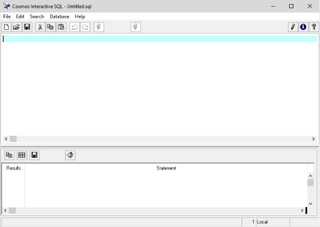
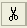
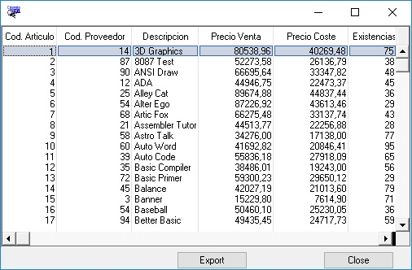

# SQL interactivo 
El SQL Interactivo permite editar y ejecutar ficheros con extensión «.sql» que contendrán instrucciones pertenecientes al CTSQL. 

Para ejecutar el SQL Interactivo ejecute el elemento «CSQL Interactivo» de la carpeta Cosmos en el menú de programas en Windows. 

La ventana principal del SQL Interactivo tiene el aspecto que se muestra en la siguiente figura: 

` `

*Ventana principal del SQL interactivo.*

Esta pantalla incluye los siguientes elementos: 

1. Un menú «pulldown». 
1. Un menú de iconos con algunas de las opciones más comúnmente utilizadas. 
1. La ventana de edición. 
1. La ventana de resultados. Muestra: sentencias ejecutadas, errores, número de registros de la consulta, número de filas modificadas, borradas e insertadas.
1. Una barra de estado en la que se mostrarán mensajes al usuario. 

Desde esta ventana podrá llevar a cabo las siguientes operaciones relativas al tratamiento de ficheros SQL: 

- [**Crear un fichero SQL nuevo**](#chmtopic2). 
- [**Abrir un fichero SQL existente**](#chmtopic3). 
- [**Guardar un fichero SQL**](#chmtopic4). 
- [**Ejecutar un fichero SQL**](#chmtopic5). 
- [**Seleccionar la base de datos**](#chmtopic6). 
- [**Establecer una conexión**](#chmtopic7). 

Desde la ventana de edición se podrá ejecutar:

- Varias instrucciones seguidas. Pulsar botón "Execute" ![ref1].
- Una sola instrucción. Para ello se deberá seleccionar la instrucción y después pulsar botón "Execute selection" .

Desde la ventana de resultados se podrá:

- Copiar la sentencia seleccionada. Pulsar botón ![ref2].
- Todas la sentencias. Pulsar botón .
- Guarda todos los resultados en un fichero. Pulsar botón ![ref3]
- Limpiar la lista. Pulsar botón 
# Ficheros «.sql»
Un fichero con extensión «.sql» contendrá instrucciones pertenecientes al CTSQL. En estos ficheros no se pueden incluir datos variables. Si un fichero incluye más de una instrucción CTSQL, cada una de ellas, y opcionalmente la última, tiene que finalizar en un punto y coma («;»). Por ejemplo: 

create table provincias( 

`	`provincia smallint not null label "Cod. Provincia", 

`	`descripcion char(20) label "Provincia", 

`	`prefijo smallint label "Prefijo") 

primary key (provincia); 

create unique index i1\_prov on provincias(descripcion); 

create table clientes( 

`	`cliente integer not null label "Codigo Cliente", 

`	`empresa char(25) upshift label "Empresa", 

`	`apellidos char(25) label "Apellidos", 

`	`nombre char(15) label "Nombre", 

`	`direccion1 char(25) label "Direccion1", 

`	`direccion2 char(25) label "Direccion2", 

`	`poblacion char(15) label "Poblacion", 

`	`provincia smallint label "Provincia", 

`	`distrito integer label "Distrito", 

`	`telefono char(13) label "Telefono",

`	`formpago char(2) label "Forma de Pago", 

`	`total\_factura money(11,2) label "Total Facturado") 

primary key (cliente) ; 

create index i2\_cliente on clientes(empresa); 

create index i4\_cli on clientes(provincia);

Además del SQL Interactivo de Cosmos, para ejecutar un fichero con extensión «.sql» podremos emplear también los métodos de la clase «SqlServer» predefinida en Cosmos. Estos métodos son los siguientes: 

«SqlFile» 
Este método ejecuta una o varias instrucciones del SQL almacenadas en un fichero cuya extensión sea «.sql». En caso de que alguna instrucción SQL a ejecutar sea una SELECT, se mostrarán por defecto todas las filas de su tabla derivada en una ventana. 

«SqlFileToFile» 
Este método ejecuta una o varias instrucciones del SQL almacenadas en un fichero cuya extensión sea «.sql». En caso de que alguna instrucción SQL a ejecutar sea una SELECT, el resultado de su ejecución se obtendrá en un fichero. 
# Trabajar con documentos 
Las opciones incluidas en el menú «File» permiten crear y guardar ficheros «.sql», y acceder a ficheros «.sql» existentes. Estas opciones son las siguientes: 

|[**«New»**](#chmtopic2)|Permite crear un nuevo fichero «.sql» vacío. |
| :- | :- |
|[**«Open»**](#chmtopic3)|Permite editar un fichero «.sql» existente. |
|[**«Save»**](#chmtopic4)|Guarda el fichero «.sql» en edición. |
|[**«Save As»**](#chmtopic10)|Permite guardar el fichero «.sql» en edición con otro nombre. |
|[**«Exit»**](#chmtopic11)|Abandona el Sql Interactivo y retorna al punto desde el que fue invocado. |

# Crear un fichero «.sql» 
La opción «New» del menú «File» permite editar un fichero «.sql» nuevo denominado «untitled.sql». El documento en edición se borrará sin pedir confirmación. Este sistema permite al usuario ejecutar sentencias de una en una, limpiando el área de edición con agilidad. 

Esta opción se puede ejecutar pulsando el botón  del menú de iconos. 
# Abrir un fichero «.sql» 
La opción «Open» del menú «File» permite abrir un fichero «.sql» existente. Al igual que ocurría en la opción «New», no se pide confirmación, y los cambios del documento en edición se perderán si no han sido salvados. 

La ejecución de esta opción muestra un cuadro de diálogo con la lista de ficheros y directorios para permitir la selección del documento con el que se desea trabajar. El árbol de directorios se iniciará siempre en el directorio correspondiente a la variable de entorno DBTEMP. 

Esta opción se puede ejecutar pulsando el botón  en el menú de iconos. 
# Guardar un fichero «.sql» 
La opción «Save» del menú «File» guarda el contenido del fichero «.sql» activo. Si se trata de un documento nuevo, su ejecución será idéntica a la de la opción [**«Save As»**](#chmtopic10), presentando un cuadro de diálogo para indicar el nombre que se desea asignar al documento y el directorio donde se desea guardar. 
# Guardar un fichero «.sql» con otro nombre 
La opción «Save As» del menú «File» guardar tanto un fichero «.sql» de nueva creación como otro ya existente asignándole otro nombre. Para la selección del nombre se abre el cuadro de dialogo de «Guardar como» iniciado en el directorio correspondiente a la variable de entorno DBTEMP. 

Si el nombre asignado al fichero «.sql» coincidiese con el de algún otro ya existente, el sistema avisaría al usuario presentando un mensaje en pantalla, en cuyo caso el usuario podrá elegir entre: 

1. Guardar el fichero «.sql» con el mismo nombre («Sobre-escribir»), con lo cual se grabarían las modificaciones que hubieran podido realizarse sobre él. En este caso el sistema pediría confirmación avisando de que se trata de un documento ya existente que se va a sobreescribir. 
1. Asignar un nombre distinto al actual, con lo cual estaríamos generando un fichero «.sql» nuevo. 
1. Cancelar la operación. 

Esta opción se puede ejecutar pulsando el botón ![ref3] del menú de iconos. 
# Salir del SQL interactivo
La opción «Exit» del menú «File» cierra el SQL Interactivo y retorna al punto desde el que fue invocado, sin pedir confirmación, los cambios del documento en edición se perderán si no han sido salvados. 
# Trabajar con texto 
Las opciones incluidas en el menú «Edit» permiten realizar ciertas operaciones de edición sobre el texto del documento activo. Dichas opciones son las siguientes: 

|[**«Copy»**](#chmtopic13)|Permite copiar texto para insertarlo en otro lugar del mismo documento o en otro distinto. |
| :- | :- |
|[**«Paste»**](#chmtopic14)|Inserta el texto previamente copiado en el lugar donde se sitúe el cursor. |
|[**«Cut»**](#chmtopic15)|Suprime el texto seleccionado para permitir su inserción en otro lugar del mismo documento o en otro distinto a través de la opción [**«Paste»**](#chmtopic14). |
|[**«Delete»**](#chmtopic16)|Permite borrar texto del documento activo. |
|[**«Undo»**](#chmtopic17)|Hace correcciones y deshace los últimos cambios. |
|[**«Redo»**](#chmtopic18)|Recupera los cambios que han sido anulados mediante la opción «[**Undo**](#chmtopic17)». |
|[**«Font»**](#chmtopic19)|Permite seleccionar el tipo de letra a emplear en el documento. |

# Copiar y mover texto
La opción «Copy» del menú «Edit» copia el texto seleccionado del fichero «.sql» activo al [**portapapeles**](#chmtopic20) de Windows para permitir su inserción en otro lugar del mismo fichero «.sql», en otro distinto o, incluso, en otra aplicación. 

Para copiar texto: 

1. [**Seleccione el texto**](#chmtopic21) que desee copiar. 
1. Pulse la tecla [Ctrl] + [C] o el botón ![ref2] del menú de iconos). 

También puede copiar texto seleccionándolo y arrastrándolo con el botón izquierdo del ratón a la posición deseada. 

Puede mover texto de sitio seleccionándolo y arrastrándolo con el botón izquierdo del ratón a la posición deseada manteniendo la tecla [Mayúsculas] pulsada. 

Temas relacionados[`
`**Teclas de edición**](#chmtopic22) [`
`**Teclas de selección de texto**](#chmtopic23) [`
`**Teclas de movimiento del cursor**](#chmtopic24)
# Pegar texto 
La opción «Paste» del menú «Edit» inserta el texto previamente copiado al [**portapapeles**](#chmtopic20) de Windows en el lugar donde se sitúe el cursor. 

Para pegar texto: 

1. [**Copie**](#chmtopic13) o [**corte**](#chmtopic15) el texto que desee insertar en otro lugar. 
1. Sitúe el cursor en el lugar donde desee insertar el texto copiado. 
1. Pulse el botón  del menú de iconos o la tecla [Ctrl] + [V]. 

Temas relacionados

[**Teclas de edición**](#chmtopic22) [`
`**Teclas de selección de texto**](#chmtopic23) [`
`**Teclas de movimiento del cursor**](#chmtopic24)
# Cortar texto 
La opción «Cut» del menú «Edit» elimina el texto seleccionado y lo almacena en el [**portapapeles**](#chmtopic20) de Windows para permitir su inserción en otro punto del fichero «.sql» activo, en otro distinto o, incluso, en otra aplicación. 

Para cortar texto: 

1. [**Seleccione el texto**](#chmtopic21) que desee cortar. 
1. Pulse el botón  del menú de iconos o la tecla [Ctrl] + [X]. 

Temas relacionados 

[**Teclas de edición**](#chmtopic22) [`
`**Teclas de selección de texto**](#chmtopic23) [`
`**Teclas de movimiento del cursor**](#chmtopic24)
# Borrar texto 
El SQL interactivo permite eliminar texto del documento activo. Para borrar texto disponemos de varias posibilidades: 

1. Para borrar caracteres a la derecha del punto de inserción pulse la tecla [Del] ([Supr]). 
1. Para borrar caracteres a la izquierda del punto de inserción pulse la tecla [Retroceso] ([Backspace]). 
1. Para borrar palabras o bloques de texto [**selecciónelos**](#chmtopic21) previamente y pulse cualquiera de las teclas citadas en los dos puntos anteriores. 

También puede borrar texto utilizando las teclas [Del] o [Retroceso] para eliminar caracteres uno a uno. 

Temas relacionados
[**Teclas de edición**](#chmtopic22) 
[**Teclas de selección de texto**](#chmtopic23) 
[**Teclas de movimiento del cursor**](#chmtopic24)
# Deshacer los últimos cambios 
El Sql Interactivo guarda un registro con algunas de las últimas modificaciones realizadas. 

Si comete algún error o cambia de idea mientras esta escribiendo puede utilizar la opción «Undo» del menú «Edit» para hacer correcciones y deshacer los últimos cambios. 

Para deshacer la última acción, pulse la tecla [Ctrl] + [Z] o el botón  del menú de botones. Para recuperar los cambios, una vez anulados utilice la opción «[**Redo**](#chmtopic18)». 

Si desea deshacer más cambios, ejecute otra vez la opción «Undo». 
# Rehacer modificaciones
El Sql interactivo permite recuperar los cambios que han sido anulados mediante la opción «[**Undo**](#chmtopic17)» del menú «Edit» . 

Para rehacer la última acción, pulse la tecla [Ctrl] + [A] o el botón  del menú de botones. Para deshacer los cambios realizados con esta opción, utilice la opción «[**Undo**](#chmtopic17)». 

Si desea rehacer más cambios, ejecute otra vez la opción «Redo». 
# Seleccionar fuente
Mediante la opción «Font» del menú «Edit» el usuario podrá seleccionar la [**fuente**](#chmtopic25) de trabajo con la que se mostrará e imprimirá el documento. Al ejecutarla se mostrará un cuadro de diálogo para elegir el tipo de letra, su tamaño y estilo (normal, negrita, cursiva, etc.). 

Esta opción se puede ejecutar desde el menú de iconos pulsando el botón . 
# Seleccionar texto 
Se pueden introducir cambios globales que afecten a bloques de texto con sólo seleccionarlos y ejecutar a continuación algunas de las opciones del menú «Edit» del menú principal. Para seleccionar texto en un documento podremos emplear indistintamente el ratón o el teclado: 

Para seleccionar texto con el ratón proceda de la siguiente manera: 

1. Sitúe el cursor delante del primer carácter del bloque de texto a seleccionar y pulse el botón izquierdo del ratón. 
1. Arrastre el cursor hasta el último carácter que desee incluir en la selección. 
1. Suelte el botón del ratón. 

Para seleccionar una sola palabra haga doble «clic» sobre ella. 

Para cancelar la selección haga «clic» en cualquier lugar del documento. 

Para seleccionar texto con el teclado proceda de la siguiente manera: 

1. Utilice las teclas de dirección para desplazar el cursor hasta el primer carácter del bloque a seleccionar. 
1. Pulse la tecla [Mayúsculas] y, manteniéndola presionada, utilice las teclas de dirección para mover el cursor hasta el último carácter que desee seleccionar. 

Si desea cancelar la selección pulse cualquiera de las teclas de dirección. 
# Desplazarse en un documento 
El Sql interactivo permite desplazarse fácilmente a través del texto de un documento mediante la utilización del ratón o las [**teclas de movimiento del cursor**](#chmtopic24). 

Temas relacionados[`
`**Teclas de edición**](#chmtopic22) [`
`**Teclas de selección de texto**](#chmtopic23) [`
`**Teclas de movimiento del cursor**](#chmtopic24)
# Modos Inserción/Reemplazo 
El SQL interactivo permite trabajar en dos modos de edición diferentes: 

- Inserción: Inserta texto a partir del punto en que se encuentre situado el cursor y desplaza el texto existente. 
- Reemplazo Los caracteres que se escriban sustituirán al texto existente a partir del punto en que se encuentre situado el cursor. 

Para cambiar el modo de operación de inserción a reemplazo o viceversa pulse la tecla [Insert]. El modo de operación por defecto al arrancar «Csql» es el de inserción. 

El modo de inserción en curso se reconoce por la forma del cursor de edición, ancho en modo reemplazo y estrecho en modo inserción. 

Temas relacionados

[**Teclas de edición](#chmtopic22)[
Teclas de selección de texto](#chmtopic23)[
Teclas de movimiento del cursor**](#chmtopic24)
# Comunicación con el SQL 
El menú «Database» tiene las opciones necesarias para que el SQL Interactivo trabaje con una base de datos determinada. 

Dichas opciones son las que se indican a continuación: 

|[**«Seleccionar Conexión»**](#chmtopic7)|Esta opción permite seleccionar una conexión distinta a la definida en el entorno. |
| :- | :- |
|[**«Abrir Base de Datos»**](#chmtopic28)|Esta opción permite abrir una base de datos. |
|[**«Ejecutar»**](#chmtopic5)|Ejecuta el fichero «.sql» en curso. |
|[**«Cerrar Base de Datos»**](#chmtopic29)|Cierra la base de datos activa. |

# Seleccionar una conexión
La opción «Select Connection» del menú «Database» permite seleccionar un entorno de conexión distinto al definido en el entorno de usuario.

Mediante esta opción se podrá establecer una conexión local o remota (cliente-servidor), pudiendo acceder a otros [**gestores**](#chmtopic30) de bases de datos.

Al ejecutar esta opción aparece el cuadro de diálogo «Database Options» que muestra los datos necesarios para conectar con el servidor SQL y definir las características principales de una base de datos:

|«Connection»|
Lista de conexiones definidas en: 

- El fichero de configuración [**COSMOS.IN**](#chmtopic31)I.

- El fichero de configuración que se este utilizando.

Prevalece lo que hay definido en el fichero de configuración frente a lo definido en el fichero COSMOS.INI.
|
| :- | :- |
|«Database»|Muestra las bases de datos encontradas por el sistema para la conexión seleccionada en el campo anterior.|
|«Edit»|Esta opción permite editar el entorno de las conexiones definidas en el fichero de configuración. Para modificar el entorno de una conexión seleccione en la lista «Connection» aquella que desee modificar. A continuación pulse el botón «Edit». Acto seguido se mostrará el cuadro de diálogo de «Connection» que permite realizar las modificaciones necesarias. Esta opción solo aparecerá cuando se arranque Cosmos con el usuario «system».|
|«Add»|Al pulsar este botón se muestra el cuadro de diálogo «Add Connection» que permite añadir una conexión (local, remota u ODBC) al fichero de configuración. Esta opción solo aparecerá cuando se arranque Cosmos con el usuario «system».|

Si el entorno seleccionado se corresponde con una conexión remota y no tiene definida la variable de entorno [**DBPASSWD**](#chmtopic32) y/o [**DBUSER**](#chmtopic33) automáticamente se pedirá la contraseña y/o el nombre de usuario para poder establecer la conexión en el siguiente acceso al servidor de la base de datos.

NOTAS:

- La conexión también puede abrirse ejecutando la sentencia **attachconnection <conexion>**. 

Para seleccionar la base de datos habrá que ejecutar la sentencia DATABASE después de la sentencia attachconnection.

# Seleccionar una base de datos 
La opción «Connect to Database» del menú «Database» permite elegir la base de datos sobre la que desea trabajar.

Al ejecutar esta opción se muestra el cuadro de diálogo «Database Selection» en el que aparecen todas las bases de datos detectadas por el sistema.

Seleccione la base de datos de la lista en curso y si no aparece escriba el nombre de la nueva base de datos que desea seleccionar (si la conexión no es vía ODBC, este nombre deberá ser un literal alfanumérico de 10 caracteres de longitud como máximo). El botón  permite conectarse a una base de datos local.

Si la conexión definida en el entorno es local aparecerán los nombres de las bases de datos disponibles, mientras que si la conexión es remota sólo aparecerá la base de datos de la variable de entorno DBNAME, si esta se encuentra definida. Si la conexión es ODBC aparecerán las fuentes de datos ODBC definidas desde el panel de control.

NOTAS:

- La base de datos también puede abrirse ejecutando la sentencia DATABASE, si la admite el servidor de la base de datos. 
# Ejecutar un fichero «.sql» 
Mediante la opción «Execute» del menú «Database» se podrán ejecutar las instrucciones del CTSQL contenidas en el fichero «.sql» en edición. El resultado de la ejecución de instrucciones SELECT se mostrará en una ventana. El progreso de la ejecucuón se mostrará en la barra de estado. 

Esta opción se puede ejecutar pulsando [Ctrl] + [E] o pulsando el botón ![ref1] del menú de iconos. 

También se podrán ejecutar una o varías instrucciones previamente seleccionadas pulsando el botón  o pulsando las teclas [Control] + [intro].
# Cerrar la base de datos 
La opción «Disconnect Database» del menú «Database» cierra la base de datos activa. 

NOTAS:

- La base de datos también puede cerrarse ejecutando la sentencia CLOSE DATABASE, si la admite el servidor de la base de datos. 
# Ficheros generados y/o utilizados por el SQL interactivo 
El SQL interactivo de Cosmos utiliza y genera una serie de ficheros identificados por sus extensiones. Estas extensiones y su significado son las siguientes. 

|«\*.scs» |(source collating sequence). Estos ficheros se encargan de componer el orden de caracteres en la tabla ASCII para utilizarla en las operaciones de comparaci n y ordenación, y son asignados a la base de datos cuando esta se crea con la instrucción CREATE DATABASE y mediante la cláusula «COLLATING». |
| :- | :- |
|«\*.ocs»|(objects collating sequence). Ficheros objetos generados por el compilador de ficheros de ordenación (**tcollcom**). |
|«\*.sql»|(structured query language). Ficheros ASCII que incluyen instrucciones del SQL. La forma de ejecutar estos ficheros es mediante el SQL Interactivo (programa csql.exe) o bien con los métodos SqlFile y SqlToFile de la clase SqlServer predefinida el en lenguaje de Cosmos. |
|«\*.unl»|(unload). Ficheros ASCII generados al descargar una tabla. Estos ficheros contienen todas las filas de la tablas descargadas en formato ASCII, y su estructura es la generada por la instrucción UNLOAD o desde el botón "export" : Cada línea del fichero corresponde con una fila de la tabla, diferenciando los campos mediante un separador que, por defecto es la barra vertical ( carácter ASCII 124 «|»). |
|«\*.dbs»|(database).Directorio que representa la base de datos creada por el CTSQL. Las tablas de la base de datos se almacenarán en este directorio. |
|«\*.dat» |(data). Fichero binario que contendrá los datos de una base de datos. La única forma de acceso a este fichero es mediante instrucciones del CTSQL. Este fichero tiene que estar siempre en el mismo directorio que su respectivo «\*.idx». |
|«\*.idx»|(index). Fichero binario que contendrá la estructura de todos los índices relativos a una tabla de la base de datos. Este fichero tiene que estar siempre en el mismo directorio que su respectivo «\*.dat». La elección del índice por el cual se desea acceder a los datos depende de la optimización de la instrucción SELECT del CTSQL (cláusulas WHERE y ORDER BY). |
|«\*.xls»|Fichero ASCII que contiene los datos de la consulta que se ha ejecutado. Se obtiene pulsando el botón "export".|
|«\*.xlsx»|Fichero con formato Excel que contiene los datos de la consulta que se ha ejecutado. Se obtiene pulsando el botón "export".|
|«\*.csv»|Fichero ASCII separado por comas que contiene los datos de la consulta que se ha realizado. Se obtiene pulsando el botón "Export".|
|«\*.ods»|Fichero de OpenOffice. Se obtiene pulsando el botón "Export".|
|«\*.pdf»|Fichero con formato PDF. Se obtiene pulsando el botón "Export".|
|«\*.html»|Fichero con formato HTML. Se obtiene pulsando el botón "Export".|

NOTAS:

- No editar nunca los ficheros de extensión «\*.dat» e «\*.idx» 
# Comando «csql»
Este comando se utiliza para la ejecución del Sql Interactivo.

Su sintaxis es la siguiente.

csql [fichero] [-ini inifile] [-runscript –connection <connexion> -database <base de datos>]

Donde:

fichero
Nombre del fichero «.sql» con el que se desea trabajar.

inifile
Nombre del fichero de configuración que se desea utilizar. Si no se indica este parámetro se utilizará el fichero «COSMOS.INI».

runscript 
Ejecuta el script sql sin esperar a que el usuario pulse el botón de ejecutar.

-connection <conexion> 
Abre la conexión indicada. Esta conexión debe existir en el fichero de configuración que se pasa en el parámetro «–ini». Parámetro obligatorio.

-database <bbdd> 
Abre la base de datos indicada. Parámetro obligatorio. 
# Empleo de otros gestores de bases de datos 
Gracias a la utilización del módulo «MultiWay», El SQL Interactivo permite trabajar no sólo con el gestor CTSQL propio de MultiBase, sino también con otros de los existentes en el mercado de distintos fabricantes (Informix, Ingres, Oracle, etc.), tanto en modo local como en instalaciones con arquitectura cliente-servidor. 
# Exportación de datos
Posibilidad de exportar los datos de una select a ficheros con formato de hoja de cálculo de Excel (\*.xls o \*.xlsx) y OpenOffice, PDF, HTML o fichero de texto en formato “unl” el resultado de una consulta ejecutada desde CSQL interactivo. 

A esta opción pulsando el botón  de la ventana que se muestra a continuación.

# Métodos abreviados con el teclado 
A continuación se ofrece una lista de otras combinaciones de teclas que pueden utilizarse en el Sql Interactivo para moverse por el documento, seleccionar, copiar y pegar texto. 

|[**Teclas de menú**](#chmtopic38)|Las teclas o combinaciones de teclas que se indican a continuación pueden utilizarse en el Sql Interactivo para seleccionar menús y sus opciones: |
| :- | :- |
|[**Teclas de edición**](#chmtopic22)|Combinaciones de teclas útiles para editar texto en un documento. |
|[**Teclas de selección de texto**](#chmtopic23)|Combinaciones de teclas útiles para seleccionar texto en un documento. |
|[**Teclas de movimiento del cursor**](#chmtopic24)|Teclas que pueden utilizarse donde sea aplicable para mover el cursor o punto de inserción. |

# Teclas de menú 
Las teclas o combinaciones de teclas que se indican a continuación pueden utilizarse en el Sql Interactivo para seleccionar menús y sus opciones: 

|[ALT] o [F10]|Activa o cancela la primera persiana del menú principal. |
| :- | :- |
|[ALT]+Carácter subrayado|Activa la persiana del menú principal correspondiente al carácter subrayado indicado. Una vez abierta la persiana, podrá pulsarse el carácter subrayado de una opción para ejecutarla directamente sin necesidad de pulsar [ALT]. |
|[Return] o [Intro]|Ejecuta el comando u opción seleccionado. |
|[Esc] |Cancelar la última operación realizada. |
|[F. izquierda] y [F. derecha] |Moverse de un menú a otro. |
|[F. arriba] y [F. abajo]|Moverse de una opción de menú a otra dentro de una persiana. |
|[Ctrl] + [E]|Ejecuta el fichero SQL. |
|[Ctrl] + [Enter]|Ejecuta la sentencia seleccionada.|
|[F1] |Ejecuta la ayuda en línea. |

# Teclas de movimiento del cursor 
Las teclas que se indican a continuación pueden utilizarse para mover el cursor o punto de inserción dentro de un cuadro de texto o en cualquier otro lugar donde se puede escribir texto. 

|[Inicio] u [Home] |Mueve el cursor al principio de la línea. |
| :- | :- |
|[Fin] o [End] |Mueve el cursor al final de la línea. |
|[RePág] |Una página arriba. |
|[AvPág]|Una página abajo. |
|[F. arriba]|Desplaza el cursor una línea hacia arriba. |
|[F. abajo]|Desplaza el cursor una línea hacia abajo. |
|[F. derecha]|Mueve el cursor un carácter hacia la derecha. |
|[F. izquierda]|Mueve el cursor un carácter hacia la izquierda. |
|[Ctrl]+[F. derecha]|Mueve el cursor una palabra hacia la derecha. |
|[Ctrl]+[F. izquierda] |Mueve el cursor una palabra hacia la izquierda. |
|[Ctrl]+[Inicio] |Sitúa el cursor al principio del documento. |
|[Ctrl]+[Fin]|Sitúa el cursor al final del documento. |

# Teclas de selección de texto 
Las selecciones que se describen a continuación comienzan siempre a partir del punto en que se encuentre situado el cursor: 

|[Ctrl]+[Mayúsculas]+[F. izquierda]|Selecciona la palabra anterior. |
| :- | :- |
|[Ctrl]+[Mayúsculas]+[F. derecha]|Selecciona la palabra siguiente. |
|[Ctrl]+[Mayúsculas]+[Inicio]|Selecciona el texto hasta el principio del documento. |
|[Ctrl]+[Mayúsculas]+[Fin]|Selecciona el texto hasta el final del documento. |
|[Mayúsculas]+[Inicio]|Selecciona el texto hasta el principio de la línea. |
|[Mayúsculas]+[Fin]|Selecciona el texto hasta el final de la línea. |
|[Mayúsculas]+[RePág] |Selecciona el texto una pantalla hacia arriba. |
|[Mayúsculas]+[AvPág]|Selecciona el texto una pantalla hacia abajo. |
|[Mayúsculas]+[F. derecha/izquierda] |Selecciona carácter a carácter hacia derecha o izquierda. |
|[Mayúsculas]+[F. arriba/abajo]|Selecciona el texto línea a línea hacia arriba o hacia abajo. |

# Teclas de edición 
Las siguientes combinaciones de teclas permiten realizar ciertas operaciones de edición con el texto del documento: 

|[Mayúsculas]+[Del] o [Ctrl]+[X] |Borra el texto seleccionado y lo guarda en el portapapeles. |
| :- | :- |
|[Ctrl]+[Insert] o [Ctrl]+[C]|Copiar el texto seleccionado y lo guarda en el portapapeles. |
|[Mayúsculas]+[Insert] o [Ctrl]+[V]|Pega el contenido del portapapeles. |
|[Supr] |Borra el texto seleccionado. |
|[TAB]|Si se ha seleccionado una o más líneas completas en un editor indenta dichas líneas hacia la derecha. |
|[Mayúsculas]+[TAB] |Si se ha seleccionado una o más líneas completas en un editor indenta dichas líneas hacia la izquierda. |
|[Ctrl] + [A]|Recupera los cambios que han sido anulados mediante la opción «Undo». |
|[Ctrl] + [Z] |Anula la última operación de edición. |
|[F. izquierda] y [F. derecha]|Mueve el control seleccionado hacia la izquierda o la derecha. |

# Drag & Drop sobre el editor 

|**Arratrar**|**Desde**|**Hasta**|**<Shft>**|**Resultado**|
| :-: | :-: | :-: | :-: | :-: |
|Texto seleccionado |Editor|Editor| |Copia el texto seleccionado en la posición del cursor |
|Texto seleccionado |Editot |Editor |x |Mueve el texto seleccionado a la posición del cursor |

# Portapapeles
Área de almacenamiento temporal en la memoria que se utiliza para transferir datos entre documentos o aplicaciones. 
# Fuente
Conjunto de letras, números, signos de puntuación y símbolos a los que se le ha aplicado un determinado tamaño y estilo. 
# Fichero de configuración «Cosmos.ini» 
El fichero de configuración «COSMOS.INI» contiene algunas de las características con las que deberán arrancar las aplicaciones que lo utilizan. Este fichero se encuentra en el subdirectorio «etc» del directorio donde se encuentre instalado Cosmos.

El fichero «COSMOS.INI» está especialmente diseñado para facilitar la definici n de usuarios y entornos (de usuario y de conexión local o remota), ficheros de iconos, etc.

Cualquier línea de comentario en el fichero de configuración deberá comenzar siempre por un punto y coma («;»).

Este fichero de configuración es utilizado por el «editor de configuración» de Cosmos.

Las secciones que componen el fichero «COSMOS.INI» son las siguientes:

- [**Sección \[Passwords**](#chmtopic40)].
- [**Sección \[Cosmos\]**](#chmtopic41).
- [**Sección \[Connections\]**](#chmtopic42).
- [**Sección \[Environment\]**](#chmtopic43).
- [**Sección \[Icons\]**](#chmtopic44).
- [**Sección \[Cosmos Visual Editor\]**](#chmtopic45)

En los siguientes apartados se comenta en detalle cada una de estas secciones.
# DBPASSWD 
Utilizada únicamente en instalaciones cliente-servidor, su finalidad es definir la palabra clave («password») para conectarse a una base de datos residente en el servidor (UNIX). 

Si el usuario UNIX al que se va a conectar la aplicación tiene definida una «password», la variable de entorno DPASSWD deberá tener definida asimismo dicha palabra clave antes de establecer la comunicación con el SQL remoto en el «servidor» UNIX. 
# DBUSER 
Esta variable se mantiene únicamente en versiones para red local o en instalaciones con arquitectura cliente-servidor con o sin «gateways». En la versión para red local su objetivo es identificar a cada «cliente» de la red con un nombre de usuario, simulando un entorno multiusuario. Por su parte, en instalaciones cliente-servidor sólo deberá configurarse en las máquinas «cliente» indicando el nombre del usuario del que se tomarán los permisos para acceder a la base de datos. 

Si no se define esta variable tomará por defecto el valor «system», mientras que en instalaciones cliente-servidor su valor dependerá de los nombres de usuarios a los que el administrador de la base de datos haya concedido acceso. 

A la hora de acceder a la base de datos, el error más común producido por una mala configuración de esta variable es el siguiente: 

Permiso CONNECT requerido 

Por ejemplo: 

DBUSER=pedro 

NOTAS:

- El valor que se asigne a esta variable podrá tener una longitud máxima de ocho caracteres. 
# Sección [Passwords]
En esta sección se definen los usuarios que pueden acceder a las aplicaciones Cosmos que utilizan el fichero de configuración. Contendrá una línea y sólo una por cada usuario definido. La sintaxis de un elemento de esta sección es la siguiente: 

[Passwords] 
usuario=contraseña\_encriptada\_por\_el\_editor\_de\_configuración. 

Donde: 

Usuario
Nombre con el que se desea identificar al usuario de las aplicaciones Cosmos.

Contraseña
Contraseña encriptada del usuario. 

En esta sección debe estar siempre definido el usuario «system», que será el administrador del sistema. Por ejemplo: 

[Passwords] 
system=:$x}wamgzkes{\*) 
# Sección [Cosmos]
Esta sección contendrá entradas genéricas para todas las aplicaciones Cosmos que utilizan el fichero de configuración. 

En esta sección se define el usuario que van a utilizar por defecto las aplicaciones Cosmos al arrancar. Dicho usuario tiene que estar definido en la sección «Passwords». 

La sintaxis de esta sección es la siguiente: 

[Cosmos] 
USER=nombre 

Donde: 

Nombre
Identifica el nombre del usuario con el que van a arrancar las aplicaciones Cosmos por defecto. 

Si esta entrada aparece no se preguntará por el usuario, aunque sí por la contraseña si ésta no es nula. Por ejemplo: 

[Cosmos] 
USER=system 
# Sección [Connections]
En esta sección se definen las conexiones locales o remotas para facilitar la utilización de otros gestores de base de datos. Su sintaxis es la siguiente: 

[Connections] 
nombre=tipo 

Donde: 

Nombre
Indica el nombre con el que se desea identificar la conexión.

Tipo
Tipo de la conexión anterior. Puede tener los siguientes valores: 

Local
Para conexiones locales.

Remote
Para conexiones remotas (cliente-servidor). 

Ejemplo: 

[Connections] 
oracle=remote
local=local 
# Sección [Environment]
El valor inicial de las variables de entorno se guardará en el fichero «COSMOS.INI» en varias secciones. Estas secciones son las siguientes: 

[Environment]
Contiene las variables de entorno cuyos valores son comunes a todos los usuarios. 

[Environment nombre]
Contiene las variables de entorno definidas para «nombre», pudiendo ser éste el nombre de un usuario definido en la sección «Passwords», el nombre de una conexión definida en la sección «Connections» o un nombre arbitrario para definir un entorno independiente. 

La sintaxis de estas secciones es la siguiente: 

variable=valor 

Donde: 

Variable
Nombre de la variable de entorno que se desea definir para el «nombre» indicado anteriormente.

Valor
Valor que se desea asignar a la variable de entorno (puede ser vacío). 

Cada grupo «variable-valor» puede ocupar una línea como máximo. Por ejemplo: 

Entorno GLOBAL: 

[Environment] 
DBPATH=c:\mbdemo 
DBEDIT=c:\cosmos\bin\wedit
TRWPATH=c:\mbdemo 
DBTEMP=c:\tmp

Entorno del usuario «system»: 

[Environment system] 
DBDATE=MDY2 
DBDELIM=| 

Entorno de conexión con Oracle: 

[Environment oracle] 
DBHOST=unix 
DBUSER=clientes 
DBSERVICE=ctsql 
DBPASSWD=hola 
# Sección [Icons]
En esta sección se definen los ficheros de iconos que utilizarán las aplicaciones y que han sido creados con el editor de iconos de Cosmos («cosicons.exe»). 

La sintaxis de un elemento de esta sección es la siguiente: 

[Icons] 
Nombre\_lógico=nombre\_fichero.bmp, ancho\_botón, alto\_botón, color\_fondo 

Donde: 

Nombre\_lógico 
Identificador del fichero de iconos.

Nombre\_fichero 
«Path» completo o relativo al subdirectorio «etc» del directorio donde se haya instalado Cosmos.

Ancho\_botón 
Ancho en «pixels» de los iconos.

Alto\_botón 
Alto en «pixels» de los iconos.

Color\_fondo 
Puede ser RGB (rojo, verde, azul) o cualquier nombre de color reconocido por Cosmos. 
# Sección [Cosmos Visual Editor] 
En esta sección se define el modo de trabajo del Editor Visual: 

- Monousuario.
- Multiusuario. 

La sintaxis de esta sección es la siguiente: 

[Cosmos Visual Editor]
MultiUser=TRUE 

Si MultiUser=TRUE se trabaja en modo multiusuario y si es FALSE se trabaja en modo monousuario. 

[ref1]: Aspose.Words.d3a8e9d5-75e6-4272-b446-64e8ec383cef.003.gif
[ref2]: Aspose.Words.d3a8e9d5-75e6-4272-b446-64e8ec383cef.005.gif
[ref3]: Aspose.Words.d3a8e9d5-75e6-4272-b446-64e8ec383cef.007.gif
