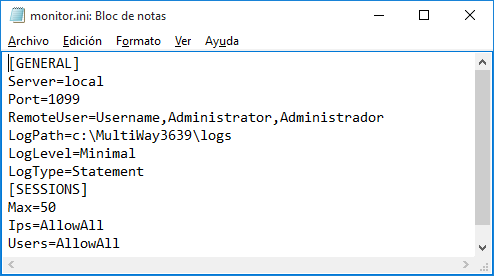
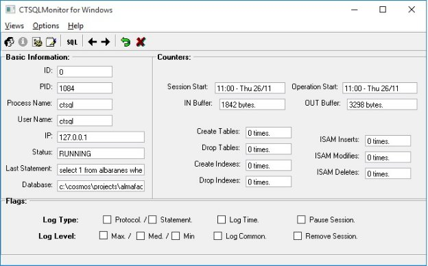
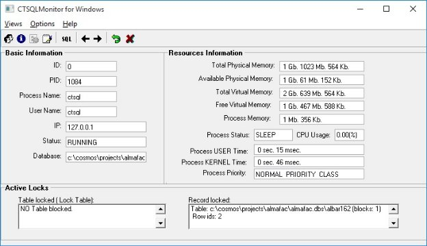
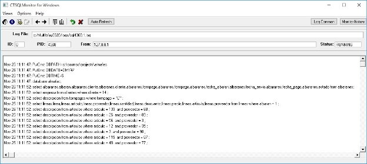
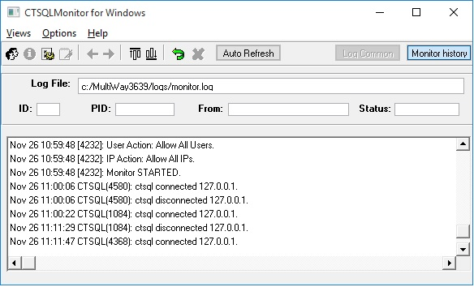
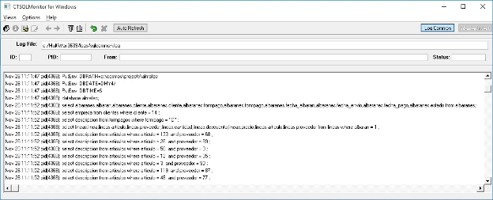

# Introducción
Este documento describe en pocas líneas el funcionamiento de la herramienta monitora en su estado actual. La herramienta monitora es un añadido al CTSQL que tiene por finalidad llevar un control de la actividad de los procesos existentes en la parte servidora.

La configuración actualmente se realiza en el fichero monitor.ini situado en el servidor.

# Fichero de Configuración
El fichero de configuración lo utilizan tanto el servicio de monitorización remota(monser.exe) como el monitor(monitor.exe) cuando trabaja en local con el servidor. Actualmente el fichero de configuración nos permite configurar varias cosas:

**[GENERAL]**

Server = local ( Servidor sobre el que se empieza la monitorización, el acceso remoto requiere validación )
RemotePort = 1099 ( Puerto remoto sobre el que está montado el servicio, monser (1099) )
RemoteUser = ctl, root, Administrator ( Usuarios que tienen acceso remoto para manejar el monitor )
Logpath =C:\Multiway\logs
Loglevel = Minimal ( Minimal, Medium, Maximal )
Logtype = Statement ( Protocol: es una traza más detallada de la comunicación del Cliente/Servidor ) ( Statement: sentencias SQL )
LogCommon=Yes
StartTrace=Yes

**[SESSIONS]**

Max = 50 ( Máximo número de sesiones concurrentes.)
Ips = DenyAll,172.10.10.1,>172.10.10.10,172.10.10.>30<50
Users = AllowAll

Aquí podemos tomar dos determinaciones:

AllowAll o DenyAll tras lo que las direcciones o usuarios que pongamos serán las excepciones. Hay dos políticas, una muy restrictiva y la otra más abierta.

Ej:

Ips=AllowAll,172.10.10.1,

(Se permite a todas las ip-s menos a las especificadas)

Ips=DenyAll,172.10.10.1,172.10.10.>30<50

(Se deniega a todas las ip-s menos al rango especificado)

Fichero de configuración monitor.ini:

# Ejecución y funcionamiento
La herramienta monitor  nos permite gestionar los accesos a las base de datos, restringir su acceso y monitorizar en base a cuatro vistas que reflejan la actividad del servidor. Al arrancar la herramienta monitora se activa la Vista General. Se puede activar y desactivar el motor de base de datos sin arrancar la parte visual de la forma: monitor –start y monitor –stop.
## **VISTA GENERAL (GENERAL VIEW):**
Desde aquí activaremos el monitor para que puedan empezar a funcionar los CTSQL-s, veremos a grandes rasgos las sesiones activas, hora de conexión, estado, máquina desde donde se conectan, la base de datos que manejan y la operación que realizan. También podremos cerrar sesiones y definir el tipo de traza de monitorización que queremos que guarden las sesiones por defecto cuando se conectan. La activación de las trazas y la definición de las opciones relacionadas con las mismas tienen un menú especial.

Las trazas son un mecanismo de monitorización que puede cargar al CTSQL, por lo que es conveniente que solo se activen cuando sea necesario.

Desde esta pantalla pasamos a las otras tres con los botones de la parte superior izquierda. Algunos solo se activarán si hay sesiones seleccionadas.

![ref1]

- Vista de Información de Sesión (Session Info View).
- Vista de Recursos del Sistema y de la Sesión (Resources View).
- Vista de Trazas (Trace View).
  - Pinchando en el icono del computador azul, y escribiendo un nombre de host, estableceremos una conexión para monitorizar de forma remota. ( tiene que estar en el servidor el monser activo).
  - Control Check "Auto Refresh". Permite indicar su el refresco de la información sobre las conexiones es automático o no.
## **VISTA DE INFORMACIÓN DE SESIÓN (SESSION INFO VIEW):**
Esta opción muestra:

- Información de una sesión activa, nombre del proceso, pid, usuario, ip etc.
- Un contador de bytes del flujo de información que intercambia con el cliente.
- Contadores de algunas operaciones como creación, modificación. y borrado de tablas e índices.
- Información de los flags activos de la sesión.

Estos flags indican si se están generando trazas y el tipo de las mismas dándonos la posibilidad de poner en pause una sesión, marcarla para que se cierre (Remove session) o cerrarla de forma brusca (Kill session).

**

## **VISTA DE RECURSOS DEL SISTEMA Y DE LA SESIÓN (RESOURCES VIEW):**
Esta opción muestra:

- Los recursos básicos del sistema que afectan al rendimiento del servidor CTSQL.
- La memoria que ocupa cada proceso.
- El tiempo de procesador que nos está ocupando cada proceso, tanto a nivel de usuario como por parte del sistema.
- La prioridad del proceso y nos permite cambiarla.
- Las tablas bloqueadas.
- Los registros bloqueados de las tablas.

## **VISTA DE TRAZAS (TRACE VIEW):**
Esta opción permite ver:

- Las trazas que mantienen las sesiones activas. Hay que tener en cuenta que una vez que el proceso muere, si tenía las trazas activas tendremos un fichero con el resultado de las mismas. El fichero tendrá el número del PID (Process id) que lo generó, con un número de versión a la derecha, si se repite el pid.

- El histórico del monitor que nos permite ver la actividad realizada con el monitor y las sesiones que se conectaron al servidor.

- El log común que nos da la posibilidad ( si lo activamos en las trazas del menú general ) de ver un fichero en conjunto con las operaciones que se realizan de manera concurrente. Nos dice el momento en el que se realizan y la sesión que lo hizo. Puede ayudar en problemas relacionados con la concurrencia.

## **INFORMACIÓN DE BLOQUEOS.**
A partir de la versión 1.02 que se distribuye con la versión 5.5 de Cosmos se ha añadido una nueva opción desde la que se accede desde la ventana principal de la aplicación Monitor pulsando el icono ![ref2].

En esta opción se pueden ver todos los bloqueos que existen en una base de datos. La información que se muestra es la siguiente:

- Id de la sesión
- PID del proceso
- Usuario que realiza la conexión (DBUSER)
- Dirección IP desde la que se accede.
- La tabla o nombre del fichero que se encuentra bloqueado. Se muestra el nombre de la tabla si es la tabla entera la que está bloqueada. Si solo se encuentra bloqueado uno o varios registros de la tabla.
- El número del registro que está bloqueado
- La ruta donde se encuentra la base de datos.

![ref3]
# DBBACKUPTMPDIR
Esta variable de entorno indica el lugar donde se van a almacenar los ficheros temporales que se generen durante el proceso de copia. Su valor por defecto es /tmp.

Esta variable de entorno se define en el fichero de configuración del Monitor (monitor.ini).

El directorio debe tener permiso de lectura y escritura para las sesiones CTSQL. 

# Códigos de ERROR devueltos por el CTSQL.
El fichero ctsql.oms debe de estar en las estaciones cliente para ver los mensajes.

` `-1123. Conexión Rechazada

` `-1124.   Monitor no activo

` `-1125.   Sesión cerrada por el monitor 

` `-1126  Versión del monitor no compatible con sql

` `-1127. Número máximo de sesiones activas
# Posibles PROBLEMAS
Error al conectar al servicio CTSQL.

- Comprobar que el ejecutable ctsql.exe está en su sitio y se llama como el servicio LSTctsql menos LST.

Usuario no tiene permisos suficientes:

- Comprobar que tengo un usuario asociado al servicio y ese usuario tiene los permisos adecuados y las políticas correctas para lanzarse como servicio.

Al  conectar con el servicio me da el error -1024:

- No tengo el fichero de mensajes actualizado con los códigos de error del monitor.

No me puedo conectar al servicio de monitorización remota:

- Comprobar que el usuario y passwd es válido.
- El servicio está activo.(Se puede hacer con un telnet a la máquina servidora por el puerto de monitorización y probar el protocolo manual).
- El ejecutable monser está en su sitio, y el servicio se llama como el ejecutable menos LST.
- El usuario con el que me valido está en el fichero monitor.ini como usuario remoto.

Si el monitor no ve las sesiones pero se puede activar y desactivar es porque:

- Utilizamos otro servicio CTSQL.
- El ctsql no es monitorizable.
- El usuario con el que lo lanzamos el monitor no coincide con el de los servicios o no pertenece al grupo de Adminstradores del dominio.

# Monitor versión 1.01
Esta nueva versión de monitor debe ser utilizada con la versión 3.6 o superiores del CTSQL e implementa la posibilidad de realizar copias de seguridad en caliente.

Se ha añadido la siguiente variable de entorno que debe indicarse en el fichero de configuración:

|DBBACKUPTMPDIR|Esta variable de entorno indica el lugar donde se van a almacenar los ficheros temporales que se generen durante el proceso de copia. Su valor por defecto es /tmp.|
| :- | :- |

# Monitor versión 1.02
## **INFORMACIÓN SOBRE TABLAS Y REGISTROS BLOQUEADOS**
A partir de la versión 1.02 que se distribuye con la versión 5.5 de Cosmos se ha añadido una nueva opción desde la que se accede desde la ventana principal de la aplicación Monitor pulsando el icono ![ref2].

En esta opción se pueden ver todos los bloqueos que existen en una base de datos. La información que se muestra es la siguiente:

- Id de la sesión
- PID del proceso
- Usuario que realiza la conexión (DBUSER)
- Dirección IP del cliente.
- La tabla o nombre del fichero que se encuentra bloqueado. Se muestra el nombre de la tabla si es la tabla entera la que está bloqueada. Si solo se encuentra bloqueado uno o varios registros de la tabla se mostrará la ruta completa del fichero que se encuentra bloqueado. Esta ruta tiene un límite de 64 caracteres.
- El número del registro que está bloqueado
  - La ruta donde se encuentra la base de datos.

![ref3]
## **REFRESCO**
Desde el control check, "Auto Refresh", se permitirá elegir al Administrador de la base de datos si el refresco de la información que se muestra en la pantalla se realizar de manera automática o no.

![ref1]

[ref1]: Aspose.Words.1dd149d3-e628-4117-b0af-ba5336071e00.002.png
[ref2]: Aspose.Words.1dd149d3-e628-4117-b0af-ba5336071e00.008.gif
[ref3]: Aspose.Words.1dd149d3-e628-4117-b0af-ba5336071e00.009.png
