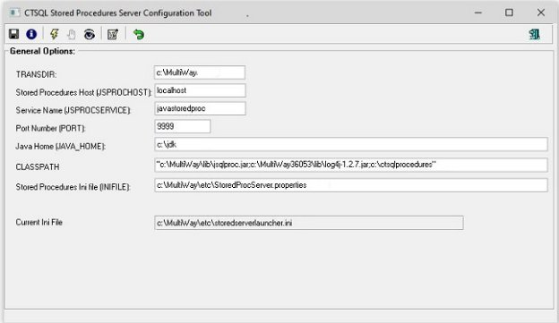
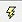
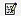

# Introducción
Cosmos consta de dos herramientas básicas para el desarrollo de una aplicaci n: Un servidor de base de datos relacional, denominado CTSQL, y un lenguaje propio de propósito general, denominado COOL. 

El presente volumen recoge todos los conceptos y particularidades relativos al gestor de base de datos de Cosmos, el CTSQL. De forma esquemática, la información contenida en el presente manual es la siguiente: 

- Elementos básicos del CTSQL: Conceptos y elementos manejados por el gestor de base de datos de Cosmos. Estos conceptos son fundamentales para comprender la forma de trabajar del CTSQL. 
- Instrucciones del SQL: Dónde se incluyen, sintaxis, corrección de errores, etc. 
- Sublenguajes del CTSQL: Lenguaje de Definición de Datos (DDL), Lenguaje de Control de Acceso a Datos (DCL), Lenguaje de Consulta (QL) y Lenguaje de Manipulación de Datos (DML). 
- Transacciones. 
- Catálogo de tablas de la base de datos. 
- Optimización. 
- Comunicación con el lenguaje de cuarta generación de MultiBase (COOL). 
- Recomendaciones. 
# Bases de Datos Relacionales y SQL
La idea de modelo relacional se basa en el concepto de «relación». Una relación no es más que un conjunto de objetos de la misma clase. Un grupo de objetos puede ser clasificado en varios tipos de objetos o conjuntos. Cada objeto tendrá varias propiedades (atributos) características de su forma de uso, las cuales definen agrupamientos en conjuntos. Cada objeto de un conjunto puede describirse por los valores de sus atributos. Esta descripción se llama [**«tupla»**](#chmtopic3). Si se consideran todas las «tuplas» que describen todos los objetos del conjunto, se habla de una «relación».

En bases de datos relacionales, la representación de una relación es una tabla (fichero). Esencialmente, una [**tabla**](#chmtopic4) está compuesta de filas (registros) y[**columnas**](#chmtopic5) (campos), que definen los datos característicos de los valores almacenados.

Una [**base de datos**](#chmtopic6) relacional se describe fundamentalmente por dos características:

1. Los datos se ven como tablas y no existen apuntadores entre ellos.
1. Las operaciones sobre los datos reciben como entrada tablas y producen como salida tablas.

El SQL tiene su origen en el prototipo de base de datos relacional SYSTEM R, desarrollado por IBM en la década de los 70. Se trata de la evolución de los lenguajes denominados «SQUARE» y «SEQUEL». Debido a su gran aceptación se decidió su normalización, primero por el Instituto Americano de Estandarización (ANSI) y posteriormente por la Organización Internacional de Estandarización (ISO). El estándar SQL tiene como finalidad principal la portabilidad de las definiciones de bases de datos y los programas de aplicación.
# Estructura del CTSQL
El lenguaje que Cosmos utiliza para acceder a la base de datos es un SQL (Structured Query Language), convertido desde hace años en el estándar para el manejo de bases de datos relacionales. En Cosmos dicho lenguaje se denomina CTSQL.

El CTSQL comprende cuatro sublenguajes, que son:

1. [**DDL (Data Definition Language)**](#chmtopic8): Lenguaje de Definición de Datos. Este sublenguaje comprende todas aquellas instrucciones relativas a la definición de los elementos que componen una[**base de datos**](#chmtopic6). Es decir, creación de bases de datos,[**tablas**](#chmtopic4),[**índices**](#chmtopic9), etc.
1. [**DCL (Data Control Language)**](#chmtopic10): Lenguaje de Control de Acceso a Datos. Este sublenguaje contempla la concesi n y retirada de permisos a usuarios sobre la base de datos, tablas y columnas. Asimismo, se encarga de los bloqueos o control de concurrencia entre usuarios. 
1. [**QL (Query Language)**](#chmtopic11): Lenguaje de Consulta. Parte del SQL dedicada a la extracción de información de las tablas de la base de datos.
1. [**DML (Data Management Language)**](#chmtopic12): Lenguaje de Manipulación de Datos. Este sublenguaje se encarga del mantenimiento de los datos en la base de datos. Esto significa que permitirá dar de alta nuevos valores, modificarlos o borrarlos en las tablas de la base de datos.
# Expresiones del CTSQL
Una «expresión» es cualquier dato, constante o variable, o la combinación de varios de ellos mediante operadores, que tras un proceso de evaluación produce un resultado. Los operadores aritméticos y de formato que pueden emplearse en expresiones de tipo CTSQL son los siguientes: 

- + Suma
- - Resta
- \* Multiplicación
- / División
- || Concatenación

Las expresiones válidas en CTSQL son las siguientes: 

**número** 
Número expresado como una constante en instrucciones CTSQL. 

**«Literal»** 
Cadena de texto entre comillas. Este literal se expresa como constante en instrucciones CTSQL y puede representar una fecha, un tipo de dato hora o una cadena de caracteres alfanuméricos. Los tipos de datos correspondientes a fecha y hora se representan respectivamente como «dd/mm/yyyy» y «hh:mm:ss». 

**-expresión** 
En expresiones numéricas invierte el signo. 

**(expresión)** 
Evalúa en primer lugar la expresión entre paréntesis (precedencia explícita). 

**expresión operador expresión** 
Cualquier combinación de expresiones mediante los operadores aritméticos y de formato indicados anteriormente. 

**función(expresiones)** 
Cualquiera de los valores agregados o funciones admitidas por CTSQL. 

**subselect [
Tabla derivada**](#chmtopic14)** devuelta por una instrucción [**SELECT**](#chmtopic15) que servirá como condicionante de una expresión. 

**ROWID** 
El «[**rowid**](#chmtopic16)» es el número de orden que ocupa físicamente una fila en una [**tabla**](#chmtopic4). Mediante este valor se produce el acceso más rápido a los datos de la tabla, por lo que su uso es prioritario. 

**NOTA**:
En la mayoría de los casos, los operandos utilizados en la formación de estas expresiones serán «columnas» de las tablas de la base de datos. 
# Variables Internas CTSQL
Al igual que ocurre en el lenguaje de cuarta generación de Cosmos (COOL), el CTSQL dispone de determinadas variables internas cuyo mantenimiento es automático. Estas variables son las siguientes:

|today|Devuelve la fecha del sistema.|
| :- | :- |
|now|Devuelve la hora del sistema.|
|current|Devuelve la fecha y la hora del sistema.|
|user|Evalúa el nombre del usuario con el que se accede a la base de datos. Este nombre será el definido en la variable de entorno [**DBUSER**](#chmtopic18).|

# Funciones del CTSQL
CTSQL puede utilizar funciones de valores agregados y funciones de fecha , hora, sistema, manejo de caracteres, conversión, generales y numéricas. Estas funciones son las siguientes: 
## **VALORES AGREGADOS**

|**Agregados**|**Sintaxis**|**Descripción**|
| :- | :- | :- |
|**count()**|Count(\*)|Devuelve el número de filas que cumplen la [**cláusula «WHERE»**](#chmtopic20). |
|** |**count(**distinct x**)**|Devuelve el número de valores únicos en la columna «x» en las filas que cumplen la cláusula «WHERE».|
|**sum()**|**sum(**[distinct] x**)** |Devuelve la suma de todos los valores de la columna «x» para las filas que cumplen la cláusula «WHERE». Esta función sólo podrá utilizarse con valores num ricos. En caso de utilizarse la palabra clave «distinct», el resultado será la suma de los valores distintos de la columna «x». |
|**avg()** |**avg(**[distinct] x**)**|Devuelve el promedio de todos los valores de la columna «x» para las filas que cumplen la cláusula «WHERE». Esta función sólo podrá utilizarse con valores numéricos. En caso de utilizarse la palabra clave «distinct», el resultado será el promedio de los valores distintos de la columna «x». |
|**max()**|**max(**x**)**|Devuelve el valor máximo de la columna «x» de aquellas filas que cumplen la [**cláusula «WHERE»**](#chmtopic20). |
|**min()**|**min(x)**|Devuelve el valor mínimo de la columna «x» de aquellas filas que cumplen la cláusula «WHERE». |

NOTAS: 

- La cláusula «WHERE» sólo puede especificarse en las instrucciones de CTSQL: [**SELECT**](#chmtopic15), [**UPDATE**](#chmtopic21) o [**DELETE**](#chmtopic22)
- En las funciones «sum(x)», «avg(x)», «max(x)» y «min(x)», «x» puede ser una expresión en lugar de una columna. En este caso, la función se evalúa sobre los valores de la expresión como cómputo de cada fila que satisface la [**cláusula «WHERE»**](#chmtopic20).
- La palabra clave «distinct» sólo puede utilizarse con columnas, nunca con expresiones. 
- La palabra clave «distinct» sólo puede utilizarse una sola vez en una «select\_list».
- Los valores nulos afectan a los valores agregados de la siguiente forma:

1\. Count(\*)» cuenta todas las filas aunque el valor de cada columna sea nulo. 
2\. «count(distinct x)», «avg(x)», «sum(x)», «max(x)» y «min(x)» ignoran las filas con valores nulos para «x». Sin embargo, si «x» contiene  olamente valores nulos, devuelven nulo («NULL») para esa columna. 
## **FUNCIONES DE FECHA**

|**Agregados**|**Sintaxis**|**Descripción**|
| :- | :- | :- |
|**date**|**date(expresión)** |Devuelve el valor de «expresión» convertido a tipo DATE. |
|**day**|**day(expresión)** |Devuelve el día de la fecha que resulte de la conversión de «expresión». |
|**month**|**month(expresión)**|Devuelve el mes de la fecha que resulte de la conversión de «expresión». |
|**year**|**year(expresión)** |Devuelve el año de la fecha que resulte de la conversión de «expresión». |
|**weekday**|**weekday(expresión)**|Devuelve el día de la semana de la fecha que resulte de la conversión de «expresión». |
|**mdy**|**mdy(mes, día, año)** |Devuelve un valor de tipo DATE («mes», «día» y «año» son expresiones que representan los componentes de la fecha). |
## **FUNCIONES DE HORA**

|**Función**|**Sintaxis**|**Descripción**|
| :- | :- | :- |
|**time**|**time(**expresión**)** |Devuelve el valor de «expresión» convertido a tipo TIME. |
|**hour**|**hour(**expresión**)** |Devuelve las horas de la hora que resulten de la conversión de «expresión».|
|**minute**|**minute(**expresión**)**|Devuelve los minutos de la hora que resulten de la conversión de «expresión». |
|**second**|**second(**expresión**)** |Devuelve los segundos de la hora que resulten de la conversión de «expresión». |
|**hms**|**hms(**hora, minutos, segundos**)** |Devuelve un valor de tipo TIME. «hora», «minutos» y «segundos» son expresiones numéricas que representan los componentes de la hora. |
|**mt**|**mt(**expresión**)** |Devuelve «AM» o «PM», dependiendo del valor de la hora que devuelva «expresi n» (Meridian Time). |
|**tomt**|**tomt(**expresión**)** |Devuelve el valor de tipo TIME correspondiente a la hora del meridiano. |
## **FUNCIONES DE SISTEMA**

|**Función** |**Sintaxis**|**Descripción**|
| :- | :- | :- |
|**typelength**|**typelength(expr1, expr2)** |Devuelve el número de bytes ocupados por un tipo de dato SQL. «expr1» debe dar el número correspondiente al tipo de dato (0 al 3 y del 5 al 8) y «expr2» debe dar la longitud, siendo este último significativo sólo en el tipo de dato CHAR.|
## **FUNCIONES DE MANEJO DE CARACTERES**

|**Función**|**Sintaxis**|**Descripción**|
| :- | :- | :- |
|**upper**|**upper(expresión)**|Permite devolver una columna o una expresión en mayúsculas. |
|**lower**|**lower(expresión)**|Devuelve la expresión en minúsculas. |
|**initcap**|**initcap(expresión)**|Retorna la expresión con la primera letra de cada palabra en mayúsculas y el resto en minúsculas|
|**ltrim**|**ltrim(expresión)**|Elimina los blancos de la expresión por la izquierda.|
|**rtrim**|**rtrim(expresión)**|Elimina los blancos de la expresión por la derecha. |
|**concat**|**concat(exp1, exp2)**|Concatena una expresión y elimina los blancos por la derecha. |
|**lpad**|**lpad(exp1,n[, exp2])**|Rellena la cadena por la izquierda hasta la longitud n con el carácter definido, por defecto es blanco. Si el nº de caracteres que le indicamos es menor que la longitud de la expresión, trunca por la derecha. |
|**rpad**|**rpad(exp1,n[,exp2])**|Rellena la cadena por la derecha hasta la longitud n con el carácter definido, por defecto es blanco. Si el nº de caracteres que le indicamos es menor que la longitud de la expresión, trunca por la derecha. |
|**substr**|**substr(exp,m[, n]))**|Retorna un substring de la expresión que recibe como parámetro. Se le indica el carácter de inicio y el nº de caracteres del substring. Si el nº  de carácter de inicio es negativo, indicará que empezará a n caracteres del final de la cadena.|
### *Ejemplos:*

<table><tr><th valign="top"><b>Función</b></th><th valign="top"><b>Instrucción</b> </th><th valign="top"><b>Resultado</b></th></tr>
<tr><td valign="top"><b>upper</b></td><td valign="top">select upper(tabname) from systables</td><td valign="top">
Devuelve el nombre de la tabla en mayúsculas. 

Retornará "SYSTABLES", "SYSCOLUMNS".
</td></tr>
<tr><td valign="top"><b>lower</b></td><td valign="top">select lower(tabname) from systables</td><td valign="top">
Devuelve el nombre de la tabla en minúsculas. 

Retornará "systables", "syscolumns".
</td></tr>
<tr><td valign="top"><b>initcap</b></td><td valign="top">select initcap("juan garcía") from systables</td><td valign="top">Retorna "Juan García". </td></tr>
<tr><td rowspan="2" valign="top"><b>concat</b></td><td valign="top">select concat(tabname, "---hola") from systables</td><td valign="top">Retorna "mitabla---hola". </td></tr>
<tr><td valign="top">select tabname || "---hola" from systables</td><td valign="top">Retorna la expresión sin eliminar espacios por la derecha:   "mitabla           ---hola".</td></tr>
<tr><td rowspan="2" valign="top"><b>lpad</b></td><td valign="top">select lpad(tabname, 20, '-') from systables</td><td valign="top">La función devolverá: "-----------systables".</td></tr>
<tr><td valign="top">select lpad(tabname, 5, '-') from systables</td><td valign="top">La función devolverá: "systa".</td></tr>
<tr><td rowspan="2" valign="top"><b>rpad</b></td><td valign="top">select rpad(tabname, 20, '-') from systables</td><td valign="top">La función devolverá: "systables-----------".</td></tr>
<tr><td valign="top">select rpad(tabname, 5, '-') from systables</td><td valign="top">La función devolverá: "systa".</td></tr>
<tr><td rowspan="2" valign="top"><b>substr</b></td><td valign="top">select substr(tabname, 1, 4) from systables where tabname = "systables"</td><td valign="top">La función retornará "syst"</td></tr>
<tr><td valign="top">select substr(tabname, -5, 4) from systables where tabname = "systables"</td><td valign="top">La función devolverá: "able"</td></tr>
</table>
## **FUNCIONES GENERALES**

|**Función**|**Sintaxis**|**Descripción**|
| :- | :- | :- |
|[**DECODE**](#chmtopic23)|**DECODE(expresion, busqueda, resultado [, busqueda, resultado]...[, default ])**|Esta función compara expr con cada uno de valores de búsqueda uno a uno. Si expr es igual a un valor de búsqueda la base de datos devuelve el resultado correspondiente. |
|[**NVL**](#chmtopic24)|**NVL(expr1,expr2)**|Compara expr1 con NULL. Si expr2 es NULL retornará expr2|
## **FUNCIONES DE CONVERSIÓN**

<table><tr><th valign="top"><b>Función</b></th><th valign="top"><b>Sintaxis</b></th><th valign="top"><b>Descripción</b></th></tr>
<tr><td valign="top">
[<b>TO_DATE</b>](#chmtopic25)

 
</td><td valign="top"><b>TO_DATE(cadena[, formato [, nlsparams ]])</b></td><td valign="top">Convierte una cadena de caracteres representando una fecha en un valor de fecha según el formato especificado.</td></tr>
<tr><td rowspan="2" valign="top">[<b>TO_CHAR</b>](#chmtopic26)</td><td valign="top"><b>TO_CHAR(numero, [formato [, nlsparams] ])</b></td><td rowspan="2" valign="top">Convierte un número o una fecha en una cadena de caracteres con el modelo de formato indicado.</td></tr>
<tr><td valign="top"><b>TO_CHAR(fecha, [formato [, nlsparams] ])</b></td></tr>
</table>
## **FUNCIONES NUMÉRICAS**

|**Función**|**Sintaxis**|**Descripción**|
| :- | :- | :- |
|[**ABS**](#chmtopic27)|ABS(expr)|Retorna el valor absoluto de una expresión numérica en una query.|
|[**SIGN**](#chmtopic28)|SIGN(num)|Esta función retorna -1 si el número que recibe como parámetro es negativo, 1 si es positivo y 0 si es 0.|
|[**TRUNC**](#chmtopic29)|TRUNC(numero, decimales)|Trunca en la enésima posición decimal.|

# Convenciones Utilizadas
Las convenciones empleadas en los diferentes manuales de Cosmos para presentar la sintaxis de cualquier elemento son las siguientes: 

[ ] 
Aquellos elementos que se encuentren entre corchetes son opcionales. 

{ } 
Indica la obligatoriedad de incluir uno de los elementos encerrados entre llaves. Dichos elementos estarán separados por el carácter de «barra vertical» (carácter ASCII 124). 

| 
Este carácter se utiliza para separar los diferentes elementos opcionales u obligatorios de la sintaxis, dependiendo de si éstos van entre corchetes o entre llaves, respectivamente. 

… 
El elemento anterior a los puntos puede aparecer más veces en la sintaxis. 

,… 
Como el caso anterior, pero cada nueva aparición del dicho elemento debe ir precedida por una coma. 

palabra 
Las palabras en minúsculas corresponden con identificadores COOL o CTSQL, expresiones, etc. 

**PALABRA**
Las palabras en mayúsculas y en negrita son reservadas del lenguaje COOL o CTSQL, y por tanto invariables. 

subrayado 
Si no se especifica otra opción, la palabra o palabras subrayadas se toman por defecto. 

**negrita** 
Cualquier signo de las convenciones que se encuentre en negrita es obligatorio en la sintaxis. 

El resto de signos se utilizan con su valor. Así, en aquellos lugares en los que se pueden especificar comillas, éstas podrán ser simples o dobles (", '), con la obligatoriedad de cerrar el texto con el mismo tipo con el que se abrió. Asimismo, se pueden incluir comillas como parte de un texto, en cuyo caso, dichas comillas deberán ser necesariamente del tipo contrario a las que sirven de delimitadores del texto. Es decir, en el caso de definir un literal entre comillas que incluya una parte también entrecomillada, habrá que combinar ambos tipos. 

# Construcción de Identificadores CTSQL 
Un identificador CTSQL es el nombre de un elemento del CTSQL. Estos elementos son los siguientes: 

- [**Bases de datos**](#chmtopic6)
- [**Tablas**](#chmtopic4)
- [**Columnas**](#chmtopic5)
- [**Índices**](#chmtopic9)
- [**Claves primarias**](#chmtopic32) y [**claves referenciales**](#chmtopic33) («primary keys» y «foreign keys»).
- [**«Views»**](#chmtopic34)
- [**Sinónimos**](#chmtopic35)
- [**Alias**](#chmtopic36).

Un identificador puede estar formado por letras, números y signos de subrayado («\_»). El primer carácter deberá ser siempre una letra, pudiendo ser la longitud del identificador de 1 a 18 caracteres. En el caso de introducir letras en mayúsculas en un identificador del CTSQL, éste las convertirá a minúsculas. 

La estructura de un identificador CTSQL es la siguiente: 

letra [ subrayado | letra | número ] 

Donde: 

letra
Puede ser mayúscula o minúscula. Rango: a-z. 

subrayado
Símbolo de subrayado («\_»). 

número
Carácter numérico. Rango: 0-9. 

En una misma base de datos, los identificadores de cada tipo deben ser unívocos, aplicándose adicionalmente esto a los siguientes grupos de elementos en su conjunto: 

- [**Tablas**](#chmtopic4) y [**«views»**](#chmtopic34)
- [**Índices**](#chmtopic9), [**claves primarias**](#chmtopic32) y [**claves referenciales**](#chmtopic33)
- [**Columnas**](#chmtopic5) (en la misma tabla) y [**alias**](#chmtopic36) (en la misma instrucción [**SELECT**](#chmtopic15)).
# Tipos de Datos del CTSQL 
Un tipo de datos es un conjunto de valores representables. Un valor es atómico y, por tanto, no permite subdivisiones. Un valor puede ser una cadena de caracteres alfanuméricos o un número. El tipo de datos determina los valores que acepta una columna de una tabla, así como su modo de almacenamiento.

Los números correspondientes a cada tipo de dato en el «diccionario» de la [**base de datos**](#chmtopic6) son los siguientes:

|**Número**|**Tipo**|
| :- | :- |
|0|CHAR|
|1|SMALLINT|
|2|INTEGER|
|3|TIME|
|5|DECIMAL|
|6|SERIAL|
|7|DATE|
|8|MONEY|
|10|DATETIME|
|11|BINARY|

0 - CHAR(n)

Cadena de caracteres alfanuméricos de longitud «n». «n» tiene que ser mayor o igual que uno y menor o igual que 32.767 (1<= n <= 32767). El número de bytes que reserva en disco este tipo de dato es el indicado en «n». El parámetro «n» es necesario indicarlo para la definición del elemento en concreto.

1 - SMALLINT

Este tipo de dato permite almacenar números enteros. El rango de valores num ricos admitidos está entre -32.767 y +32.767, ambos inclusive. Este tipo de dato ocupa siempre 2 bytes, independientemente del número de caracteres numéricos a grabar. Es decir, si se introduce el valor «1», éste ocupará lo mismo que el valor «32.767». Por lo tanto, al estar ya predefinida la longitud de este tipo de datos no será necesario indicarla.

2 - INTEGER

Este tipo de dato permite almacenar números enteros. El rango de valores num ricos que admite está entre -2.147.483.647 y +2.147.483.647, ambos inclusive. Este tipo de dato ocupa siempre 4 bytes, independientemente del número de caracteres numéricos que se incluyan como dato. Al igual que en el tipo de dato anterior, su longitud está ya predefinida.

3 - TIME

Este tipo de dato admite horas con el formato por defecto «HH:MM:SS» y almacenada como el número de segundos desde las «00:00:01». Este tipo de dato es equivalente a un INTEGER, siendo en este caso el rango de valores admitidos entre 1 y 86.400, que se corresponden con los valores «00:00:01» y «24:00:00», respectivamente. Al igual que el tipo de dato INTEGER, ocupa 4 bytes.

Los tipos TIME se introducen como una secuencia de hora, minutos y segundos, sin separador entre ellos (tampoco espacios en blanco). Su representación depende de la variable de entorno [**DBTIME**](#chmtopic38). Asimismo, estos tipos de datos permiten ordenaciones y comparaciones horarias entre dos columnas de tipo TIME.

5 - DECIMAL [(m [, n])]

Tipo de dato que almacena números decimales de coma flotante con un total de «m» dígitos significativos (precisión) y «n» dígitos a la derecha de la coma decimal (escala). «m» puede ser como máximo menor o igual a 32 («m <= 32») y «n» menor o igual que «m» («n <= m»).

Cuando se asignan valores a «m» y «n», la variable decimal tendrá punto aritm tico fijo. El segundo parámetro «n» es opcional, y si se omite se tratará como un decimal de coma flotante. Un elemento decimal(m) tiene una precisión «m» y un rango de valor absoluto entre «10-130» y «10125». En caso de no especificar parámetros a un elemento decimal, éste será tratado como «decimal(16)».

6 - SERIAL[(n)]

Este tipo de dato sólo puede utilizarse en CTSQL, no así en el lenguaje de cuarta generación COOL. Los valores que admite son números enteros secuenciales y únicos asignados automáticamente por CTSQL (contador automático). El valor inicial de este tipo de dato, por defecto, es uno (1). No obstante, este valor inicial puede cambiarse al asignar un valor a «n» en la definición del elemento (columna). El CTSQL no permitirá la introducción ni la modificación de ningún valor ya utilizado sobre una columna SERIAL. La ocupación en disco es de 4 bytes.

Comportamiento del tipo de dato SERIAL:

- Al grabar el primer valor sobre la columna definida como SERIAL, el valor asignado automáticamente por defecto es «1». Esto es así, excepto si se asigna un valor inicial en la definición de la columna. Asimismo, dicha columna SERIAL también puede inicializarse mediante la asignación de un valor concreto en una inserción o actualización. Si dicha columna SERIAL dispone de datos, el siguiente valor a insertar será el máximo más uno, siempre y cuando no haya existido alguna baja.
- En caso de que la columna SERIAL haya tenido ciertos valores y se hayan borrado, el siguiente valor a insertar será el máximo valor que haya existido o exista más uno.
- Por defecto, en las inserciones de valores nuevos en la columna SERIAL siempre se incrementará al valor máximo existente, o que haya existido, más uno.

7 - DATE 

Tipo de dato que admite fechas con el formato por defecto «dd/mm/yyyy» y las almacena como el número de días transcurridos partiendo desde el «01/01/1900». Dicho número será positivo o negativo dependiendo de si la fecha es posterior o anterior, respectivamente, al valor inicial indicado. Este tipo de dato es equivalente a un INTEGER, ocupando por tanto 4 bytes en disco. 

Los tipos DATE son introducidos como una secuencia de día, mes y año con caracteres numéricos: 

- El día puede representarse como el día del mes (1 ó 01, 2 ó 02, etc.).
- El mes se representa como un número (1 equivale a enero, 2 a febrero, etc.)
- El año se representa como un número de cuatro dígitos (0001 a 9999). En caso de visualizar dos dígitos para el año, CTSQL asume que el año es 19yy

Se puede ordenar por una columna de tipo DATE y hacer una comparación cronol gica entre dos columnas de tipo DATE

El orden en que se introduzcan el año, mes y día dependerá del valor de la variable de entorno [**DBDATE**](#chmtopic39)

8 - MONEY [(m [, n])]

Tipo de dato que almacena números decimales de coma flotante con un total de «m» dígitos significativos (precisión) y «n» dígitos a la derecha de la coma decimal (escala). Ésta es la misma definición que se asignó al tipo de dato «DECIMAL». Este tipo de dato se utiliza para representar cantidades referentes a unidades monetarias, empleando la variable de entorno [**DBMONEY**](#chmtopic40) para identificar la unidad monetaria a la que se refiere el importe definido como valor.

El tipo de dato MONEY(m) se define como el tipo de dato DECIMAL(m,2), y si no se especifican parámetros, MONEY se trata como una variable de tipo DECIMAL(16,2).

10 - DATETIME

Esta clase permite almacenar una fecha y un valor horario separados por un blanco. la fecha la almacena como el número de días transcurridos partiendo desde el «01/01/1900». Dicho número será positivo o negativo dependiendo de si la fecha es posterior o anterior, respectivamente, al valor inicial indicado.

La hora es almacenada como el número de segundos desde las «00:00:0 y se introduce como una secuencia de hora, minutos y segundos. Este tipo de dato es equivalente a dos INTEGER, ocupando por tanto 8 bytes en disco.

11 - BINARY(n)

Cadena de números hexadecimales de longitud «n». «n» tiene que ser mayor o igual que uno y menor o igual que 32.767 (1<= n <= 32767). El número de bytes que reserva en disco este tipo de dato es el indicado en «n». El parámetro «n» es necesario indicarlo para la definición del elemento en concreto.

El siguiente cuadro recoge de forma resumida los valores de los diferentes tipos de datos: 

|**Tipo de dato**|**Valor mínimo**|**Valor máximo**|**Ocupación (bytes)**|
| :- | :- | :- | :- |
|CHAR(n)|1 carácter|32\.767 caracteres|n|
|SMALLINT|-32.767|+32.767|2|
|INTEGER|-2.147.483.647|+2.147.483.647|4|
|TIME|00:00:01|24:00:00|4|
|DECIMAL(m,n)|![sql00000.gif]|![sql00001.gif]|1+m/2|
|SERIAL(n)|-2.147.483.647|+2.147.483.647|4|
|DATE|01/01/0001|31/12/9999|4|
|DATETIME|01/01/0001 00:00:01|31/12/9999 24:00:00|8|
|BINARY(n)|1 byte|32\.767 bytes|n|
|MONEY(m,n)|![sql00002.gif][sql00000.gif]|![sql00003.gif][sql00001.gif]|1+m/2|

En caso de existir valores introducidos en las tablas, la conversión de tipos de datos entre sí es válida en los siguientes casos:

Tabla de conversión de tipos de datos

|**Desde\Hasta**|**CHAR**|**SMALLINT**|**INTEGER**|**TIME**|**DECIMAL**|**SERIAL**|**DATE**|**DATETIME**|**MONEY**|
| :- | :- | :- | :- | :- | :- | :- | :- | :- | :- |
|CHAR| |SÍ|SÍ|SÍ|SÍ|SÍ|SÍ|SÍ|SÍ|
|SMALLINT|NO| |SÍ|SÍ|SÍ|SÍ|SÍ|NO|SÍ|
|INTEGER|NO|SÍ| |SÍ|SÍ|SÍ|SÍ|NO|SÍ|
|TIME|NO|SÍ|SÍ| |SÍ|SÍ|SÍ|SÍ|SÍ|
|DECIMAL|NO|SÍ|SÍ|SÍ| |SÍ|SÍ|NO|SÍ|
|SERIAL|NO|SÍ|SÍ|SÍ|SÍ| |SÍ|NO|SÍ|
|DATE|NO|SÍ|SÍ|SÍ|SÍ|SÍ| |SÍ|SÍ|
|DATETIME|SÍ|NO|NO|NO|NO|NO|SÍ| |NO|
|MONEY|NO|SÍ|SÍ|SÍ|SÍ|SÍ|SÍ|NO| |

La conversión «SÍ» será válida cuando los datos a convertir cumplan las reglas de rango especificadas para cada tipo en particular. 
# Atributos
Un atributo es una característica asignada a las columnas que integran las [**tablas**](#chmtopic4) de la [**base de datos**](#chmtopic6). Estas características son muy importantes en la definición de la base de datos, pues indican al sistema reglas de integridad sobre los datos, evitando su verificación por programa.

Los atributos del CTSQL sólo podrán utilizarse en las instrucciones [**CREATE TABLE**](#chmtopic42) y [**ALTER TABLE**](#chmtopic43) dentro del Lenguaje de Definición de Datos ([**DDL**](#chmtopic8)).

Los atributos son los siguientes (entre paréntesis se indican también aquellos que afectan al CTSQL):

|[**CHECK](#chmtopic44) **(CTSQL)**|Este atributo se utiliza para definir una expresión de tipo booleana (condición).|
| :- | :- |
|[**DEFAULT](#chmtopic45) **(CTSQL)**|Este atributo se utiliza para asignar un valor por defecto.|
|[**DOWNSHIFT](#chmtopic46) **(CTSQL)**|Este atributo convierte las letras mayúsculas de los valores de una variable de tipo CHAR en minúsculas. |
|[**FORMAT](#chmtopic47) **(CTSQL)**|Este atributo permite establecer el formato de presentación de los valores de las variables a las que se asigne.|
|[**LABEL](#chmtopic48) **(CTSQL)** |Este atributo define una etiqueta (título) para la variable que se está definiendo.|
|[**LEFT](#chmtopic49) **(CTSQL)**|Alinea a la izquierda el valor asignado a una variable.|
|[**NOENTRY](#chmtopic50) **(CTSQL)**|Este atributo no permite insertar un valor a la variable.|
|[**NOT NULL**](#chmtopic51)|Este atributo obliga a que la columna tenga un valor distinto de nulo («NULL»).|
|[**NOUPDATE](#chmtopic52) **(CTSQL)** |Este atributo no permite actualizar un valor a la variable.|
|[**PICTURE](#chmtopic53) **(CTSQL)**|Este atributo especifica la máscara de edición de una variable de tipo CHAR.|
|[**RIGHT](#chmtopic54) **(CTSQL)**|Alinea a la derecha el valor asignado a una variable.|
|[**UPSHIFT](#chmtopic55) **(CTSQL)**|Este atributo convierte las letras minúsculas de los valores de una variable de tipo CHAR en mayúsculas. |
|[**ZEROFILL](#chmtopic56)**(CTSQL)** |Este atributo alinea a la derecha el valor sin tener en cuenta el tipo de dato (numérico o alfanumérico), y rellena con ceros por la izquierda.|

# CHECK
Este atributo se utiliza para definir una expresión de tipo booleana (condición). Todos los valores de la variable que hagan que dicha expresión evalúe a FALSE serán rechazados. Su sintaxis es la siguiente: 

**CHECK**(condición) 

Donde: 

<table><tr><th valign="top"><b>condición</b></th><th colspan="2" valign="top">
Lista de una o más subcondiciones separadas por operadores AND, OR y NOT. Estas condiciones pueden incluir el signo dólar («$») para sustituir el nombre de la variable a la que se aplica este atributo. Las condiciones válidas son las siguientes: 

expresión operador_relación expresión

Donde: 

operador_relación puede ser uno de los siguientes: 

<b>=</b> Igual.  <b>!=</b> o <b><></b> Distinto.  <b>></b> Mayor que.  <b>>=</b> Mayor o igual que.  <b><</b> Menor que.  <b><=</b> Menor o igual que. 

[<b>NOT</b>] expresión <b>BETWEEN</b> expr1 <b>AND</b> expr2  Devuelve verdadero o falso en caso de que el resultado de una expresión «$» esté o no comprendido en el rango dado por otras dos (ambas inclusive). La partícula «NOT» invierte el resultado. 

[<b>NOT</b>] expresión <b>IN</b> (lista_valores)  Devuelve verdadero o falso en caso de que el resultado de una expresión «$» sea igual o no a uno de los valores incluidos en «lista_valores». La partícula «NOT» invierte el resultado. 

Donde: 
</th></tr>
<tr><td> </td><td>lista_valores</td><td>Lista de valores separados por comas. </td></tr>
<tr><td> </td><td colspan="2" valign="top">
 

[<b>NOT</b>] expresión <b>LIKE</b> "literal"  Devuelve verdadero o falso en caso de que el resultado de una expresión se ajuste o no al patrón definido en «literal». La partícula «NOT» invierte el resultado. 

Donde: 
</td></tr>
<tr><td> </td><td valign="top">literal </td><td valign="top">Expresión alfanumérica que puede contener dos metacaracteres que tienen un significado especial: </td></tr>
<tr><td> </td><td valign="top"><b>%</b></td><td valign="top">Indica cero o más caracteres en la posición donde aparezca. </td></tr>
<tr><td> </td><td valign="top"><b>_</b></td><td valign="top">(subrayado) Indica cualquier carácter (uno solo) en la posición indicada. </td></tr>
<tr><td> </td><td colspan="2" valign="top">
 

[<b>NOT</b>] expresión <b>MATCHES</b> "literal"  Devuelve verdadero o falso en caso de que el resultado de una expresión se ajuste o no al patrón definido en «literal». La partícula «NOT» invierte el resultado. 

Donde: 
</td></tr>
<tr><td> </td><td valign="top">"literal" </td><td valign="top">Expresión alfanumérica que puede contener varios metacaracteres que tienen un significado especial: </td></tr>
<tr><td> </td><td valign="top"><b>*</b></td><td valign="top">Indica cero o más caracteres en la posición indicada. </td></tr>
<tr><td> </td><td valign="top"><b>?</b></td><td valign="top">Indica cualquier carácter (uno solo) en la posición donde aparezca. </td></tr>
<tr><td> </td><td valign="top"><b>[</b>lista<b>]</b></td><td valign="top">Indica que cualquiera de los caracteres incluidos en la «lista» puede aparecer en esa posición. Se puede indicar un rango de caracteres separando el inicial y el final por medio de un guión. Si el primer carácter de «lista» es «^», indica que los caracteres o rangos no pueden aparecer en esa posición. </td></tr>
<tr><td> </td><td valign="top"><b>\</b></td><td valign="top">Indica que el carácter al que precede no debe ser considerado como especial (metacarácter). Siempre precederá a cualquiera de los metacaracteres indicados anteriormente. </td></tr>
<tr><td> </td><td colspan="2" valign="top">expresión <b>IS</b> [<b>NOT</b>] <b>NULL</b>  Devuelve verdadero o falso en caso de que el resultado de una expresión sea o no un valor nulo. La partícula «NOT» invierte el resultado. </td></tr>
</table>
Todas las condiciones indicadas pueden enlazarse mediante los siguientes operadores lógicos: 

|**AND**|Devolverá TRUE si ambas condiciones evalúan a TRUE. |
| :- | :- |

condición <b>AND condición 

|**OR**|Devolverá TRUE si al menos una de las condiciones evalúa a TRUE. |
| :- | :- |

condición <b>OR condición 

Ejemplo: 

create table albaranes (
albaran integer not null label "Num. Albaran", 
cliente integer not null label "Cod. Cliente", 
fecha\_albaran date label "Fecha Albaran", 
fecha\_envio date label "Fecha Envio", 
fecha\_pago date label "Fecha Pago", 
formpago char( 2) label "Cod. F.Pago", 
estado char( 1) upshift check ($ in ("S", "N")) 
default "N" label "Facturado"
);

NOTAS:

1. Los paréntesis agrupan operandos y operaciones alterando la precedencia de evaluación de los operadores.
1. En todos estos puntos, «expresión» puede sustituirse por el signo «$», lo que indicará que se trata del elemento (variable) que se está definiendo. 
1. Una expresión que devuelva el valor «NULL» sólo hará cierta la condición «IS NULL».
1. En los casos anteriores sería igualmente válido haber especificado en las condiciones el operador lógico «NOT» antes de la primera expresión. Por ejemplo:

[**NOT**] expresión **BETWEEN**… 
[**NOT**] expresión **IN**… 
# DEFAULT
Este atributo se utiliza para asignar un valor por defecto a la columna de la tabla, en el momento de iniciar la edición en modo agregar para provocar «insert» de filas. Asimismo, en caso de utilizar la instrucción [**INSERT**](#chmtopic57) del «[**DML**](#chmtopic12)» y no asignar un valor a la columna con este atributo, por defecto siempre se grabará el valor especificado en el mismo. Su sintaxis es la siguiente:

**DEFAULT** valor

Donde:

valor
Constante numérica o alfanumérica que se tomará por defecto. Si la variable es de tipo DATE, TIME o CHAR, este valor tiene que ir entre comillas.

En caso de no utilizar este atributo, todas las columnas toman por defecto el valor nulo.

En las columnas de tipo DATE, TIME y DATETIME pueden utilizarse las variables internas de CTSQL para asignar valores por defecto. Estas variables son TODAY, NOW y CURRENT respectivamente.

Ejemplo:

create table albaranes ( 
albaran integer not null label "Num. Albaran", 
cliente integer not null label "Cod. Cliente", 
fecha\_albaran date default today label "Fecha Albaran", 
fecha\_envio date default today label "Fecha Envio", 
fecha\_pago date label "Fecha Pago", 
formpago char( 2) label "Cod. F.Pago", 
estado char( 1) upshift check ($ in ("S", "N")) default "N" label "Facturado"
); 

En este ejemplo, tanto la columna «fecha\_albaran» como «fecha\_envio» tienen asignadas el atributo DEFAULT con el valor de la fecha del sistema («TODAY»).

Asimismo, la columna «estado» incluye el atributo DEFAULT indicando que por defecto siempre se grabará el valor «N» en mayúsculas ([**UPSHIFT**](#chmtopic55)). Este valor es uno de los dos posibles indicados por el atributo [**CHECK**](#chmtopic44): «S» y «N». 
# DOWNSHIFT
Este atributo convierte las letras mayúsculas de los valores de una columna de tipo CHAR a minúsculas en el momento de su inserción o actualización ([**INSERT**](#chmtopic57) o [**UPDATE**](#chmtopic21)), respectivamente. En caso de emplear el lenguaje de cuarta generación COOL como interfaces para el mantenimiento de la tabla en concreto, en la edición de los valores de esta columna también convertirá las mayúsculas a minúsculas. La sintaxis del atributo es la siguiente: 

**DOWNSHIFT** 

NOTAS 

- Si la tabla ya está creada y se han grabado en ella valores con letras en mayúsculas, al incorporar este atributo a dicha columna mediante una alteración de la tabla ([**ALTER TABLE**](#chmtopic43)) no se convertirán dichos valores. 
- Si se especifican los atributos DOWNSHIFT y [**UPSHIFT**](#chmtopic55), CTSQL considerará únicamente el último que encuentre en la definición de la columna. 

Ejemplo: 

create table proveedores( proveedor integer not null label "Codigo Proveedor", 
empresa char(25) downshift label "Empresa", 
apellidos char(25) label "Apellidos", 
nombre char(15) label "Nombre", 
direccion1 char(25) label "Direccion1", 
direccion2 char( 25) label "Direccion2", 
poblacion char( 15) label "Poblacion", 
provincia smallint label "Provincia", 
distrito integer label "Distrito", 
telefono char( 13) label "Telefono" ) 
primary key (proveedor) ; 

En este ejemplo, la columna «empresa» se define con el atributo DOWNSHIFT, lo que significa que no podrá contener ningún carácter en mayúsculas. Si intentásemos insertar o actualizar un valor con caracteres en mayúsculas, éstos se convertirán automáticamente a minúsculas.
# FORMAT
Este atributo determina el formato en el que se presentarán los valores de aquellas columnas en las que se asigne. El atributo FORMAT podrá asignarse a todos los tipos de datos, excepto a CHAR (para éste habrá que utilizar el atributo [**PICTURE**](#chmtopic53)). Su formato es el siguiente:

**FORMAT** "formato" 

Donde: 

formato 
Cadena de caracteres entre comillas que indica el formato. Dependiendo del tipo de dato, los posibles formatos son: 

1. Numéricos (SMALLINT, INTEGER, DECIMAL, SERIAL y MONEY). Los caracteres que se podrán emplear son los siguientes:  

|**#** |Representa cada dígito. No cambia los espacios en blanco por ningún otro carácter. |
| :- | :- |
|**.**(punto)|El punto indica la posición de la coma decimal. Aparecerá una coma o un punto, dependiendo de la definición de la variable de entorno [**DBMONEY**](#chmtopic40). |
|**,**(coma)|Permite indicar la separación de miles, millones, etc. Se imprimirá una coma si la variable de entorno [**DBMONEY**](#chmtopic40) tiene como valor un punto, y un punto si aquél es una coma. |
|**\***|Rellena los espacios en blanco con asteriscos. |
|**&**|Rellena los espacios en blanco con ceros. |
|**-**|Imprime un signo menos cuando la expresión sobre la que se aplica es menor que cero. Cuando se especifican varios signos «-», sólo aparecerá uno lo más a la derecha posible. |
|**+** |Imprime el signo «+» o «-», dependiendo de que la expresión sobre la que se aplica sea mayor o igual a cero («+») o menor que cero («-»). |
|**(** |Imprime un signo «abrir paréntesis» antes de un número negativo. Cuando se especifican varios signos «(», sólo aparecerá uno lo más a la derecha posible. |
|**)** |Imprime el signo «cerrar paréntesis» al final de un formato en el que se ha especificado «)». |
|**$** |Literal que se imprime como un signo de moneda. Cuando se indican varios en la plantilla, aparecerá sólo uno lo más a la derecha posible. Si se ha definido la parte «front» de la variable de entorno [**DBMONEY**](#chmtopic40), será esto último lo que incluya el resultado y no el signo «$» . |
|**%** |Este literal se imprimirá como tal en la posición donde se especifique. En caso de emplear más de un «%», éstos aparecerán en las posiciones asignadas. Estos signos no tienen ningún efecto sobre la expresión a evaluar. |

El siguiente cuadro recoge de forma resumida algunos ejemplos sobre la utilización de diferentes tipos de formatos: 

|**Números**|**Formato**|**Resultado** |
| :- | :- | :-: |
|-13423,41 |"##,###.##" |13\.423,41 |
|13423,41 |"##,###.##" |13\.423,41 |
|124713,12 |"##,###.##" |\*\*\*\*\*\*\*\*\* |
|30 |"##,###.##" |30,00 |
|2478 |"&&,&&&" |02\.478 |
|2076 |"\*\*,\*\*\*" |\*2.076 |
|20 |"\*\*,\*\*\*" |\*\*\*\*20 |
|-23453 |"+++,+++" |-23.453 |
|-1 |"+##,###" |-1 |
|23453 |"+++,+++" |+23.453 |
|1|"+##,###"|+1 |
|-6498 |"---,---" |-6.498 |
|20 |"---,---" |20 |
|-25 |"-##,###" |-25 |
|-3712 |"(++,+++)" |(-3.712) |
|-50 |"---,---%" |-50% |
|-24 |"(---,---%)" |(-24%) |
|24 |"(---,---%)" |24% |

2. Fechas (DATE). En este caso los caracteres que se evalúan con un significado para la plantilla de formato son «d», «m» e «y», en las combinaciones que se indican a continuación, representándose cualquier otro carácter como tal. dd Dos dígitos para el día del mes (01 a 31). ddd Tres letras significativas del nombre del día de la semana (Lun a Dom). mm Dos dígitos para el mes (01 a 12). mmm Tres letras significativas del nombre del mes (Ene a Dic). yy Dos dígitos para el año desde 1900 (00 a 99). yyyy Cuatro dígitos para el año (0000 a 9999). Casos prácticos: 

|**Fecha**|`  `**Formato** |`  `**Resultado** |
| :- | :- | :- |
|`  `01/07/1994 |`  `dd-mm-yyyy |`  `01-07-1994 |
|`  `01/07/1994|`  `dd ddd / mm mmm / yyyy  |`  `01 Vie / 07 Jul / 1994 |
|`  `01/07/1994 |`  `dd / mmm / yyyy  |`  `01 / Jul / 1994 |
|`  `01/07/1994|`  `dd-mm-yy |`  `01-07-94 |

3. Horas (TIME). En este caso los caracteres que se evalúan con un significado para la plantilla de formato son «h», «m» y «s», en las combinaciones que se indican a continuación: 

   hh:mm:ss 
   Dos dígitos para la hora, dos para los minutos y dos para los segundos. 

   hh:mm 
   Dos dígitos para la hora y dos dígitos para los minutos. 

   hh 
   Dos dígitos para la hora. 
   Casos prácticos: 

|` `**Hora** |` `**Formato** |` `**Resultado** |
| :- | :- | :- |
|` `15:10:20 |` `hh:mm:ss |` `15:10:20 |
|` `15:10:20 |` `hh:mm |` `15:10 |
|` `15:10:20 |` `hh |` `15 |

4. DateTime:  En este caso los caracteres que se evalúan con un significado para la plantilla de formato son los mismos que se han explicado para las fechas y las horas.
   Casos prácticos: 

|`  `**DateTime** |`  `**Formato** |`  `**Resultado** |
| :- | :- | :- |
|`  `01/07/1994 15:10:20 |` `dd-mm-yyyy hh:mm:ss |`  `01-07-1994 15:10:20|
|`  `01/07/1994 15:10:20|` `dd ddd / mm mmm / yyyy  hh:mm|`  `01 Vie / 07 Jul / 1994 15:10 |

Ejemplo: 

create table lineas(
albaran integer not null format "###" label "Num. Albaran", 
linea smallint not null format "##" label "Num. Linea", 
articulo smallint label "Cod. Articulo", 
proveedor integer label "Cod. Proveedor", 
cantidad smallint format "###" label "Cantidad", 
descuento smallint label "Descuento", 
precio money(9,2) label "Precio" ) 
primary key (albaran,linea) ;
# LABEL
Este atributo en CTSQL define por defecto una etiqueta (título) para la [**columna**](#chmtopic5) que se está definiendo. Esta etiqueta será mostrada con las instrucciones de entrada/salida del lenguaje de cuarta generación COOL, por ejemplo, el método SelectWindow de la clase SqlServer, etc. 

La sintaxis de este atributo es la siguiente: 

**LABEL** "literal" 

Donde: 

"literal" 
Cadena de caracteres alfanumérica entre comillas. 

Ejemplo: 

create table provincias ( 
provincia smallint not null label "Cod. Provincia", 
descripcion char(20) label "Provincia", 
prefijo smallint label "Prefijo" ); 

En este ejemplo, todas las columnas tienen asignadas una etiqueta («label»). Estas etiquetas aparecerán a la hora de hacer una lectura ([**SELECT**](#chmtopic15)) de los datos de la tabla, o bien en cualquier operación de entrada/salida desde el lenguaje de cuarta generación COOL. 
# LEFT
Alínea el campo a la izquierda. Su sintaxis es la siguiente: 

**LEFT** 

Si no se especifica ningún atributo de alineación, por defecto los datos num ricos se ajustan a la derecha y los tipos de datos CHAR a la izquierda. 

NOTA 

- En caso de especificar los atributos LEFT y [**RIGHT**](#chmtopic54) , CTSQL considerará únicamente el último que encuentre en la definición de la [**columna**](#chmtopic5).
# NOENTRY
Este atributo impide insertar un valor en aquella [**columna**](#chmtopic5) donde se define mediante la instrucción [**INSERT**](#chmtopic57) del CTSQL. Sin embargo, sí admitirá dicho valor cuando se actualice una fila mediante la instrucción [**UPDATE**](#chmtopic21) del CTSQL. Su sintaxis es la siguiente: 

**NOENTRY** 

En caso de asignar a una columna los atributos [**NOT NULL**](#chmtopic51) y NOENTRY habrá que definir también el atributo [**DEFAULT**](#chmtopic45). 

Ejemplo: 

create table albaranes ( albaran integer not null label "Num. Albaran", 
cliente integer not null label "Cod. Cliente", 
fecha\_albaran date label "Fecha Albaran", 
fecha\_envio date label "Fecha Envio", 
fecha\_pago date label "Fecha Pago", 
formpago char( 2) label "Cod. F.Pago", 
estado char( 1) upshift check ($ in ("S", "N")) noentry default "N" label "Facturado" ); 

En este ejemplo, cada vez que se dé de alta una fila en la tabla «albaranes», la columna «estado» no admitirá la asignación de valor alguno. No obstante, el valor que se grabará en todas las [**filas**](#chmtopic3)será «N», ya que es su valor por defecto. Dicha columna en actualización ([**UPDATE**](#chmtopic21)) podrá admitir los valores «S» y «N». 
# NOT NULL
Este atributo obliga a que la columna tenga un valor distinto de nulo («NULL») al insertar o modificar un [**fila**](#chmtopic3) de una tabla. Su sintaxis es la siguiente:

**NOT NULL** 

CTSQL utiliza «NULL» como valor por defecto en la inserción de nuevas filas sobre una tabla. A la hora de agregar una [**columna**](#chmtopic5) con este atributo a una tabla ya existente, es aconsejable asignar un valor por defecto. Esta operación la realiza el atributo [**DEFAULT**](#chmtopic45) . Esta recomendación se debe a que si la tabla ya contiene filas, la columna nueva se agregará con el valor por defecto en cada una de las filas existentes. Sin embargo, en caso de no especificar valor por defecto se producirá un error en dicha operación. 

Ejemplo: 

create table provincias (
provincia smallint not null label "Cod. Provincia", 
descripcion char(20) label "Provincia", 
prefijo smallint label "Prefijo" ) 
primary key (provincia); 

En este ejemplo, se asigna el atributo NOT NULL a la columna que integrará la clave primaria de la tabla «provincias». 

**IMPORTANTE** 

***Todas las columnas que integran la clave primaria de una tabla han de tener asignado el atributo NOT NULL.*** 
# NOUPDATE
Este atributo impide actualizar un valor en aquella[**columna**](#chmtopic5) donde se define mediante la instrucción [**UPDATE**](#chmtopic21) del CTSQL. No obstante, sí admitirá dicho valor cuando se inserte una fila mediante la instrucción [**INSERT**](#chmtopic57) del CTSQL. Su sintaxis es la siguiente:

**NOUPDATE**

Este atributo se asignará a aquellas columnas cuyo valor insertado ([**INSERT**](#chmtopic57)) no se pueda modificar. En caso de asignar este atributo a la(s) columna(s) que integran la [**clave primaria**](#chmtopic32) («primary key»), su acción será similar a los controles originados por la programación de la [**integridad referencial**](#chmtopic58) entre dos tablas.

Ejemplo:

create table formpagos ( formpago char(2) not null noupdate label "Cód. F. Pago", descripcion char(20) label "Forma de pago" ) primary key (formpago); 

create table albaranes ( albaran integer not null label "Num. Albaran", 
cliente integer not null label "Cod. Cliente", 
fecha\_albaran date label "Fecha Albaran", 
fecha\_envio date label "Fecha Envio", 
fecha\_pago date label "Fecha Pago", 
formpago char( 2) label "Cod. F.Pago", 
estado char( 1) upshift check ($ in ("S", "N")) default "N" label "Facturado" ) 
primay key (albaran) 
foreign key for2\_alb (formpago) references formpagos 
on update restrict 
on delete restrict;

En este ejemplo, una vez asignado un valor en la inserción de la fila, la columna «formpago» de la tabla «formpagos» nunca podrá actualizarse por dos razones:

- Tiene asignado el atributo NOUPDATE.
- En la base de datos existen tablas, por ejemplo «albaranes», que tienen integridad referencial con la tabla «formpagos» mediante la columna «formpago». Esta integridad referencial especifica que en actualizaciones no puede existir cambio de valor de la columna «formpago» en la tabla «formpagos» (RESTRICT), siempre y cuando existan filas compartiendo dicho valor en la tabla de «albaranes». Y lo mismo ocurre en la operación de borrado ([**DELETE**](#chmtopic22)).
# PICTURE
Este atributo especifica la máscara de edición de una columna de tipo CHAR. Su sintaxis es la siguiente: 

**PICTURE** "máscara" 

Donde: 

máscara 
Cadena de caracteres que especifica el formato deseado. Esta cadena tiene que ir necesariamente entre comillas, pudiendo estar compuesta por la combinación de los siguientes símbolos: 

|**Símbolo** |**Representación** |
| :- | :- |
|A |Cualquier carácter alfabético. |
|# |Cualquier carácter numérico. |
|X |Cualquier carácter alfanumérico. |

Cualquier otro carácter se tratará como un literal y aparecerá en el campo en la misma posición en que se especifique en la máscara. 

Ejemplo: 

alter table clientes add 
(cif char(15) picture "A##/###########" upshift); 

En este ejemplo, la columna «cif» tiene una máscara que indica lo siguiente: 

- El primer carácter debe ser una letra («A-Z») en mayúsculas, ya que también incluye el atributo [**UPSHIFT**](#chmtopic55).
- El segundo y tercer carácter tiene que ser un número («0-9»). 
- El cuarto carácter siempre será una barra («/»). 
- A partir del cuarto carácter hasta el final tienen que ser números («0-9»). 
# RIGHT
Ajusta el campo a la derecha. Su sintaxis es la siguiente: 

**RIGHT**

Si no se especifica ningún atributo de alineación, por defecto los datos num ricos se ajustan a la derecha y los tipos de datos CHAR a la izquierda. 

NOTA 

- En En caso de especificar los atributos RIGHT, LEFT, CTSQL considerará únicamente el último que encuentre en la definición de la columna. 
# UPSHIFT
Este atributo convierte las letras minúsculas de los valores de una [**columna**](#chmtopic5) de tipo CHAR en mayúsculas en el momento de su inserción o actualización ([**INSERT**](#chmtopic57) o [**UPDATE**](#chmtopic21)), respectivamente. Su sintaxis es la siguiente: 

**UPSHIFT**

NOTAS

1. Si la tabla ya está creada y en ella se han grabado valores con letras en minúsculas, al incorporar este atributo a dicha columna mediante una alteración de la tabla ([**ALTER TABLE**](#chmtopic43)) no se convertirán dichos valores. 
1. En caso de coincidir el atributo UPSHIFT con [**DOWNSHIFT**](#chmtopic46), CTSQL obedecerá al último que se encuentre en la definición de la columna. 

Ejemplo:

create table proveedores( proveedor integer not null label "Codigo Proveedor", empresa char(25) upshift label "Empresa", apellidos char(25) label "Apellidos", nombre char(15) label "Nombre", direccion1 char(25) label "Direccion1", direccion2 char( 25) label "Direccion2", poblacion char( 15) label "Poblacion", provincia smallint label "Provincia", distrito integer label "Distrito", telefono char( 13) label "Telefono") primary key (proveedor) ; 

En este ejemplo, la columna «empresa» se define con el atributo UPSHIFT. Esto significa que no podrá contener ningún carácter en minúsculas. En el caso de que intentásemos insertar o actualizar un valor con caracteres en minúsculas, estos se convertirán automáticamente a mayúsculas. 
# ZEROFILL
Este atributo alinea a la derecha el valor, sin tener en cuenta el tipo de dato (numérico o alfanumérico), y rellena con ceros por la izquierda. Su sintaxis es la siguiente:

**ZEROFILL**

NOTA

- Este atributo produce automáticamente [**RIGHT**](#chmtopic54).

Ejemplo:

create table clientes(
cliente integer not null label "Codigo Cliente", 
empresa char( 25) upshift label "Empresa", 
apellidos char( 25) label "Apellidos", 
nombre char( 15) label "Nombre", 
direccion1 char( 25) label "Direccion1", 
direccion2 char( 25) label "Direccion2", 
poblacion char( 15) label "Poblacion", 
provincia smallint label "Provincia", 
distrito integer label "Distrito" zerofill, 
telefono char( 13) label "Telefono", 
formpago char( 2) label "Forma de Pago", 
total\_factura money( 11, 2) label "Total Facturado" ) 
primary key (cliente)

En este ejemplo, la columna «distrito» tiene asignado el atributo ZEROFILL. En caso de no incorporar este atributo, los códigos postales que comiencen por cero (aunque se tecleen los ceros de la izquierda), se perderían al tratarse de un tipo de dato numérico (INTEGER). Por ejemplo: El distrito «08031» de Barcelona aparecería como «8031». Sin embargo, si se incluye el atributo ZEROFILL como en nuestro ejemplo, no será necesario teclear los ceros de la izquierda, ya que dicho atributo los incluye automáticamente.
# Columna
Una columna es un conjunto de valores del mismo tipo de datos, no necesariamente distintos y variables en el tiempo. Una columna se define con un nombre (identificador), el tipo de datos al que pertenecen sus valores y los [**atributos**](#chmtopic41) de éstos. Dichos atributos son los que se han comentado en el epígrafe anterior para el CTSQL.

Un valor de una columna es la unidad más pequeña que puede seleccionarse o actualizarse. Una columna representa un atributo en una entidad «tabla» de la base de datos.

Una columna se puede nombrar simplemente por su identificador o por medio de su identificador precedido por el nombre de la tabla y un punto decimal («tabla.columna»). Esta forma de identificar las columnas es de uso obligado en caso de existir ambigüedades en una instrucción de CTSQL, por ejemplo, si se utilizan dos columnas del mismo nombre pero diferentes tablas en una misma instrucción de CTSQL.

Ejemplo:

create table provincias ( provincia smallint not null label "Cod. Provincia", descripcion char(20) label "Provincia", prefijo smallint label "Prefijo" ); 

La instrucción [**CREATE TABLE**](#chmtopic42) será la que provoque la creación de una tabla con sus respectivas columnas. En este ejemplo, la tabla «provincias» contiene tres columnas, denominadas «provincia», «descripcion» y «prefijo», con distintos tipos de datos.

**IMPORTANTE** 

***Una columna no puede denominarse igual que la tabla a la que pertenece. El CTSQL no tiene problema, ya que distingue perfectamente entre una columna y una tabla con el mismo nombre, pero con el lenguaje de cuarta generación COOL se producirían errores de compilación.*** 
# Tabla Base
Una tabla base es un conjunto de columnas no necesariamente distintas. Una tabla se define con un nombre (identificador) y la definición de sus correspondientes columnas. Una tabla representa una entidad de la base de datos. 

El concepto de tabla es similar al de fichero en otros lenguajes de programación. Las diferencias entre una tabla de la base de datos y un fichero son las siguientes: 

- Las filas de una tabla no guardan ningún orden particular en el almacenamiento, sin embargo, pueden recuperarse en cualquier orden con sólo especificarlo en la operación que la define.  
- Las columnas de una tabla pueden recuperarse en cualquier orden con sólo especificarlo al indicar sus nombres.  
- No es necesario acceder a todas las filas ni a todas las columnas, existen operaciones que permiten manejar un subconjunto de las filas, o un subconjunto de las columnas, o ambas posibilidades a la vez ([**tablas derivadas**](#chmtopic14) o [**«views»**](#chmtopic34)). 
# Ficheros «\*.dat» e «\*.idx»
Cuando se crea una tabla, ésta se representa físicamente por dos ficheros, con extensiones «.dat» e «.idx». Los nombres de estos ficheros están formados por una parte alfabética y otra numérica: 

- La parte alfabética se toma del nombre asignado a la tabla en el momento de crearla.
- La parte numérica corresponde al número de identificación de la tabla dentro de la [**base de datos**](#chmtopic6). Este número se denomina «tabid» y se trata de una de las columnas de la tabla de la base de datos [**«systables»**](#chmtopic60). Este número es secuencial y comienza en el 150 para las tablas del usuario, y cambiará automáticamente cada vez que se altere la estructura de la tabla.

Con estas dos partes (alfabética y numérica) se construye un nombre de fichero con ocho caracteres más la extensión «.dat» e «.idx». Por defecto, estos ficheros se sitúan en el subdirectorio «.dbs» que representa la base de datos. 

Por ejemplo, la tabla de «provincias» estaría representada físicamente por los ficheros «provi150.dat» y «provi150.idx». 

El fichero «.dat» almacenará la información introducida por el operador a la tabla en concreto. Por su parte, el fichero «.idx» almacena la estructura de los índices creados para dicha tabla. Todos los índices se encuentran en el mismo fichero. 

Al crear la tabla, los ficheros «.dat» e «.idx» ocupan 0 y 2.048 bytes en disco, respectivamente, incrementándose ambos en múltiplos de 1 Kbyte. En este espacio, el fichero de índices («.idx») incluye la siguiente información:

- Número de [**índices**](#chmtopic9). 
- Descripción de cada índice (si es único o duplicado y de qué columnas está compuesto). 
- Número de registros, incluyendo «huecos» provocados por borrado de [**filas**](#chmtopic3), en el fichero de datos.
- Longitud (en bytes) de una fila.
- Número de registros del fichero de índices. 
- Lista de «huecos» de los ficheros de datos e índices.
- Una estructura en árbol («B+ tree») por índice.
- El espacio que ocupará el fichero de datos «.dat» para una tabla se calcula de la siguiente forma: (número\_filas + número\_huecos) \* (bytes\_fila + 1) 

Donde: 

número\_filas 
Número de [**filas**](#chmtopic3) existentes en la tabla. Este número se encuentra en la columna «nrows» de la tabla del catálogo de la base de datos [**«systables»**](#chmtopic60). Para que la información de esta columna sea coherente con el número de filas reales de la tabla hay que ejecutar previamente la instrucción [**UPDATE STATISTICS**](#chmtopic61) del CTSQL.

número\_huecos 
Número de «huecos» existentes en el fichero provocados por el borrado de filas. 

bytes\_fila 
Número de bytes que ocupa una fila en la tabla de la que se desea calcular su ocupación en disco. Esta información se encuentra en la columna «rowsize» de la tabla del catálogo de la base de datos [**«systables»**](#chmtopic60).
# Almacenamiento de la Información 
CTSQL aumenta de forma automática los [**ficheros físicos «.dat» e «.idx»**](#chmtopic59) correspondientes a la tabla en la que se inserta información. En el fichero de datos («.dat»), este aumento se realiza cuando no exista ninguna fila marcada. Una fila se marca cuando se produce su borrado mediante la instrucción [**DELETE**](#chmtopic22) del [**DML**](#chmtopic12). Esto significa que cuando el CTSQL produce un borrado de filas, éstas no se borran, sino que se marcan. Estas filas marcadas se sustituirán por nuevas filas agregadas a la tabla mediante la instrucción [**INSERT**](#chmtopic57) del DML. 

La única forma de compactar estas filas marcadas («borradas») para la recuperación de espacio, sin inserción de filas nuevas, es mediante la ejecución del comando [**trepidx**](#chmtopic63) sobre dicha tabla. 

Por ejemplo, supongamos que disponemos de una tabla con la siguiente información y cuyo orden físico de almacenamiento de las filas es el siguiente: 

|**Provincia**|**Descripción**|
| :- | :- |
|1|ALAVA |
|2|ALBACETE|
|3|ALICANTE|
|4|ALMERIA|

Si en esta tabla se produce un borrado de la fila «3»: 

delete from provincias where provincia = 3 

la tabla quedaría con la siguiente información: 

|**Provincia**|**Descripción**|**M**|
| :- | :- | :- |
|1|ALAVA | |
|2|ALBACETE| |
|3|ALICANTE|\*|
|4|ALMERIA| |

«M» es una «marca» interna que ocupa 1 byte y que indica, en el caso de contener información («\*»), que la fila se encuentra borrada. 

Cuando se inserta una nueva fila, por ejemplo: «5», «ÁVILA»: 

insert into provincias (provincia, descripcion) values (5,"AVILA") 

ésta se almacenará en el mismo lugar que la borrada previamente: 

|**Provincia**|**Descripción**|**M**|
| :- | :- | :- |
|1|ALAVA | |
|2|ALBACETE| |
|3|ALICANTE|\*|
|4|ALMERIA| |

En caso de realizar una lectura secuencial de las filas de esta tabla, la información que devolverá es la expuesta en el ejemplo anterior. 

**IMPORTANTE 
*Debido a esta forma de actuar del CTSQL, NUNCA nos podremos fiar del orden de introducción de las filas en la tabla. Posiblemente, si dicha tabla ha tenido bajas de filas, el orden de inserción de las mismas no coincida con la lectura secuencial de las mismas.*** 
# Tabla Temporal
Una tabla temporal es igual que una [**tabla base**](#chmtopic4), pero con la diferencia de que su borrado será automático en el momento que termine la sesión que la creó. 

Una tabla temporal se crea mediante la instrucción CREATE TEMP TABLE del sublenguaje [**DDL**](#chmtopic8) del CTSQL o bien mediante la cláusula «[**INTO TEMP**](#chmtopic65)» de la instrucción [**SELECT**](#chmtopic15). 

NOTA 

- Los ficheros físicos con extensión [**«.dat» e «.idx»**](#chmtopic59) se crean en el directorio de trabajo definido en la variable de entorno [**DBTEMP**](#chmtopic66).
- Se recomienda borrar las tablas temporales una vez dejen de utilizarse. Las tablas temporales se van añadiendo a una pila, si se han creado dos tablas temporales con el mismos nombre y se realiza un select sobre ella los datos que se mostrarán son introducidos en la última tabla que se creó. 
# Tabla Derivada
- Una tabla derivada es una tabla resultado que contiene la información obtenida por la ejecución de la instrucción de lectura [**SELECT**](#chmtopic15) del CTSQL. Una tabla derivada no es un objeto persistente, no tiene nombre y no está definida por separado de la operación que la genera (como ya se ha indicado, esta operación la realiza la instrucción SELECT). Por ejemplo, ejecutar la siguiente instrucción: 

select provincia, descripcion from provincias where provincia = 28 

En este caso, la tabla derivada está compuesta de una sola fila, que es la siguiente:

|**Provincia**|**Descripción**|
| - | - |
|28|MADRID |

Ahora bien, una tabla derivada también puede estar compuesta de varias filas. Por ejemplo:

select provincia, descripcion from provincias where provincia < 10

La tabla derivada que se generaría con el ejemplo anterior sería:

|**Provincia**|**Descripción**|
| - | - |
|1|ALAVA|
|2|ALBACETE|
|3|ALICANTE|
|4|ALMERIA|
|5|AVILA|
|6|BADAJOZ|
|7|BALEARES|
|8|BARCELONA|
|9|BURGOS|

- Una [**tabla derivada**](#chmtopic67) en la cláusula FROM es una subselect que se sitúa después de la sentencia FROM de la consulta. 

# «View»
Una «view» es una tabla derivada a la que se le asigna un nombre. Asimismo, podría tratarse como una [**tabla base**](#chmtopic4) de la base de datos, pero sin [**ficheros «.dat» e «.idx»**](#chmtopic59) físicos. Pese a no existir físicamente en el almacenamiento, se trata de un objeto persistente en la base de datos. El contenido de una «view» es evaluado cada vez que se la invoca en una instrucción CTSQL. 

La creación de una «view» la provoca la instrucción [**CREATE VIEW**](#chmtopic68) del sublenguaje [**DDL**](#chmtopic8) del CTSQL, mientras que su borrado se efectúa con la instrucción [**DROP VIEW**](#chmtopic69). La estructura física de una «view» está definida por la instrucción SELECT asociada en su creación. Dicha estructura física no puede alterarse. 

Las «views» tienen fundamentalmente dos utilidades: 

- Presentar los datos de las tablas en una estructura más próxima al concepto que posee el usuario de una aplicación sobre cómo se estructuran dichos datos. Esto es debido a que, por motivos de normalización de tablas, es posible que se llegue a una fragmentación que suponga constantes operaciones de «join» a la hora de recuperar dichas tablas. También puede ser un medio de nominar instrucciones [**SELECT**](#chmtopic15) cuya estructura sea de uso muy frecuente. 
- Delimitar el acceso a los datos en conjuntos preestablecidos, de forma que se pueda establecer una privacidad lógica sobre ellos. Dado que la tabla derivada resultante de la «view» consta de [**columnas**](#chmtopic5) y [**filas**](#chmtopic3), esta delimitación de acceso se puede aplicar en uno o en ambos sentidos. Sobre columnas significa no acceder a determinados datos de cada entidad (tabla). Por ejemplo: Ver el precio de venta de un artículo, pero no el de coste. Aplicado este criterio a las filas, significa acceder a un subconjunto de las entidades posibles en una tabla. Por ejemplo: Un departamento sólo puede ver sus filas. 

**IMPORTANTE** 

***Una «view» no tiene «[rowid](#chmtopic16)».*** 

Asimismo, una «view» puede utilizarse para modificar la(s) relación(es) base, ya sea insertando nuevas «[**tuplas**](#chmtopic3)», ya actualizando las existentes o borrándolas. Esto supone que cualquiera de estas operaciones se descompondrá en las correspondientes sobre las tablas base que la componen (tablas relacionadas en la instrucción SELECT de creación de la «view») y no sobre la «view», que es el resultado de la instrucción SELECT asociada a ella. 

Antes de la creación de una «view» destinada a la actualización de tablas, es imprescindible una definición clara de la [**integridad referencial**](#chmtopic58) de las tablas base implicadas ([**claves primarias**](#chmtopic32) —«primary keys»— y [**claves referenciales**](#chmtopic33) —«foreign keys»—). 
# Actualización de Una «View» Derivada de Una Sola Tabla 
Para poder actualizar una «view» es necesario que ésta cumpla las siguientes restricciones: 

- La «lista\_select» de la instrucción [**SELECT**](#chmtopic15) que define la «view» no puede incluir expresiones. Un valor agregado se considera una expresión.
- Asimismo, la instrucción SELECT que define la «view» no puede incluir las siguientes cláusulas: «DISTINCT», [**y ](#chmtopic71)[«HAVING».**](#chmtopic72)
- Ninguna columna de la [**tabla base**](#chmtopic4) y no incluida en la «view» debe estar definida como «[**NOT NULL**](#chmtopic51)»
- Debe incluir la clave primaria («primary key») de la tabla base o aquellas [**columnas**](#chmtopic5) que identifiquen unívocamente la [**tupla**](#chmtopic3) «fila» en la tabla.
# Actualización de Una «View» Derivada de Otra «View»
Si la «view» de la que se deriva la que queremos actualizar se deriva a su vez de una única relación base (tabla), se aplicarán las mismas restricciones comentadas en el epígrafe [**«Actualización de Una «View» Derivada de Una Sola Tabla»**](#chmtopic70), aun existiendo una cadena de «views». 

Si, por el contrario, la «view» que se desea actualizar y/o la «view» base incluye(n) algún «join» (enlace con otra tabla), se aplicarán las restricciones de la actualización de «views» derivadas de más de una tabla. Estas restricciones se comentan en el siguiente epígrafe. 
# Actualización de Una «View» Derivada de Dos Tablas 
En este caso se aplican todas las restricciones indicadas en el supuesto de[**derivación de una sola tabla**](#chmtopic74), salvo la referente a la inclusión de la [**clave primaria**](#chmtopic32) en la «select\_list» de la instrucción SELECT que define la «view». Esto se debe a que la nueva relación procede de una operación de «join» siempre interno, esto es, que la instrucción [**SELECT**](#chmtopic15) devolverá las «[**tuplas**](#chmtopic3)» de ambas tablas que satisfagan la condición de tener valores iguales en la(s) columna(s) especificada(s) en dicha operación.

Así pues, el tratamiento de la identificación unívoca de las «tuplas» de cada tabla base implicada en la «view» presenta dos casos paralelos a la relación que establezca el «join»:

- Si la relación es «unaria», es decir, si a cada «tupla» recuperada de la primera tabla le corresponde una sola «[**tupla**](#chmtopic3)» de la segunda, se refiere a un «join» entre las[**claves primarias**](#chmtopic32) («primary key») de ambas tablas. 
- Si la relación es «n-aria», es decir, si a cada «tupla» de la primera tabla le corresponde una o más de la segunda, se refiere a un «join» entre la clave primaria («primary key») de la primera tabla y la [**clave referencial**](#chmtopic33) de la segunda («foreign key»).

Esta distinción se aplicará al definir las restricciones de actualización, en dependencia de la operación de actualización de las [**tablas base**](#chmtopic4) (INSERT, DELETE y UPDATE). En los siguientes ejemplos, se denominará «A» y «B» respectivamente a las partes izquierda y derecha del «join».

1. En actualización de un «join» con relación entre claves primarias («primary key»):

   •[**INSERT**](#chmtopic57):

   Si existe clave en A y no en B o a la inversa:

   - Los datos del que existen deben coincidir. Si fuera así, no se insertaría. 
   - INSERT sobre la tabla que no existe.

   •[**DELETE**](#chmtopic22):

   - Si existen en ambas tablas, se borran.

   •[**UPDATE**](#chmtopic21):

   - Si existen en ambas tablas, se actualizan. 
   - En caso de no existir se produce un INSERT.

1. En actualización de un «join» con relación entre[**clave primaria**](#chmtopic32) («primary key») en «A» y[**clave referencial**](#chmtopic33) («foreign key») en «B»:

   •[**INSERT**](#chmtopic57):

Si no existe una clave para ninguno de A y B:

\- Se produce un INSERT en ambas tablas.

Si existe clave de A (clave primaria):

\- Sus datos deben coincidir.

Si existe clave de B (clave referencial—sólo datos sin enlace—):

-La(s) columna(s) de B que establezca(n) el «join» debe(n) ser nula(s).

\- Los demás datos deben coincidir.

\- UPDATE de la(s) columna(s) de «join» al valor de la [**clave primaria**](#chmtopic32) («primary key») de A.

•[**DELETE**](#chmtopic22):

No se puede borrar A.

Si la(s) columna(s) del «join» en B está(n) definida(s) como «[**NOT NULL**](#chmtopic51)»:

\- DELETE de B.

Si ésta(s) admite(n) nulos:

\- Se pone(n) a nulos (borrado lógico).

•[**UPDATE**](#chmtopic21):

No se puede actualizar A.

Si existe B:

\- UPDATE sobre B.
# Actualización de Una «View» Derivada de Más de Dos Tablas
Se descompondrá la «view» en sus «joins» (al igual que sucede en el caso de «views» derivadas de dos tablas) y se aplicarán las reglas ya definidas, con la restricción adicional en este caso de que una tabla mediante su clave referencial no puede enlazar dos tablas mediante sus [**claves primarias**](#chmtopic32). Por el contrario, una tabla con clave primaria sí puede enlazar dos tablas mediante las [**claves referenciales**](#chmtopic33) de éstas. Al resultado de cada «join» se le aplicará el siguiente «join». 
# Fila o «Tupla» 
Una fila es un conjunto no vacío de valores tal que: 

- Pertenece a una tabla.
- El valor «i-ésimo» de la fila pertenece a la columna «i-ésima» de la tabla.

Una fila se corresponde con un caso concreto de la tabla a la que pertenece. Una fila es la unidad más pequeña de datos que puede ser insertada o borrada en una tabla. El concepto de fila equivale al de registro en términos de ficheros clásicos. 

Ejemplo: 

insert into provincias (provincia, descripcion, prefijo) values (28, "MADRID", 91) 

Esta instrucción se encarga de agregar una fila en la tabla «provincias» de la base de datos de demostración. En el ejemplo anterior, la fila sería la siguiente: 

- La columna «provincia» adquiere el valor numérico «28».
- La columna «descripción» adquiere el valor alfanumérico «MADRID».
- La columna «prefijo» adquiere el valor numérico «91».
# Base de Datos
Una base de datos es un conjunto de tablas variables con el tiempo que representa un conjunto de entidades de un sistema de información. 

El CTSQL sólo puede tener abierta una base de datos, por lo que el CTSQL sólo podrá acceder a la información grabada en las tablas que la componen. Como ya se verá en la instrucción DATABASE del CTSQL, al abrir una base de datos se cerrará automáticamente la que estaba abierta hasta ese momento. 
# ROWID
El «rowid» es el número de fila en una tabla, y la forma más rápida de acceso a ésta, por lo que su utilización es prioritaria. Por ejemplo, la tabla de «provincias» en la base de datos de demostración incluye la siguiente información: 

|**Provincia**|**Descripción**|**Prefijo**|**ROWID**|
| :- | :- | :- | :- |
|1|ALAVA|945|1|
|2|ALBACETE|967|2|
|3|ALICANTE|965|3|
|4|ALMERIA|951|4|
|33|ASTURIAS|985|5|
|5|AVILA|918|6 |
|6 |BADAJOZ |924|7 |
|7|BALEARES|971|8 |
|8 |BARCELONA|93|9 |

Como se puede comprobar en esta tabla, el «rowid» es un número secuencial. 
# Índices
El esquema relacional no incluye definición alguna sobre el método de acceso a los datos, por lo que las instrucciones relativas a índices incluidas en CTSQL son una extensión de éste. Los motivos de definición de un índice son fundamentalmente los siguientes: 

- Aumentar la velocidad de acceso a la tabla reduciendo el tiempo de respuesta. 
- Asegurar la identificación unívoca de filas de una tabla. 
- Facilitar los enlaces entre tablas («join»), la ejecución de instrucciones SELECT del SQL con condiciones de «subselect» y la realización de entradas de datos multitabla mediante el objeto Form del lenguaje de cuarta generación COOL de Cosmos. 

Un índice se puede crear o borrar en cualquier momento durante el desarrollo de una aplicación. 
# Funcionamiento de los Índices
Una de las características de los sistemas relacionales es la transparencia de la estructura física de los datos y el acceso a éstos para usuarios y programas. El tratamiento de índices en CTSQL es igualmente transparente e independiente de dicha estructura mediante las instrucciones [**CREATE INDEX**](#chmtopic77) y [**DROP INDEX**](#chmtopic78). No obstante, en el diseño de índices de una base de datos han de tenerse en cuenta las siguientes características de funcionamiento: 

1. La adición indiscriminada de índices puede ralentizar las operaciones de inserción y actualización de filas ([**INSERT**](#chmtopic57) y [**UPDATE**](#chmtopic21), respectivamente). 
1. La estructura de una tabla específica determina el tipo de consultas que se van a realizar sobre ella, ya sea por su naturaleza (es distinta una tabla de «clientes» a una de «líneas de albaranes»), ya por el ámbito de aplicación de distintos usuarios (consultan de forma diferente una tabla de «líneas de albarán», un departamento de expediciones y otro de marketing). Por ello, deben considerarse los criterios restrictivos (cláusula «[**WHERE**](#chmtopic20)») así como la ordenación deseada (cláusula «[**ORDER BY**](#chmtopic79)») de las consultas más frecuentes, para así crear los índices adecuados. En este sentido, el optimizador de CTSQL utilizará preferentemente la [**clave primaria**](#chmtopic32) («primary key»), u otros índices si se especifican condiciones sobre sus componentes, o se desea una ordenación con una estructura similar a un índice existente. 
1. Los índices juegan un papel fundamental en el enlace de tablas, por lo que es preferible que exista al menos un índice en la tabla que pueda tener más filas. 
# Recomendaciones en el Uso de Índices
1. Identifique y defina siempre la [**clave primaria**](#chmtopic32) de la tabla, ya que con ello asegura la consistencia de sus datos (además de los restantes aspectos que se mencionan en el apartado sobre «[**Integridad Referencial**](#chmtopic58)») . 
1. No se deben construir índices que no se vayan a utilizar en las consultas normales. Si ciertas consultas son periódicas o poco frecuentes, y además no son interactivas, por ejemplo un listado mensual, cree el índice sólo antes de realizar consulta, borrándolo al final. 
1. Al igual que en el caso anterior, si periódicamente va a cargar datos mediante la instrucción [**LOAD**](#chmtopic81) y tiene la certeza de que los registros a cargar no van a generar duplicidades en la [**clave primaria**](#chmtopic32) de la tabla receptora, borre los índices antes de iniciar la carga, regenerándolos posteriormente. 
1. No construya índices sobre tablas pequeñas (menos de 200 filas), ya que su rendimiento se degrada.
1. No construya índices duplicados sobre [**columnas**](#chmtopic5) con un conjunto pequeño de valores posibles, por ejemplo: sexo, estado civil, respuestas sí/no, etc., puesto que ya de por sí el acceso al índice consume bastante tiempo y en este caso se convertiría en una búsqueda secuencial de todas las filas que contuviesen el mismo valor. 
1. Utilice condiciones sobre columnas indexadas en la cláusula «[**WHERE**](#chmtopic20)» y, si se desea una ordenación específica, defina un índice con las columnas de la cláusula «[**ORDER BY**](#chmtopic79)».
1. A la hora de optimizar una sentencia de CTSQL (instrucciones [**SELECT**](#chmtopic15), [**UPDATE**](#chmtopic21) y [**DELETE**](#chmtopic22)), utilice la variable de entorno [**OUTOPT**](#chmtopic82).
# Integridad
De un modo genérico, y referido al esquema lógico de una base de datos, se puede definir la integridad como la consistencia de las definiciones que forman dicho esquema y de la utilización de las mismas.

Los niveles de integridad que pueden considerarse son:

- [**Integridad de Diccionario**](#chmtopic84).
- [**Integridad de Tablas**](#chmtopic85).
- [**Integridad Referencial**](#chmtopic58).
# Integridad de Diccionario 
Este tipo de integridad se refiere a la definición de características de una [**columna**](#chmtopic5) de forma centralizada en el diccionario de la base de datos (tablas «sys\*»). Se corresponde con los atributos de columnas que suponen restricciones de los valores posibles para esa columna (INCLUDE y CHECK), formato de la misma (FORMAT y PICTURE), operaciones posibles con ella (NOENTRY y NOUPDATE), etc.

Mediante la centralización de dichos [**atributos**](#chmtopic41) de columnas, que son mantenidos automáticamente por CTSQL, se evita incluir estas definiciones en los distintos programas COOL que manejen dichas columnas, asegurando así la integridad de éstas en todo el desarrollo de la aplicación.
# Integridad de Tablas
Considerando una relación «tabla» como un conjunto de objetos del mismo tipo, y un «[**tupla**](#chmtopic3)» («fila») como una instancia de esa relación, podemos definir la integridad de tablas como la ausencia de redundancias en esa relación, esto es, cada «tupla» es única en esa relación.

Así, en el diseño de una [**base de datos**](#chmtopic6) se utiliza el procedimiento de normalización de tablas, cuyo objetivo es agrupar los distintos fragmentos de información redundantes en nuevas tablas. En este procedimiento surge el concepto fundamental de [**clave primaria**](#chmtopic32) («primary key»), que no es otra cosa sino la columna o combinación de columnas de una tabla que identifican unívocamente a cada una de sus filas. Dado el carácter unívoco de esta clave, ésta no podrá contener valores nulos en ninguna de sus columnas.
# Integridad Referencial 
La integridad referencial es la consistencia de datos entre las «[**tuplas**](#chmtopic3)» de dos o más tablas. La relación entre dichas tablas se establece mediante una o varias columnas de enlace (máximo ocho), estableciendo así una relación de interdependencia entre ellas. Dichas columnas de enlace («join») serán los componentes de la definición de la [**clave primaria**](#chmtopic32) («primary key») en una tabla y de las [**claves referenciales**](#chmtopic33) («foreign keys») en el resto de tablas.

Por tanto, la clave primaria («primary key») de una tabla es un índice único, simple o compuesto, una o varias columnas, respectivamente, cuyos componentes identifican una fila. La clave primaria («primary key») de una tabla se crea mediante las instrucciones [**CREATE TABLE**](#chmtopic42) o [**ALTER TABLE**](#chmtopic43). 

Las [**claves referenciales**](#chmtopic33) son los identificadores que establecen la relación con las [**claves primarias**](#chmtopic32) («primary key») de otra tabla. Esta relación consiste en controlar la existencia de ciertos datos en la tabla que contiene la clave primaria («primary key») para poder utilizarlos en la tabla con claves referenciales («foreign keys»). Dicha relación se controla a nivel de modificaciones (UPDATE) y borrado (DELETE) de filas en la tabla con la clave primaria («primary key»). Las acciones que se pueden tomar son:

- RESTRICT: Si el operador intenta borrar o modificar una fila en la tabla que contiene la clave primaria, la cual establece la integridad referencial, y dichos valores existen en otras tablas que contienen claves referenciales (RESTRICT) significa que dicha operación no será permitida.
- SET NULL: Esta opción indica que la actualización o el borrado sobre la tabla que contiene la clave primaria, la cual establece la integridad referencial, implicará el poner a nulos todas aquellas columnas componentes de la clave referencial («foreign key») en las filas afectadas.

Por ejemplo, las tablas de «clientes» y «proveedores» referencian a la tabla de «provincias» para controlar la integridad de datos. La estructura de estas tablas es la siguiente:

create table provincias( 

`	`provincia smallint not null label "Cod. Provincia", 

`	`descripcion char(20) label "Provincia", 

`	`prefijo smallint label "Prefijo"

) 

primary key (provincia) ; 

create table clientes( 

`	`cliente integer not null label "Codigo Cliente", 

`	`empresa char(25) upshift label "Empresa", 

`	`apellidos char(25) label "Apellidos", 

`	`nombre char(15) label "Nombre", 

`	`direccion1 char(25) label "Direccion1", 

`	`direccion2 char(25) label "Direccion2", 

`	`poblacion char(15) label "Poblacion", 

`	`provincia smallint label "Provincia", 

`	`distrito integer label "Distrito", 

`	`telefono char(13) label "Telefono",

`	`formpago char(2) label "Forma de Pago", 

`	`total\_factura money(11,2) label "Total Facturado"

) 

primary key (cliente) ; 

create index i2\_cliente on clientes(empresa ); 

alter table clientes foreign key for1\_cli(provincia) references provincias 

`	`on update restrict 

`	`on delete restrict ; 

create table proveedores( 

`	`proveedor integer not null label "Codigo Proveedor", 

`	`empresa char(25) upshift label "Empresa", 

`	`apellidos char(25) label "Apellidos", 

`	`direccion1 char(25) label "Direccion1", 

`	`direccion2 char(25) label "Direccion2", 

`	`poblacion char(15) label "Poblacion", 

`	`provincia smallint label "Provincia", 

`	`distrito integer label "Distrito", 

`	`telefono char(13) label "Telefono"

)

primary key (proveedor) ; 

create index i2\_proveedor on proveedores(empresa ); 

alter table proveedores foreign key for1\_pro(provincia) references provincias 

`	`on update restrict 

`	`on delete restrict ;

Como se puede comprobar en estas tablas, existe una columna común a todas ellas. Esta columna es el código de la provincia, denominada «provincia» en las tres tablas: «provincias», «clientes» y «proveedores». En este caso, el nombre de la columna que establece la relación coincide en las tres tablas, si bien esta denominación común no es obligatoria. Por contra, lo que sí es necesario es que dicha columna coincida en tipo y longitud de dato SQL en las tres tablas. En nuestro ejemplo, las tres columnas «provincia» son SMALLINT. 

La columna «provincia» en la tabla de «provincias» es el componente de la [**clave primaria**](#chmtopic32) («primary key»). Esto significa que no pueden existir dos provincias con el mismo código, es decir, establece la «unicidad» de datos.

primary key (provincia); 

Sin embargo, la columna «provincia» en las tablas de «clientes» y «proveedores» forma dos [**claves referenciales**](#chmtopic33): «for1\_cli» y «for1\_pro», respectivamente, estableciendo relación con la tabla de «provincias». Esta relación siempre será por medio de la clave primaria:

alter table clientes foreign key for1\_cli (provincia) references provincias 

`	`on update restrict 

`	`on delete restrict ; 

alter table proveedores foreign key for1\_pro (provincia) references provincias 

`	`on update restrict 

`	`on delete restrict ;

Como se puede comprobar en estos ejemplos, ambas claves referenciales se crean con la cláusula RESTRICT tanto en actualización como en borrado ([**UPDATE**](#chmtopic21) y [**DELETE**](#chmtopic22), respectivamente). Esto significa que si el operador intenta borrar o modificar el código de la provincia en la tabla de «provincias» a la que pertenece algún «cliente» o «proveedor», dicha operación se cancelará de forma automática (RESTRICT). 

\- Información en la tabla de «provincias»:

select provincia, descripcion from provincias where provincia between 18 and 22;

|**Cod. Provincia**|**Provincia** |
| :- | :- |
|18|GRANADA |
|19|GUADALAJARA |
|20 |GUIPUZCOA |
|21 |HUELVA |
|22|HUESCA |

\- Información en la tabla de «clientes»:

select empresa, provincia from clientes where provincia between 18 and 22;

|**Provincia** |**Empresa**|
| :- | :- |
|ATC|19 |
|LEM|18 |
|PEREIRA|18 |
|RTP |19 |
|JULIO SOTO|18 |
|MACARRON S.A.|19 |
|ROBLES|19 |
|REXPACS|18 |
|TABLAS|20 |
|ALFOMBRAS MAS|19 |

\- Información en la tabla de «proveedores»:

select empresa, provincia from clientes where provincia between 18 and 22;

|**Empresa**|**Provincia** |
| :- | :- |
|VENTAUTO|18 |
|BARNICES DEVA|21 |
|ALFOMBRAS MAS|19 |
|AGRUGASA |19 |
|TYLER|18 |
|GUYON|19 |
|CARO|19|
|TABLAS|19|
|HORARIO|19|

En el caso anterior no se podrán modificar o borrar filas en las provincias que se indican a continuación, ya que existen «clientes» o «proveedores» con el mismo código de provincia:

18  GRANADA 
19  GUADALAJARA 
20  GUIPUZCOA 
21  HUELVAse

Sin embargo, el código «22», que corresponde a «HUELVA», podrá modificarse siempre y cuando el nuevo código asignado sea un dato único en la tabla. Asimismo, dicha fila también podrá borrarse si lo desea el operador. Una vez identificadas las claves primarias y referenciales surge la necesidad de definir qué acciones tomar cuando se presente algún caso de los mencionados. Dichas acciones afectan a ambas tablas, puesto que son interdependientes. En este caso consideraremos las siguientes situaciones:

- se actualiza cualquiera de las columnas que componen la [**clave primaria**](#chmtopic32) («primary key») en la tabla referenciada. En el ejemplo, «provincias».
- se borra cualquiera de las columnas la clave primaria («primary key») tabla referenciada.
- se insertan filas en la tabla referenciante, «clientes» o «proveedores», sin enlace referenciada («provincias»).</del>se

Las acciones a tomar serían:

- Impedir la acción iniciada sobre tabla referenciada (actualización/borrado).
- Poner a nulos las columnas componentes de la  [**clave referencial**](#chmtopic33) en la tabla referenciante («clientes» o «proveedores»), es decir, deshacer el enlace de las filas afectadas, lo que podríamos denominar un «borrado lógico».
- Impedir la inserción de «tuplas» en tabla referenciante («clientes» o «proveedores») que no tengan enlace con referenciada («provincias»), forzando existencia previa una «tupla» esta el (los) valor(es) adecuado(s) la(s) columna(s) enlace.

**IMPORTANTE** 

***La cláusula «primary key» implica la creación automática de un índice único, no siendo así en el caso de la «foreign key», por lo que en ciertas ocasiones es recomendable crear un índice (único o duplicado).*** 

***Esto es debido a que dichas columnas serán las que enlacen ambas tablas, es decir, las que realizarán el «join». El índice puede ser único o duplicado, siendo este último el más lógico en este planteamiento.*** 

***Si en la base de datos existen un número elevado de tablas que referencian a una misma tabla puede superarse el número máximo de ficheros abierto por el CTSQL cuando se realiza una modificación o borrado de registro en la tabla de referencial. El mensaje que muestra el CTSQL en este caso es: "Imposible abrir el fichero para la tabla A". Para solucionar el problema y que el mensaje no aparezca modifique el valor de la variable de entorno MBISFILES***
# Transacciones 
La seguridad física y lógica de los datos es un aspecto primordial en una aplicación de base de datos. Son muchas las causas que pueden dañar una [**base de datos**](#chmtopic6), dejándola en unestado inconsistente e incluso inaccesible, por ejemplo fallos del sistema, tales como «caídas sistema», sobrecarga de procesos, memoria paginación insuficiente, terminación anormal CTSQL, etc.

Para sistematizar la seguridad de los datos de una base de datos ante este tipo de problemas, se pueden activar, opcionalmente, las transacciones.

Una transacción es el conjunto de operaciones relativas a la recuperación y actualización sobre la base de datos que se realizan de forma unitaria e indivisible, esto es, o se realizan totalmente o no se realizan. En otras palabras, es el modo de agrupar varias instrucciones [**DML**](#chmtopic12) (INSERT, DELETE y UPDATE) y asegurar que dicho grupo se ejecute completamente. Para ello hay que marcar explícitamente el principio y fin de dicho grupo de instrucciones mediante las siguientes: 

- BEGIN WORK: inicia la transacción. 
- COMMIT WORK: finaliza la transacción haciendo definitivos los cambios. 
- ROLLBACK WORK: finaliza la transacción deshaciendo los cambios realizados en la base de datos. 

No obstante, para poder activar una transacción es preciso que la [**base de datos**](#chmtopic6), ya sea en su creación, otro momento, tenga definido un fichero de transacciones («log file»). Las instrucciones que activan son siguientes:
 

**CREATE DATABASE** base\_datos **WITH LOG IN** "fichero\_log"

Crea una base de datos transaccional.

**START DATABASE** base\_datos **WITH LOG IN** "fichero\_log"

Esta instrucción convierte en transaccional una base de datos creada previamente sin transacciones. Asimismo, en una base de datos definida con transacciones sirve para cambiar el fichero transaccional («log file»). Es decir, asigna un nuevo fichero transaccional a una base de datos que no lo tuviera o crea uno nuevo. 

La consecuencia práctica de estas instrucciones es que en el fichero transaccional («log file») se registrarán tanto el comienzo de la transacción como su fin. Esta operación permite:

- Que el programador decida en base a condiciones de error de determinadas instrucciones la realización o no de las modificaciones incluidas en la transacción como un todo.
- Que si ocurre algún fallo del sistema durante el proceso de la transacción, al faltar la marca de cierre de la misma se pueda producir una vuelta a un estado consistente de la base de datos.

Así pues, mediante este mecanismo se puede establecer un nuevo nivel de integridad de datos de las tablas bajo control del programador en operaciones tales como borrado de datos obsoletos de tablas relacionadas por un enlace («join»), asegurando además el cumplimiento de todas las instrucciones implicadas.

Una transacción supone el bloqueo de todas las filas implicadas en las operaciones que reciben este tratamiento, siendo liberadas al finalizarla (COMMIT WORK y ROLLBACK WORK) y cerrando todos los cursores abiertos durante la misma. Dicho bloqueo no es automático, sino que para cada una de dichas filas hay que provocar una actualización (UPDATE), aunque ésta sea absurda (por ejemplo, actualizar una fila dejando el mismo valor). En este momento dicha fila se encuentra bloqueada para el resto de usuarios que tengan acceso a la base de datos. 

NOTAS

1. En instalaciones cliente-servidor hay que tener en cuenta que cada sistema operativo UNIX tiene un número máximo de bloqueos («tunable parameter»), por lo que habrá que ajustar éste o utilizar, en su caso, el bloqueo de tabla ( [**LOCK TABLE**](#chmtopic87)) que inhibe el bloqueo de fila.
1. En MS-DOS y Windows sólo existe la posibilidad de bloqueo en instalaciones de red local. En estos sistemas, el comando **share** es el que permite el bloqueo de filas y tablas. Dicho comando tiene un número máximo de bloqueos (parámetro «/L»), por lo que habrá que ajustarlo o utilizar, en su caso, el bloqueo de tabla (LOCK TABLE) que inhibe el bloqueo de fila. 
# Secuencia de Ordenación: «Collating Sequence» 
Si no se indica lo contrario, una base de datos emplea la tabla de caracteres ASCII del GCS#2 de IBM en las operaciones de comparación y ordenación utilizadas en el manejo de tablas. La asignación de una nueva tabla se hace en la creación de la base de datos mediante la instrucción [**CREATE DATABASE**](#chmtopic89) y la cláusula «COLLATING SEQUENCE».

Dos casos habituales en los que se precisa de esta característica son el de las vocales acentuadas y el del carácter eñe («ñ») en castellano. Estos caracteres se encuentran a partir del carácter 128 de la tabla de caracteres ASCII GCS#2. Cuando se recuperan o comparan datos que incluyen estos caracteres, esperamos que el resultado sea conforme al orden lexicográfico (del diccionario) y no al orden de la tabla ASCII. En otros idiomas existen análogamente vocales acentuadas, o consonantes no incluidas en el rango de las demás en dicha tabla, por ejemplo la cedilla («ç»). Asimismo, y para obtener dicho orden lexicográfico podemos considerar mayúsculas y minúsculas indistintamente como la misma letra, por ejemplo, columnas que no tienen atributo mayúsculas/minúsculas (UPSHIFT/DOWNSHIFT).

NOTA

- La forma de construir estos ficheros se explica en el capítulo «Ficheros de Personalización» en el Manual del Administrador.
# Valores Nulos 
En CTSQL se considera valor nulo («NULL») de una [**columna**](#chmtopic5) a la ausencia de valor dentro del rango correspondiente (esto es, los valores posibles para su tipo de dato), o también valor desconocido. Para detectar un valor nulo en una columna, existe en CTSQL un operador explícito. Su sintaxis es la siguiente:

**IS [NOT] NULL** 

Este operador devolverá TRUE o FALSE. Por ejemplo:

select provincia, descripcion from provincias where descripcion is not null

Cualquier expresión que contenga operadores aritméticos devolverá «NULL» si al menos uno de los operandos lo es. Por ejemplo: 

select pr\_vent - pr\_cost from articulos 

En este ejemplo, en el momento en que cualquiera de los dos operandos («pr\_vent» o «pr\_cost») sea nulo («NULL»), el resultado de dicha operación también será nulo. 

En la [**base de datos**](#chmtopic6), CTSQL utiliza el valor nulo («NULL») como valor por defecto en la inserción de nuevos registros, en el supuesto de que no se hubieran especificado los siguientes [**atributos**](#chmtopic41) en la creación de la tabla para las columnas a las que no se asigne ningún valor:

- [**NOT NULL**](#chmtopic51): La columna que tenga asignado dicho atributo no puede contener un valor nulo en ninguna de las filas de la tabla.
- [**DEFAULT**](#chmtopic45): Este atributo permite asignar un valor por defecto a una columna en caso de no asignarle ningún valor en la inserción de la fila.

El tratamiento de los valores nulos en las distintas instrucciones CTSQL es el siguiente:

1. Cláusula «[**WHERE**](#chmtopic20)»: En este caso es posible utilizar el operador antes mencionado («IS [NOT] NULL»). En cualquier otro no se recuperarán filas cuyos valores en la columna a la que se aplica la condición sean nulos.
1. Cláusula «[**ORDER BY**](#chmtopic79)»: Si la columna por la que se ordena contiene valores nulos, éstos se considerarán menores que cualquier otro valor de la misma columna; así, con ordenación ascendente (ASC) aparecerán al principio, mientras que con descendente (DESC) lo harán al final.
1. Cláusula «GROUP BY»: Cada fila que contenga valores nulos en la columna por la que se agrupa será considerada un grupo distinto, ya que su valor es desconocido.
1. Valores agregados: El valor agregado «count(\*)» devuelve siempre el número de filas de la tabla, incluyendo los nulos. Si para una columna «x» existen valores nulos y no nulos, «count(distinct x)», «avg(x)», «sum(x)», «min(x)» y «max(x)» devuelven los valores correspondientes a su función, ignorando las filas con valores nulos para «x». Si «x» sólo contiene valores nulos, «count(distinct x)» devolverá cero, y el resto de valores agregados nulo («NULL»).
# Enlace de Tablas: «Outer Joins» 
La operación de enlace («join») define el enlace entre tablas a través de una o más [**columnas**](#chmtopic5) en aquellas tablas cuyos valores cumplen la condición de enlace, siendo esta condición establecida mediante uno de los siguientes operadores: «=», «>», «<», «>=», «<=» o «!=», si bien el más habitual e intuitivo es «=».

Por lo general, el enlace («join») entre las tablas se realizará combinando la(s) columna(s) que componen la [**clave primaria**](#chmtopic32) («primary key») de una tabla con la(s) que compone(n) su correspondiente [**clave referencial**](#chmtopic33) («foreign key») en la otra. Por ejemplo:

select clientes.empresa, albaranes.fecha\_albaran 
from clientes, albaranes 
where clientes.cliente = albaranes.cliente

El enlace de la tablas «clientes» y «albaranes» se realiza siempre en la cláusula «[**WHERE**](#chmtopic20)». Como se ha indicado anteriormente, en este enlace interviene la columna «cliente» de la tabla «clientes», la cual compone la clave primaria («primary key») de dicha tabla, mientras que la columna «cliente» de la tabla «albaranes» compone una clave referencial («foreign key») de ésta.

En el ejemplo anterior, se obtienen todos los clientes que tengan albaranes y sus correspondientes albaranes. No obstante, puede haber clientes a los que aún no se les haya suministrado nada. Éstos no aparecerán en el resultado de esta instrucción SELECT (es como si se «perdieran» datossuponiendo que lo que se quiere realmente es listar los clientes, tengan o no albaranes).

Para evitar esta aparente «pérdida de información», CTSQL dispone de los «outer joins», cuya función es recuperar en una operación de enlace de tablas todas las filas de una de tabla, tengan o no enlace en la otra. En nuestro ejemplo, si hubiéramos utilizado un «outer join», éste nos habría devuelto todos los clientes, tanto los que tuvieran albaranes como los que no (éstos aparecerían una sola vez con la columna de la tabla de enlace «albaranes» a nulo). El aspecto de esta instrucción de lectura [**SELECT**](#chmtopic15) es la siguiente:

select clientes.empresa, albaranes.fecha\_albaran 
from clientes, outer albaranes 
where clientes.cliente = albaranes.cliente

Así pues, como características de un «outer join» podemos definir las siguientes: 

1. Un «outer join» implica, al menos, dos tablas, una de las cuales es «dominante» (en la que se preserva la clave de enlace) y otra «subordinada».
1. **Todas las filas** de la tabla «dominante» estarán presentes en la proyección resultante, tengan o no enlace con la tabla «subordinada». Aquellas que no tengan enlace en dicha tabla se completarán con valores nulos en las columnas correspondientes en la tabla subordinada.

**NOTA:** También se considera que una tabla dominante no tiene enlace con una tabla subordinada cuando existe un filtro sobre la tabla subordinada y ninguna fila de esta cumple la condición. 

Una operación de «outer join» que implique más de dos tablas puede descomponerse en operaciones análogas entre dos tablas, es decir, se resuelve el enlace entre dos tablas y a continuación el enlace entre la tabla resultante y una tercera, y aplicando a esta nueva tabla resultante otro enlace con otra tabla, y así sucesivamente. Para ello hemos de considerar los distintos enlaces agrupados en niveles por las siguientes reglas de precedencia:

- El orden de las tablas en la cláusula «[**FROM**](#chmtopic92)» es significativo, evaluándose de izquierda a derecha (precedencia implícita).
- Los enlaces entre paréntesis tienen precedencia sobre otros enlaces (precedencia explícita). 
- Los «inner join» se consideran en el mismo nivel y tienen precedencia sobre los «outer join» (interno en oposición a «outer» o externo; en el «inner join» no se preservan las claves que no tengan enlace).
- Por su parte, los «outer join» implican un nuevo nivel en dependencia de las tablas relacionadas (ver representaciones gráficas más adelante).

Veamos a continuación los casos posibles de enlaces entre tres tablas, sus restricciones y la resolución de dicho enlace. En éstos la representación del operador de enlace es «op», significando cualquier operador de comparación.

Consideraremos tres tablas «A», «B» y «C», cuyas columnas de enlace son respectivamente «a», «b» y «c». Asimismo, se representan gráficamente las tablas en distintos niveles en dependencia del tipo de enlace. El signo «Ø» representa el «outer join».

Supongamos como ejemplo los siguientes contenidos para las tablas «A», «B» y «C»:

|**A.a**|**B.b**|**C.c** |
| :- | :- | :- |
|1|2|3|
|2|3|4|
|3|4|5|

**IMPORTANTE** 

***Las formas de resolución que se exponen en los supuestos no son necesariamente las que utiliza CTSQL; se han indicado éstas por claridad en el planteamiento del problema.*** 

**Supuesto 1º:** 

FROM A, B, C
WHERE...
AB C nivel 1

Éste es el «inner join», donde no se precisa ninguna restricción en la cláusula «WHERE», es decir, se realizará el producto cartesiano de las tres tablas. Si se especifica un enlace, entonces será la intersección de las tablas implicadas y el producto cartesiano de la resultante con la tercera tabla, para la que no se especificó enlace. Si se especifican los enlaces entre «A» y «B» y entre «B» y «C», entonces será la intersección de las tres.

Ejemplo: «Inner join» de «A» y «B». Su resultado producto cartesiano con «C»:

select \* from A, B, C where a = b

Resultado:

|**a**|**b**|**c** |
| :- | :- | :- |
|2|2|3|
|2|2|4|
|2|2|5|
|3|3|3|
|3|3|4|
|3|3|5|

**Supuesto 2º:** 

FROM A, B, OUTER C
WHERE (a OR b) op c
A BØ nivel 1
| 
C nivel 2

En el ejemplo anterior, «A» y «B» están «relacionadas» al mismo nivel. Debe existir un enlace entre «A» y «C» o entre «B» y «C». Antes de aplicarse este enlace (el «outer»), se resolverá el enlace entre «A» y

` `«B» para efectuar el «outer join» sobre la tabla resultante y «C».

Ejemplo: Producto cartesiano de «A» y «B» y «outer join» de su resultado con «C» enlazando con la clave de «A»:

select \* from A, B, outer C where a = c

Resultado:

|**a**|**b**|**c**|
| :- | :- | :- |
|1|2|null |
|1|3|null |
|1|4|null |
|2|2|null |
|2|3|null |
|2|4|null |
|3|2|3 |
|3|3|3 |
|3|4|3 |

**Supuesto 3º:** 

FROM A, OUTER B, OUTER C WHERE a op b and a op c

A —— Ø —— Ø nivel 1 

| | B C nivel 2

Aunque «B» y «C» están en el mismo nivel, no están conectadas por ningún operador. La cláusula «WHERE» debe incluir un enlace entre «A» y «B» y otro entre «A» y «C». Primero se resolverá el «outer join» entre «A» y «B» y sobre esta tabla resultante aplicar el «outer join» con «C».

Ejemplo: «Outer join» de «A» y «B», «outer join» de su resultante con «C»:

select \* 

from A, outer B, outer C 

where a = b and a = c

Resultado:

|**a**|**b**|**c**|
| :- | :- | :- |
|1|null|null|
|2|2|null|
|3|3|3|

**Supuesto 4º:**

FROM A, OUTER (B, C)WHERE a op (b OR c)

A—— Ø nivel 1
|
B—— C nivel 2

Hay que considerar en el gráfico de este caso que las posiciones de «B» y «C» son intercambiables, lo que supone la exigencia de incluir un enlace entre la tabla de nivel 1 («A») y alguna de las de nivel 2 («B» o «C») o con ambas. Además, «B» y «C» pueden tener algún enlace entre ellas (lo que supondría una mayor restricción). La resolución de este enlace es: el «inner join» de «B» y «C» y el «outer join» de su resultado con la tabla «A» a través de la clave de «B» o «C», según se indique en la cláusula «[**WHERE**](#chmtopic20)».

Ejemplo: Producto cartesiano de «B» y «C», «outer join» de su resultado con «A»:

select \* from a, outer (b, c) 

where a = c

Resultado:

|**a**|**b**|**c**|
| :- | :- | :- |
|1|null|null|
|2|null|null|
|3|2|3|
|3|3|3|
|3|4|3|

**Supuesto 5º:** 

FROM A, OUTER (B, OUTER C) WHERE a op b AND b op c

A —— Ø nivel 1 

| 

B —— Ø nivel 2 

| 

C nivel 3

La cláusula «[**WHERE** ](#chmtopic20)» debe incluir dos enlaces: uno entre «A» y «B» y otro entre «B» y «C». La resolución de este enlace es: resolver el «outer join» entre «B» y «C», siendo la tabla resultante la tabla subordinada en el «outer join» con «A».

Ejemplo: «Outer join» de «B» y «C», y «outer join» de su resultado con «A»:

select \* 

from a, outer (b, outer c) 

where a = b and b = c

Resultado:

|**a**|**b**|**c**|
| :- | :- | :- |
|1|null|null|
|2|2|null|
|3|3|3|

# Catálogo de la Base de Datos 
En una base de datos existen tres tipos de tablas:[**tablas base**](#chmtopic4)o de usuario,tablas del catálogola base datos y Entorno Desarrollo.

- Las [**tablas base**](#chmtopic4) contienen información de los datos manejados por la aplicación, y su mantenimiento es realizado por el operador.
- Las [**tablas del catálogo**](#chmtopic94) de la base de datos se generan de forma automática a la hora de crear la base de datos (mediante la instrucción [**CREATE DATABASE**](#chmtopic89)). Estas tablas son mantenidas de forma automática por el CTSQL cada vez que se utiliza una instrucción del sublenguaje [**DDL**](#chmtopic8), y su ubicación es dentro del subdirectorio que representa la [**base de datos**](#chmtopic6) («base\_datos.dbs»). Su nombre comienza por «sys» y son las siguientes:

|[**systables**](#chmtopic60)|Esta tabla contiene una fila por cada tabla existente en la base de datos, incluidas las del catálogo y programación. |
| :- | :- |
|[**syscolumns**](#chmtopic95)|Contiene información de todas las columnas de cada una de las tablas que componen la base de datos. |
|[**sysindexes**](#chmtopic96)|Índices de cada una de las tablas de la base de datos. |
|[**systabauth**](#chmtopic97)|Permisos sobre las tablas de la base de datos. |
|[**syscolauth**](#chmtopic98)|Permisos sobre las columnas que componen las tablas de la base de datos. |
|[**sysusers**](#chmtopic99)|Permisos de acceso a la base de datos.|
|[**sysviews**](#chmtopic100)|Contiene las instrucciones SELECT que construyen las «views» existentes en la base de datos. |
|[**sysdepend**](#chmtopic101)|Estructura de las [**«views»**](#chmtopic34). |
|[**syssynonyms**](#chmtopic102)|Contiene los [**sinónimos**](#chmtopic103) definidos en la base de datos. |
|[**sysforeign**](#chmtopic104)|Lista de las claves referenciales («foreign keys») existentes en cada una de las tablas de la base de datos. |
|[**syscolattr**](#chmtopic105)|Atributos CTSQL asignados a cada una de las columnas que componen las tablas de la base de datos. |
|[**syscollating**](#chmtopic106)|[**Secuencia de ordenación**](#chmtopic107). |
|[**sysremote**](#chmtopic108)|Tablas de acceso remoto.|

Estas tablas se explican más adelante en el capítulo «Catálogo de una Base de Datos».

Por su parte, en instalaciones con «gateways» se genera un catálogo específico para el intercambio de información entre los distintos gestores de bases de datos (Oracle, Informix, Ingres). Las tablas de este catálogo equivalen a las expuestas anteriormente, con la diferencia de que sus nombres comienzan por «mb». Dichas tablas son las siguientes:

mbtables 
mbcolumns 
mbindexes
mbtabauth 
mbcolauth 
mbusers 
mbviews 
mbdepend 
mbsynonyms 
mbforeign 
mbcolattr
# Alias
Un «alias» es un nombre alternativo asignado en una instrucción de lectura SELECT a una tabla o columna. La construcción de un «alias» es como un identificador más de la base de datos. Estos identificadores pueden emplear caracteres en mayúsculas, siendo válidos únicamente para dicha instrucción [**SELECT**](#chmtopic15). Equivale a un renombrado de tabla o columna en ejecución, y es temporal mientras se está ejecutando la instrucción de lectura.

Un «alias» de columna se define en la «lista\_select» de la instrucción SELECT, y sólo puede emplearse en la cláusula «[**ORDER BY**](#chmtopic79)» de aquélla. Un «alias» de columna se emplea para mostrar una etiqueta distinta de la columna a la que se le asigna cuando se muestra en una ventana la tabla derivada devuelta por su lectura. 

Por su parte, un «alias» de tabla es especialmente útil cuando se desea enlazar una tabla consigo misma. Un «alias» de tabla se define en la cláusula «[**FROM**](#chmtopic92)» de una instrucción SELECT. 

Un «alias» se define mediante un espacio en blanco entre su nombre y el de la columna o tabla en cada caso. 

Por ejemplo: 

a) Alias de columna: 

select provincia Codigo, descripcion from provincias 

En este ejemplo, se ha definido un «alias» («Codigo») a la columna «provincia». A la hora de presentar la tabla derivada devuelta por esta instrucción SELECT, la etiqueta de dicha columna será «Codigo» en lugar de «Cod. provincia» («label» de dicha columna).

b) Alias de tabla:

select provincias.descripcion, prov2.descripcion 
from provincias, provincias prov2 
where provincias.provincia = 28 
and prov2.provincia = 19 

En este ejemplo, se ha definido un «alias» a la tabla «provincias» que se lee dos veces en esta instrucción. El «alias» es el que distingue entre ambas tablas que físicamente es una sola. Esta instrucción genera una [**tabla derivada**](#chmtopic14) compuesta por dos columnas, cada una de las cuales contiene el nombre de una provincia distinta: «MADRID» y «GUADALAJARA».
# Sinónimos
Un sinónimo es un nombre alternativo asignado a una tabla de la [**base de datos**](#chmtopic6). Cuando se asigna un sinónimo a una tabla,ésta podrá ser llamada indistintamente por su propio nombre o el sinónimo.
 

Este concepto es similar al explicado anteriormente para el «alias» de una tabla. La diferencia principal entre ambos conceptos es que el sinónimo persiste hasta la ejecución de la instrucción [**DROP SYNONYM**](#chmtopic109), mientras que el «alias» sólo es válido para la instrucción de lectura SELECT que lo define.

Un sinónimo se crea mediante la instrucción [**CREATE SYNONYM**](#chmtopic110) y se borra de la base de datos mediante DROP SYNONYM.
# Uso de instrucciones del CTSQL 
En este capítulo se explica la forma de utilizar las instrucciones del CTSQL en ficheros SQL. Dichas instrucciones son las que se detallan más adelante en este mismo volumen en los capítulos correspondientes a los distintos sublenguajes del CTSQL: DDL, DCL, QL y DML.
# Sintaxis y Manejo de Instrucciones CTSQL 
Las reglas y particularidades de la sintaxis de una instrucción de tipo CTSQL son las siguientes:

- Una instrucción CTSQL puede introducirse en tantas líneas como se precisen. Es decir, cada palabra que constituye una instrucción CTSQL podría introducirse en una línea, pulsando [Intro] después de cada una de ellas.
- Asimismo, puede utilizarse la barra espaciadora o el tabulador para la indentación de las instrucciones. Por ejemplo:
- select provincia, descripcion, prefijo 
  from provincias 
  where provincia between 1 and 10;
- Las constantes de tipo alfanumérico (CHAR), hora (TIME) o fecha (DATE) tienen que encerrarse entre comillas, simples o dobles ( ' ' o " " ). Por ejemplo:

"27/06/1965" Fecha 
"16:10:01" Hora 
"Manuel Ruiz López" Alfanumérico 

- Una instrucción CTSQL puede introducirse en mayúsculas o minúsculas. Sin embargo, en aquellos valores constantes entrecomillados sí existe diferencia entre minúsculas y mayúsculas:

sElEcT CLIENTE, empresa, DIRECCION1 from clientes 
WHERE empresa = "CIFERSA"; 

select cliente, empresa, direccion1 
from clientes 
where empresa = "CIFERSA";

El resultado de estas dos instrucciones de CTSQL es idéntico, ya que el valor constante a buscar está escrito en mayúsculas. El resto de la instrucción es indiferente cómo se escriba.

- Si se incluye más de una instrucción CTSQL en el mismo fichero, éstas tienen que separarse por un punto y coma («;»). Este signo es opcional en la última instrucción especificada.
# Ficheros «.sql» 
Un fichero con extensión «.sql» contendrá instrucciones pertenecientes al CTSQL. En estos ficheros no se pueden incluir datos variables. Si un fichero incluye más de una instrucción CTSQL, cada una de ellas, y opcionalmente la última, tiene que finalizar en un punto y coma («;»). Por ejemplo:

create table provincias( provincia smallint not null label "Cod. Provincia", descripcion char( 20) label "Provincia", prefijo smallint label "Prefijo" ) primary key (provincia); 

create unique index i1\_prov on provincias(descripcion ); 

create table clientes (cliente integer not null label "Codigo Cliente", empresa char(25) upshift label "Empresa", apellidos char(25) label "Apellidos", nombre char(15) label "Nombre", direccion1 char(25) label "Direccion1", direccion2 char(25) label "Direccion2", poblacion char(15) label "Poblacion", provincia smallint label "Provincia", distrito integer label "Distrito", telefono char(13) label "Telefono", formpago char(2) label "Forma de Pago", total\_factura money(11,2) label "Total Facturado" ) primary key (cliente) ; 

create index i2\_cliente on clientes(empresa ); create index i4\_cli on clientes(provincia ); 

La forma de ejecutar un fichero con extensión «.sql» es mediante los métodos de la clase «SqlServer» predefinida en Cosmos. Los métodos de esta clase son los siguientes:

«SqlFile» 
Este método ejecuta una o varias instrucciones del SQL almacenadas en un fichero cuya extensión sea «.sql». En caso de que la instrucción SQL a ejecutar sea una SELECT, se mostrarán por defecto todas las filas de su tabla derivada en una ventana.

«SqlFileToFile» 
Este método ejecuta una o varias instrucciones del SQL almacenadas en un fichero cuya extensión sea «.sql». En caso de que la instrucción SQL a ejecutar sea una SELECT, el resultado de su ejecución se obtendrá en un fichero.

También se pueden ejecutar ficheros «.sql» con el SQL interactivo de Cosmos (programa «csql.exe» del grupo COSMOS).
# Módulos COOL 
Todas las instrucciones propias del CTSQL pueden incluirse en los módulos de programación del lenguaje de cuarta generación (COOL) como parámetros en las llamadas a los siguientes métodos predefinidos en Cosmos:

1. «SqlExec» de la clases «SqlStatement» y «SqlServer»: Prepara y ejecuta una instrucción SQL. Sirve para el tratamiento de instrucciones SQL de forma dinámica.
1. «SelecToFile»: Este método de la clase «SqlServer» ejecuta cualquier instrucción SELECT del SQL. El resultado de su ejecución se obtiene en un fichero.
1. Y en los métodos «SqlFile» y «SqlFileToFile» de la clase «SqlServer» mencionados en el epígrafe anterior.

A la hora de desarrollar una aplicación con Cosmos, al manejar los datos de la [**base de datos**](#chmtopic6) hay que incluir las llamadas a los métodos correspondientes en el módulo de programación. 
# Carga y Descarga de Datos Desde/Hacia Ficheros ASCII 
CTSQL dispone de dos instrucciones específicas que permiten generar o leer un fichero ASCII con los datos a insertar en una tabla o como resultado de una proyección de algunas o todas las columnas de ésta respectivamente. Estas instrucciones son LOAD y UNLOAD. Realmente, estas instrucciones permiten establecer el vínculo entre ficheros del sistema operativo, con un formato específico, y las instrucciones del CTSQL, INSERT y SELECT respectivamente. La sintaxis de cada una de estas instrucciones es la siguiente:

1. Instrucción LOAD:

**LOAD FROM** "fichero\_ascii" **INSERT INTO** tabla [(lista\_columnas)] 

2. Instrucción UNLOAD:

   **UNLOAD TO** "fichero\_ascii" 
   **SELECT** [**ALL** | **DISTINCT** | **UNIQUE** ] lista\_select 
   `         `**FROM** lista\_tablas 
   `         `[**USING** lista\_variables [**ON** tabla]] 
   [**WHERE** {condición\_comparación | condición\_subselect}] 
   `         `[**GROUP BY** lista\_grupos] 
   `         `[**HAVING** condición\_grupos] 
   [**ORDER BY** columna [**ASC** | **DESC**] [, columna [**ASC** | **DESC**] [ , ... ]]

El formato que debe tener un fichero para la instrucción LOAD es la representación ASCII (en texto) de los valores a cargar, seguido cada uno de ellos de un carácter delimitador, de tal forma que por cada línea haya tantos caracteres de delimitación como columnas a cargar. El delimitador empleado por defecto es el carácter ASCII 124 («|»). No obstante, este carácter se puede definir mediante la variable de entorno [**DBDELIM**](#chmtopic115). Si el separador se encuentra como carácter en uno de los valores de una columna, aquél debe ir precedido de un «backslash» («\») al objeto de que no sea considerado como separador sino como un carácter más. A su vez, cada registro viene separado por un carácter de nueva línea. Este mismo formato es el que genera la instrucción UNLOAD. Su aspecto es el siguiente: 

Un|Unidades| 
m|metros| 
Kg|Kilogramos| 
Cj|Cajas| 
l|litros| 
cc|cm cubicos|

En el ejemplo anterior, el fichero ASCII sólo contiene dos campos que podrán cargarse en dos columnas de tipo carácter (CHAR) de una tabla.

Respecto a la instrucción LOAD conviene advertir que su ejecución se abortará cuando se produzca, entre otros, alguno de los siguientes supuestos:

- Si el fichero ASCII no puede leerse.
- Cuando un registro (línea) no tenga el mismo número de campos que de columnas expresado en «lista\_columnas» en la instrucción INSERT.
- Cuando no se especifique en la instrucción INSERT el número de columnas de la tabla coincidentes en [**tipo de dato**](#chmtopic37) y límite de rango con los campos del fichero ASCII.
- Cuando la tabla tenga asociado un índice único, se cancelará la carga en el primer registro que contenga una clave idéntica a otra ya existente en él.
- Cuando se intente cargar una tabla que tenga [**clave(s) referencial(es)**](#chmtopic33) apuntando a otra u otras tablas, se producirá un error si no existe referencia en dichas tablas.

En bases de datos transaccionales, se deberá comenzar una transacción para iniciar la carga de datos. Por ejemplo:

begin work; 
`    `lock table tabla in exclusive mode; 
`    `load from "fichero.unl" insert into tabla; 
`    `unlock table tabla; 
commit work;

Si se produce algún error (por ejemplo como los anteriormente expuestos), se podrá deshacer la operación de carga mediante un programa COOL. Por ejemplo:

main begin

Sql.SqlExec("database almacen");
Sql.SqlExec("lock table tabla in exclusive mode");
Sql.SqlExec("begin work");
Sql.Load( "fichero.unl",”tabla");
if Sql.Error <> 0 then Sql.SqlExec("rollback work"); 
else Sql.SqlExec("commit work"); 
Sql.SqlExec("unlock table tabla"); 

end 

Por lo que respecta a la instrucción UNLOAD, no es preciso que exista el fichero sobre el que se va a realizar la descarga. En el caso de que exista lo sobreescribirá. Las únicas posibilidades de error en esta instrucción son la definición incorrecta de la instrucción SELECT y la falta de permisos de creación del fichero a nivel de sistema operativo o de red. Por ejemplo:

database almacen;
unload to "fichero.unl" select cliente, empresa from clientes where clientes.provincia in
(select provincia from provincias where provincias.descripcion matches "M\*");

El ejemplo anterior genera un fichero, de nombre «fichero.unl», con las filas que cumplan condiciones especificadas en la instrucción <a href="sql00096.htm">SELECT sobre la tabla de «clientes». 

El aspecto del fichero generado es el siguiente:

4|P.P.B.| 
5|ARCO| 
6|FCP S.A.|
8|DRAPOSA| 
10|DEL OLMO| 
11|CIFERSA| 
14|ZENITH| 
23|DETECSA| 
25|CIFERSA| 
27|DSE| 
31|AOL| 
32|DSE| 
34|ALBISA|
35|ATC| 
37|GRIFFIN S. A.| 
44|FCP S.A.| 
48|HARSHAW| 
52|HIDROPONIA| 
53|MOTOROLA| 
54|LLORENS| 
58|FITNESS| 
59|INFERSA| 
60|MACARRON S.A.| 
61|GYM| 
67|PALCOSA| 
73|TACIME| 
76|PEREIRA| 
77|LEM| 
78|FEAGAS| 
… 
… 

El siguiente ejemplo cargará las filas descargadas previamente por la instrucción UNLOAD. Este ejemplo producirá un error si no se cumplen las condiciones básicas expuestas anteriormente para la carga de datos:

load from "fichero.unl" insert into clientes (cliente,empresa);

NOTAS

- La ejecución de estas instrucciones se puede simular mediante el manejo de «Streams» en un programa COOL.
- La clase SqlServer del lenguaje COOL tiene los métodos necesarios para ejecutar cualquier instrucción SQL: carga y descarga de datos desde/hacia ficheros ASCII (Load/Unload), etc. También permite la ejecución de una instrucción SQL previamente almacenada en un fichero o producida como resultado de una expresión.
# El Lenguaje de Definición de Datos (DDL) 
Este sublenguaje del CTSQL es el encargado de la definición y mantenimiento de aquellos elementos SQL que se manejarán en el desarrollo de la aplicación. Dichos elementos son los siguientes:

- [**Bases de datos**](#chmtopic6).
- [**Tablas**](#chmtopic116)
- [**Filas**](#chmtopic3) o «tuplas».
- [**Columnas**](#chmtopic5).
- [**Índices**](#chmtopic9).
- [**Sinónimos**](#chmtopic35).
- [**«Views»**](#chmtopic34).

**IMPORTANTE** 

***Todas las características expuestas en este capítulo referidas a instrucciones de SQL corresponden al gestor de base de datos CTSQL de Cosmos.*** 
# Bases de Datos 
Las operaciones que se pueden llevar a cabo sobre una base de datos son las siguientes:

- [**Creación de la base de datos**](#chmtopic89). 
- [**Borrado de la base de datos**](#chmtopic118). 
- [**Selección de la base de datos**](#chmtopic119). 
- [**Cierre de la base de datos**](#chmtopic119). 
# Creación de una Base de Datos 
La primera operación que hay que realizar siempre a la hora de comenzar el desarrollo de una aplicación es crear la[**base de datos**](#chmtopic6). Esta operación se realiza mediante la instrucción CREATE DATABASE, cuya sintaxis es la siguiente:

**CREATE DATABASE** base\_datos [**WITH LOG IN** "fichero\_log"] 
[**COLLATING** "fichero\_ordenación"]

Esta instrucción crea un subdirectorio cuyo nombre será igual al de la base de datos indicada en «base\_datos» más la extensión «.dbs» («base\_datos.dbs»). Este subdirectorio se genera por defecto dentro del directorio en curso. No obstante, en caso de tener activa la variable de entorno [**DBPATH**](#chmtopic120), este subdirectorio se generará por defecto en el primer directorio indicado en dicha variable. 

Dentro del directorio «base\_datos.dbs» se crean asimismo unos ficheros, con extensiones «.dat» e «.idx», que se corresponden con las tablas del catálogo de la base de datos (tablas «sys\*»).

Ejemplo:

create database almacen

Esta instrucción crea un directorio, denominado «almacen.dbs», dentro del cual se generarán las tablas del catálogo de la base de datos («sys\*»).

La base de datos que se genera por defecto no es transaccional. Para crear una base de datos transaccional habría que ejecutar necesariamente la instrucción CREATE DATABASE del CTSQL con la cláusula «WITH LOG IN». Por ejemplo:

create database almacen with log in "\cosmos\demo\lunes"

Esta instrucción generaría el fichero «\cosmos\demo\lunes» para recoger las transacciones realizadas sobre la base de datos.

Asimismo, todas las bases de datos que se generen utilizarán la tabla de caracteres «GCS#2» de IBM para las funciones de ordenación. Si se desea modificar esta tabla habrá que utilizar la cláusula «COLLATING» junto al nombre del fichero compilado con la [**secuencia de ordenación**](#chmtopic107) deseada.

La compilación de este fichero de ordenación se tiene que realizar desde el sistema operativo mediante el comando [**tcollcom**](#chmtopic121).
# Borrado de una Base de Datos 
La operación de borrado de una [**base de datos**](#chmtopic6) consiste en eliminar el directorio propio de la base de datos junto con las tablas que se hubiesen generado para la misma, tanto si dichas tablas se encuentran dentro del mismo directorio como si no. Esta operación de borrado de la base de datos se realiza mediante la instrucción DROP DATABASE, cuya sintaxis es la siguiente:

**DROP DATABASE** base\_datos
# Tablas 
Las operaciones que se pueden realizar sobre las tablas son:

- [**Creación**](#chmtopic42).
- [**Definición de la integridad referencial**](#chmtopic122).
- [**Modificación de la estructura**](#chmtopic43). 
- [**Renombrado**](#chmtopic123).
- [**Borrado**](#chmtopic124).
# Creación de Tablas 
Una vez creada la [**base de datos**](#chmtopic6) según lo explicado anteriormente, el siguiente paso a realizar para el desarrollo de una aplicación consiste en la creación de las tablas que compondrán dicha base de datos. La creación de estas tablas se realiza mediante la instrucción CREATE TABLE del CTSQL, cuya sintaxis es la siguiente: 

**CREATE [TEMP] TABLE** nombre\_tabla ( 

`	`nombre\_columna tipo\_sql atributos, 

`	`nombre\_columna tipo\_sql atributos, )

[**IN** "directorio"] 

[**PRIMARY KEY** (lista\_columnas)] 

[**FOREIGN KEY** identificador (lista\_columnas) 

`	`**REFERENCES** nombre\_tabla 

`	`**ON UPDATE** {**RESTRICT | SET NULL**} 

`	`**ON DELETE** {**RESTRICT | SET NULL**}] 

[**FOREIGN KEY** ]

Para poder crear tablas en una base de datos es necesario haber seleccionado ésta previamente. Ejemplo:

create table provincias( 

`	`provincia smallint not null label "Cod. Provincia", 

`	`descripcion char(20) label "Provincia", 

`	`prefijo smallint label "Prefijo"

); 

create table clientes( 

`	`cliente integer not null label "Codigo Cliente", 

`	`empresa char(25) upshift label "Empresa", 

`	`apellidos char(25) label "Apellidos", 

`	`nombre char(15) label "Nombre", 

`	`direccion1 char(25) label "Direccion1", 

`	`direccion2 char(25) label "Direccion2", 

`	`poblacion char(15) label "Poblacion", 

`	`provincia smallint label "Provincia", 

`	`distrito integer label "Distrito", 

`	`telefono char(13) label "Telefono",

`	`formpago char(2) label "Forma de Pago", 

`	`total\_factura money(11,2) label "Total Facturado"

);

Estas dos instrucciones crean respectivamente las tablas «provincias» y «clientes», compuestas ambas por sus correspondientes [**columnas**](#chmtopic5) con sus respectivos [**atributos**](#chmtopic41). En el directorio que representa la base de datos se habrán creado asimismo los cuatro ficheros correspondientes a ambas tablas (dos «.dat» y dos «.idx»). Para comprobar la existencia de dichos ficheros ejecutar el siguiente comando:

1. En UNIX (instalaciones cliente-servidor):

$ cd almacen.dbs 
$ ls provi\* clien\* 
clien164.dat 
clien164.idx 
provi150.dat 
provi150.idx 

2. En MS-DOS y Windows:

C:\cosmos\project> cd almacen.dbs 
C:\cosmos\project\almacen.dbs> dir clien\* 
El volumen en unidad C es MS-DOS\_6 
Número de Serie del Volumen es 0CA3-7FB0 
Directorio de C:\COSMOS\PROJECT\ALMACEN.DBS 
CLIEN164.DAT xxxx 07/07/94 17:06 
CLIEN164.IDX xxxx 07/07/94 17:06 
2 archivo(s) xxxx bytes 
xxxxxxx bytes libres 
C:\cosmos\project\almacen.dbs> dir provi\* 
El volumen en unidad C es MS-DOS\_6 
Número de Serie del Volumen es 0CA3-7FB0 
Directorio de C:\COSMOS\PROJECT\ALMACEN.DBS 
PROVI150.DAT xxxx 07/07/94 17:06 
PROVI150.IDX xxxx 07/07/94 17:06 
2 archivo(s) xxxx bytes 
xxxxxxx bytes libres 

En estos momentos estas dos tablas no contienen información. El sublenguaje [**DML**](#chmtopic12) de CTSQL será el que se encargue de agregar y borrar información sobre estas tablas.
# Definición de Integridad Referencial 
Una vez generada la [**base de datos**](#chmtopic6) y las respectivas tablas que la componen, el siguiente paso a ejecutar será la definición de las [**claves primarias**](#chmtopic32) y [**referenciales**](#chmtopic33) que controlarán la integridad entre todas las tablas de la base de datos.

Con esta relación entre claves primarias y referenciales se intenta evitar la inconsistencia de datos entre las tablas de la base de datos. Dentro de este epígrafe consideraremos los siguientes apartados:

- [**Definición de la clave primaria**](#chmtopic125).
- [**Definición de las claves referenciales**](#chmtopic126)
# Definición de la Clave Primaria 
La definición y borrado de la clave primaria se encuentra implícita respectivamente en la sintaxis de las instrucciones [**CREATE TABLE**](#chmtopic42) y [**ALTER TABLE**](#chmtopic43). 

La columna o columnas que compongan la [**clave primaria**](#chmtopic32) deberán tener asignado el atributo [**NOT NULL**](#chmtopic51). La definición de la clave primaria implica la creación de un[**índice**](#chmtopic9) único que estará compuesto por dichas columnas. El número máximo de columnas que pueden formar una clave primaria es 8, o bien que entre todas ellas no superen los 120 bytes. Esta limitación es la misma que fija ISAM para la definición de los índices.

Ejemplo:

create table clientes( cliente integer not null label "Codigo Cliente", 
empresa char(25) upshift label "Empresa", 
apellidos char(25) label "Apellidos", 
nombre char(15) label "Nombre", 
direccion1 char(25) label "Direccion1", 
direccion2 char(25) label "Direccion2", 
poblacion char(15) label "Poblacion", 
provincia smallint label "Provincia", 
distrito integer label "Distrito", 
telefono char(13) label "Telefono", 
formpago char(2) label "Forma de Pago", 
total\_factura money(11,2) label "Total Facturado" ) 
primary key (cliente);

Este ejemplo crea la tabla de «clientes» con sus respectivas columnas y atributos. Asimismo, al final de ésta se crea la clave primaria que identificará una fila de dicha tabla. La clave primaria estará compuesta por la columna «cliente». 

Ejemplo:

alter table clientes drop primary key;

Esta instrucción se encarga de borrar la clave primaria creada previamente con la instrucción CREATE TABLE en el ejemplo anterior.
# Definición de las Claves Referenciales
La definición de las [**claves referenciales**](#chmtopic33) se encuentra implícita en la sintaxis de las instrucciones [**CREATE TABLE**](#chmtopic42) y [**ALTER TABLE**](#chmtopic43). La instrucción ALTER TABLE permite asimismo el borrado de claves referenciales.

La definición de una clave referencial no supone la creación de un índice. Como norma general, una clave referencial tiene que estar compuesta por el mismo número de columnas que la respectiva clave primaria en la tabla referenciada. Asimismo, dichas columnas tienen que especificarse en el mismo orden y, además, ser del mismo tipo de dato SQL.

NOTA

- El nombre de la columna o columnas componentes de la clave referencial y la clave primaria no tienen por qué ser iguales.

Ejemplo:

create table clientes( cliente integer not null label "Codigo Cliente", 
empresa char(25) upshift label "Empresa", 
apellidos char(25) label "Apellidos", 
nombre char(15) label "Nombre", direccion1 char(25) label "Direccion1", 
direccion2 char(25) label "Direccion2", 
poblacion char(15) label "Poblacion", 
provincia smallint label "Provincia", 
distrito integer label "Distrito", 
telefono char(13) label "Telefono", 
formpago char(2) label "Forma de Pago", 
total\_factura money(11,2) label "Total Facturado" 
) 
primary key (cliente)

foreign key for2\_cli(formpago)

references formpagos 
on update restrict 
on delete restrict

foreign key for1\_cli(provincia)

references provincias 
on update restrict 
on delete restrict ;

En este ejemplo, la instrucción CREATE TABLE genera la tabla «clientes», y a su vez su respectiva clave primaria por la columna «cliente». Asimismo, esta instrucción crea dos claves referenciales restrictivas en actualización y borrado que referencian a las tablas de «provincias» y «formpagos».

Ejemplo:

alter table clientes drop foreign key for2\_cli;

Esta instrucción borra la clave referencial definida por la instrucción CREATE TABLE del ejemplo anterior.

Ejemplo:

alter table clientes foreign key for2\_cli(formpago) references formpagos on update set null on delete set null

En este ejemplo, se vuelve a crear la clave referencial «for2\_cli», pero sin ser restrictiva con respecto a la tabla «formpagos», sino que al actualizar o al borrar el código de la tabla referenciada dichos códigos en la tabla referenciante se actualizarán con valores nulos.

NOTA

- Un tanto por ciento bastante elevado de las claves referenciales deberían crearse también como [**índices**](#chmtopic9). Por lo general, dichos índices serán duplicados.
# Modificación de la Estructura de las Tablas 
Una tabla puede alterar su estructura en cualquier momento durante el desarrollo de una aplicación, existan o no datos en ella. Este cambio de estructura puede consistir en las siguientes operaciones:

- Agregar una columna nueva.
- Modificar el tipo o atributos de una columna ya existente en la tabla.
- Borrar un columna existente en la tabla.
- Agregar o borrar la clave primaria de la tabla.
- Agregar o borrar claves referenciales de la tabla.

La forma de modificar la estructura de una tabla es mediante la instrucción ALTER TABLE del CTSQL, cuya sintaxis es:

**ALTER TABLE** nombre\_tabla 

`	`[**ADD** (nombre\_columna tipo\_sql atributos 

`	`[**BEFORE** columna\_existente],…)][,] 

`	`[**DROP** (columna\_existente)][,] 

`	`[**MODIFY** (columna\_existente atributos 

`	`[**REMOVE** lista\_atributos],…)][,] 

[**PRIMARY KEY** (lista\_columnas)][,]

[**FOREIGN KEY** identificador (lista\_columnas) 

`	`**REFERENCES** nombre\_tabla 

`	`**ON UPDATE** {**RESTRICT** | **SET NULL**} 

`	`**ON DELETE** {**RESTRICT** | **SET NULL**}][,] 

[**DROP PRIMARY KEY**][,] 

[**DROP FOREIGN KEY** identificador][,]

En caso de borrar una columna que componga un índice o parte de él, dicho índice se borrará igualmente. Esta regla se aplica también a las claves primarias y referenciales. 

Cuando se efectúa una modificación en la estructura de una tabla, el nombre de sus ficheros físicos también se modifica. Este cambio de nombre se produce al cambiar el número de identificador interno de dicha tabla, ya que éste es parte del nombre de los ficheros. Este número se corresponde con la columna «tabid» de la tabla [**«systables»**](#chmtopic60).

Asimismo, en el momento en que se produce una modificación de la estructura de una tabla se compactan sus ficheros, eliminando todas aquellas filas marcadas que indican que se encuentran borradas por la instrucción [**DELETE**](#chmtopic124).

Ejemplo 1:

alter table clientes add (nif integer label "N.I.F.")

Esta instrucción agrega una columna nueva («nif») a la tabla «clientes» de la base de datos de demostración «almacen». Esta columna será la última de las que componen la citada tabla. Si la tabla de «clientes» tuviese ya filas grabadas, la columna «nif» se agregará con valores nulos («null») en todas ellas, ya que no se les asigna un valor por defecto («default»).

Ejemplo 2:

alter table clientes modify (distrito zerofill)

Esta instrucción asigna el atributo [**ZEROFILL**](#chmtopic56) a la columna «distrito» de la tabla «clientes». Este atributo se encarga de rellenar con ceros los datos agregados en la columna «distrito». 

Ejemplo 3:

alter table clientes drop (nif)

Esta instrucción borrará la columna creada anteriormente en el ejemplo número 1.

NOTA

- En el momento en que se altera la estructura de una tabla, todos los programas COOL que hagan referencia a ella deben ser recompilados.
# Asignación de un «TABID» a una tabla de la base de datos 
Cuando se emplean las instrucciones [**CREATE TABLE**](#chmtopic42) o[**ALTER TABLE**](#chmtopic43) del CTSQL se asigna automáticamente a la tabla en el catálogo de la base de datos (tablas «sys\*») un número único en la base de datos. Este número se genera en la columna «tabid» de la tabla [**«systables»**](#chmtopic60), y desde ésta se distribuye al resto de tablas del propio catálogo de la base de datos. El número asignado a una tabla nueva o a la alteración de una ya existente es el número máximo de la columna «tabid» más uno. Este incremento secuencial y automático es debido a que dicha columna en la tabla «systables» es de tipo SERIAL.

No obstante mediante la cláusula «SET» de la instrucción CREATE TABLE se podrá indicar el número correspondiente al «tabid». La sintaxis de la cláusula «SET» es la siguiente: 

**CREATE TABLE** nombre\_tabla (…) 
**SET** número\_tabid

Ejemplo :

create table provincias( provincia smallint not null, 
descripción chahr(20) upshift, 
prefijo smallint ) 
set 250;

La tabla «provincias» en la base de datos «almacen» se creará con el número «TABID 250» en el catálogo de la base de datos. En caso de existir una tabla con este número, la creación producirá un error indicando que dicha tabla ya existe en la base de datos.
# Renombrar una Tabla 
Una de las operaciones que se pueden realizar sobre las tablas es cambiarles el nombre. Este cambio puede implicar muchos problemas si la aplicación se encuentra acabada, ya que habría que modificar el nombre de dicha tabla en todos aquellos módulos COOL donde se hubiese hecho referencia a ella.

La operación de renombrado de una tabla se realiza mediante la instrucción RENAME TABLE del CTSQL, cuya sintaxis es la siguiente:

**RENAME TABLE** nombre\_tabla **TO** nuevo\_nombre\_tabla

Ejemplo:

rename table formpagos to formapago 

A partir de estos momentos, la tabla «formpagos» de la base de datos de demostración «almacen» se denominará «formapago».
# Borrar una Tabla 
El borrado de una tabla provoca la desaparición física de los [**ficheros «.dat» e «.idx»**](#chmtopic59), y consecuentemente la de la información contenida en ellos. Esta operación se lleva a cabo con la instrucción DROP TABLE del CTSQL, cuya sintaxis es la siguiente:

**DROP TABLE** nombre\_tabla

Ejemplo:

drop table formpagos;

Esta instrucción eliminaría la tabla «formpagos» de la base de datos, tanto a nivel de estructura como de datos.
# Filas o «Tuplas» 
A nivel de filas, la única operación que puede realizarse desde el sublenguaje[**DDL**](#chmtopic8)del CTSQL es la actualización de estadísticas para la optwimización de los accesos a dicha tabla.

La actualización de estadísticas consiste en modificar la columna «nrows», perteneciente a la tabla del catálogo de la base de datos[**«systables»**](#chmtopic60).El dato que se graba en dicha columna corresponde al número real de filas contiene la tabla o tablas cuestión ese momento. Esta operación realiza instrucción UPDATE STATISTICS del CTSQL,cuya sintaxis es siguiente: 
 

**UPDATE STATISTICS** [**FOR TABLE** nombre\_tabla]

Si no se especifica el nombre de la tabla de la cual se desean actualizar sus estadísticas, esta operación se realizará sobre todas las tablas de la base de datos seleccionada.

Ejemplo:

select nrows from systables where tabname = "clientes"; 
update statistics for table "clientes"; 
select nrows from systables where tabname = "clientes";

Este ejemplo contiene tres instrucciones CTSQL para mostrar la ejecución de la instrucción UPDATE STATISTICS. La primera y la última SELECT muestran el número de filas que el catálogo interpreta que tiene la tabla de «clientes» antes y después de actualizar las estadísticas.
# Columnas 
Además de lo indicado a nivel de [**columnas**](#chmtopic5) en la creación o modificación de la estructura de las tablas, la única operación que se puede realizar sobre una columna con el sublenguaje [**DDL**](#chmtopic8) es cambiarle el nombre.

El cambio de nombre de una columna puede implicar muchos problemas si la aplicación se encuentra acabada, ya que habría que modificar el nombre de dicha columna en todos aquellos módulos COOL donde se hubiese hecho referencia a ella.

La operación de renombrado de una columna se realiza con la instrucción RENAME COLUMN del CTSQL, cuya sintaxis es la siguiente:

**RENAME COLUMN** nombre\_tabla.nombre\_columna 
**TO** nuevo\_nombre\_columna

Ejemplo:

rename column formpagos.descripcion to descrip

A partir de estos momentos, la columna «descripcion» de la tabla «formpagos» de la base de datos de demostración «almacen» se denominará «descrip».
# Índices 
El sublenguaje[**DDL**](#chmtopic8) del CTSQL contempla únicamente dos operaciones respecto a los [**índices**](#chmtopic9): creación y borrado.

Los índices pueden [**crearse**](#chmtopic77) y [**borrarse**](#chmtopic78) en cualquier momento durante el desarrollo de una aplicación. La ejecución de cualquiera de estas dos operaciones lleva implícita la modificación del fichero de índices («.idx»), construyendo o eliminando respectivamente su árbol correspondiente.
# Creación de Índices 
La creación de [**índices**](#chmtopic9) para las tablas de la [**base de datos**](#chmtopic6) se lleva a cabo con la instrucción CREATE INDEX del CTSQL,cuya sintaxis es siguiente: 

**CREATE** [**UNIQUE** | **DISTINCT**] **INDEX** nombre\_índice 
**ON** tabla (columna [**ASC** | **DESC**] [, columna [**ASC** | **DESC**] [, …])

Las características y restricciones respecto a la creación de índices son las siguientes: 

- El nombre del índice que se asigna en esta instrucción («nombre\_índice») sirve para identificar dicho índice a la hora de su posible borrado.
- Un índice puede construirse sobre una o más [**columnas**](#chmtopic5) (máximo 8) de una tabla, siendo simple o compuesto, respectivamente.
- Si las columnas componentes de un [**índice**](#chmtopic9) pueden tener varios valores iguales en distintas filas de la tabla, entonces a éste se le denomina «índice duplicado». Por el contrario, si una determinada combinación de valores sólo puede aparecer una vez en la tabla, entonces se llamará «índice único».
- La longitud máxima de un índice es 120 bytes, ya sea único o duplicado. Es decir, la suma de las longitudes en bytes de las columnas que lo componen no debe superar los 120 bytes.
- Al crear un índice se puede establecer el orden de recuperación de los datos asociados, ascendente (por defecto) o descendente.
- No se puede crear un índice con una estructura (lista de columnas componentes) idéntica a la de otro índice existente sobre la misma tabla.
- Un índice no se puede crear con columnas de distintas tablas de la base de datos. 
- Un índice no se puede crear con parte de una columna.
- No se puede crear un índice duplicado, simple o compuesto, para una tabla en la que existan más de 32.767 filas con valores duplicados para el conjunto de columnas que componen dicho índice.
- Los [**tipos de datos**](#chmtopic37) de las columnas que componen un índice pueden ser distintos. 

Ejemplo:

create index i2\_articulo on articulos(descripcion ); 
create index i3\_articulo on articulos(articulo ); 
create index i4\_articulo on articulos(proveedor ); 
create index i\_artlineas on lineas(articulo,proveedor);
create index alblin\_ind on lineas(albaran );

En este ejemplo se crean los índices sobre las tablas «articulos» y «lineas» de la base de datos de demostración «almacen». Todos estos índices son duplicados y la mayoría simples, ya que están compuestos de una sola columna, excepto el índice «i\_artlineas», que está compuesto por dos columnas («articulo» y «proveedor»).

**IMPORTANTE**

***Una [clave primaria](#chmtopic32) es un índice único. Esto significa que no se puede crear un índice compuesto con la(s) misma(s) columna(s) que la clave primaria. Sin embargo, una clave referencial NO es índice en dicha tabla. No obstante, un tanto por ciento bastante alto de dichas claves referenciales deberían ser índices para la tabla.***
# Borrado de Índices 
El borrado de[**índices**](#chmtopic9) se efectúa mediante la instrucción DROP INDEX del CTSQL, cuya sintaxis es la siguiente:

**DROP INDEX** nombre\_índice

El nombre del índice («nombre\_índice») es el identificador que se le asigna en el momento de crearlo. Como ya se ha indicado anteriormente, este nombre sólo sirve como referencia para la operación de borrado. Por ejemplo:

drop index i3\_articulo

Este ejemplo borra uno de los índices creados en el ejemplo expuesto en el epígrafe anterior. 
# Sinónimos 
Las dos únicas operaciones que se pueden llevar a cabo con los [**sinónimos**](#chmtopic35) desde el sublenguaje [**DDL**](#chmtopic8) del CTSQL son las que hacen referencia a su [**creación**](#chmtopic110) y [**borrado**](#chmtopic109).
# Creación de Sinónimos 
La operación de creación de [**sinónimos**](#chmtopic35) de tablas se lleva a cabo a través de la instrucción CREATE SYNONYM del CTSQL, cuya sintaxis es la siguiente:

**CREATE SYNONYM** sinónimo **FOR** tabla

Esta instrucción crea un sinónimo para la tabla especificada en «tabla». Este sinónimo persistirá en la base de datos hasta que se borre.

Por ejemplo:

create synonym proclien from provincias; 
create synonym proprove from provincias; 
select provincia, descripcion, prefijo from proclien; 
select provincia, descripcion, prefijo from proprove; 
select provincia, descripcion, prefijo from provincias;

En este ejemplo se crean dos sinónimos para la tabla «provincias»: «proclien» y «proprove». Desde este momento, dicha tabla podrá ser invocada por tres nombres diferentes: «provincias», su nombre original, «proclien» y «proprove». Esto se comprueba con la ejecución de las tres últimas instrucciones del ejemplo: Las tablas derivadas generadas por cada una de las instrucciones de lectura [**SELECT**](#chmtopic15) son idénticas.
# Borrado de Sinónimos 
El borrado de [**sinónimos**](#chmtopic35) se realiza mediante la instrucción DROP SYNONYM del CTSQL, cuya sintaxis es la siguiente:

**DROP SYNONYM** sinónimo

Por ejemplo:

drop synonym proclien;

Este ejemplo elimina uno de los dos sinónimos generados en el ejemplo del epígrafe anterior.
# «Views» 
Al igual que sucedía con los sinónimos y los índices, en el caso de las [**«views»**](#chmtopic34) el sublenguaje DDL del CTSQL contempla únicamente la realización de las operaciones de [**creación**](#chmtopic68) y [**borrado**](#chmtopic69).
# Creación de «Views» 
La creación de «views» se realiza mediante la instrucción CREATE VIEW, cuya sintaxis es la siguiente:

**CREATE VIEW** nombre\_view [(columnas)] 
**AS** instrucción\_select [**WITH CHECK OPTION**]

La única forma de modificar la estructura de una «view» es borrándola y volviéndola a crear. La cláusula WITH CHECK OPTION» se emplea cuando la «view» es utilizada para actualizar las tablas originales que componen dicha «view».

Una [**«view»**](#chmtopic34) persistirá en la [**base de datos**](#chmtopic6) hasta que se borre.

Ejemplo:

create view art\_facturados(texto, totlinea) 

`	`as select descripcion, 

`	`sum(precio \* (1 - descuento/100) \* cantidad) 

from lineas, articulos, albaranes 

where articulos.articulo = lineas.articulo 

`	`and lineas.proveedor = articulos.proveedor 

`	`and albaranes.albaran = lineas.albaran 

`	`and albaranes.estado = "S" 

group by 1 ; 

select texto, totlinea from art\_facturados;

Esta instrucción crea una «view» («art\_facturados») en la aplicación de demostración («almacen»), compuesta por dos columnas, denominadas «texto» y «totlinea». La tabla derivada se genera del enlace de tres tablas de la base de datos: «lineas», «articulos» y «albaranes». Una vez creada la «view», todas las operaciones que se pueden realizar sobre tablas también se podrán aplicar sobre ella. 

La instrucción de lectura [**SELECT**](#chmtopic15) que acompaña a la creación de la «view» devuelve la tabla derivada que la compone. Realmente, dicha lectura se provoca sobre las tablas «lineas, «articulos» y «albaranes».

La [**«view»**](#chmtopic34) generada en el ejemplo anterior no puede ser actualizada, ya que en la selección existen valores agregados y, además, la instrucción [**SELECT**](#chmtopic15) que la genera incluye la cláusula [**«GROUP BY»**](#chmtopic71).
# Borrado de «Views» 
Para proceder al borrado de una[**«view»**](#chmtopic34) habrá que ejecutar la instrucción DROP VIEW del CTSQL, cuya sintaxis es la siguiente:

**DROP VIEW** nombre\_view

Esta instrucción se encarga de eliminar del catálogo de la base de datos (tablas «sys») toda la información generada por la instrucción CREATE VIEW. No obstante, hay que indicar que una «view» no tiene representación física en el disco. La instrucción DROP VIEW es a las «views» lo que la DROP TABLE es a las tablas.

Ejemplo:

drop view art\_facturados;

Esta instrucción borra la «view» creada en el ejemplo indicado en el epígrafe anterior.
# El Lenguaje de Control de Acceso a Datos (DCL) 
Dentro de la definición de una [**base de datos**](#chmtopic6), el sublenguaje de control de acceso a datos del CTSQL contempla los siguientes procesos:

- [**Permisos**](#chmtopic131).
- [**Bloqueos**](#chmtopic132).

En los epígrafes que siguen se comenta en detalle el comportamiento del CTSQL y las operaciones a realizar en cada uno de estos procesos.
# Permisos 
Uno de los aspectos a tener en cuenta en el diseño de una [**base de datos**](#chmtopic6) es quiénes pueden acceder y a qué datos, así como el tipo de acceso que se autoriza.

En función de los datos y del tipo de usuario se podrán establecer distintos niveles de privacidad en el acceso. En este sentido se pueden considerar dos niveles en el control de accesos:

- Referido a los datos.
- Referido a los usuarios.

El control de los permisos de acceso sólo tiene sentido en instalaciones de Cosmos de tipo multiusuario (por ejemplo en redes de área local y arquitecturas cliente-servidor con o sin «[**gateways**](#chmtopic133)»). 
## **NIVELES DE ACCESO RESPECTO A LOS DATOS.** 
En una base de datos existen tres niveles de acceso respecto a los datos: 

1. Acceso a la base de datos, que delimita:
1. Los derechos de uso de instrucciones de definición de datos (DDL), tales como CREATE, DROP, etc.
1. La manipulación de los datos de la base de datos (QL y DML), tales como SELECT o UPDATE.
1. La posibilidad de establecer permisos sobre tablas, columnas, etc. (DCL).
1. Activar el tratamiento de [**transacciones**](#chmtopic86).
2. Acceso a tablas, referido al acceso a sus datos en instrucciones de recuperación o modificación de cualquier «[**tupla**](#chmtopic3)» de la misma, modificación de su esquema añadiendo [**columnas**](#chmtopic5) o atributos de éstas o creando índices.
2. Acceso a las columnas de una tabla, que afecta a la consulta (SELECT) y modificación (UPDATE) de columnas específicas de cada «tupla» de una tabla.
## **NIVELES DE ACCESO RESPECTO A LOS USUARIOS:**
Al igual que en el caso anterior se contemplan tres niveles:

1. DBA: Este tipo de usuario es el administrador de la [**base de datos**](#chmtopic6), y su acceso es absoluto a todos los niveles de datos. Además, incluye control sobre el tratamiento de transacciones. Un usuario «DBA» puede conceder o retirar cualquier permiso a cualquier otro usuario. El creador de la base de datos se convierte automáticamente en usuario «DBA» y no puede dejar de serlo, esto es, ningún usuario puede retirarle este privilegio, ni siquiera él mismo. El administrador de la base de datos puede conceder este permiso a otros usuarios, convirtiéndose éstos a su vez en usuarios «DBA», aunque con menor prioridad.
1. RESOURCE: Este nivel es el inmediato inferior a «DBA» y permite la creación de tablas, [**índices**](#chmtopic9), etc., así como la concesión de permisos a otros usuarios sobre lo creado o sobre aquellas tablas no creadas por él, pero sobre las que se le hayan concedido permisos mediante la cláusula «WITH GRANT OPTION» de la instrucción GRANT.
1. CONNECT: Este nivel es el más bajo y sólo permite acceso a instrucciones de consulta o actualización de tablas.

Las instrucciones del CTSQL que permiten establecer estas jerarquías de acceso son GRANT y REVOKE. 
# Permisos sobre Bases de Datos 
Cuando se crea una [**base de datos**](#chmtopic6), el único usuario que por defecto tiene acceso a ella es el que la crea (usuario «DBA» propietario). Este usuario «administrador» será quien conceda o revoque permisos sobre esa base de datos y sus respectivas tablas. La operación de conceder o revocar permisos sobre la base de datos se realiza respectivamente mediante las instrucciones GRANT y REVOKE, cuyas sintaxis son:

**GRANT** {**DBA** | **RESOURCE** | **CONNECT**} **TO** {**PUBLIC** | lista\_usuarios}

**REVOKE** {**DBA** | **RESOURCE** | **CONNECT**} **FROM** {**PUBLIC** | lista\_usuarios}

La palabra reservada «PUBLIC» indica cualquier usuario. En caso de intentar seleccionar una base de datos y no tener permiso de acceso el CTSQL presentará el siguiente mensaje de error:

Permiso CONNECT requerido OK

En instalaciones de Cosmos en redes de área local, así como en arquitecturas cliente-servidor, el nombre del usuario corresponde al valor que contenga la variable de entorno [**DBUSER**](#chmtopic18) en cada uno de las máquinas «cliente». Por ejemplo:

database almacen; 
grant connect to public

En este ejemplo, la instrucción GRANT concede el permiso de conexión a la base de datos «almacen» a cualquier usuario existente en la máquina. A partir de estos momentos, cualquier usuario podrá manejar la información grabada en cualquiera de las tablas pertenecientes a dicha base de datos, siempre y cuando no se hayan retirado los permisos por defecto. Esto se debe a que al crear una tabla, ésta toma por defecto que «PUBLIC» (cualquier usuario) puede mantener sus datos: altas (INSERT), bajas (DELETE), modificaciones (UPDATE) y consultas (QUERY).

Ejemplo:

database almacen; 
revoke connect from demo;

En este caso, «demo» es el usuario que previamente tenía concedido el permiso de acceso a la base de datos «almacen», el cual queda «revocado» mediante el empleo de la instrucción REVOKE.
# Permisos sobre Tablas y Columnas 
Cuando se crea una tabla, la instrucción [**CREATE TABLE**](#chmtopic42) se encarga también de conceder todos los permisos sobre dicha tabla a todos los usuarios «PUBLIC». Los permisos que pueden asignarse a las tablas son los siguientes:

**SELECT** [**(**lista\_columnas**)**] 
Lectura de la tabla. En caso de indicar «[**columnas**](#chmtopic5)» el permiso de lectura se aplicará sólo a éstas.

**UPDATE** [**(**lista\_columnas**)**] 
Actualización de la tabla. En caso de indicar «columnas» el permiso de actualización se aplicará sólo a éstas.

**INSERT** 
Inserción de [**filas**](#chmtopic3) en la tabla.

**DELETE** 
Borrado de filas en la tabla.

**INDEX** 
Creación de [**índices**](#chmtopic9) para dicha tabla.

**ALTER** 
Alteración de la estructura de la tabla. Éste es el único permiso que no se asigna por defecto en la creación de la tabla mediante la instrucción CREATE TABLE.

**ALL** [privileges]
Engloba todos los permisos anteriores.

Como ya ha quedado indicado en el epígrafe anterior, para que un usuario pueda acceder a los datos será necesario haberle concedido previamente el permiso de acceso a la base de datos.

Para cambiar los permisos generados por la instrucción CREATE TABLE se podrán emplear las instrucciones GRANT o REVOKE con el siguiente formato:

**GRANT** permisos **ON** tabla **TO** {**PUBLIC** | lista\_usuarios} [**WITH GRANT OPTION**]

**REVOKE** permisos **ON** tabla **FROM** {**PUBLIC** | lista\_usuarios} 

La cláusula «WITH GRANT OPTION» indica que se van a conceder permisos a los usuarios indicados en la «lista\_usuarios» para conceder o retirar permisos a los restantes usuarios del sistema.

Existen dos grupos de permisos, por una parte, los que alteran el esquema de la tabla (ALTER e INDEX), y por otra, los que afectan a los datos como filas completas (DELETE, INSERT, SELECT y UPDATE). Si se especifica una lista de [**columnas**](#chmtopic5) entre paréntesis después de SELECT o UPDATE, el permiso no se aplicará a nivel de tabla completa, sino sólo a nivel de las columnas especificadas. El hecho de que esto no se aplique a INSERT ni a DELETE es que estas operaciones involucran a una fila completa.

Por ejemplo:

database almacen; 
grant alter on unidades to demo

En este ejemplo se concede permiso para alterar la estructura de la tabla «unidades» de la base de datos «almacen» al usuario «demo».

revoke alter to unidades from demo

En este caso se retira el permiso (REVOKE) asignado en el ejemplo anterior con la instrucción GRANT.
# Bloqueos 
En aplicaciones de [**bases de datos**](#chmtopic6) y entornos multiusuario surge como problema efectivo el de la concurrencia. Ésta se puede definir como la simultaneidad de accesos de distintos usuarios a los mismos datos para operaciones completas de consulta y/o actualización. Aunque CTSQL procese una petición sobre una base de datos cada vez, virtualmente, para cada peticionario, su operación es «única» (primero consulta, después actualiza). Esto podría llevar a inconsistencias tales como lectura de valores irreales, actualización de valores aleatoria e, incluso, pérdida de información.

Para solventar estas posibles inconsistencias, el CTSQL dispone de un mecanismo, denominado «bloqueo», que consiste básicamente en la limitación del acceso a determinados datos por parte del primer programa que los solicita, de forma que los demás no puedan leerlos ni modificarlos.

En función de los diferentes objetos manejados por el CTSQL, existen distintos niveles de bloqueos, según afecten a la base de datos, a las tablas o a las filas.

En los epígrafes que siguen se explica el mecanismo y la consecuencia de cada uno de estos bloqueos en los diferentes objetos del CTSQL.
# Bloqueo de la Base de Datos 
El bloqueo de una [**base de datos**](#chmtopic6) se refiere a la selección o apertura de ésta por un solo usuario. La instrucción que permite bloquear la base de datos es la siguiente: 

**DATABASE** base\_datos [**EXCLUSIVE**]

En este caso, la cláusula «EXCLUSIVE» debe especificarse para producir el bloqueo de la base de datos indicada en «base\_datos». Esta operación sólo podrá ejecutarla el administrador de la base de datos, es decir, aquellos usuarios que tengan permiso «DBA» sobre la misma.

En el caso de ejecutar esta instrucción sobre una base de datos que ya estuviese seleccionada por otro usuario se produciría un error indicando la imposibilidad del bloqueo. Este error también se produciría si un usuario con permiso sobre la base de datos intentase seleccionarla y ésta ya hubiese sido seleccionada previamente por un usuario «DBA» en modo exclusivo («EXCLUSIVE»).

NOTA

- La instrucción «DATABASE base\_datos EXCLUSIVE» puede simularse también con el bloqueo de la tabla [**«systables»**](#chmtopic60) perteneciente al catálogo de la base de datos:

lock table systables in exclusive mode 
# Desbloqueo de la Base de Datos 
Para desbloquear una base de datos habrá que provocar la ejecución de la instrucción CLOSE DATABASE, ya que al cerrar la base de datos se pierde el bloqueo existente. La sintaxis de esta instrucción es la siguiente:

**CLOSE DATABASE** 

Hay que tener en cuenta que esta instrucción se encuentra implícita en la instrucción DATABASE del sublenguaje de manipulación de datos ([**DML**](#chmtopic12)) del CTSQL. Al ejecutar DATABASE se cierra la base de datos en curso, seleccionándose la que se hubiese indicado en su sintaxis.

NOTA

- En caso de haber bloqueado la base de datos mediante la ejecución de la instrucción LOCK TABLE de la tabla [**«systables»**](#chmtopic60), su desbloqueo deberá llevarse a cabo mediante la instrucción UNLOCK TABLE. Por ejemplo:

unlock table systables
# Bloqueo de Tablas 
La forma de bloquear una tabla de una [**base de datos**](#chmtopic6) es mediante la ejecución de la instrucción LOCK TABLE, cuya sintaxis es la siguiente:

**LOCK TABLE** tabla **IN** {**SHARE** | **EXCLUSIVE**} **MODE** 

Como puede verse en esta sintaxis, existen dos niveles de bloqueo sobre las tablas:

**IN SHARE MODE** 

Esta cláusula indica que se permite la lectura de la tabla sobre la que se aplica el bloqueo a otros usuarios, pero no su actualización. 

**IN EXCLUSIVE MODE** 

Esta cláusula indica que no se permite a otros usuarios ni la lectura ni la actualización de la tabla sobre la que se aplica el bloqueo. Este tipo de bloqueo es el más adecuado cuando la actualización de la tabla implique un número elevado de [**filas**](#chmtopic3) o cualquier proceso masivo sobre la misma.

Por ejemplo:

lock table articulos in exclusive mode; 
update articulos set pr\_vent = pr\_vent \* 1,05; 
unlock table articulos;

Este ejemplo bloquea la tabla «articulos» para una actualización masiva de todas sus filas, incrementando el precio de venta («pr\_vent») un cinco por ciento. Después de realizar la operación de actualización la tabla queda desbloquedada mediante la ejecución de la instrucción UNLOCK TABLE.
# Desbloqueo de Tablas 
La forma de desbloquear una tabla previamente [**bloqueada**](#chmtopic87) por la instrucción LOCK TABLE es ejecutando UNLOCK TABLE, con independencia del modo de bloqueo aplicado. Su sintaxis es la siguiente: 

**UNLOCK TABLE** tabla

Si la tabla indicada en «tabla» no estuviese bloqueada no se produciría ningún error.
# Bloqueo de Filas 
El CTSQL no dispone de una instrucción específica para bloquear una fila de la tabla. Este tipo de bloqueo es automático en el momento en que se intenta modificar dicha [**fila**](#chmtopic3) mediante la instrucción UPDATE del sublenguaje de manipulación de datos (DML) del CTSQL. Si esta instrucción detecta que la fila a actualizar se encuentra bloqueada por otro usuario, se queda en espera hasta que se desbloquee.

Hay ocasiones en las que interesa bloquear un número indeterminado de filas de una tabla. Esta operación sólo podrá realizarse si la [**base de datos**](#chmtopic6) sobre la que actúa es transaccional. Este tipo de bloqueo se tiene realizar comenzando una [**transacción**](#chmtopic86) (BEGIN WORK) y actualizando todas las filas que se desean bloquear, aunque sta sea una actualización absurda. Dichas filas quedarán bloqueadas hasta que finalice la transacción (COMMIT WORK o ROLLBACK WORK).

NOTAS

- Por el procedimiento de bloqueo que maneja el CTSQL hay que tener cuidado con los bloqueos de las tablas. Un usuario podría quedarse infinitamente bloqueado al intentar actualizar una fila de una tabla bloqueada mediante la instrucción LOCK TABLE, ya que ésta no se desbloquea nunca (el único que podría desbloquearla sería el usuario que la hubiese bloqueado).
- El lenguaje de cuarta generación COOL dispone de mecanismos para el bloqueo de filas en procesos de actualización. Los objetos COOL que controlan este tipo de bloqueos son «Cursor» y «Form».
# El Lenguaje de Consultas (Instrucción SELECT)
La única forma de leer las [**filas**](#chmtopic3) contenidas en las tablas de una [**base de datos**](#chmtopic6) es mediante la instrucción [**SELECT**](#chmtopic15) del sublenguaje de consultas (Query Language) del CTSQL.

La particularidad de cualquier SQL existente en el mercado a la hora de manipular los datos grabados de las tablas es que éstos son siempre tratados en bloque. Es decir, la instrucción SELECT se encarga de leer de una o varias tablas y el resultado de esta lectura es una [**tabla derivada**](#chmtopic14) compuesta por un número determinado de columnas.

Una instrucción SELECT es una operación entre tablas cuyo resultado puede ser interpretado como otra tabla («tabla derivada»). Esta tabla sería el producto cartesiano de las tablas contenidas en la cláusula [**«FROM»**](#chmtopic92). En el caso de existir una cláusula [**«WHERE»**](#chmtopic20) se eliminarían de la tabla resultado todas aquellas filas que no cumpliesen las condiciones especificadas en dicha cláusula. De todas las filas resultantes se eliminarán, además, todas aquellas [**columnas**](#chmtopic5) que no hayan sido indicadas en la cláusula «lista\_select».

La sintaxis de esta instrucción SELECT puede tener los siguientes formatos: 

A): 

**SELECT** [**ALL** | **DISTINCT** | **UNIQUE** ] lista\_select 

`	`**FROM** lista\_tablas, [(**SELECT** ...)]

[**WHERE** {condición\_comparación | condición\_subselect}] 

`	`[**GROUP BY** lista\_grupos] 

`	`[**HAVING** condición\_grupos] 

`	`[**LIMIT** {[offset,] row\_count | row\_count OFFSET offset}] 

`	`[**ORDER BY** columna [**ASC** | **DESC**] [,columna [**ASC** | **DESC**] [, …]] 

[**INTO TEMP** tabla\_temporal] 

B): 

**SELECT** [**ALL** | **DISTINCT** | **UNIQUE** ] lista\_select 

`	`**FROM** lista\_tablas 

[**WHERE** {condición\_comparación | condición\_subselect}] 

`	`[**GROUP BY** lista\_grupos] 

`	`[**HAVING** condición\_grupos] 

`	`[**UNION** [**ALL**]] 

**SELECT** [**ALL** | **DISTINCT** | **UNIQUE** ] lista\_select 

`	`**FROM** lista\_tablas 

[**WHERE** {condición\_comparación | condición\_subselect}] 

`	`[**GROUP BY** lista\_grupos] 

`	`[**HAVING** condición\_grupos] 

`	`[**UNION** [**ALL**]] 

**SELECT** … 

`	`[**ORDER BY** columna [**ASC** | **DESC**] [,columna [**ASC** | **DESC**] [, …]] 

[**INTO TEMP** tabla\_temporal] 

Según esta sintaxis, la instrucción SELECT mínima estará compuesta por las cláusulas «lista\_select» y «FROM». Todas las cláusulas de esta instrucción SELECT tienen que especificarse según el orden indicado en esta sintaxis. 

En los siguientes epígrafes se comenta por separado cada una de estas cláusulas. 

**IMPORTANTE**

***No editar NUNCA los ficheros «.dat» e «.idx» correspondientes a una tabla. En caso de hacerlo se podrían perder todas sus filas.*** 

***El orden de definición de las columnas dentro de una tabla es indiferente para la selección, inserción, borrado y modificación de información sobre ellas.*** 
# Cláusula SELECT
Esta cláusula indica las [**columnas**](#chmtopic5) que contendrá la [**tabla derivada**](#chmtopic14) obtenida como resultado de la ejecución de la instrucción SELECT. Esta cláusula es una de las obligatorias dentro de la estructura de una instrucción SELECT, y su sintaxis es la siguiente:

**SELECT** [**ALL** | **DISTINCT** | **UNIQUE** ] lista\_select **FROM** lista\_tablas , [(**SELECT** ....)]

Donde:

[**ALL**](#chmtopic140)
Palabra reservada que indica que se seleccionarán «todas» las filas que satisfagan la cláusula «WHERE» (si existe), sin eliminar las filas duplicadas que pudieran surgir como resultado en la tabla derivada. Esta cláusula es la que se utilizará por defecto en cualquier selección. 

[**DISTINCT](#chmtopic141)** 
Palabra reservada que indica que se eliminarán aquellas [**filas**](#chmtopic3) duplicadas del resultado de la selección. De cada grupo de estas filas duplicadas, en la [**tabla derivada**](#chmtopic14) sólo aparecerá una de ellas. Esta palabra puede aparecer una sola vez en la instrucción. 

**UNIQUE** 
Palabra reservada sinónimo de [**DISTINCT**](#chmtopic141). 

[**lista_select**](#chmtopic142) 
Lista compuesta por elementos separados por comas.

# Cláusula FROM
Esta cláusula obligatoria dentro de una instrucción SELECT determina la tabla o lista de tablas de las que se desea leer datos. Si se especifica más de una tabla en esta cláusula, la tabla derivada resultante será el producto cartesiano de éstas si no se enlazan en la cláusula «WHERE». Su sintaxis es la siguiente:

**FROM** lista\_tablas , [(**SELECT** .....)]

Donde:

lista\_tablas:

- Lista de tablas separadas por comas. Cada una de estas tablas puede especificarse con la siguiente sintaxis:

[**OUTER**] tabla [alias]

Donde:

OUTER 
Palabra reservada que se emplea para componer [**outer joins**](#chmtopic91) .

[**Ejemplos**](#chmtopic143)

- [**Tabla derivada**](#chmtopic67) . Instrucción [**SELECT**](#chmtopic67) dentro de la cláusula FROM

En la versión 3.6 0.41 del gestor de base de datos se han implementado las tablas derivadas en la cláusula FROM.

# Cláusula FROM: Tabla derivada
Una tabla derivada en la cláusula FROM es una subselect que se sitúa después de la sentencia FROM de la consulta.

La tabla derivada solo existe en la consulta en la que es ejecutada, es decir, no forma parte del esquema de la base de datos.

Ejemplo:

|select fecha\_año, count(distinct cliente) from (select year(fecha\_albaran) as fecha\_año , cliente  from albaranes) group by fecha\_año|
| :- |

|**Año**|**Clientes**|
| :- | :- |
|1998|34|
|2015|1|
|2016|2|

NOTAS:

a) No están implementadas las tablas derivadas como parte de los campos de la instrucción SELECT.

b ) Las tablas derivadas se deben emplear cuando queramos anidar funciones agregadas, hallar el promedio de las cantidades compradas, o filtrar las filas de la tabla principal antes de un JOIN.

Implementada en la versión 3.6 0.41 del gestor de base de datos.

# Cláusula WHERE
Mediante esta cláusula se podrán especificar diferentes criterios de selección. Aquellas[**filas**](#chmtopic3) que cumplan las condiciones indicadas serán las que formarán la [**tabla derivada**](#chmtopic14). Su sintaxis es la siguiente:

**WHERE** condición 

Donde:

condición 
Lista de una o más subcondiciones separadas por los operadores lógicos «AND», «OR» o «NOT». Existen dos tipos de condiciones de búsqueda:

- [**Condición de Comparación**](#chmtopic144)
- [**Condición de Subselección**](#chmtopic145).
# Condición de Comparación 
Una condición de comparación puede definirse mediante cualquiera de las siguientes sintaxis:

expresión operador\_relación expresión 

Esta condición devuelve verdadero o falso si ambas expresiones cumplen la relación establecida por el operador.

Donde:

expresión 
Cualquier [**expresión**](#chmtopic13) válida .

operador\_relación 
Operador de relación. Puede ser cualquiera de los siguientes:

|` `**Operador**|` `**Significado**|
| :- | :- |
|` `**=** |` `Igual.|
|` `**!=** o **<>**|` `Distinto.|
|` `**>**|` `Mayor que. |
|` `**>=**|` `Mayor o igual que. |
|` `**<** |` `Menor que. |
|` `**<=**|` `Menor o igual que. |

Al establecer una comparación entre, al menos, una columna de una tabla y una columna de otra, se crea un enlace («join») entre ambas. El efecto de este enlace es crear una tabla virtual compuesta. Cada fila de esta tabla virtual es una composición de las filas de las tablas enlazadas que satisfacen la condición de enlace. Este mismo concepto puede extenderse al enlace de más de dos tablas. Este enlace siempre se realizará mediante la comparación entre las columnas que compondrán la [**clave primaria**](#chmtopic32) («primary key») y la [**clave referencial**](#chmtopic33) («foreign key») en caso de haber definido integridad referencial. 

Ejemplo:

select clientes.empresa, provincias.descripcion, formpagos.descripcion 

`	`from clientes, provincias, formpagos 

where clientes.provincia = provincias.provincia 

`	`and clientes.formpago = formpagos.formpago

La tabla resultante del ejemplo anterior sería:

|**Empresa**|**Provincia**|**Forma de Pago** |
| :- | :- | :- |
|MOTOROLA|BARCELONA|Contado|
|RTC S.A.|BARCELONA|Contado |
|GUYON|BARCELONA|Contado|
|P.P.B.|MADRID|Contado|
|ARCO|MADRID|Contado|
|FCP S.A.|MADRID|Contado |
|… | | |

El ejemplo anterior es un caso muy común en el enlace de tablas. Las tres tablas se encuentran enlazadas en la cláusula «WHERE» mediante dos condiciones de enlace.

NOTA. Si la relación entre las tablas declaradas en la cláusula «FROM» es mediante una columna, el número de condiciones de enlace a especificar en la cláusula «WHERE» es el número de tablas menos una. Es decir, si en la cláusula «FROM» hay tres tablas por lo menos tiene que existir dos condiciones de enlace entre ellas. En caso de faltar alguna de las condiciones se producirá el producto cartesiano con la tabla que falta el enlace.

expresión [**NOT**] **BETWEEN** expresión\_desde **AND** expresión\_hasta
Esta condición devuelve verdadero o falso en caso de que el resultado de una expresión esté o no comprendido en el rango dado por otras dos, ambas inclusive. La partícula «NOT NULL» invierte el resultado.

Donde:

expresión
Cualquier expresión válida. Este concepto ya se ha comentado en el capítulo 2 de este mismo volumen.

**NOT**
Palabra reservada que invierte el resultado.

**BETWEEN** 
Palabra reservada que indica el rango.

expresión\_desde 
Cualquier expresión válida cuyo resultado es el valor inicial del rango. Este valor inicial es incluido en el rango.

expresión\_hasta 
Cualquier expresión válida cuyo resultado es el valor final del rango. Este valor final es incluido en el rango. Esta expresión deberá ser mayor que el de «expresión\_desde».

Ejemplo: 

select provincia, descripcion from provincias
where provincia between 10 and 15 

La tabla resultante de este ejemplo sería:

|**Cod. Provincia**|**Provincia**|
| :- | :- |
|10|CACERES|
|11|CADIZ|
|12|CASTELLON|
|13|CIUDAD REAL |
|14|CORDOBA |
|15|LA CORUÑA |

Las provincias que aparecen son aquellas cuyo código está comprendido en el rango entre el 10 y el 15, ambos inclusive. Si hubiésemos indicado la partícula «NOT», la tabla derivada que se habría generado sería la formada por el resto de provincias. 

expresión [**NOT**] **IN** (lista\_valores)
Esta condición devuelve verdadero o falso en caso de que el resultado de una expresión sea igual o no a uno de los valores incluidos en «lista\_valores». La partícula «NOT» invierte el resultado.

Donde:

expresión
Cualquier expresión válida. Este concepto ya se ha explicado en el capítulo 2 de este mismo volumen.

**NOT** 
Partícula que invierte el resultado.

**IN** 
Palabra reservada.

lista\_valores 
Lista de valores, separados por comas y encerrados entre paréntesis. Estos valores serán numéricos o alfanuméricos dependiendo del tipo de dato de «expresión». Los valores de los [**tipos de dato**](#chmtopic37) «CHAR», «TIME» y «DATE» tienen que ir entre comillas.

Ejemplo: 

select formpago, descripcion from formpagos
where formpago in ("C", "L3", "Z")

Resultado:

|**Cod. F.Pago**|**Forma de Pago** |
| :- | :- |
|C|Contado|
|L3|30/60/90 |

La tabla derivada que se genera en este ejemplo está compuesta por aquellas filas cuyo código de forma de pago es «C», «L3» o «Z». En este caso, al no existir «Z», éste no aparece en la tabla derivada. Esta misma tabla derivada podría construirse también con la siguiente instrucción SELECT: 

select formpago, descripcion from formpagos 
where formpago = "C" or formpago = "L3" or formpago = "Z" 

La tabla derivada resultante de esta instrucción SELECT sería idéntica a la expuesta en el primer caso. 

expresión [**NOT**] **LIKE** "literal"
Condición de comparación de expresiones de tipo alfanumérico. Es decir, esta condición sólo podrá aplicarse a las columnas de tipo «CHAR». Devuelve verdadero o falso en caso de que el resultado de una expresión se ajuste o no al patrón definido en «literal». La partícula «NOT» invierte el resultado. 

Donde:

expresión 
Cualquier [**expresión**](#chmtopic13) válida cuyo tipo sea alfanumérico («CHAR»).

**NOT** 
Partícula que invierte el resultado.

**LIKE** 
Palabra reservada.

"literal" 
Literal que forma el patrón de comparación con «expresión». Este literal puede contener dos caracteres que tienen un significado especial, pudiendo especificarse cada uno de ellos más de una vez. Dichos caracteres son los siguientes:

**%** 
El lugar donde aparezca este carácter se podrá sustituir por ningún carácter, por uno o por más de un carácter.

**\_** (subrayado) 
Este carácter indica que se tiene que sustituir obligatoriamente por un carácter en el lugar que ocupe.

Ejemplo 1: 

select provincia, descripcion from provincias 
where descripcion like "Z\_\_A%" 

Resultado:

|**Cod. Provincia**|**Provincia**|
| :- | :- |
|50|ZARAGOZA|

La máscara «Z\_\_A%» indica la selección de todas las provincias que comiencen por «Z» mayúscula y cuyo cuarto carácter sea una «A» mayúscula. El resto de caracteres son incondicionales.

Ejemplo 2: 

select provincia, descripcion from provincias
where descripcion like "%D" 

Resultado:

|**Cod. Provincia**|**Provincia**|
| :- | :- |
|28|MADRID|
|47|VALLADOLID|

La máscara «%D» seleccionará aquellas provincias cuyo nombre termine por una «D» mayúscula.

expresión [**NOT**] **MATCHES** "literal" 
Condición de comparación de expresiones de tipo alfanumérico. Es decir, sólo podrá aplicarse a las columnas de tipo «CHAR». Esta condición es similar a «LIKE», pero con la posibilidad de emplear más metacaracteres en el literal de la condición. Devuelve verdadero o falso en caso de que el resultado de una expresión se ajuste o no al patrón definido en «literal». La partícula «NOT» invierte el resultado.

Donde:

expresión
Cualquier [**expresión**](#chmtopic13) válida cuyo tipo sea alfanumérico («CHAR»).

**NOT** 
Partícula que invierte el resultado.

**MATCHES** 
Palabra reservada.

"literal" 
Literal que forma el patrón de comparación con «expresión». Este literal puede contener varios caracteres que tienen un significado especial, pudiendo especificarse cada uno de ellos más de una vez. Dichos caracteres son los siguientes:

**\*** 
El lugar donde aparezca este carácter se puede sustituir por ningún carácter, por uno o por más de un carácter.

**?** 
Este carácter indica que se tiene que sustituir obligatoriamente por un carácter en el lugar que ocupe.

**[**caracteres**]** 
Los corchetes indican que cualquiera de los «caracteres» incluidos entre ellos pueden aparecer en la posición que ocupan dentro del «literal». Se puede indicar un rango de caracteres separando el inicial y el final por medio de un guión.

**[**^caracteres**]** 
Similar al anterior, si bien el carácter « ^ » indica que los caracteres o rangos no pueden aparecer en la posición que ocupan dentro del «literal». 

**\** 
Este símbolo indica que el carácter al que precede no debe ser considerado como «metacarácter», sino como un carácter más dentro del «literal».

Ejemplo 1: 

select provincia, descripcion from provincias 
where descripcion matches "Z??A\*" 

Resultado:

|**Cod. Provincia**|**Provincia**|
| :- | :- |
|50|ZARAGOZA|

Este ejemplo es equivalente al expuesto en primer lugar en el caso de la condición con «LIKE».

Ejemplo 2: 

select provincia, descripcion from provincias 
where descripcion matches "[BMV]A\*" 

Resultado:

|**Cod. Provincia**|**Provincia**|
| :- | :- |
|6|BADAJOZ|
|7|BALEARES|
|8|BARCELONA|
|28|MADRID|
|29|MALAGA|
|46|VALENCIA|
|47|VALLADOLID|

La máscara «[BMV]A\*» extraerá las provincias cuyo nombre comience por «B», «M» o «V» mayúsculas y cuyo segundo carácter sea una «A» mayúscula.

Ejemplo 3: 

select provincia, descripcion from provincias
where descripcion matches "[^A-T]???A\*" 

Resultado:

|**Cod. Provincia**|**Provincia**|
| :- | :- |
|47 |VALLADOLID|
|48|VIZCAYA|

En este ejemplo se seleccionarán todas las provincias cuyo nombre no comience por ninguna de las letras comprendidas en el rango desde «A» hasta «T», y cuyo quinto carácter sea una «A» mayúscula.

expresión **IS** [**NOT**] **NULL** 
Devuelve verdadero o falso en caso de que el resultado de una expresión sea o no un valor nulo. La partícula «NOT» invierte el resultado. En caso de no utilizar este operador para la detección de valores nulos, no se recuperarán las filas cuyos valores en la columna a la que se aplica la condición sean nulos («NULL»).

Ejemplo: 

select clientes.cliente, clientes.empresa from clientes 
where total\_factura is null 

Este ejemplo mostrará aquellos clientes a los que no se les haya facturado.
# Condición de Subselección 
Una condición de «subselect» consiste en comparar una expresión, que por lo general será una [**columna**](#chmtopic5), con una [**tabla derivada**](#chmtopic14) devuelta por otra instrucción SELECT. En CTSQL existen tres formas de realizar condiciones de «subselect»: 

expresión operador\_relación {**ALL** | [**ANY** | **SOME**]} (subselect) 

Esta condición devuelve verdadero o falso dependiendo de si se cumple o no cierta relación entre el resultado de una «expresión» y el resultado de un «subquery» en función del operador de relación que intervenga.

Donde:

expresión
Cualquier [**expresión**](#chmtopic13) válida. Por lo general, será una columna de la tabla cuyos datos generarán la tabla derivada. 

operador\_relación 
Operador de relación. Puede ser cualquiera de los siguientes: 

|` `**Operador**|` `**Significado**|
| :- | :- |
|` `**=** |` `Igual.|
|` `**!=** o **<>**|` `Distinto.|
|` `**>**|` `Mayor que. |
|` `**>=**|` `Mayor o igual que. |
|` `**<** |` `Menor que. |
|` `**<=**|` `Menor o igual que. |

subselect 
Instrucción SELECT cuya «lista\_select» sólo podrá contener una [**columna**](#chmtopic5) en la [**tabla derivada**](#chmtopic14) que genere. Esta columna tendrá que ser del mismo tipo de dato SQL que la columna que condiciona «expresión». 

**ALL** 
Palabra reservada que indica que el resultado de la comparación debe ser verdadero para cada uno de los valores devueltos por la «subselect».

El siguiente ejemplo muestra una tabla derivada con los artículos cuyo precio de coste es inferior a todos los artículos vendidos:

select articulo, descripcion, pr\_cost, pr\_vent from articulos 
where pr\_cost < all (select precio from lineas)  

|**Cod. Articulo**|**Descripcion**|**Precio Coste** |**Precio Venta** |
| :- | :- | :- | :- |
|15|Banner|7614,90|15229,80|
|127|PFS Report|9927,86|10920,65|
|137|Power Base|7296,30|14592,60 |

**ANY** 
Palabra reservada que indica que el resultado de la comparación debe ser verdadero al menos para uno de los valores devueltos por la instrucción «subselect». 

**SOME** 
Sinónimo de ANY. 

Ejemplo: 

select cliente, albaran, fecha\_albaran from albaranes
where cliente = any 
(
select cliente from clientes 
where provincia = any (select provincia from provincias where descripcion = "MADRID")
) 

Resultado: 

|**Cod. Cliente**|**Num. Albaran**|**Fecha Albaran**|
| :- | :- | :- |
|14|1|11/11/1988|
|84|6|16/10/1988|
|67|7|22/07/1988|
|32|9|28/07/1988|
|37|10|14/11/1988 |
|89|14|21/09/1988|
|4|16|19/10/1988|
|54|17|27/07/1988|
|… | | |

Este ejemplo muestra los códigos de cliente que pertenecen a la provincia de «MADRID» y que hayan realizado alguna compra.

Las partículas «ANY» y «ALL» pueden omitirse si se sabe de antemano que «subselect» devolverá una sola [**fila**](#chmtopic3). En este caso, «condición» evalúa a verdadero o falso dependiendo de que se cumpla o no la condición de comparación entre «expresión» y el resultado devuelto por la instrucción «subselect»

Ejemplo: 

Comparar una columna de la tabla de la que se extrae información («clientes») con el resultado de la lectura de otra («provincias»). Este caso es válido siempre y cuando la instrucción SELECT que se encuentra en la cláusula «WHERE» sólo devuelva una fila. 

select cliente, empresa, provincia from clientes 
where clientes.provincia = (select provincia from provincias where descripcion = "GUADALAJARA") 

Resultado: 

|**Codigo Cliente**|**Empresa**|**Provincia**|
| :- | :- | :- |
|12|ATC|19|
|39|RTP|19|
|75|MACARRON S.A.|19|
|80|ROBLES|19|
|99|ALFOMBRAS MAS|19|

expresión [**NOT**] **IN** (subselect) 
Esta condición devuelve verdadero o falso dependiendo de si se cumple o no cierta relación entre «expresión» y el resultado de la instrucción «subselect». 

Donde: 

subselect 
Instrucción SELECT cuya «selección» sólo podrá contener una columna en la tabla derivada que genere. Esta columna tendrá que ser del mismo tipo de dato SQL que la columna que condiciona «expresión». 

**NOT** 
Partícula que invierte el resultado. 

**IN** 
Palabra reservada que pregunta si «expresión» es alguno de los valores devueltos por «subselect». 

Ejemplo: 

select clientes.cliente, clientes.empresa from clientes 
where clientes.cliente IN (select cliente from albaranes) 

Resultado: 

|**Codigo Cliente**|**Empresa**|
| :- | :- |
|4|P.P.B. |
|11|CIFERSA |
|12|ATC |
|13|BARNICES DEVA |
|14|ZENITH |
|15|INTEL |
|23|DETECSA |
|26|POLIGAS |
|27|DSE |
|28|GYM |
|30|PEREIRA |
|32|DSE |
|35|ATC |
|… | |
|… | |

Este ejemplo presenta la lista de los clientes que han realizado alguna compra. 

NOTAS 

a) La partícula «IN» puede simularse mediante la subselect «= ANY». 

b) La partícula «NOT IN» puede reemplazarse por la «subselect» «!= ALL». 

[**NOT**] **EXISTS** (subselect) 
Esta condición devuelve verdadero o falso dependiendo de si existe o no alguna fila resultado de la instrucción «subselect». La partícula «NOT» invertirá el resultado de la condición. 

Donde: 

**NOT** 
Partícula que invierte el resultado. 

**EXISTS**
Palabra reservada que evalúa la existencia o no de alguna [**fila**](#chmtopic3) en la [**tabla derivada**](#chmtopic14) de la instrucción «subselect». 

subselect 
Instrucción SELECT válida. La «lista\_select» de esta instrucción puede contener más de una [**columna**](#chmtopic5) o expresión, ya que ésta no se utilizará para la comparación de expresiones de la condición. 

Ejemplo: 

select clientes.cliente, clientes.empresa, clientes.provincia from clientes 
where not exists 
(select "cualquier expresion" from provincias where clientes.provincia = provincias.provincia) 

Este ejemplo no devuelve ninguna fila si las tablas de «clientes» y «provincias» tienen la [**integridad referencial**](#chmtopic58) correcta. En caso de devolver alguna fila significará que existe algún cliente dado de alta en una provincia que no existe en la tabla de «provincias». Esto sería una falta muy grave de integridad de datos. 
# Cláusula GROUP BY 
Esta cláusula devuelve una fila a partir de un conjunto de [**filas**](#chmtopic3) que tienen un denominador común para las [**columnas**](#chmtopic5) indicadas en ella.

**GROUP BY** lista\_grupos

Donde:

**GROUP BY** 
Palabras reservadas.

lista\_grupos 
Nombre de una columna, o lista de nombres de columnas separados por comas, que determinan el grupo. En lugar de los nombres de columnas se pueden introducir uno o más números enteros. Estos números enteros se refieren a la posición de las columnas en la «lista\_select». Esto último es obligatorio si los elementos de la «lista\_select» por los que se desea agrupar no son nombres de columnas sino expresiones.

El máximo de columnas que se pueden incluir en una cláusula «GROUP BY» es 8. Asimismo, la suma de las longitudes de las columnas indicadas en esta cláusula no puede exceder de 120 bytes. Estas dos condiciones vienen impuestas por el XOPEN-ISAM. 

NOTAS 

1. En la «lista\_select» de la instrucción SELECT no se pueden indicar columnas que no estén incluidas en la cláusula «GROUP BY».
1. Cuando en la «lista\_select» se encuentra al menos una función de valores agregados junto a más columnas, esto constituye una instrucción SELECT que obligatoriamente requiere establecer grupos por dichas columnas. 

Ejemplo 1:

select provincia, count(\*) 

`	`from clientes 

group by 1;

Resultado:

|**Provincia**|**(count(\*))** |
| :- | :- |
|8|46 |
|12|1 |
|18|4 |
|19|5 |
|20|1 |
|28|37 |
|29|1 |
|41|3 |
|42|2 |

Esta tabla derivada devuelve el número de clientes que existe en los códigos de provincias indicados en la primera columna.

En caso de querer mostrar el nombre de la provincia al que corresponde cada uno de estos grupos habría que ejecutar la siguiente instrucción SELECT:

select clientes.provincia, count(\*), provincias.descripcion 

`	`from clientes, provincias 

where clientes.provincia = provincias.provincia 

`	`group by 1, 3;

En este caso el resultado que se obtendría es:

|**Provincia**|**(count(\*))**|**Provincia** |
| :- | :- | :- |
|8|46|BARCELONA |
|12|1|CASTELLON |
|18|4|GRANADA |
|19|5|GUADALAJARA |
|20|1|GUIPUZCOA |
|28|37|MADRID |
|29|1|MALAGA |
|41|3|SEVILLA |
|42|2|SORIA |

Cuando se incrementan las columnas en la «selección» de la instrucción SELECT, todas ellas tienen que ser grupos y especificarse en la cláusula «GROUP BY».

Ejemplo 2:

select albaran, sum( precio \* cantidad - (precio \* (descuento /100))) 

`	`from lineas 

group by albaran;

Resultado:

|**Num. Albaran** |**(sum)** |
| :- | :- |
|1|954546,97 |
|2|51|
|3|6025,40 |
|4|206855,58 |
|5|710863,32 |
|6|66299,04 |
|7|221273,95 |
|8|1188598,27 |
|9|373555,11 |
|10|55910,88 |
|11|219976,78 |
|… | |

Este ejemplo muestra el total facturado de cada uno de los albaranes emitidos.

NOTAS

1. Cada fila que contenga un valor nulo («NULL») en la columna por la que se agrupa será considerada un grupo distinto, ya que su valor es desconocido.
1. En una instrucción SELECT con cláusula «GROUP BY» no tiene por qué incluirse en la «lista\_select» una función de valor agregado. Por ejemplo:

select provincia 

`	`from clientes 

group by provincia;

|**Provincia** |
| :- |
|8 |
|12 |
|18 |
|19 |
|20 |
|28 |
|29 |
|41 |
|42 |

Esta instrucción muestra los códigos de provincia en los que existen clientes. Esta tabla derivada también puede conseguirse con la siguiente instrucción SELECT:

select unique provincia 
from clientes;
# Cláusula HAVING 
Esta cláusula establece condiciones de selección sobre los grupos determinados por la cláusula «GROUP BY». Una de las expresiones de la condición obligatoriamente tiene que ser una función de valor agregado. Por lo general, esta cláusula siempre acompañará a la «GROUP BY». No obstante, en caso de que no se incluya esta última en la sintaxis se considerará que todas las filas componen un único grupo. Su sintaxis es la siguiente:

**HAVING** condición\_grupos

Donde:

**HAVING** 
Palabra reservada que especifica condiciones de grupos.

condición\_grupos 
Cualquiera de las condiciones explicadas en la cláusula [**«WHERE»**](#chmtopic20) de una instrucción SELECT. La condición puede descomponerse en una lista de comparaciones separadas por «AND» u «OR». Estas comparaciones relacionan un valor agregado sobre el grupo con una constante o con otro valor agregado sobre el mismo grupo.

Ejemplo 1:

select clientes.provincia, count(\*), provincias.descripcion 

`	`from clientes, provincias 

where clientes.provincia = provincias.provincia 

`	`group by 1, 3 

`	`having count(\*) > 10 ;

Resultado:

|**Provincia**|**(count(\*))**|**Provincia** |
| :- | :- | :- |
|8|46|BARCELONA |
|28|37|MADRID |

Esta tabla derivada muestra las provincias en las que existen más de diez clientes. Como puede comprobarse en la tabla derivada, «MADRID» y «BARCELONA» tienen 37 y 46 clientes respectivamente.

Ejemplo 2:

select lineas.articulo, articulos.descripcion, count(\*) 

`	`from lineas, articulos 

where lineas.articulo = articulos.articulo and lineas.proveedor = articulos.proveedor 

`	`group by 1, 2 

`	`having count(\*) > 5;

Resultado:

|**Cod. Articulo**|**Descripcion**|**(count(\*))** |
| :- | :- | :- |
|6|Alter Ego|7 |
|12|Basic Compiler|7 |
|42|Cross 80386|7 |
|84|M/S Quick Basic|6 |
|86|Map Edit|6 |
|114|PC Tutor |6 |
|148|Side View|8 |
|167|T3|7 |

Esta tabla derivada muestra los códigos y nombres de aquellos artículos que han sido comprados más de cinco veces.
# Cláusula ORDER BY
Esta cláusula ordena el resultado de la selección por el valor de una o más [**columnas**](#chmtopic5) de forma ascendente o descendente. Esta [**tabla derivada**](#chmtopic14) sólo puede ordenarse por las columnas que intervienen en la «selección» de la instrucción SELECT. Su sintaxis es:

**ORDER BY** columna [**ASC** | **DESC**][,columna [**ASC** | **DESC**][, …] 

Donde:

**ORDER BY** 
Palabra reservada que indica ordenación de la tabla derivada.

columna 
Nombre de una columna (o alias) por el que se desea ordenar el resultado de la selección. En lugar de nombres de columnas también se pueden introducir uno o más números enteros que se refieren a la posición de las columnas dentro de la cláusula «selección» de la instrucción SELECT. Esto último es obligatorio si los elementos de la «selección» por los que se quiere ordenar son expresiones, por ejemplo: Valores agregados, operaciones aritméticas, «substrings», etc. 

**ASC** 
Palabra reservada que especifica que el resultado debe ordenarse de forma ascendente. Esta opción es la que CTSQL utiliza por defecto, por lo que no será necesario especificarla en la sintaxis. 

**DESC** 
Palabra reservada que especifica que el resultado debe ordenarse de forma descendente. 

**IMPORTANTE**

- **Las columnas de la cláusula «ORDER BY» tienen que aparecer de forma implícita, es decir, por medio del símbolo «\*» (asterisco, que indica que se listan todas las columnas de la tabla) o explícita en la cláusula «lista\_select» de la instrucción SELECT.** 
- **El máximo de columnas que se pueden incluir en una cláusula «ORDER BY» es 8. Asimismo, la suma de las longitudes de las columnas indicadas en esta cláusula no puede exceder de 120 bytes. Estas dos condiciones vienen impuestas por el XOPEN-ISAM.** 
- **Si la columna por la que se ordena contiene valores nulos («NULL»), éstos se considerarán menores que cualquier otro valor de la misma columna; así, con ordenación ascendente («ASC») aparecerán al principio, con descendente («DESC») al final.**

Ejemplo: 

select albaranes.albaran, lineas.linea, articulos.descripcion 

`	`from albaranes, lineas, articulos 

where albaranes.albaran = lineas.albaran 

`	`and (lineas.articulo = articulos.articulo 

`	`and lineas.proveedor = articulos.proveedor)

`	`order by 1, 2 desc ; 

Resultado: 

|**Num. Albaran**|**Num. Linea**|**Descripcion** |
| :- | :- | :- |
|1|19|Smart Key |
|1|18|PC Plot |
|1|17|Cross NSC-800 |
|1|16|Graph Talk |
|1|15|M/S Quick Basic |
|1|14|C Helper |
|1|13|Clipper |
|1|12|Super Draw |
|1|11|Spell Binder |
|1|10|CopyII-PC |
|1|9|Basic Primer |
|1|8|PC Palette |
|1|7|Easy DOS |
|1|6|PC MPX |
|1|5|8087 Test |
|1|4|Basic Compiler |
|1|3|Faster C |
|1|2|C Tools Plus |
|1|1|Personnal Basic |
|2|7|Side View |
|2|6|Smart Works |
|2|5|Turbo Prolog |
|2|4|PC Write |
|2|3|Cobol |
|2|2|PFS Graph |
|2|1|P-Mate |
|3|3|VP Planner |
|… | | |
|… | | |

Esta tabla derivada presenta todos los albaranes ordenados de forma ascendente junto con todas sus líneas, pero éstas ordenadas en forma descendente. 
# Cláusula LIMIT
Esta cláusula indicará al motor que retorne un rango de N registros, desde la posición X a la posición Y, o los Y primeros. La sintaxis de la sentencia LIMIT dentro de la SELECT es la siguiente: 

**SELECT** [**ALL** | **DISTINCT** | **UNIQUE** ] lista\_select

**FROM** lista\_tablas

[**WHERE** {condición\_comparación | condición\_subselect}]

[**GROUP BY** lista\_grupos]

[**HAVING** condición\_grupos]

**ORDER BY** columna [**ASC** | **DESC**] [,columna [**ASC** | **DESC**] [, …]]

**LIMIT** {[offset,] row\_count | row\_count **OFFSET** offset}]

[**INTO TEMP** tabla\_temporal] 

La cláusula Limit debe ir después de la cláusula ORDER BY y antes de la cláusula INTO TEMP.

Por compatibilidad con la sintaxis de diversos motores, esta sentencia se puede escribir de dos maneras:

1. LIMIT.
1. LIMIT y OFFSET.

Las dos indican lo mismo, pero con los parámetros cambiados.

Parámetros:

row\_count
Indica el número de registros que se van mostrar.

offset
Indica el número de registro que se van a ignorar.

Ejemplos:

- Si se realiza la siguiente intrucción "SELECT":

select  provincia, descripcion from provincias order by provincia limit 10

Esta mostrará los 10 primeros registros

|` `1|ALAVA |
| :- | :- |
|` `2|ALBACETE|
|` `3|ALICANTE|
|` `4|ALMERIA|
|` `5|AVILA|
|` `6|BADAJOZ|
|` `7|BALEARES|
|` `8|BARCELONA|
|` `9|BURGOS|
|10|CACERES|

- Si se realiza la siguiente intrucción "select":

select provincia, descripcion from provincias order by provincia limit 10,2

El resultado de esta select será:

|11|CADIZ|
| :- | :- |
|12|CASTELLON|

Es decir, se ignorarán los 10 primeros registros y se mostrarán las 2 siguientes. 

- Si se realiza la siguiente intrucción "select":

select provincia, descripcion from provincias order by provincia limit 2 offset 10 

El resultado de esta select será:

|11|CADIZ|
| :- | :- |
|12|CASTELLON|

Es decir, se ignorarán los 10 primeros registros y se mostrarán las 2 siguientes. 

**NOTA: 
La cláusula LIMIT se ha implementado en la versión 3.4 0.3 de CTSQL.**
# Cláusula INTO TEMP
Esta cláusula crea una [**tabla temporal**](#chmtopic64) con la [**tabla derivada**](#chmtopic14) devuelta por la selección. Las tablas temporales creadas por medio de esta cláusula no pertenecen a ninguna [**base de datos**](#chmtopic6). Esto significa que podrían suponerse compartidas por todas las bases de datos. Una tabla temporal no desaparece mientras no lo haga el programa que la creó, lo que significa que se pueden volcar datos sobre una tabla temporal, cambiar de base de datos y trabajar con la tabla temporal creada con la base de datos anterior. Esta cláusula es **INCOMPATIBLE** con la «ORDER BY», y su sintaxis es la siguiente: 

**INTO TEMP** tabla\_temporal 

Donde: 

**INTO TEMP** 
Palabras reservadas que implican la creación de una tabla temporal. 

tabla\_temporal 
Nombre de identificador que se desea asignar a la tabla temporal. Los nombres de las columnas de la tabla temporal son los que aparecen en la «lista\_select» de la instrucción SELECT que la crea. No obstante, en caso de utilizar una expresión (operaciones aritméticas, funciones de valores agregados, «substrings», etc.) hay que asignarles obligatoriamente un nombre de «alias». En este caso, los nombres de los «alias» serán los de las columnas de la tabla temporal. 

Los ficheros físicos «.dat» e «.idx» que representan a la tabla temporal se crearán en el directorio indicado por la variable de entorno [**DBTEMP**](#chmtopic66). 

Ejemplo 1: 

select articulo, descripcion, pr\_vent - pr\_cost beneficio 

`	`from articulos 

into temp beneficios;

select \* from beneficios; 

Resultado: 

|**articulo**|**descripcion**|**beneficio**|
| :- | :- | :- |
|1|3DGraphics|40269,48 |
|2|8087 Test|26136,79 |
|3|ANSI Draw|33347,82 |
|4|ADA|22473,38 |
|5|Alley Cat|44837,44 |
|6|Alter Ego|43613,46 |
|7|Artic Fox|33137,74 |
|8|Assembler Tutor |22256,89 |
|9|Astro Talk|17138,00 |
|10|Auto Word |20846,41 |
|11|Auto Code|27918,09 |
|12|Basic Compiler |19243,01 |
|13|Basic Primer |29650,11 |
|… | | |
|… | | |

Esta tabla derivada es el resultado de leer todas las filas grabadas en la tabla temporal «beneficios». 

Ejemplo 2: 

select articulo, descripcion, pr\_vent from articulos 

`	`into temp actualiza; 

update actualiza set pr\_vent = pr\_vent \* 1,05 

Este ejemplo extraerá todos los artículos de la tabla «articulos» y los grabará en una [**tabla temporal**](#chmtopic64) denominada «actualiza». Tras esta operación, se actualizarán todos los artículos, incrementando su precio de venta en un 5 por ciento sobre dicha tabla temporal, no así en la maestra. 
# Cláusula UNION 
Esta cláusula devuelve una tabla derivada compuesta por el resultado de varias instrucciones SELECT concatenadas (unidas). La sintaxis de una instrucción SELECT con la cláusula «UNION» es la siguiente:

**SELECT** [**UNION** [**ALL**]] **SELECT** [**UNION** [**ALL**]] … 
[**ORDER BY** columna [**ASC** | **DESC**][, columna [**ASC** | **DESC**][, …]] 
[**INTO TEMP** tabla\_temporal] 

Donde:

**UNION** 
Palabra reservada que indica la unión de los resultados de cada una de las instrucciones SELECT que se incluyan. 

**ALL** 
La [**tabla derivada**](#chmtopic14) final («UNION») no contendrá filas duplicadas a menos que se especifique esta palabra reservada. 

**SELECT**
Instrucción SELECT con las siguientes cláusulas: 

**SELECT** [**ALL** | **DISTINCT** | **UNIQUE** ] lista\_select 
**FROM** lista\_tablas 
[**WHERE** {condición\_comparación | condición\_subselect}] 
[**GROUP BY** lista\_grupos] 
[**HAVING** condición\_grupos] 

La sintaxis completa de una instrucción SELECT con varias cláusulas «UNION» tiene el siguiente aspecto:

**SELECT** [**ALL** | **DISTINCT** | **UNIQUE** ] lista\_select 

**FROM** lista\_tablas 

[**WHERE** {condición\_comparación | condición\_subselect}] 

[**GROUP BY** lista\_grupos] 

[**HAVING** condición\_grupos] 

[**UNION** [**ALL**]] 

**SELECT** [**ALL** | **DISTINCT** | **UNIQUE** ] lista\_select 

**FROM** lista\_tablas 

[**WHERE** {condición\_comparación | condición\_subselect}] 

[**GROUP BY** lista\_grupos] 

[**HAVING** condición\_grupos] 

[**UNION** [**ALL**]]

**SELECT** … 

[**ORDER BY** columna [**ASC** | **DESC**] [,columna [**ASC** | **DESC**] [, …]] 

[**INTO TEMP** tabla\_temporal] 

Las características de la cláusula «UNION» son las siguientes:

- El número de columnas y los tipos de las columnas correspondientes de todas las cláusulas «lista\_select» de las instrucciones SELECT deben ser idénticos. 
- En la cláusula «ORDER BY» las columnas tienen que referenciarse por número y no por nombre. 
- El operador «UNION» no puede aparecer en un «subquery» ni en la definición de una «view».
- Los nombres de las columnas de la tabla resultante coinciden con los de la primera instrucción SELECT. 

Por ejemplo: Construir una tabla derivada compuesta por los nombres de empresa, de clientes y proveedores, así como sus respectivas direcciones y códigos postales. Esta tabla derivada podría utilizarse para la realización de un «mailing» sin tener en cuenta si son clientes o proveedores.

select clientes.empresa, clientes.nombre, clientes.apellidos, 

clientes.direccion1, clientes.distrito, clientes.poblacion, 

provincias.descripcion, "C" 

from clientes, provincias 

`	`where clientes.provincia = provincias.provincia; 

select proveedores.empresa, proveedores.nombre,

proveedores.apellidos, proveedores.direccion1, 

proveedores.distrito, proveedores.poblacion, 

provincias.descripcion, "P" 

from proveedores, provincias 

`	`where proveedores.provincia = provincias.provincia 

select clientes.empresa, clientes.nombre, clientes.apellidos, 

clientes.direccion1, clientes.distrito, clientes.poblacion, 

provincias.descripcion, "C" identificador 

`	`from clientes, provincias 

`	`where clientes.provincia = provincias.provincia 

union 

select proveedores.empresa, proveedores.nombre, 

proveedores.apellidos, proveedores.direccion1, 

proveedores.distrito, proveedores.poblacion, 

provincias.descripcion, "P" 

from proveedores, provincias 

`	`where proveedores.provincia = provincias.provincia

Este ejemplo presenta tres tablas derivadas:

- La primera muestra todos los clientes contenidos en la tabla «clientes».
- La segunda presenta todos los proveedores contenidos en la tabla «proveedores».
- La tercera tabla presenta todos los clientes junto con los proveedores de ambas tablas. Los clientes estarán identificados por la letra «C» en la [**columna**](#chmtopic5) «identificador» de la [**tabla derivada**](#chmtopic14), mientras que los proveedores se identificarán por la letra «P». 
# Instrucción SHOW
Esta instrucción permite consultar información de tablas, columnas e índices de manera sencilla. 

La sintaxis es la siguiente:

**SHOW TABLES**. Retorna el nombre de todas las tablas.

**SHOW TABLES LIKE** "like\_expr". Retorna el nombre de todas las tablas filtrando por nombre. 

**SHOW COLUMNS FROM** tabla. Retorna el nombre, tipo, tamaño y atributo not null de todas las columnas de la tabla indicada.

**SHOW COLUMNS FROM** tabla **LIKE** "like\_expr". Retorna el nombre, tipo, tamaño y atributo not null de todas las columnas de la tabla indicada. Filtra por nombre de columna.

**SHOW INDEXES FROM** tabla. Retorna el nombre de índice, atributo de único, y nombre de columnas de todos los índices de una tabla. 

**SHOW INDEXES FROM** tabla **LIKE** "like\_expr". Retorna el nombre de índice, atributo de único, y nombre de columnas de todos los índices de una tabla. Filtra por nombre de índice.

**SHOW REFERENCES FROM** tabla. Retorna el nombre de la/s tabla/s a las que referencia la tabla, el nombre de la FK, nombre de la columna de la FK y los atributos ON UPDATE y ON DELETE.

**SHOW REFERENCES TO** tabla. Retorna el nombre de la/s tabla/s que referencian a la tabla indicada, el nombre de la FK, nombre de la columna de la FK y los atributos ON UPDATE y ON DELETE.

Ejemplos:

show tables;

show columns from clientes;

show columns from clientes like '%cli%';

show indexes from clientes;

SHOW REFERENCES FROM clientes;

SHOW REFERENCES TO provincias;

unload to C:\tmp\refrencesToPovin.unl SHOW REFERENCES TO provincias;

**NOTA**: Esta instrucción consulta los datos en las tablas del catálogo de la base de datos «CTSQL». Por lo tanto, solo podrá utilizarse con conexiones a base de datos «CTSQL» y con el «gateway» de «Informix» o de «Oracle», pero no con conexiones «ODBC» a otros «SGBD».
# El Lenguaje de Manipulación de Datos (DML) 
Este sublenguaje del CTSQL contempla las siguientes operaciones:

- [**Apertura y cierre de la base de datos**](#chmtopic119).
- [**Inserción de filas**](#chmtopic57).
- [**Borrado de filas**](#chmtopic22).
- [**Modificación de filas**](#chmtopic21).

**IMPORTANTE
*El orden de definición de las columnas dentro de una tabla es indiferente para la selección, inserción, borrado y modificación de información sobre ellas.*** 
# Selección y Cierre de una Base de Datos 
En CTSQL, cualquier operación que se vaya a realizar siempre tendrá que ser sobre una base de datos previamente seleccionada. CTSQL sólo permite tener seleccionada una [**base de datos**](#chmtopic6). En caso de querer seleccionar una segunda, la primera se cerrará de forma automática. Las instrucciones encargadas de abrir y cerrar una base de datos tienen la siguiente estructura:

1. Para abrir una base de datos:

**DATABASE** base\_datos [**EXCLUSIVE**] 

Donde: 

base\_datos 
Identificador CTSQL que se corresponde con el nombre de la base de datos. 

**EXCLUSIVE**
Palabra reservada que provoca el [**bloqueo de la base de datos**](#chmtopic136) para el resto de usuarios. 

2. Para cerrarla:

**CLOSE DATABASE** 

Ambas instrucciones no distinguen entre bases de datos transaccionales y no transaccionales. 

En instalaciones cliente-servidor, la instrucción DATABASE busca por defecto la base de datos a seleccionar en UNIX («base\_datos») en el directorio en curso, mientras que en el caso del Windows lo hace en el directorio de trabajo especificado en las propiedades del icono. 

No obstante, si hubiésemos definido la variable de entorno [**DBPATH**](#chmtopic120), la instrucción DATABASE buscará la base de datos en cualquiera de los directorios especificados en dicha variable. Esta búsqueda en los «paths» de la variable se realiza de izquierda a derecha. 

Ejemplo: 

database almacen; 

create table provincias ( 

`	`provincia smallint not null label "Cod. Provincia", 

`	`descripcion char(20) label "Provincia", 

`	`prefijo smallint label "Prefijo"

); 

close database;

En este ejemplo se selecciona la base de datos «almacen» y a continuación se crea una tabla denominada «provincias». Esta tabla se creará para la base de datos seleccionada previamente. Por último, se cierra la base de datos. 
# Inserción de Filas
CTSQL permite la inserción de valores sobre todas las [**columnas**](#chmtopic5) de una tabla o bien de parte de ellas. Esta facilidad de manejo de datos es estándar de cualquier SQL del mercado. Cuando una tabla está vacía, todas las [**filas**](#chmtopic3) que se graben a continuación se insertarán físicamente de forma secuencial en el fichero de datos («.dat»), mientras que el fichero de índices («.idx») se irá actualizando automáticamente por cada una de ellas. 

Sin embargo, en el caso de que dicha tabla tuviese alguna fila borrada, las inserciones rellenarían los huecos marcados por dichas filas borradas. Como veremos en el siguiente epígrafe («Borrado de Filas»), las filas no se borran físicamente del fichero de datos («.dat»), sino que se marcan, de ahí que la longitud de cada fila en el fichero de datos ocupe el número de bytes de todas las columnas más uno. Este uno corresponde con el byte reservado para la marca de borrado.

Como característica fundamental del CTSQL, el manejo de datos puede realizarse de fila en fila o bien en un bloque indeterminado de filas ([**tabla derivada**](#chmtopic14)). La instrucción que permite la inserción de filas en las tablas es INSERT. Esta instrucción tiene dos posibles sintaxis:

a) Inserción de una sola fila:

**INSERT INTO** tabla [(columnas)] **VALUES** (valores)

b) Inserción de un bloque indeterminado de filas (tabla derivada): 

**INSERT INTO** tabla [(columnas)] instrucción\_select 

Donde: 

tabla 
Nombre de una tabla de la base de datos en curso.

columnas
Nombre de la columna o columnas pertenecientes a la tabla indicada anteriormente. La especificación de estos nombres de columnas es opcional. No obstante, es recomendable indicarlos siempre. Hay que tener en cuenta que una tabla puede cambiar de estructura (añadir [**columnas**](#chmtopic5) nuevas, borrar columnas existentes, etc.) en cualquier momento. 
En caso de no especificar los nombres de las columnas, CTSQL irá rellenando las columnas según se encuentran creadas físicamente en la tabla. 

valores 
Valores a insertar en cada una de las columnas especificadas anteriormente. En caso de no especificar los nombres de las columnas, cada valor se asignará a cada una de las columnas según el orden de creación de las mismas para la tabla. Los tipos de datos de los valores a insertar en la tabla tienen que coincidir con los de las columnas respectivas en la tabla. Los [**tipos de dato**](#chmtopic37)«CHAR», «TIME» y «DATE» tienen que ir entre comillas.

instrucción\_select 
Instrucción SELECT que generará la [**tabla derivada**](#chmtopic14) a insertar en bloque sobre la tabla elegida. Esta instrucción SELECT puede estar compuesta por cualquiera de las combinaciones indicadas en el capítulo anterior («[**Lenguaje de Consultas**](#chmtopic11)»). Sin embargo, las cláusulas «ORDER BY» e «INTO TEMP» no pueden incluirse nunca dentro de esta instrucción SELECT cuando forme parte de una instrucción INSERT. 

En caso de insertar alguna fila que provoque conflicto con algún índice único, CTSQL provocará un error y dicha fila no se grabará. Asimismo, si deseamos insertar una fila en una tabla que no cumple las normas de [**integridad referencial**](#chmtopic58) con otra(s) tabla(s) de la base de datos, CTSQL no permitirá su inserción. Además, si alguna de las columnas tiene asignado un [**atributo**](#chmtopic41) incongruente con los valores a insertar pueden ocurrir dos cosas: 

1. Que CTSQL convierta el dato automáticamente en función de las características de dicho atributo. Por ejemplo, si el atributo es [**UPSHIFT**](#chmtopic55) y se intenta grabar un dato alfanumérico en minúsculas, CTSQL se encargará de convertirlo automáticamente a mayúsculas. 
1. Que se produzca un error. Este error puede ser producido por el atributo «[**NOT NULL**](#chmtopic51)» en caso de intentar insertar una fila sin asignar un valor a una columna con dicho atributo y sin tener valor por defecto (atributo [**DEFAULT**](#chmtopic45)). Asimismo, puede ser producido por el atributo [**NOENTRY**](#chmtopic50) al intentar insertar un valor sobre dicha columna. 

Ejemplo 1: 

database almacen; 

insert into provincias (provincia, descripcion, prefijo) 

`	`values (1, "ALAVA", 945); 

En caso de intentar insertar esta fila en la tabla de «provincias» de la base de datos de demostración «almacen» se producirá un error. Este error es debido a que dicha tabla posee un [**índice**](#chmtopic9) («primary key») por la columna «provincia», y si el código a insertar («1») ya existe, CTSQL producirá el siguiente error: 

|Imposible agregar una fila. Valor duplicado para una columna con un índice único.  |`  `OK |
| :- | :- |

Ejemplo 2: 

database almacen; 
insert into provincias values (51, "CEUTA", 951); 

Esta instrucción insertará una fila sobre la tabla «provincias» de la base de datos de demostración «almacen». La estructura de la tabla a nivel de columnas es la siguiente: 

- La primera columna es el código de la provincia «provincia». Por lo tanto, el primer valor de la fila a insertar («51») será el que se asigne a dicha columna. 
- La segunda columna es el nombre de la provincia («descripcion»). Por tanto, el segundo valor de la fila («CEUTA») será el que se asigne a esta columna.
- La tercera y última columna es el prefijo de la provincia. Por lo tanto, el valor «951» es el que le corresponde.

Ejemplo 3: 

database almacen; 

create table clien\_mail ( 

`	`cliente integer not null label "Codigo Cliente", 

`	`empresa char(25) upshift label "Empresa", 

`	`apellidos char(25) label "Apellidos", 

`	`nombre char(15) label "Nombre", 

`	`direccion1 char(25) label "Direccion",

`	`poblacion char(15) label "Población", 

`	`distrito integer zerofill label "Distrito", 

`	`provincia char(20) "Provincia"

); 

insert into clien\_mail (cliente, empresa, apellidos, nombre, direccion1, poblacion, distrito, provincia) 

`	`select clientes.cliente, clientes.empresa, clientes.apellidos, clientes.nombre, clientes.direccion1, 

`		`clientes.poblacion, clientes.distrito, provincias.descripcion 

`	`from clientes, provincias 

`	`where clientes.provincia = provincias.provincia 

`		`and provincias.descripcion matches "?A\*"; 

Estas instrucciones de CTSQL realizan las siguientes operaciones: 

1. Selección de la base de datos de demostración «almacen». 
1. Creación de una tabla, denominada «clien\_mail», con la siguiente estructura: 

**Tabla "clien\_mail"** 
cliente integer NOT NULL
empresa char(25) 
nombre char(25) 
apellidos char(25) 
direccion1 char(25) 
poblacion char(15) 
distrito integer 
provincia char(20) 

3. Inserción en bloque de todos aquellos clientes de la tabla de «clientes» que pertenezcan a la provincia cuyo nombre contenga como segunda letra una «A» mayúscula. 

   La instrucción de inserción también podría presentar el siguiente aspecto: 

insert into clien\_mail 

`	`select clientes.cliente, clientes.empresa, clientes.apellidos, clientes.nombre, 

`		`clientes.direccion1, clientes.poblacion, clientes.distrito, 

`		`provincias.descripcion 

`	`from clientes, provincias 

`	`where clientes.provincia = provincias.provincia 

`		`and provincias.descripcion matches "?A\*"; 
# Borrado de Filas 
El borrado de filas en CTSQL consiste en marcar físicamente aquellas [**filas**](#chmtopic3) que cumplan las condiciones impuestas por la instrucción DELETE, cuya sintaxis es la siguiente:

**DELETE FROM** tabla 

`	`[**WHERE** {condicion\_comparación | condición\_subselect} ]

Donde:

tabla
Nombre de la tabla sobre la que se va a realizar el borrado de aquellas filas que cumplan la «condición» especificada a continuación.

**WHERE** 
Palabra reservada a la que siguen las condiciones que deben cumplir las filas a borrar.

condición 
Cualquiera de las condiciones especificadas en la cláusula [**WHERE**](#chmtopic20) de la instrucción SELECT. 

Como ya se ha indicado anteriormente, el borrado de las filas no es físico, sino lógico. Por lo tanto, cuando se borra un número indeterminado de filas de una tabla, los ficheros físicos que representan a la tabla siguen ocupando el mismo espacio en el disco. Para recuperar el espacio ocupado por las filas borradas se pueden realizar dos operaciones:

1. Ejecutar el comando de reparación de índices [**trepidx**](#chmtopic63) para dicha tabla. Este comando, además de la reparación de índices, se encarga también de compactar la tabla, eliminando las filas borradas («marcadas»).
1. Provocar una alteración («ALTER TABLE») sobre la estructura de dicha tabla, aunque ésta sea absurda. Esta instrucción del sublenguaje «DDL» del CTSQL generará unos ficheros físicos nuevos para dicha tabla. 

INSERT rellena los huecos dejados por DELETE.

Si se intenta borrar una fila que está bloqueada por otro usuario, la instrucción DELETE quedará bloqueada a su vez hasta que dicha fila se libere.

Asimismo, en caso de intentar borrar alguna fila que tenga referencia en cualquier otra tabla de la base de datos, existiendo entre ambas [**integridad referencial**](#chmtopic58) mediante una [**clave referencial**](#chmtopic33) («foreign key») con cláusula «RESTRICT» en borrado hacia la [**clave primaria**](#chmtopic32) («primary key»), el CTSQL devolverá un error indicando la imposibilidad de borrarla.

Ejemplo 1:

delete from clientes;

Esta instrucción borraría todas las filas de la tabla «clientes».

Ejemplo 2:

delete from clientes 

`	`where empresa matches "?A\*";

Este ejemplo borraría todos los clientes cuyo nombre de empresa incluyese como segundo carácter una «A» mayúscula.

Ejemplo 3:

delete from clientes 

`	`where provincia = any (select provincia from provincias 

`	`where descripcion matches "M\*");

Este ejemplo borraría todos los clientes pertenecientes a cualquier provincia que comenzase por «M» mayúscula.

Ejemplo 4:

delete from clientes 

`	`where provincia in (select provincia from provincias 

`	`where descripcion matches "M\*"); 

Ejemplo 5: 

delete from clientes 

`	`where exists (select "cualquier expresión" 

`		`from provincias 

`	`where descripcion matches "M\*" 

`		`and clientes.provincia = provincias.provincia);

En los ejemplos 4 y 5, la instrucción DELETE es idéntica a la expuesta en el ejemplo 3, si bien en estos dos últimos casos se han aplicado otras comparaciones de «subselect».

NOTA

- En todos estos ejemplos, CTSQL puede que devuelva un error por incurrir en un borrado que provocaría una falta grave de integridad de datos. Este error es provocado por la [**integridad referencial**](#chmtopic58) establecida en la base de datos de demostración «almacen». No obstante, las filas borradas previamente al error producido por la integridad referencial no se recuperarán, excepto si el borrado es tratado en una [**transacción**](#chmtopic86) cuando la base de datos sea transaccional.
# Modificación de Filas 
CTSQL permite la modificación de todos los valores de todas las [**columnas**](#chmtopic5) de una tabla o bien de parte de ellas. La modificación de los valores de las columnas que componen una tabla se realiza mediante la ejecución de la instrucción UPDATE. En caso de no incluir condiciones, una instrucción UPDATE actualizará todas las filas que contenga la tabla. La sintaxis de esta instrucción es la siguiente: 

**UPDATE** tabla **SET** columna = expresión 

`	`[, columna = expresión] [,…] 

`	`[**WHERE** {condicion\_comparación | condición\_subselect} ] 

Donde: 

tabla 
Nombre de la tabla sobre la que se va a realizar la modificación de los valores de las [**columnas**](#chmtopic5) indicadas en «columna» de aquellas [**filas**](#chmtopic3) que cumplan la «condición» especificada a continuación. 

columna
Nombre de la columna que pertenece a «tabla». El valor actual de esta columna será cambiado por el contenido de «expresión». 

expresión 
Cualquiera de las [**expresiones**](#chmtopic13) válidas. 

**WHERE** 
Palabra reservada a la que siguen las condiciones que deben cumplir las filas a modificar. 

condición 
Cualquiera de las condiciones especificadas en la cláusula [**WHERE**](#chmtopic20) de la instrucción SELECT. 

En caso de intentar actualizar una fila bloqueada por otro usuario, la instrucción UPDATE quedará a su vez bloqueada hasta que dicha fila se libere. 

Asimismo, en caso de intentar actualizar alguna fila que tenga referencia en cualquier otra tabla de la base de datos, existiendo entre ambas integridad referencial con cláusula «RESTRICT» en actualización hacia la [**clave primaria**](#chmtopic32) («primary key»), el CTSQL devolverá un error indicando la imposibilidad de dicha actualización. 

Además, en caso de intentar actualizar una columna que tenga asignado el atributo «NOUPDATE», CTSQL devolverá un error indicando que dicha columna no puede actualizarse. Este caso es idéntico al del atributo «[**NOENTRY**](#chmtopic50)» en la instrucción INSERT. El mensaje que aparece es el siguiente: 

|Imposible actualizar la columna (xxxxx) |`    `OK |
| :- | :- |

Ejemplo 1: 

update articulos set pr\_vent = pr\_vent \* 1.05; 

Esta instrucción actualiza todos los artículos incluidos en la tabla «articulos», incrementando el precio de venta («pr\_vent») en un cinco por ciento. 

Ejemplo 2: 

update articulos set pr\_vent = pr\_vent \* 1.05 

`	`where pr\_cost >= 10000; 

Esta instrucción incrementará los precios de venta de aquellos artículos de la tabla «articulos» cuyo precio de coste («pr\_cost») sea superior o igual a 10.000. 

Ejemplo 3: 

update clientes set total\_factura = (select sum((cantidad \* precio) \* (1 - (descuento / 100))) 

`		`from albaranes, lineas 

`	`where albaranes.cliente = 4

`		`and albaranes.albaran = lineas.albaran) 

`	`where clientes.cliente = 4 

Esta instrucción actualizará el total facturado al cliente cuyo código es el «4» en su ficha de la tabla «clientes». En este caso, como «expresión» de la instrucción UPDATE se utiliza la [**tabla derivada**](#chmtopic14) de una instrucción SELECT. Esta instrucción SELECT tiene que devolver obligatoriamente una sola fila, como es el caso de nuestro ejemplo. 
# Transacciones 
Una transacción es el conjunto de operaciones relativas a recuperación y actualización sobre la [**base de datos**](#chmtopic6) que se realizan de forma unitaria e indivisible, esto es, o se realizan totalmente o no se realizan. En otras palabras, es el modo de agrupar varias instrucciones [**DML**](#chmtopic12) (INSERT, DELETE y UPDATE) y asegurar que dicho grupo se ejecute completamente.

Para poder contemplar transacciones en una base de datos, ésta tiene que ser una base de datos transaccional. En los siguientes epígrafes se indican las operaciones necesarias para crear una base de datos transaccional y, además, la forma de convertir una base de datos que no es transaccional en transaccional y viceversa.
# Creación de una Base de Datos Transaccional 
Para crear una base de datos transaccional hay que emplear la instrucción [**CREATE DATABASE**](#chmtopic89) del CTSQL con la opción «WITH LOG IN», que indica el fichero transaccional. La sintaxis de instrucción es siguiente:

**CREATE DATABASE** base\_datos [**WITH LOG IN** "fichero\_log"] 
[**COLLATING** "fichero\_ordenación"]

Además del directorio que representa la base de datos («.dbs»), en el directorio en curso o en cualquiera de los indicados en la variable de entorno [**DBPATH**](#chmtopic120) se generará el fichero especificado en «fichero\_log». El nombre de «fichero\_log» tiene que incluir el «path» completo. Este «fichero\_log» no tiene formato ASCII, por lo que **NUNCA** deberá ser editado. La única forma de manejar su información es mediante las instrucciones del CTSQL que se comentan en este capítulo. 
Ejemplo: create database almacen with log in "\cosmos\demo\lunes" 
Esta instrucción genera el fichero «\cosmos\demo\lunes» para recoger todas las operaciones de manejo y mantenimiento sobre las tablas de la base de datos. Asimismo, en la tabla [**«systables»**](#chmtopic60) del catálogo de la [**base de datos**](#chmtopic6) existe una fila correspondiente a la identificación del fichero transaccional. La información que se guarda para este fichero transaccional en esta tabla es la siguiente: 

select \* from systables 

`	`where tabname = "syslog"

|**tabname**|**syslog** |
| :- | :- |
|owner|demo|
|dirpath|\cosmos\demo\lunes |
|tabid|150 |
|rowsize|0 |
|ncols|1 |
|nindexes|0 |
|nrows|0 |
|created|25/05/1994 |
|version|0 |
|tabtype|L |
|nfkeys|0 |
|part1|0 |
|part2|0 |
|part3|0 |
|part4|0 |
|… | |

Este fichero transaccional («fichero\_log») tiene que existir mientras la base de datos se encuentre activa, o bien hasta que se sustituya por otro fichero mediante la instrucción START DATABASE. En caso de perder el fichero de transacciones, la base de datos no podrá abrirse jamás. En este supuesto, debemos conocer el «path» completo donde residía dicho fichero transaccional y crearlo, aunque sea vacío. NOTAS: 

- La única forma de crear una base de datos transaccional es mediante la ejecución de la instrucción indicada anteriormente.
- El fichero transaccional crecerá constantemente, pudiendo ocupar un espacio considerable en el disco duro.
# Convertir una Base de Datos en Transaccional y Viceversa 
Para convertir en transaccional una base de datos que no lo es hay que emplear la instrucción START DATABASE del CTSQL, cuya sintaxis es la siguiente:

**START DATABASE** base\_datos **WITH LOG IN** "fichero\_log"

Al igual que sucedía en la instrucción [**CREATE DATABASE**](#chmtopic89), el nombre del fichero transaccional («fichero\_log») tendrá que incluir el «path» completo donde se ubicará. 

Esta instrucción sólo puede realizarla el propietario de la base de datos, o bien el usuario que tenga[**permiso**](#chmtopic131) «DBA» sobre ella. Asimismo, esta operación se tiene que realizar con la base de datos cerrada y sin que nadie la tenga seleccionada. Por lo tanto, antes de ejecutar esta operación habrá que especificar la instrucción CLOSE DATABASE:

**CLOSE DATABASE** 

Por ejemplo, para comprobar que una base de datos no está seleccionada o abierta por algún usuario se puede ejecutar la instrucción DATABASE con la cláusula «EXCLUSIVE»: 

**DATABASE** base\_datos [**EXCLUSIVE**]

Si la ejecución de esta instrucción no devuelve ningún error, la base de datos podrá cambiar de fichero transaccional. En conclusión, el proceso quedaría de la siguiente forma: 

database almacen exclusive; {SI NO DEVUELVE NINGÚN ERROR} 
close database; 
start database almacen with log in "\cosmos\demo\martes"

En caso de que deseásemos convertir una base de datos transaccional en no transaccional habría que ejecutar igualmente la instrucción START DATABASE, pero con el nombre del fichero transaccional vacío:

start database base\_datos with log in ""
# Cambiar de Fichero Transaccional 
Como ya hemos comentado anteriormente, la instrucción START DATABASE convierte en transaccional una base de datos que no lo es y viceversa. Del mismo modo, esta instrucción se emplea también para cambiar de fichero transaccional. Estos ficheros transaccionales crecen con bastante facilidad, por lo que se recomienda cambiar de fichero transaccional cuando éste ocupe un espacio considerable en el disco (por ejemplo, cada vez que se realice una copia de seguridad). 

Todas las recomendaciones expuestas en el epígrafe anterior para la instrucción START DATABASE son igualmente válidas en este caso.

NOTAS:

1. Cuando se cambia de fichero transaccional y se realiza una copia de seguridad, el fichero transaccional antiguo debe incluirse en ella. Esta recomendación es importante si alguna vez hay que recurrir a la recuperación de datos (instrucción [**ROLLFORWARD DATABASE**](#chmtopic153)) desde dicho fichero transaccional.
1. Cuando un fichero transaccional se encuentra en la copia de seguridad, dicho fichero debe eliminarse del disco, ya que posiblemente ocupe bastante espacio.
# Control de Transacciones 
Una vez que la base de datos seleccionada dispone de un fichero transaccional es posible controlar las transacciones. Una transacción consiste en controlar un determinado proceso, de tal forma que, en el hipotético caso de que éste finalizase de manera anómala, tuviésemos la posibilidad de deshacer dicha operación. Para ello hay que marcar explícitamente el principio y el fin de dicho proceso (grupo de instrucciones) con las siguientes instrucciones del CTSQL:

|**BEGIN WORK** |Inicia la transacción. |
| :- | :- |
|**COMMIT WORK** |Finaliza la transacción haciendo definitivos los cambios realizados por el proceso en cuestión. |
|**ROLLBACK WORK** |Finaliza la transacción deshaciendo los cambios realizados en la base de datos por dicho proceso. |

La consecuencia práctica de estas instrucciones es que en el fichero transaccional («log file») se registrarán tanto el comienzo de la transacción como su finalización. Esta operación permite que el programador decida en base a condiciones de error de determinadas instrucciones la realización o no de las modificaciones incluidas en la transacción como un todo.

Así pues, mediante este mecanismo se puede establecer un nuevo nivel de integridad de datos de las tablas bajo control del programador en operaciones tales como borrado de datos obsoletos de tablas relacionadas por un enlace («join»), asegurando además el cumplimiento de todas las instrucciones implicadas.

Una transacción puede suponer el bloqueo de todas las filas implicadas en las operaciones que reciben este tratamiento, siendo liberadas al finalizarla (instrucciones COMMIT WORK y ROLLBACK WORK) y cerrando todos los «cursores» abiertos durante la misma. Dicho bloqueo no es automático, sino que, para cada una de dichas filas, hay que provocar una actualización (UPDATE), aunque ésta sea absurda (por ejemplo, actualizar una fila dejándole el mismo valor. A partir de ese momento dicha fila estaría bloqueada para el resto de usuarios que tuviesen acceso a la [**base de datos**](#chmtopic6)).

Ejemplo:

database almacen; 

create table prueba ( 

`	`codigo smallint, 

`	`nombre char(10)

); 

begin work; 

insert into prueba (codigo, nombre) values (1, "Nombre 1"); 

insert into prueba (codigo, nombre) values (2, "Nombre 2"); 

insert into prueba (codigo, nombre) values (3, "Nombre 3"); 

insert into prueba (codigo, nombre) values (4, "Nombre 4"); 

insert into prueba (codigo, nombre) values (5, "Nombre 5"); 

rollback work; 

select \* from prueba;

En este ejemplo, y considerando que la base de datos «almacen» es transaccional, se crea una tabla denominada «prueba». Posteriormente, comienza una transacción (BEGIN WORK) y se insertan varias filas en ella. Por último, la instrucción ROLLBACK WORK elimina dichas filas, quedando la tabla vacía como puede comprobarse con la instrucción [**SELECT**](#chmtopic15) final.

Sin embargo, si en lugar de especificar la instrucción ROLLBACK WORK hubi semos indicado COMMIT WORK, dichas filas quedarían grabadas en la tabla al final de la operación. Estos ejemplos se podrían realizar con las instrucciones DELETE y UPDATE del CTSQL.

Ejemplo:

database almacen; 

begin work; 

update articulos set pr\_vent = pr\_vent \* 1,05 

commit work;

En caso de especificar la instrucción ROLLBACK WORK en lugar de COMMIT WORK la actualización no se realizaría.

NOTAS

1. Téngase en cuenta que, en función de cada fabricante, cada sistema operativo UNIX tiene un número máximo de bloqueos («tunable parameters»), por lo que habrá que ajustar éste o utilizar, en su caso, la instrucción [**LOCK TABLE**](#chmtopic87), que inhibe el bloqueo de fila.
1. En Windows sólo existe la posibilidad de bloqueo en las versiones para red de área local.
# Recuperación de Datos 
Como ya se ha indicado anteriormente, la instrucción START DATABASE asigna un nuevo fichero transaccional a la base de datos indicada en su sintaxis. Esta operación debe realizarse cada vez que se obtenga una copia de seguridad de la base de datos. Dado que las operaciones de actualización, inserción y borrado sobre las tablas de la base de datos se reflejan sobre dicho fichero transaccional, en caso de pérdida de información en la base de datos aquélla podría recuperarse. La instrucción que se encarga de esta operación es la siguiente:

**ROLLFORWARD DATABASE** base\_datos [**TO** fichero\_resultado]

Mediante la ejecución de esta instrucción sería posible la reconstrucción de la base de datos partiendo de la información registrada en un fichero transaccional sobre una copia de seguridad. La instrucción ROLLFORWARD DATABASE sólo recuperará aquellas transacciones que hayan finalizado con COMMIT WORK y no con ROLLBACK WORK.

La base de datos indicada en esta instrucción («base\_datos») tiene que ser transaccional. El fichero indicado en la cláusula «TO» («fichero\_resultado») sirve para almacenar el resultado de la ejecución de dicha instrucción.

A continuación se expone un supuesto práctico con el procedimiento lógico a la hora de asignar ficheros transaccionales al realizar diariamente copias de seguridad. 

- **Viernes:** 
  El fichero transaccional que se encuentra activo en la base de datos el viernes es: «\cosmos\demo\viernes» 
- **Lunes:** 
- start database almacen with log in "\cosmos\demo\lunes"; 

Hacer copia de seguridad de la base de datos junto con el fichero transaccional antiguo «\cosmos\demo\viernes». 
Procesos de actualización, inserción y borrado sobre las tablas de la base de datos. 

- **Martes:** 
- start database almacen with log in "\cosmos\demo\martes"; 

Hacer copia de seguridad de la base de datos junto con el fichero transaccional antiguo «\cosmos\demo\lunes». 
Procesos de actualización, inserción y borrado sobre las tablas de la base de datos. 

- **Miércoles:** 

start database almacen with log in "\cosmos\demo\miercole"; 

Hacer copia de seguridad de la base de datos junto con el fichero transaccional antiguo «\cosmos\demo\martes». 
Procesos de actualización, inserción y borrado sobre las tablas de la BD. 
¡CAÍDA DEL SISTEMA CON PÉRDIDA DE INFORMACIÓN DE ALGUNAS TABLAS! 
Recuperar la copia de seguridad del «martes». Inicialmente, parece que todo el trabajo del «miércoles» se ha perdido. 
Ejecutar: 

rollforward database almacen;

Con esta instrucción se recuperarán todas las operaciones realizadas en la base de datos que se encuentren registradas en el fichero transaccional «miercole». 
En principio, la base de datos queda en estado normal de explotación, habiendo recuperado todo el trabajo del miércoles excepto la última transacción (BEGIN WORK), que no finalizó por caída del sistema. 

- **Jueves:** 

start database almacen with log in "\cosmos\demo\jueves"; 

Hacer copia de seguridad de la base de datos junto con el fichero transaccional antiguo «\cosmos\demo\miercole». 
Procesos de actualización, inserción y borrado sobre las tablas de la base de datos. 
# Catálogo de la base de datos 
El catálogo de una [**base de datos**](#chmtopic6) está compuesto por un conjunto de tablas donde se recoge información sobre que tablas,[**columnas**](#chmtopic5),[**índices**](#chmtopic9), permisos, etc. tiene la base de datos a la que pertenecen. El mantenimiento de estas tablas es automático por parte del CTSQL, y el nombre de todas ellas comienza por «sys\*». Físicamente se encuentran ubicadas dentro del subdirectorio generado para la base de datos («.dbs»). Estas tablas son las siguientes: 

|[**systables**](#chmtopic60)|Tablas que componen la base de datos. |
| :- | :- |
|[**syscolumns**](#chmtopic95)|Columnas de cada una de las tablas. |
|[**sysindexes**](#chmtopic96)|Índices de cada tabla. |
|[**systabauth**](#chmtopic97)|Permisos de acceso a tablas. |
|[**syscolauth**](#chmtopic98)|Permisos de acceso a columnas. |
|[**sysusers**](#chmtopic99)|Permisos de acceso a la base de datos. |
|[**sysviews**](#chmtopic100)|Composición de «[**views**](#chmtopic34)». |
|[**sysdepend**](#chmtopic101)|Estructura de las[**«views»**](#chmtopic34). |
|[**syssynonyms**](#chmtopic102)|[**Sinónimos**](#chmtopic35) de tablas. |
|[**sysforeign**](#chmtopic104)|Claves referenciales («foreign keys») de cada tabla. |
|[**syscolattr**](#chmtopic105)|Atributos CTSQL de cada columna. |
|[**syscollating**](#chmtopic106)|[**Secuencia de ordenación**](#chmtopic107). |
|[**sysremote**](#chmtopic108)|Tablas de acceso remoto.|

Por lo que respecta a instalaciones con «[**gateways**](#chmtopic133)», la única diferencia radica en que el nombre de las tablas comienza por «mb» en lugar de «sys».

En los epígrafes que siguen se comentan en detalle las características, funciones y estructura de cada una de las tablas del catálogo de la base de datos.
# Tabla «systables» («mbtables» en «Gateways»)
Esta tabla es generada automáticamente por el gestor de la base de datos CTSQL. Su función es recoger los nombres de todas las tablas que componen la [**base de datos**](#chmtopic6) junto con sus características. Entre estas tablas se encuentran las propias del catálogo y las[**tablas base**](#chmtopic4). Asimismo, esta tabla contiene información de aquellas «views» definidas en la base de datos. Como ya se ha indicado en su definición, una [**«view»**](#chmtopic34) es como una tabla, pero sin ficheros físicos que la representen.

Además de todo lo dicho hasta ahora, la tabla «systables» contiene información sobre el nombre del fichero transaccional que se encuentre activado en esos momentos. Debido a la existencia de este fichero en la tabla «systables» se deduce si una base de datos puede trabajar o no con transacciones. 

Cada una de las tablas de la base de datos representa una fila en esta tabla «systables». La estructura de esta tabla es la siguiente: 

create table systables( 
tabname char(18), 
owner char( 8), 
dirpath char(64), 
tabid serial, 
rowsize smallint, 
ncols smallint, 
nindexes smallint,
nrows integer, 
created date, 
version integer, 
tabtype char( 1), 
nfkeys smallint, 
part1 smallint, 
part2 smallint, 
part3 smallint, 
part4 smallint, 
part5 smallint, 
part6 smallint, 
part7 smallint, 
part8 smallint
); 

create unique index tabname on systables(tabname ,owner ); 
create unique index tabid on systables(tabid ); 

Las características de cada una de las columnas de esta tabla son las siguientes: 

Esta columna contiene los nombres de todas las tablas y «views» que componen la base de datos. Asimismo, en caso de que la base de datos sea transaccional, el nombre que se asigna a esta columna es «syslog», para indicar todas las características del fichero transaccional. 

owner
[Propietario de la tabla]. El propietario de una tabla es el usuario que la crea. Estos propietarios se fijan para permitir o no el acceso al resto de usuarios de la máquina. En instalaciones en local el nombre del propietario es «system», mientras que en instalaciones de red local o en arquitecturas cliente-servidor el nombre del propietario se fija mediante la variable de entorno.
Las tablas del catálogo de la base de datos («sys\*») siempre adquieren el propietario «trans». 

dirpath
Esta columna tomará o no valor dependiendo de si la información que corresponde a la fila en curso se refiere a una tabla, a una «view» o a un fichero transaccional. A continuación se indica el valor que toma en cada uno de estos casos: 

tablas
«Path» o «ruta» donde se crea físicamente la tabla. Esta columna toma el valor indicado en la cláusula «IN» de la instrucción [**CREATE TABLE**](#chmtopic42) del CTSQL. En caso de no indicar dicha cláusula, esta columna adquiere el nombre del fichero físico que representa a la tabla indicada en «tabname». El nombre de este fichero siempre estará compuesto por ocho caracteres: Parte del nombre de la tabla y un número. Este número se corresponde con el número de identificación de la tabla «tabid» en esta misma tabla «systables». Este número «tabid» cambia de valor en el momento que se produce una alteración de la estructura de la tabla. Por lo tanto, cada alteración de tabla implica el cambio de nombre del fichero físico que la representa. 

views
En el caso de las «views», esta columna no contendrá información, ya que aquéllas no son representadas por ningún fichero físico en disco. 

log
En el caso del fichero transaccional, en esta columna se graba el «path» o camino donde se encuentra dicho fichero. En caso de haberse creado el fichero en el directorio en curso, el contenido de esta columna será el propio nombre del fichero. 

tabid
Número secuencial («serial») que identifica a una tabla o «view» del resto de las tablas del catálogo. En el caso del fichero transaccional, esta columna toma el siguiente valor consecutivo como si se tratase de una tabla más en la base de datos.

Cada vez que se provoca una alteración de la estructura de la tabla (instrucción [**ALTER TABLE**](#chmtopic43)), este número de identificación («tabid») cambia automáticamente. 

rowsize
Longitud en bytes de la ocupación de una [**fila**](#chmtopic3) de la tabla o «view» que se está definiendo. Hemos de tener en cuenta que el número de bytes que ocupa una fila física en el disco es el «rowsize» más un byte, que se utiliza como marca para conocer cuáles son las filas borradas en una tabla.

En el caso del fichero transaccional, esta columna contendrá el valor cero («0»).

ncols
Número de [**columnas**](#chmtopic5) que componen una fila de la tabla o «view» que se está definiendo. En el caso del fichero transaccional, esta columna tendrá el valor uno («1»).

nindexes
Número de índices de la tabla que se está definiendo. En los casos de las [**«views»**](#chmtopic34) y del fichero transaccional, esta columna siempre tendrá valor cero («0»).

nrows
Números de filas que contiene la tabla que se está definiendo. Esta columna no se actualiza automáticamente según se vayan introduciendo o eliminando filas de la tabla. El valor por defecto que adquiere esta columna es cero («0»). Para actualizar esta columna con el número real de filas que contiene una tabla en concreto se deberá ejecutar la instrucción [**UPDATE STATISTICS**](#chmtopic61) del CTSQL. Si el contenido de esta columna es lo más aproximado al número de filas reales de la tabla, la optimización será más rápida, y consecuentemente el acceso a los datos será también más rápido.

created
Fecha de creación de la tabla, de la «view» o del fichero transaccional. 

version
Número de versión de la tabla. Es un número secuencial cuyo valor se incrementa en uno cada vez que se altera la estructura de la tabla (instrucción [**ALTER TABLE**](#chmtopic43)).

tabtype
Indicador del tipo de elemento SQL definido en esta tabla. Los valores que puede tomar esta columna son los siguientes:

|**tabtype**|**Elemento SQL**|
| :- | :- |
|T|Tabla|
|V|View|
|L|Fichero transaccional |

nfkeys
Número de [**claves referenciales**](#chmtopic33) («foreign keys») de la tabla en curso. Esta columna sólo tendrá un valor real en el caso de las tablas, nunca en el de las [**«views»**](#chmtopic34) o en el del fichero transaccional.

part1-8
Estas columnas contendrán el número de [**columna**](#chmtopic5) de la tabla que se está definiendo componente de la [**clave primaria**](#chmtopic32) («primary key»). Dicho número de columna se corresponde con la columna «colno» de la tabla «syscolumns». Aquella columna que contenga como valor un cero indicará el final de la clave primaria. Hemos de tener en cuenta que una clave primaria es un [**índice**](#chmtopic9) único y que éste puede estar compuesto como máximo por 8 columnas, o bien que entre todas ellas totalicen como máximo 120 bytes.

Ejemplo:

select \* from systables; 

La [**tabla derivada**](#chmtopic14) que genera esta instrucción es la siguiente:

|systables|trans|systable|1|131|2|33|18/02/1992|1|T|0|0|0|0|0|0|0|0|0|
| :- | :- | :- | :- | :- | :- | :- | :- | :- | :- | :- | :- | :- | :- | :- | :- | :- | :- | :- |
|syscolumns|trans|syscolum|2|28|1|190|18/02/1992|1|T|0|0|0|0|0|0|0|0|0|
|sysindexes|trans|sysindex|3|48|2|43|18/02/1992|1|T|0|0|0|0|0|0|0|0|0|
|systabauth|trans|systabau|4|27|2|33|18/02/1992|1|T|0|0|0|0|0|0|0|0|0|
|syscolauth|trans|syscolau|5|24|2|1|18/02/1992|1|T|0|0|0|0|0|0|0|0|0|
|sysviews|trans|sysviews|6|70|1|6|18/02/1992|1|T|0|0|0|0|0|0|0|0|0|
|sysusers|trans|sysusers|7|19|1|1|18/02/1992|1|T|0|0|0|0|0|0|0|0|0|
|sysdepend|trans|sysdepen|8|10|2|3|18/02/1992|1|T|0|0|0|0|0|0|0|0|0|
|syssynonyms|trans|syssynon|9|34|2|0|18/02/1992|1|T|0|0|0|0|0|0|0|0|0|
|sysforeign|trans|sysforei|10|44|2|9|18/02/1992|1|T|0|0|0|0|0|0|0|0|0|
|syscolattr|trans|syscolat|11|73|1|74|18/02/1992|1|T|0|0|0|0|0|0|0|0|0|
|syscollating|trans|syscolla|12|256|0|0|18/02/1992|1|T|0|0|0|0|0|0|0|0|0|
|provincias|system|provi150|150|24|1|50|18/02/1992|1|T|0|1|0|0|0|0|0|0|0|
|formpagos|system|formp151|151|22|1|5|18/02/1992|1|T|0|1|0|0|0|0|0|0|0|
|unidades|system|unida152|152|12|1|6|18/02/1992|1|T|0|1|0|0|0|0|0|0|0|
|art\_facturados|system| |167|25|0|0|18/02/1992|0|V|0|0|0|0|0|0|0|0|0|
|articulos|system|artic171|171|49|4|194|06/06/1994|4|T|2|1|2|0|0|0|0|0|0|
|albaranes|system|albar162|162|23|2|50|18/02/1992|2|T|2|1|0|0|0|0|0|0|0|
|lineas|system|linea166|166|22|3|521|18/02/1992|3|T|2|1|2|0|0|0|0|0|0|
|proveedores|system|prove158|158|153|2|100|18/02/1992|2|T|1|1|0|0|0|0|0|0|0|
|... | | | | | | | | | | | | | | | | | | |

# Tabla «syscolumns»(«mbcolumns» en «Gateways)
Esta tabla es generada y mantenida automáticamente por el gestor de la base de datos CTSQL. Su objetivo es indicar las características principales de cada una de las[**columnas**](#chmtopic5) de todas las tablas o «views» pertenecientes a la base de datos en curso, incluyendo las del propio catálogo «sys\*» (o «mb\*»). 

Cada una de las columnas pertenecientes a una tabla de la [**base de datos**](#chmtopic6) representa una fila en esta tabla «syscolumns». La estructura de esta tabla es la siguiente: 

create table syscolumns(
colname char(18),
tabid integer,
colno smallint,
coltype smallint,
collength smallint
) ;
create unique index column on syscolumns(tabid ,colno );

Las características de cada una de estas columnas son las siguientes: 

colname
Esta columna contiene los nombres de todas las columnas de cada una de las tablas o «views» definidas en la base de datos en curso. 

tabid
Esta columna contiene el número de identificación de una tabla. Este número se genera automáticamente en la tabla «systables» y varía cada vez que se ejecuta una instrucción[**ALTER TABLE**](#chmtopic43) del CTSQL sobre la tabla que se está definiendo. Por lo tanto, se trata de la columna de enlace entre la tabla «systables» y la «syscolumns». 

colno
Número secuencial que indica el orden en que se ha definido cada una de las columnas dentro de una tabla o «view». El número máximo que puede tomar esta columna para una tabla en concreto es el mismo que el indicado en la columna «ncols» de la tabla «systables». 

coltype
Esta columna indica el número que identifica al tipo de dato adjudicado a la columna «colno» que se está definiendo para una tabla en concreto («tabid»). Estos tipos de datos se encuentran codificados de la siguiente forma: 

|**coltype** |**Tipo** |
| :- | :- |
|0 |CHAR |
|1 |SMALLINT |
|2 |INTEGER |
|3 |TIME |
|5 |DECIMAL |
|6 |SERIAL |
|7 |DATE |
| |MONEY|
|10|DATETIME|
|11|BINARY|

En caso que una columna esté definida como «[**NOT NULL**](#chmtopic51)» el número se incrementa en 256. Por ejemplo, una columna con tipo SMALLINT, que equivale al número «1», se grabaría con el número «257». En la base de datos «almacen», la columna «provincia» de la tabla «provincias» tiene estas características. Para comprobarlo ejecutar la siguiente instrucción CTSQL: 

select sycolumns.\* from systables, syscolumns
where systables.tabname = "provincias"
and syscolumns.colname = "provincia"
and systables.tabid = syscolumns.tabid

La tabla derivada que genera esta instrucción es la siguiente: 

|**colname** |**tabid** |**colno** |**coltype** |**collength** |
| :- | :- | :- | :- | :- |
|provincia |150 |1 |257 |2 |

collength
Esta columna contiene el número de bytes que ocupa cada una de las columnas «colno» que se corresponden con la tabla «tabid». El número de bytes que ocupa cada uno de los tipos de datos CTSQL es el siguiente: 

|**Tipo de dato**|**Valor mínimo**|**Valor máximo**|**Ocupación (bytes)**|
| :- | :- | :- | :- |
|CHAR(n)|1 carácter|32\.767 caracteres|n|
|SMALLINT|-32.767|+32.767|2|
|INTEGER|-2.147.483.647|+2.147.483.647|4|
|TIME|00:00:01|24:00:00|4|
|DECIMAL(m,n)|![sql00000.gif]|![sql00001.gif]|1+m/2|
|SERIAL(n)|-2.147.483.647|+2.147.483.647|4|
|DATE|01/01/0001|31/12/9999|4|
|DATETIME|01/01/0001 00:00:01|31/12/9999 24:00:00|8|
|BINARY(n)|1 byte|32\.767 bytes|n|
|MONEY(m,n)|![sql00002.gif][sql00000.gif]|![sql00003.gif][sql00001.gif]|1+m/2|

Sin embargo, en el caso de los [**tipos de datos**](#chmtopic37) DECIMAL y MONEY esta columna «collength» se incrementa con respecto al siguiente algoritmo. 

(PRECISION \* 256) + ESCALA 

Por ejemplo, si se define una columna como «decimal(8,2)», el valor que se almacenará en la columna «collength» será: 

8 \* 256 + 2 = 2306 

En la base de datos de demostración «almacen» existen dos columnas en la tabla «articulos» definidas como «decimal(8,2)». En la tabla «syscolumns» se graba la siguiente información: 

select sycolumns.\* from systables, syscolumns
where systables.tabname = "articulos" 
and syscolumns.colname in ("pr\_vent","pr\_cost") 
and systables.tabid = syscolumns.tabid 

La tabla derivada que genera esta instrucción es la siguiente:

|**colname** |**tabid** |**colno** |**coltype** |**collength** |
| :- | :- | :- | :- | :- |
|pr\_vent |160 |4 |8 |2306 |
|pr\_cost |160 |5 |8 |2306 |

Ejemplo:

select colname, tabid, colno, coltype, collength from syscolumns 

|**colname** |**tabid** |**colno** |**coltype** |**collength** |
| :- | :- | :- | :- | :- |
|tabname |1 |1 |0 |18 |
|owner |1 |2 |0 |8 |
|dirpath |1 |3 |0 |64 |
|tabid |1 |4 |6 |4 |
|rowsize |1 |5 |1 |2 |
|ncols |1 |6 |1 |2 |
|nindexes |1 |7 |1 |2 |
|nrows |1 |8 |2 |4 |
|created |1 |9 |7 |4 |
|version |1 |10 |2 |4 |
|tabtype |1 |11 |0 |1 |
|nfkeys |1 |12 |1 |2 |
|part1 |1 |13 |1 |2 |
|part2 |1 |14 |1 |2 |
|part3 |1 |15 |1 |2 |
|part4 |1 |16 |1 |2 |
|part5 |1 |17 |1 |2 |
|part6 |1 |18 |1 |2 |
|part7 |1 |19 |1 |2 |
|part8 |1 |20 |1 |2 |
|colname |2 |1 |0 |18 |
|tabid |2 |2 |2 |4 |
|colno |2 |3 |1 |2 |
|coltype |2 |4 |1 |2 |
|collength |2 |5 |1 |2 |

# Tabla «sysindexes» («mbindexes» en «Gateways») 
Esta tabla es generada y mantenida de forma automática por el gestor de la base de datos CTSQL. Su objetivo es almacenar la información correspondiente a todos los [**índices**](#chmtopic9) creados para cada una de las tablas de la [**base de datos**](#chmtopic6). Cada uno de estos índices representa una fila en la tabla «sysindexes».

Hay que tener en cuenta que un índice no puede estar compuesto por más de ocho [**columnas**](#chmtopic5) y que la suma de todas ellas no puede exceder los 120 bytes.

La estructura de esta tabla es la siguiente:

create table sysindexes( 

`	`idxname char(18), 

`	`owner char( 8), 

`	`tabid integer, 

`	`idxtype char( 1), 

`	`clustered char( 1), 

`	`part1 smallint, 

`	`part2 smallint, 

`	`part3 smallint, 

`	`part4 smallint, 

`	`part5 smallint, 

`	`part6 smallint, 

`	`part7 smallint, 

`	`part8 smallint

) ; 

create index idxtab on sysindexes(tabid ); 

create unique index idxname on sysindexes(idxname ,tabid );

Las características de cada una de estas columnas son las siguientes:

idxname 
Esta columna contiene el nombre del índice asignado en la instrucción [**CREATE INDEX**](#chmtopic77) del CTSQL. El nombre de este [**índice**](#chmtopic9) sólo se utiliza para su posterior borrado en caso de que esta operación sea necesaria. 

Una [**clave primaria**](#chmtopic32) («primary key») es un índice único para una tabla cuyo objetivo es controlar la [**integridad referencial**](#chmtopic58). En una tabla sólo puede definirse una clave primaria. Estas claves primarias se reflejan en esta tabla identificándose mediante la palabra clave «primary». 

owner
Nombre de usuario que crea el índice especificado en la columna «idxname». En instalaciones monopuesto siempre será «system», mientras que en red local y en arquitecturas cliente-servidor este nombre de usuario será el que se especifique en la variable de entorno [**DBUSER**](#chmtopic58). 

El valor de esta columna también está en función de los [**permisos**](#chmtopic131) establecidos a nivel de bases de datos y de la tabla en concreto.

tabid
Esta columna contiene el número de identificación de una tabla. Este número se genera automáticamente en la tabla «systables» y varía cada vez que se ejecuta una instrucción [**ALTER TABLE**](#chmtopic43) del CTSQL sobre la tabla que se está definiendo. Por lo tanto, se trata de la columna de enlace entre las tablas «systables», «syscolumns» y «sysindexes».

idxtype
Indica el tipo de índice creado para la tabla «tabid». Esta columna puede tomar los siguientes valores:

|U|[Único]. No admite valores duplicados. |
| :- | :- |
|D ó «-»|[Duplicado]. Admite valores duplicados. |

clustered 
Método para extraer información ordenada. Los valores que puede tomar esta columna son los siguientes:

|C|«Clustered». |
| :- | :- |
|Espacio o «-»|No «clustered». |

Esta columna se utiliza únicamente por compatibilidad. 

part1-8 
Estas columnas contendrán el número de columna de la tabla que se está definiendo componente del índice especificado en «idxname». Dicho número de columna se corresponde con la columna «colno» de la tabla «syscolumns». Aquella columna que contenga como valor un cero indicará el final del índice. Si el identificador es positivo, el[**índice**](#chmtopic9) será ascendente por dicha columna, y si es negativo, descendente.

Ejemplo:

select idxname, owner, tabid, idxtype ty, clustered cl, 

`	`part1 p1, part2 p2, part3 p3, part4 p4, part5 p5, 

`	`part6 p6, part7 p7, part8 p8 

`		`from sysindexes 

`			`where tabid <= 12

Estos son todos los índices de las tablas de catálogo (sys\*).

|**idxname**|**owner**|**tabid**|**ty**|**cl**|**p1**|**p2**|**p3**|**p4**|**p5**|**p6**|**p7**|**p8**|
| :- | :- | :- | :- | :- | :- | :- | :- | :- | :- | :- | :- | :- |
|tabname|trans|1|U|-|1|2|0|0|0|0|0|0|
|tabid|trans|1|U|-|4|0|0|0|0|0|0|0|
|column|trans|2|U|C|2|3|0|0|0|0|0|0|
|idxname|trans|3|U|-|1|3|0|0|0|0|0|0|
|idxtab|trans|3|- |- |3|0|0|0|0|0|0|0|
|tabgtor|trans|4|U|-|3|1|2|0|0|0|0|0|
|tabgtee|trans|4|-|-|3|2|0|0|0|0|0|0|
|colgtor|trans|5|U|-|3|1|2|4|0|0|0|0|
|colgtee|trans|5|-|-|3|2|0|0|0|0|0|0|
|view|trans|6|U|-|1|2|0|0|0|0|0|0|
|users|trans|7|U|-|1|0|0|0|0|0|0|0|
|btabid|trans|8|-|-|1|0|0|0|0|0|0|0|
|dtabid|trans|8|-|-|3|0|0|0|0|0|0|0|
|synonym|trans|9|U|-|1|2|0|0|0|0|0|0|
|syntabid|trans|9|-|-|4|0|0|0|0|0|0|0|
|fkdtabid|trans|10|-|-|1|0|0|0|0|0|0|0|
|fkrtabid|trans|10|-|-|2|0|0|0|0|0|0|0|
|colattr|trans|11 |U|-|1|2|3|4|0|0|0|0|

# Tabla «systabauth» («mbtabauth» en «Gateways») 
Esta tabla es generada y mantenida de forma automática por el gestor de la base de datos CTSQL. Su objetivo es indicar los permisos sobre las tablas y [**«views»**](#chmtopic34) de la base de datos (respecto a los usuarios que tienen acceso a la misma). Esta tabla puede estar relacionada con la tabla del catálogo de la base de datos «syscolauth» para indicar los [**permisos**](#chmtopic135) sobre alguna de sus columnas.

La estructura de esta tabla es la siguiente:

create table systabauth( 

`	`grantor char(8), 

`	`grantee char(8), 

`	`tabid integer, 

`	`tabauth char(7)

) ; 

create unique index tabgtor on systabauth (tabid ,grantor ,grantee); 

create index tabgtee on systabauth(tabid ,grantee );

Las características de estas columnas son las siguientes:

grantor 
Esta columna indica el nombre del usuario que especifica el permiso sobre una tabla «tabid». Dicho nombre será siempre «system» en instalaciones monopuesto, mientras que en red local o en arquitecturas cliente-servidor será el especificado en la variable de entorno [**DBUSER**](#chmtopic18). 

En principio, este nombre de usuario coincide con el del propietario de la tabla «systables.owner». Caso de no ser así, dicho usuario deberá tener el permiso «DBA» por parte del administrador de la base de datos para conceder permisos al resto de usuarios. 

En el caso de las «views» esta columna no tiene valor. 

grantee 
Indica el nombre del usuario al que se conceden o revocan permisos sobre la tabla. 

Por defecto, todas las tablas, excepto las propias del catálogo, tienen los siguientes permisos para todos los usuarios que tengan acceso a la [**base de datos**](#chmtopic6):

- Lectura de todas sus columnas.
- Actualización de todas sus columnas.
- Inserción de filas.
- Borrado de filas.
- Creación de índices.

Si se indica la palabra reservada «PUBLIC» en esta columna significará que todos los permisos que se especifiquen en la columna «tabauth» serán válidos para todos los usuarios que tengan acceso a la base de datos. Por ejemplo:

select systabauth.\* from systables,systabauth 

`	`where systables.tabname = "provincias" 

`		`and systables.tabid = systabauth.tabid;

|**grantor**|**grantee**|**tabid**|**tabauth**|
| :- | :- | :- | :- |
|demo|public|150|su-idx- |

En el caso de las «views», esta columna contiene el nombre de usuario que ha creado la «view». Por ejemplo:

select systabauth.\* from systables,systabauth 

`	`where systables.tabname = "art\_facturados" 

`		`and systables.tabid = systabauth.tabid;

|**grantor**|**grantee**|**tabid**|**tabauth**|
| :- | :- | :- | :- |
| |demo|167|demo|

tabid 
Esta columna contiene el número de identificación de una tabla. Este número se genera automáticamente en la tabla «systables» y varía cada vez que se ejecuta una instrucción[**ALTER TABLE**](#chmtopic43) del CTSQL sobre la tabla que se está definiendo. Por lo tanto, se trata de la columna de enlace con la tabla «systables».

tabauth 
Esta columna indica los permisos sobre la tabla especificada en la columna «tabid». Esta columna tiene tipo CHAR con una longitud de siete bytes. Cada una de las posiciones (bytes) de esta columna tiene el siguiente significado:

|Pos. 1.-s(ELECT) |Permiso de lectura de la tabla indicada en «tabid» para el usuario «grantee». |
| :- | :- |
|Pos. 2.-u(PDATE) |Permiso de actualización de la tabla indicada en «tabid» para el usuario «grantee». |
|Pos. 3.-(\*) |Este tercer carácter sólo admite un asterisco, que sirve para indicar que dicha tabla tiene columnas sobre las que existen permisos especiales de lectura o modificación con respecto a un usuario «grantee». En caso de aparecer dicho carácter en esta posición, hay que consultar la tabla «syscolauth» para comprobar que existen permisos sobre ciertas columnas de la tabla que se está definiendo («tabid»). |
|Pos. 4.-i(NSERT) |Permiso para insertar filas en la tabla indicada en «tabid» para el usuario «grantee». |
|Pos. 5.-d(ELETE) |Permiso para borrar filas de la tabla indicada en «tabid» para el usuario «grantee». |
|Pos. 6.-(INDE)x |Permiso para crear índices sobre la tabla indicada en «tabid». |
|Pos. 7.-a(LTER TABLE) |Permiso para alterar la estructura de la tabla especificada en «tabid», así como renombrar la tabla o alguna de sus columnas. |

Los valores que pueden tomar cada una de las posiciones son los que se encuentran en minúsculas en su definición. En caso de no conceder dicho permiso debe aparecer un guión («-»). Si dichos valores se especifican en mayúsculas significará que el usuario «grantee» tiene posibilidad de concesión de permisos a otros usuarios sobre la tabla indicada en «tabid».

En el caso de las tablas del catálogo de la base de datos, el permiso que toman por defecto es el de lectura para todos los usuarios que tengan acceso a la base de datos. La información grabada en la tabla «systabauth» para todas las tablas del catálogo de la base de datos es la siguiente:

select grantor, grantee, tabid, tabauth 

`	`from systabauth 

`		`where tabid <= 12

|**grantor**|**grantee**|**tabid**|**tabauth**|
| :- | :- | :- | :- |
|trans|public|1|s—— |
|trans|public|2|s—— |
|trans|public|3|s——|
|trans|public|4|s—— |
|trans|public|5|s—— |
|trans|public|6|s—— |
|trans|public|7|s—— |
|trans|public|8|s—— |
|trans|public|9|s—— |
|trans|public|10|s—— |
|trans|public|11|s—— |
|trans|public|12|s—— |

Por su parte, la información grabada en la tabla «systabauth» para el resto de tablas de la base de datos es la siguiente:

select grantor, grantee, tabid, tabauth 

`	`from systabauth 

`		`where tabid >= 150

|**grantor**|**grantee**|**tabid**|**tabauth**|
| :- | :- | :- | :- |
|demo|public|150|su-idx- |
|demo|public|151|su-idx- |
|demo|public|152|su-idx- |
|demo|public|153|su-idx- |
|demo|public|154|su-idx- |
|demo|public|155|su-idx- |
|demo|public|156|su-idx- |
|demo|public|157|su-idx- |
|demo|public|160|su-idx- |
|demo|public|173|su-idx- |
|demo|public|181|su-idx-|
| |demo|167|demo|
|demo|public|190|su-idxa |
|demo|public|269|SU-IDX- |
|demo|prueba|265|—\*idx- |

La palabra genérica «PUBLIC» indica que todos los usuarios tienen los permisos o restricciones expuestos en la columna «tabauth». 
# Tabla «syscolauth» («mbcolauth» en«Gateways») 
Esta tabla es generada y mantenida automáticamente por el gestor de la base de datos CTSQL. Su objetivo es indicar los permisos de lectura y actualización sobre todas o algunas columnas de las tablas base.

La estructura de esta tabla es la siguiente:

create table syscolauth( 
grantor char(8), 
grantee char(8), 
tabid integer, 
colno smallint, 
colauth char(2)
) ; 
create unique index colgtor on syscolauth (tabid , grantor , grantee , colno); 
create index colgtee on syscolauth(tabid ,grantee );

Las características de cada una de estas columnas son las siguientes:

grantor 
Esta columna indica el nombre del usuario que establece el permiso sobre una columna de la tabla «tabid». En instalaciones monopuesto dicho nombre será siempre «system», mientras que en red local y en arquitecturas cliente-servidor será el que se especifique en la variable de entorno [**DBUSER**](#chmtopic18). 
En principio, este nombre de usuario coincide con el del propietario de la tabla «systables.owner». En caso de no ser así, dicho usuario debe tener el permiso «DBA» por parte del administrador de la base de datos para conceder permisos al resto de usuarios. 
En el caso de las [**«views»**](#chmtopic34) esta columna no contiene ningún valor. 

grantee 
Indica el nombre del usuario al que se conceden o revocan permisos sobre las columnas «colno» de la tabla. 
Si se indica la palabra reservada «public» en esta columna significará que todos los permisos que se especifiquen en la columna «colauth» serán válidos para todos los usuarios que tengan acceso a la base de datos. 

tabid 
Esta columna contiene el número de identificación de una tabla a la que pertenecen las columnas sobre las que se especifican los permisos «colno». Este número «tabid» se genera automáticamente en la tabla «systables» y varía cada vez que se ejecuta una instrucción [**ALTER TABLE**](#chmtopic43) del CTSQL sobre la tabla que se está definiendo. Por lo tanto, se trata de la columna de enlace con la tabla «systables».

colno 
Número que identifica a la columna sobre la que se asignan los permisos especificados en la columna «colauth». Esta columna es el enlace con la columna «colno» de la tabla «syscolumns».

colauth 
Esta columna contiene los permisos sobre la columna especificada en «colno». Esta columna tiene dos posiciones, ya que se trata de un tipo de dato «char(2)». Los valores que admite esta columna son combinaciones de los siguientes:

|**su**|**Permite leer y modificar la columna «colno».** |
| :-: | :- |
|s-|Sólo permite leer la columna «colno». |
|-u|Sólo permite modificar la columna «colno». |

Si estos valores se indican en mayúsculas significará que el usuario «grantee» tiene posibilidad de concesión de permisos a otros usuarios sobre la tabla indicada en «tabid». Esta modificación la provoca la cláusula «WITH GRANT OPTION» de la instrucción GRANT del sublenguaje de control de datos (DCL) del CTSQL.

Ejemplo:

select grantor, grantee, tabid, colno, colauth 
from syscolauth

|**grantor**|**grantee**|**tabid**|**colno**|**colauth**|
| :- | :- | :- | :- | :- |
| |demo|167|2|-U |
|demo|demo1|250|3|s- |

# Tabla «sysusers» («mbusers» en «Gateways») 
Esta tabla es generada y mantenida automáticamente por el gestor de la base de datos CTSQL. Su objetivo es indicar la relación de usuarios que tienen acceso a la base de datos. Esta tabla es la primera que se lee a la hora de seleccionar una base de datos.

En esta tabla se insertará una nueva fila cada vez que se asigne a un usuario cualquiera de los permisos que se comentan a continuación.

La estructura de la tabla «sysusers» es la siguiente:

create table sysusers( 
username char(8), 
usertype char(1), 
priority smallint, 
password char(8) ) ; 
create unique index users on sysusers(username );

Las características de cada una de estas columnas son las siguientes:

username
Nombre de usuario al que se concede el acceso a la base de datos. En instalaciones monopuesto este nombre será siempre «system», mientras que en red local y en arquitecturas cliente-servidor vendrá determinado por la variable de entorno [**DBUSER**](#chmtopic18). 

usertype 
Tipo de permiso concedido al usuario especificado en «username». En CTSQL existen tres tipos de permisos sobre la base de datos que pueden definirse mediante los siguientes valores:

|**Valor**|**Permiso**|**Descripción**|
| :- | :- | :- |
|**D**|**DBA**|Permiso de administración de la base de datos. Puede ser cualquiera de los siguientes: Permiso de creación de tablas e índices; «DROP» (borrado de elementos CTSQL); «START» y «ROLLFOR-WARD» (manejo de transacciones), y concesión y retirada de permisos al resto de usuarios. El usuario que crea la base de datos toma por defecto privilegio «DBA». |
|**R**|**RESOURCE**|Permiso de acceso a las tablas con permiso para crearlas o crear índices sobre ellas. |
|**C**|**CONNECT**|Permiso de acceso a las tablas, pero sin permiso para crearlas o crear índices. |

priority 
Esta columna contiene un número (cuyo rango está entre «0» y «9») que indica la prioridad de un usuario. El propietario de la base de datos tiene el valor «9», mientras que el número asignado por defecto al resto de usuarios es el «5».

password
Esta columna no se encuentra en uso actualmente.

Ejemplo: 

|**username**|**usertype**|**priority**|**password**|
| :-: | :- | :- | :- |
|manuel|D|9| |
|trans|R|5| |
|public|C|5| |

select username, usertype, priority, password from sysusers

En este ejemplo, el usuario «manuel» tiene permiso «DBA», siendo a su vez el propietario de la base de datos; por su parte, el usuario «trans» tiene el permiso «RESOURCE», mientras que el resto de usuarios de la máquina tienen permiso «CONNECT».
# Tabla «sysviews» («mbviews» en «Gateways») 
Esta tabla es generada y mantenida de forma automática por el gestor de la base de datos CTSQL. Su objetivo es indicar la instrucción de creación de una «view» (CREATE VIEW) con todos sus parámetros. Una «view» puede ocupar varias filas de esta tabla.

La estructura de la tabla «sysviews» es la siguiente:

create table sysviews( 

`	`tabid integer, 

`	`seqno smallint, 

`	`text char(64)

) ; 

create unique index view on sysviews(tabid ,seqno );

Las características de cada una de estas columnas son:

tabid 
Esta columna contiene el número de identificación de una «view». Este número se genera automáticamente en la tabla «systables». Por lo tanto, se trata de la columna de enlace con la tabla «systables».

seqno 
Se trata de un número secuencial correspondiente al orden en que tienen que especificarse las filas de esta tabla para poder construir la instrucción de creación de la «view». El valor que toma esta columna para especificar la primera línea de la instrucción CREATE VIEW de la «view» «tabid» es el cero «0».

text 
Texto de la instrucción [**CREATE VIEW**](#chmtopic68) del CTSQL para la creación de la «view» «tabid». Si la instrucción CREATE VIEW ocupa más de 64 bytes se crearán varias filas en esta tabla, incrementándose secuencialmente el número «seqno».

Ejemplo:

select tabid, seqno, text from sysviews

|**tabid**|**seqno**|**text**|
| :- | :- | :- |
|167|0|create view art\_facturados(texto,totlinea) as select descripc|
|167|1|ion, sum(precio \* (1 - descuento/100) \* cantidad) from linea |
|167|2|s, articulos, albaranes where articulos.articulo = lineas.ar |
|167|3|ticulo and lineas.proveedor = articulos.proveedor and albara |
|167|4|nes.albaran = lineas.albaran and albaranes.estado = "S" group |
|167|5|by 1 ; |
|250|0|create view extracto (codigo,empresa) as |
|250|1|select cliente,empresa from clientes where |
|250|2|nombre like "A%" |

# Tabla «sysdepend» («mbdepend» en«Gateways») 
Esta tabla es generada y mantenida de forma automática por el gestor de la base de datos CTSQL. La información que contiene es la relación entre cada una de las «views» «tabid» indicadas en la tabla «sysviews» y cada una de las tablas o [**«views»**](#chmtopic34) a las cuales se accede para crear dicha «view». Hay que tener en cuenta que una «view» puede estar compuesta por la lectura de otra(s) «view(s)».

Una «view» estará representada por tantas filas en esta tabla como tablas o «views» existan en la cláusula «FROM» de la instrucción [**SELECT**](#chmtopic15) que la crea.

La estructura de esta tabla es la siguiente:

create table sysdepend( 
btabid integer, 
btype char(1), 
dtabid integer, 
dtype char(1) ) ; 
create index btabid on sysdepend(btabid ); create index dtabid on sysdepend(dtabid );

Las características de cada una de esta columnas son las siguientes:

btabid 
Esta columna contiene el número de identificación de la tabla o «view» de la cual se extrae información para la creación de una «view». Este número se genera automáticamente en la tabla «systables». Por lo tanto, se trata de la columna de enlace con la tabla «systables».

btype 
Esta columna indica si el «btabid» indicado es una tabla o una «view» dentro de la base de datos. Los valores que puede tomar esta columna son: «T», si es una tabla, y «V», si es una «view».

dtabid 
Número de identificación de la «view» que se genera. Esta columna enlaza con la columna «tabid» de la tabla «systables». El número de la «view» estará repetido tantas veces como tablas o «views» existan en la cláusula «[**FROM**](#chmtopic92)» de la instrucción SELECT que se encarga de su creación. 

dtype 
Tipo del elemento identificado con el número «dtabid». Esta columna sólo contendrá el valor «V» para indicar que se trata de una «view»

Ejemplo:

select btabid, btype, dtabid, dtype from sysdepend

|**btabid**|**btype**|**dtabid**|**dtype**|
| :- | :- | :- | :- |
|166|T|167|V|
|160|T|167|V|
|162|T|167|V|

En este ejemplo, la tabla derivada indica que la «view» identificada por el «tabid» «167» está compuesta por la lectura de tres tablas.
# Tabla «syssynonyms» («mbsynonyms» en «Gateways») 
Esta tabla es generada y mantenida de forma automática por el gestor de la base de datos CTSQL, y contendrá los nombres de [**sinónimos**](#chmtopic35) (alias de tabla, pero en diccionario) asignados a cada una de las tablas mediante la instrucción [**CREATE SYNONYM**](#chmtopic110). La forma de eliminar estos sinónimos es mediante la instrucción [**DROP SYNONYM**](#chmtopic109) del CTSQL.

Cada uno de los sinónimos creados en la base de datos en curso representa una fila en esta tabla del catálogo.

La estructura de esta tabla es la siguiente:

create table syssynonyms( 
owner char( 8), 
synname char(18), 
created date, 
tabid integer ) ; 
create unique index synonym on syssynonyms(owner ,synname ); 
create index syntabid on syssynonyms(tabid );

Las características de cada una de estas columnas son:

owner 
Propietario del sinónimo. El propietario de un [**sinónimo**](#chmtopic35) es el usuario que lo crea, y sólo él podrá eliminarlo mediante la instrucción DROP SYNONYM. En instalación local este propietario será siempre «system», mientras que en instalaciones de red y en arquitecturas cliente-servidor, el nombre del propietario se establece mediante la variable de entorno [**DBUSER**](#chmtopic18). 

synname 
Nombre del sinónimo. Todo lo expuesto para los nombres de las tablas de una base de datos es igualmente válido para los nombres de los sinónimos. 

created 
Fecha de creación del sinónimo.

tabid 
Esta columna contiene el número de identificación de la tabla o «view» a la cual se asigna el nombre de sinónimo especificado en la columna «synname». Por lo tanto, se trata de la columna de enlace con la tabla «systables». 

Ejemplo:

select owner, synname, created, tabid from syssynonyms

|**owner**|**synname**|**created**|**tabid**|
| :- | :- | :- | :- |
|demo|provicli|27/06/1992|183|
|demo|provipro|08/09/1993|183|

En este ejemplo existen dos sinónimos sobre la misma tabla. La tabla será aquella que tenga asignado el número «183» en la columna «tabid» de la tabla «systables».
# Tabla «sysforeign» («mbforeign» en «Gateways») 
Esta tabla es generada y mantenida de forma automática por el gestor de la base de datos CTSQL. La información que contiene es la relación de las [**claves referenciales**](#chmtopic33) establecidas entre las tablas de la base de datos. Por cada una de las claves referenciales («foreign keys») existirá una fila en esta tabla. Para poder crear las claves referenciales deben existir previamente las [**claves primarias**](#chmtopic32) («primary key») en la tabla referenciada.

La estructura de esta tabla es la siguiente: 

create table sysforeign(
dtabid integer,
rtabid integer,
fkname char(18),
on\_update char( 1),
on\_delete char( 1),
part1 smallint,
part2 smallint,
part3 smallint,
part4 smallint,
part5 smallint,
part6 smallint,
part7 smallint,
part8 smallint
) ;
create index fkdtabid on sysforeign(dtabid );
create index fkrtabid on sysforeign(rtabid );

dtabid
Número de identificación de la tabla referencial. Esta tabla es en la que se crean las claves referenciales («foreign keys»). Este número se genera automáticamente en la tabla «systables» y varía cuando se ejecuta una instrucción [**ALTER TABLE**](#chmtopic43) sobre la tabla. Por lo tanto, se trata de la columna de enlace con la tabla «systables».

rtabid
Número de identificación de la tabla referenciada. Esta tabla tiene que estar creada en la base de datos para poder establecer la clave referencial, así como tener creada la clave primaria («primary key»). Al igual que la columna anterior, equivale al «tabid» de la tabla «systables» en el catálogo de la base de datos.

fkname
Esta columna contiene el nombre de la clave referencial asignado en la instrucción [**CREATE TABLE**](#chmtopic42) o ALTER TABLE del CTSQL. El nombre de esta clave sólo se utiliza para su posterior borrado en caso de que esta operación sea necesaria.

on\_update
Acción que debe tomarse en la tabla referencial (tabla en la que se crea la clave referencial) en caso de que la(s) columna(s) a la(s) que referencia mediante una clave primaria cambien de valor en una actualización (UPDATE). Los valores que puede tomar esta columna son los siguientes: 

R (RESTRICT)
No permitirá cambiar de valor la(s)[**columna**](#chmtopic5)(s) que compone(n) la clave primaria de la tabla «rtabid» a la que apunta la clave referencial «fkname». 

S (SET NULL)
En caso de que cualquiera de la(s) columna(s) que componen la clave primaria cambie de valor en la operación de actualización (UPDATE), se modificarán los valores actuales de la(s) columna(s) que componga(n) la [**clave referencial**](#chmtopic33) «fkname» con el valor «NULL».

on\_delete
Esta columna tiene el mismo objetivo que «on\_update», pero sólo en el caso de que se borre la fila de la tabla referenciada. Asimismo, los valores que puede tomar esta columna son también iguales («R» —RESTRICT— y «S» —SET NULL—).

part1-8
Estas columnas contendrán el número de columna de la tabla que se está definiendo componente de la clave referencial («foreign key»). Dicho número de columna se corresponde con la columna «colno» de la tabla «syscolumns». Aquella columna que contenga como valor un cero indicará el final de la clave referencial.

Ejemplo:

select systables.tabname referencial,
systables1.tabname referenciada, sysforeign.\*
from systables, systables systables1, sysforeign
where sysforeign.dtabid = systables.tabid
and sysforeign.rtabid = systables1.tabid

|**referencial** |**referenciada** |**dtabid** |**rtabid** |**fkname** |**on\_update** |**on\_delete** |**part1** |**part2** |**part3** |**part4** |**part5** |**part6** |**part7** |**part8** |
| :- | :- | :- | :- | :- | :- | :- | :- | :- | :- | :- | :- | :- | :- | :- |
|proveedores |provincias |158 |150 |for1\_pro |R |R |8 |0 |0 |0 |0 |0 |0 |0 |
|articulos |proveedores |168 |158 |for1\_art |R |R |2 |0 |0 |0 |0 |0 |0 |0 |
|articulos |unidades |168 |152 |for2\_art |R |R |11 |0 |0 |0 |0 |0 |0 |0 |
|albaranes |clientes |162 |164 |for1\_alb |R |R |2 |0 |0 |0 |0 |0 |0 |0 |
|albaranes |formpagos |162 |151 |for2\_alb |R |R |6 |0 |0 |0 |0 |0 |0 |0 |
|clientes |provincias |164 |150 |for1\_cli |R |R |8 |0 |0 |0 |0 |0 |0 |0 |
|clientes |formpagos |164 |151 |for2\_cli |R |R |11 |0 |0 |0 |0 |0 |0 |0 |
|lineas |articulos |166 |168 |for1\_lin |R |R |3 |4 |0 |0 |0 |0 |0 |0 |
|lineas |albaranes |166 |162 |for2\_lin |R |R |1 |0 |0 |0 |0 |0 |0 |0 |

# Tabla «syscolattr» («mbcolattr» en«Gateways»)
Esta tabla es generada y mantenida de forma automática por el gestor de la base de datos CTSQL. Su objetivo es almacenar la relación de atributos de CTSQL asignados a cada una de las columnas de las tablas de la base de datos. Estos [**atributos**](#chmtopic41) se asignan a cada [**columna**](#chmtopic5) en el momento de creación de la tabla (instrucción CREATE TABLE) o bien cuando se altera su estructura (instrucción ALTER TABLE).

Dependiendo del número de atributos y de su combinación, una columna de una tabla en concreto puede tener varias filas en la tabla «syscolattr».

La estructura de esta tabla es la siguiente:

create table syscolattr(
tabid integer,
colno smallint,
type char( 1),
seqno smallint,
text char(64)
) ;
create unique index colattr on syscolattr (tabid ,colno ,type ,seqno );

Las características de estas columnas son las siguientes:

dtabid
Número de identificación de la tabla a la que pertenece la columna a la que se han asignado los atributos del CTSQL. Esta columna tiene origen en la tabla «systables». Por lo tanto, ésta será la columna de enlace entre ambas tablas.

colno
Esta columna contiene el número de identificación de la columna a la que se asignan los atributos del CTSQL. Este número de identificación se asigna mediante la columna «colno» en la tabla «syscolumns». Por lo tanto, esta columna es el enlace con la tabla «syscolumns».

type
Tipo de atributo CTSQL que se asigna a la columna «colno» de la tabla «dtabid». Esta columna puede tomar los siguientes valores:

|**Valor**|**Type**|
| :- | :- |
|B|BINARY|
|C|CHECK|
|D|DEFAULT|
|F|FORMAT (PICTURE)|
|L|LABEL|
|d|DEFAULT=today|
|c|DEFAULT=current|
|t|DEFAULT=now|

La columna «type» se complementa con «text», que se describe más adelante.

seqno
Número secuencial que se va incrementando en función del número de atributos que se asignen a una columna. El valor inicial de esta columna es cero («0»).

text
Literal correspondiente a la combinación de ciertos atributos de CTSQL. Esta columna puede combinar los siguientes valores:

|**Valor**|**Atributo**|
| :- | :- |
|U|UPSHIFT|
|D|DOWNSHIFT|
|R|RIGHT|
|L|LEFT|
|Z|ZEROFILL|
|E|NOENTRY|
|M|NOUPDATE|

"Literal" (LABEL, CHECK, FORMAT, DEFAULT)
Este literal sólo tendrá lugar cuando en la columna «type» aparezca cualquiera de los valores siguientes: «L»ABEL, «C»HECK, «F»ORMAT y «D»EFAULT.

Ejemplo:

select \* from syscolattr;

La tabla derivada que se genera con la ejecución de esta instrucción es la siguiente:

|**tabid**|**colno**|**type**|**seqno**|**text**|
| :- | :- | :- | :- | :- |
|150|1|L|0|Cod. Provincia|
|150|2|L|0|Provincia|
|150|3|L|0|Prefijo|
|151|1|L|0|Cod. F.Pago|
|151|2|L|0|Forma de Pago|
|152|1|L|0|Cod. Unidad|
|152|2|L|0|Unidades|
|194|1|L|0|Cod. Articulo|
|194|2|L|0|Cod. Proveedor|
|194|3|L|0|Descripcion|
|194|4|L|0|Precio Venta|
|162|7|B|0|U|
|162|7|L|0|Facturado|
|162|7|C|0|$ in ("S", "N")|
|162|6|L|0|Cod. F.Pago|
|162|5|L|0|Fecha Pago|
|162|4|L|0|Fecha Envio|
|162|2|L|0|Cod. Cliente|
|162|1|L|0|Num. Albaran|
|...| | | | |

# Tabla «syscollating» 
Esta tabla es generada y mantenida de forma automática por el gestor de la base de datos CTSQL. Su finalidad es contener los caracteres ASCII que se emplearán en las operaciones de ordenación y comparación de datos. Esta tabla se construye a partir de un fichero de secuencia de ordenación (la forma de construir este tipo de ficheros se explica en el capítulo «Ficheros de Personalización» en el Manual del Administrador). Este fichero se asocia a la base de datos en el momento de su creación (instrucción [**CREATE DATABASE**](#chmtopic89)).

La estructura de esta tabla es la siguiente:

create table syscollating( 
secuence char( 256)) ;

Las características de esta columna son:

secuence 
Literal que contiene la [**secuencia de ordenación**](#chmtopic107) especificada en el fichero de «collating sequence». Se trata de una tabla de caracteres ASCII construida por el usuario. Cuando esta tabla contiene información, Cosmos deja de utilizar la tabla de caracteres empleada por defecto, que es la del «GCS#2» de IBM.
# Tabla «sysremote» 
Esta tabla es generada y mantenida de forma automática por el gestor de la base de datos CTSQL. Esta tabla la utiliza el gestor de base de datos para saber si la tabla sobre la que se ejecuta la sentencia select está en el servidor al que esta conectado o en otro.

La estructura de esta tabla es la siguiente:

create table sysremote(

tabname char (32) not null, 

tabpath char (128)

)

set <tabid\_de\_la\_tabla>

primary key (tabname);

Las características de cada una de estas columnas son las siguientes: 

tabid< 100 

Como el resto de las tablas del catálogo para que el trans no la procese.

tabname
Nombre que queremos dar a la tabla remota en la base de datos local.

tabpath
Campo donde se indican los datos necesarios para poder localizar la tabla remota en la base de datos remota. 

El formato a emplear es el siguiente:

nombre\_de\_host@base\_de\_datos.nombre\_tabla\_en\_bd\_remota

Ejemplo: servidor@almafac.clientes

Es importante tener en cuenta los siguientes puntos:

- No pueden existir “foreign Key” a esta tabla.
- El nombre del servicio y el número de puerto en las dos máquinas debe ser el mismo.
- El usuario que se utiliza para la conexión (DBUSER) debe ser el mismo en los dos servidores.
- El DBPATH debe ser el mismo.
- El nombre del servicio debe ser ctsql.
- Si se define una tabla local con le mismo nombre que una remota siempre accederá a la remota.

Secciones del fichero del configuración del motor (ctsql.ini). 

- En la sección [Remoete Users] es donde se definirán los usuarios y password que se van a utilizar en el host remoto.

Formato:

user.host=remoteuser.remotepassword

Para un usuario dado "user" cuando se vaya a conectar con el servidor "host", se usará como DBUSER y como DBPASSWD los valores "remoteuser" y "remotepassword" respectivamente.

Cada uno de los valores puede sustituirse por '\*'.

user = \*
host = \*
remoteuser = \*
remotepassword = \*

Ejemplo: \*.\* = userctsql.xxxxxxxx

- La sección [Remote Database] es dónde se definará la base de datos y el servicio que se va a utilizar en al conexión remota.

Formato:

host.dbalias=remotedb.remoteservice

Para la conexión a un equipo (host) y una base de datos indicada en la tabla sysremote (dbalias) se usará como base de datos y valor de la variable de entorno DBSERVICE los valores remotedb y remoteservice respectivamente.

Cada uno de los valores puede sustituirse por '\*'.

dbalias = \*
host = \*
remotedb= \*
remoteservice= \*

Ejemplo: \*.\*=almafac.ctsql

Para establecer la conexión se utiliza la primera entrada que cumpla las condiciones.

Si se quiere cubrir todas las posibilidades se puede añadir al final de cada sección una entrada del tipo: "\*.\* = \*.\*"
# Tabla «sysprocedur»
Esta tabla gestionará los procedimientos almacenados, y se creará automáticamente al generar la base de datos junto con las demás tablas del catalogo del sistema.

Este catálogo nos sirve para poder encontrar las clases Java asociadas a los procedimientos almacenado.

La estructura de la tabla es la siguiente:

create table sysprocedur(

name char(20) not null,

class char(256),

parameters char(128),

returning char(128)

)

set 15

primary key(name);

Las características de cada una de estas columnas son las siguientes: 

tabid< 100 

Como el resto de las tablas del catálogo.

name
Nombre que queremos dar al procedimiento almacenado.

class
Nombre de la clase. 

parameters
Parámetros entrada que recibe el procedimiento almacenado. Sólo se podrán usar si el procedimiento no es lanzado desde un triggers.
Ejemplo: 

call java procedure facturar(58);

returning

Valor de retorno del procedimiento almacenado.

**NOTA:**

Esta tabla es creada automáticamente al ejecutar la instrucción «create database». 

En caso de que la base de datos haya sido creada con una versión de motor anterior a la 3.4 será necesario actualizar la base de datos siguiendo los siguientes pasos:

1. Creación de la tabla.
1. Renombrar como se indica a continuación los ficheros físicos “.dat” e “.idx” desde el sistema operativo en el directorio de la base de datos:

syspro15.dat -> sysprocedu.dat

syspro15.idx  -> sysprocedu.idx

1. Modificar la columna «dirpath» de la tabla systables:

update systables set dirpath = "sysprocedu" where tabname = "sysprocedur";
#### TEMAS RELACIONADOS
[**Instrucciones CTSQL**](#chmtopic156)
# Tabla «systriggers»
Esta tabla gestionará los triggers, y se creará automáticamente al generar la base de datos junto con las demás tablas del catalogo del sistema.

La estructura de la tabla es la siguiente:

create table systriggers (name char (20), tabname char (20), statement char (10), event char (10), callproc char(20), status char(10)) set 16;

create unique index trigname on systriggers (name);

create index trigtabname on systriggers (tabname);

Las características de cada una de estas columnas son las siguientes: 

name
Nombre del triggers.

tabname
Nombre de la tabla.

statement
Nombre de la instrucción SQL.

event
Indica si el triggers se lanzarán antes o después de insertar, borrar o modificar un datos de la tabla.

callproc
Nombre del procedimiento.

status
Indicar si el triggers está activado o desactivado.

**NOTA:**

En caso de que la base de datos haya sido creada con una versión de motor anterior a la 3.4 será necesario actualizar la base de datos siguiendo los siguientes pasos:

1. Creación de la tabla.
1. Renombrar como se indica a continuación los ficheros físicos “.dat” e “.idx” desde el sistema operativo en el directorio de la base de datos:

systri16.dat -> systrigger.dat

systri16.idx -> systrigger.idx

1. Modificar la columna «dirpath» de la tabla systables:

update systables set dirpath = "systrigger" where tabname = "systriggers";
#### Temas relacionados
[**Instrucciones CTSQL**](#chmtopic158)

# Optimización: Manejo de Índices 
El esquema relacional no incluye definición alguna sobre el método de acceso a los datos, por lo que las instrucciones relativas a índices en SQL son una extensión de éste. Los motivos de definición de un [**índice**](#chmtopic9) son básicamente los siguientes:

- Aumentar la velocidad de acceso a la tabla reduciendo el tiempo de respuesta.
- Asegurar la identificación unívoca de [**filas**](#chmtopic3) de una tabla mediante la definición de [**claves primarias**](#chmtopic32).
- Facilitar los enlaces entre tablas («joins»), condiciones de «subselect» y en las entradas de datos multitabla («Forms»).

Las características de los índices son:

1. Un índice puede construirse sobre una o más columnas (8 como máximo) de una tabla, siendo simple o compuesto, respectivamente. 
1. Si las columnas componentes de un índice tienen valores iguales en distintas «tuplas» de la tabla, el índice se denomina «índice duplicado». Por el contrario, si una determinada combinación de valores sólo puede aparecer una vez en la tabla se llamará «índice único».
1. La longitud máxima de un índice es de 120 bytes, es decir, la suma de las longitudes en bytes de las columnas que lo componen.
1. Al crear un índice se puede establecer el orden de recuperación de los datos asociados: ascendente (por defecto) o descendente.
1. No se puede crear un índice con una estructura (lista de columnas componentes) idéntica a la de otro índice existente sobre la misma tabla.

Una de las características de los sistemas relacionales es la transparencia de la estructura física de los datos y el acceso a éstos para usuarios y programas. El tratamiento de índices en CTSQL es igualmente transparente e independiente de dicha estructura mediante las instrucciones [**CREATE INDEX**](#chmtopic77) y [**DROP INDEX**](#chmtopic78). No obstante, en el diseño de índices de una base de datos han de tenerse en cuenta las siguientes características de funcionamiento:

1. La adición indiscriminada de índices puede ralentizar las operaciones de INSERT y UPDATE.
1. La estructura de una tabla específica determina el tipo de consultas que se va a realizar sobre ella, ya sea por su naturaleza (es distinta una tabla de «clientes» a una de «lineas» de albarán), ya por el ámbito de aplicación de distintos usuarios (consultan de formas diferentes una tabla de «lineas» de albarán, un departamento de expediciones y otro de márquetin). Por ello, deben considerarse los criterios restrictivos (cláusula «[**WHERE**](#chmtopic20)»), así como la ordenación deseada (cláusula «[**ORDER BY**](#chmtopic79)» en una instrucción [**SELECT**](#chmtopic15)) de las consultas más frecuentes para crear los índices adecuados. En este sentido, el optimizador de CTSQL utilizará preferentemente la clave primaria, u otros índices si se especifican condiciones sobre sus componentes o se desea una ordenación con una estructura similar a un índice existente.
1. Los índices juegan un papel fundamental en el enlace de tablas, por lo que es deseable exista al menos índice la tabla pueda tener más filas.
# Recomendaciones Sobre el Manejo de Índices 
1. Identificar y definir siempre la clave primaria de la tabla, ya que con ello se asegura la consistencia de sus datos.
1. No construir [**índices**](#chmtopic9) que no se vayan a usar en las consultas normales. Si ciertas consultas son periódicas o poco frecuentes y además no son interactivas, por ejemplo un listado mensual, crear el índice sólo antes de la misma, borrándolo al final del ejercicio. 
1. Al igual que en el caso anterior, si periódicamente va a cargar datos mediante la instrucción LOAD y tiene la certeza de que los registros a cargar no van a generar duplicidades en la clave primaria de la tabla receptora, borrar los índices antes de iniciar la carga, regenerándolos posteriormente. Este proceso será más rápido. Adicionalmente, se puede bloquear el acceso a esa tabla por otros usuarios con la instrucción [**LOCK TABLE**](#chmtopic87).
1. No construir índices sobre tablas pequeñas (menos de 200 filas), ya que su rendimiento no sería satisfactorio. El acceso secuencial en este número de filas es inmediato.
1. No construir índices duplicados sobre columnas con un conjunto pequeño de valores posibles (por ejemplo: sexo, estado civil, respuestas sí/no, etc.), puesto que el acceso al índice ya consume tiempo y se convierte en este caso en una búsqueda secuencial (todas las filas que contengan el mismo valor).
1. Utilice condiciones sobre columnas indexadas en la cláusula «WHERE» y, si desea una ordenación específica, defina un índice con las columnas de la cláusula «ORDER BY» de la instrucción SELECT.
# El Optimizador de CTSQL 
El optimizador de «queries» de CTSQL decide una estrategia de búsqueda sobre las tablas incluidas en las sentencias en base a los siguientes factores:

- Índices existentes.
- Uso del «[**ROWID**](#chmtopic16)».
- Número de filas en la tabla.
- Enlaces («joins»).
- Orden de las condiciones en la cláusula «WHERE».
- Orden de las tablas en la cláusula «FROM» de la instrucción SELECT.

Para tomar una decisión el optimizador realiza tres pasos:

- **Paso 1.º** Selección de rangos de acceso a cada tabla. Analiza las condiciones incluidas en la cláusula «WHERE» y las agrupa por tabla, evaluando los rangos de valores de cada tabla.
- **Paso 2.º** En base a los rangos encontrados selecciona para cada tabla la mejor estrategia de búsqueda, es decir, acceso por [**índice**](#chmtopic9), por «[**ROWID**](#chmtopic16)» o secuencial. Para cada tabla evalúa la mejor forma de acceso correspondiente a dichos rangos. Para ello comprueba si las columnas implicadas forman parte de algún índice, si alguna condición es más restrictiva que las demás, si incluye condiciones por «ROWID», o bien, en el peor de los casos, determinará si es necesario acceder secuencialmente a toda la tabla.
- **Paso 3.º** Selecciona en qué secuencia se accederá a las diferentes tablas involucradas. Evalúa cuál será la primera tabla a la que se deberá acceder. Idealmente, esta tabla debe ser la que devuelva un menor número de filas de una forma más eficaz (con el menor número de lecturas posible). Para ello se utiliza la información obtenida en el paso anterior. Una vez seleccionada una tabla, se vuelve al Paso 2.º con el fin de revisar los «joins» entre la tabla seleccionada y el resto. Este proceso continuará hasta terminar con todas las tablas de la sentencia.

En las páginas que siguen se explica en detalle la forma en la que actúa el optimizador bajo diferentes condiciones.

El optimizador sólo se decantará por una estrategia determinada (índice seleccionado o secuencia de tablas) si ésta es mejor que el resto. Por tanto, si no existe ningún motivo que lo justifique utilizará la primera estrategia encontrada. Esto se refiere tanto al índice seleccionado para cada tabla como a la secuencia de acceso a las tablas. De este modo se permite que el programador pueda forzar al SQL a utilizar una estrategia determinada, como se verá más adelante.
# Decisión del Índice a Emplear 
Los elementos que intervienen en la decisión de si un [**índice**](#chmtopic9) es más adecuado que otro son los siguientes:

1. Número de partes del índice referenciadas en la «[**WHERE**](#chmtopic20)» mediante condiciones de «=», «>=», «>», o bien las condiciones «MATCHES», «LIKE», «IN», «BETWEEN» que provoquen condiciones equivalentes a las anteriores.
1. En un índice compuesto la referencia a una de sus partes sólo se tendrá en cuenta si además se referencian todas las componentes anteriores a ésta en otras condiciones de la «WHERE».
1. Un índice referenciado en todas sus partes por las condiciones anteriormente citadas es mejor que un índice del que no se referencien todas las componentes.
1. Un índice referenciado en todas sus partes por condiciones de igualdad es mejor que otro referenciado en todas sus partes por cualquier otra condición.
1. Un [**índice**](#chmtopic9) referenciado en todas sus partes por condiciones de igualdad es mejor que otro en su mismo caso si el primero es índice único y el segundo no.
1. A igualdad de condiciones de elegibilidad entre dos índices, el optimizador seleccionará en primer lugar el primero al que se haga referencia (que en la cláusula «[**WHERE**](#chmtopic20)» aparezca uno de sus componentes con anterioridad); en caso de igualdad (la primera referencia se hace mediante una columna que está en ambos índices) se elegirá el que sea clave primaria (si lo fuese) o el que se haya creado antes.
1. Una condición es optimizable si es única o está unida al resto de condiciones de esta tabla con un nexo «AND». Por ejemplo, la sentencia «SELECT \* FROM clientes WHERE cliente > 20 OR provincia > 10» no es optimizable, y por tanto será necesario acceder secuencialmente a toda la tabla para obtener el resultado. Por el contrario, la sentencia «SELECT \* FROM clientes WHERE cliente > 20 AND provincia > 10» sí es optimizable, y se accederá por «cliente» si hay un índice en la columna «cliente», o bien si hay un índice compuesto cuya primera componente sea la columna «cliente»; y se accederá por «provincia» si ocurre esto mismo para «provincia». Si están definidos los dos índices se accederá por el primero referenciado en la «WHERE» (en este ejemplo «cliente»). Una forma de forzar al acceso por «provincia» mediante su índice, si sabemos que también existe un índice por «cliente», puede ser haciendo que la primera condición no sea optimizable, por ejemplo: 

select \* from clientes where (cliente > 20 or 1=0) and provincia > 10

o bien cambiando el orden en la «WHERE»:

select \* from clientes where provincia > 10 and cliente > 20

8. Una condición optimizable por «[**ROWID**](#chmtopic16)» es siempre mejor que un acceso por índice. Por ejemplo:

select \* from clientes where cliente > 15 and rowid in (13, 23, 1, 45)

no utilizará el índice «cliente», sino que accederá directamente a las filas indicadas por el «[**ROWID**](#chmtopic16)».

9. En general, una cláusula «[**ORDER BY**](#chmtopic79)» hace que sobre el resultado obtenido de la [**SELECT**](#chmtopic15) se realice una ordenación posterior, salvo si esta ordenación puede ser optimizada. Esto ocurre si se dan las siguientes condiciones (todas):
   1. La SELECT se realiza sobre una única tabla.
   1. Existe un índice que coincide con las columnas de ordenación. 
   1. No se ha podido determinar ningún índice de acceso a la tabla o bien el índice seleccionado coincide con el del «ORDER BY».
   1. Si se dan todas estas condiciones, CTSQL no necesitará realizar una ordenación posterior a la selección.
# Decisión de la Secuencia de Tablas
Siempre es mejor acceder a una tabla antes que a otra si el número de [**filas**](#chmtopic3) válidas de la primera es menor que el de la segunda. De este modo, el número de accesos a disco, en principio, es inferior. Por ejemplo, supongamos dos tablas, «a» y «b», con las filas que se muestran a continuación:

|`  `**Tabla a**|`  `**Tabla b** |
| :- | :- |
|`  `a1|`  `b1 |
|`  `a2|`  `b2 |
|`  `a3 | |
|`  `a4 | |
|`  `a5 | |

La sentencia: «SELECT \* FROM a, b», necesitará el siguiente número de lecturas de disco dependiendo de la tabla por la que se empiece:

1. Tabla «a», Tabla «b»: Las lecturas necesarias serán a1, b1, b2, a2, b1, b2, …a5, b1, b2. En total, 15 lecturas.
1. Tabla «b», Tabla «a»: Las lecturas serán, b1, a1, a2, a3, a4, a5, b2, a1, a2, a3, a4, a5. En total, 12 lecturas.

Esta diferencia crece proporcionalmente a la diferencia de filas entre las tablas y exponencialmente al número de tablas.

Para establecer qué tabla es la que devuelve menor número de [**filas**](#chmtopic3), CTSQL utilizará las condiciones más restrictivas. Es decir, una tabla que pueda ser accedida mediante un índice o «[**ROWID**](#chmtopic16)» es mejor que otra que no pueda serlo. Si existen dos tablas que no pueden ser accedidas por índice, se elegirá la que tenga menor número de filas. CTSQL obtendrá este número del campo «nrows» de la tabla «systables» del catálogo del sistema. Este campo solamente se actualiza por medio de la instrucción UPDATE STATISTICS del SQL. Por tanto, conviene tener en cuenta que para algunas sentencias donde intervenga un gran número de tablas con grandes diferencias en el número de filas será conveniente tener este valor razonablemente actualizado.

Si dos tablas no van a ser accedidas por índices y tienen el mismo número de filas en la columna «nrows», CTSQL elegirá el orden de acceso definido en la cláusula «[**FROM**](#chmtopic92)». 

En las siguientes secciones de este capítulo se incluyen ejemplos de cómo actúa el optimizador con diferentes sentencias [**SELECT**](#chmtopic15).
# Ejemplos de Optimización con una Tabla 
Dentro de este apartado se muestran una serie de ejemplos para explicar la forma de elegir el [**índice**](#chmtopic9) más apropiado. En función de las condiciones que se empleen, el índice a utilizar será diferente en cada caso. Téngase en cuenta, además, que si una instrucción SQL no incluye la cláusula «WHERE», el acceso a la tabla se realizará de forma secuencial.

La estructura de la tabla que vamos a utilizar en los siguientes ejemplos es:

create table provincias (provincia smallint not null, descripcion char(20) upshift, prefijo smallint ) primary key (provincia);

**- Ejemplo 1:** 

select provincia, descripcion from provincias 

En este caso, el acceso a la tabla «provincias» es secuencial, ya que al tener que leer toda la tabla resultará el procedimiento más rápido.

\- **Ejemplo 2:**

select provincia, descripcion from provincias 
where provincia > 5

En este caso, la columna «provincia» constituye la [**clave primaria**](#chmtopic32) de la tabla «provincias». Por lo tanto, al indicar una condición sobre dicha columna, el índice seleccionado para este acceso será automáticamente clave primaria.

\- **Ejemplo 3:**

select provincia, descripcion from provincias 
where provincia > 5 or 1 = 0

Siguiendo con el ejemplo anterior, al añadir una condición «OR» cuya evaluación es falsa, el optimizador anula el acceso por dicha clave primaria.

\- **Ejemplo 4**:

select provincia, descripcion from provincias 
where descripcion matches "A\*"

En este caso la condición MATCHES «"A\*"» equivaldría a escribir «">=A"». 

La columna «descripcion» no es[**índice**](#chmtopic9), por lo que el acceso a la tabla «provincias» se realizará igualmente de forma secuencial.

No obstante, si la columna «descripcion» fuese un índice simple utilizaría ste para el acceso. Asimismo, en el caso de que dicha [**columna**](#chmtopic5) fuese la primera de un índice compuesto, éste sería considerado igualmente para el proceso de optimización. Si existiesen ambos índices (simple y compuesto) se elegiría el simple, ya que su columna («descripcion» en este caso) compone la totalidad del índice, lo que no ocurriría con el otro índice.

En el caso de que la columna «descripcion» formase parte de un índice compuesto, pero no fuese la primera componente del mismo, éste sólo podría ser utilizado en el caso de que en la sentencia existiesen también condiciones sobre las componentes anteriores del índice.

\- **Ejemplo 5**: 

select provincia, descripcion from provincias 
where descripcion matches "\*A\*"

En este ejemplo, tanto si la columna «descripcion» es o no índice, el acceso siempre será secuencial. Ello es debido a que la condición no es optimizable.

Para los ejemplos que siguen a continuación emplearemos la siguiente estructura de tabla:

create table pruebas (codigo smallint not null, descripcion char(20) not null, direccion char(30), provincia smallint ) primary key (codigo, descripcion); create index i1\_pruebas on pruebas (descripcion) 

**- Ejemplo 6:**

select codigo, descripcion from pruebas where codigo = 1 and descripcion > "valor"

En este ejemplo, el índice que se utilizará será la clave primaria, compuesta por las columnas «codigo» y «descripcion» La razón de elegir la clave primaria radica en que se hace referencia a ella en primer lugar mediante la condición «codigo=1».

Lo mismo sucedería si se cambiase el orden de las condiciones, es decir:

select codigo, descripcion from pruebas where descripcion > "valor" and codigo = 1

La razón en este caso es que, aunque ambos índices son referenciados al mismo tiempo por medio de la condición: «descripción > "valor"» se elige la clave primaria (ver sección 11.4, punto 6).

\- **Ejemplo 7**: 

Para forzar el uso del índice «i1\_pruebas» en lugar de la clave primaria en el ejemplo anterior, es necesario obligar a que el optimizador obvie la condición por «codigo»: 

select codigo, descripcion from pruebas where (codigo = 1 or 1 = 0) and descripcion > "valor"

\- **Ejemplo 8**: 

select codigo, descripcion from pruebas where codigo > 1 and descripcion = "valor"

En este ejemplo, la condición que emplea el operador igual («=») es la más restrictiva (hace referencia a todos los componentes del índice «i1\_pruebas» por igual (ver sección 11.4, punto 4).

Los siguientes ejemplos toman como base este esquema de la tabla «pruebas1»:

create table pruebas1 (codigo smallint not null, empresa char(30) not null, nombre char(20), apellido1 char(20), apellido2 char(20), direccion char(30), provincia smallint, telefono char(7) ) primary key (codigo, empresa); create index i1\_pruebas1 on pruebas1 (empresa); create index i2\_pruebas1 on pruebas1 (nombre, apellido1, apellido2);

\- **Ejemplo 9**:

select \* from pruebas1 where empresa > "" and codigo > 10 and nombre matches "A\*"

En este ejemplo están referenciadas las primeras [**columnas**](#chmtopic5) de los tres [**índices**](#chmtopic9) por condiciones de «>» o «>=», por lo que los tres índices son igual de válidos. La primera condición («empresa > ""») referencia a dos índices (la [**clave primaria**](#chmtopic32)e «i1\_pruebas1»). Se seleccionará la clave primaria (ver [**Decisión del índice a emplear, punto 6).**](#chmtopic162)

\- **Ejemplo 10**: 

select \* from pruebas1 where empresa = "Base100" and codigo > 10 and nombre = "Alfonso"

En este ejemplo los tres índices son válidos, ya que en cada uno de ellos se referencia su primera columna. El índice elegido será «i1\_pruebas1» ya que todas las columnas que lo componen están condicionadas por «=».

Si se quiere forzar al optimizador para utilizar otro índice (la clave primaria) bastará con anular la posibilidad de optimizar por «i1\_pruebas1»:

select \* from pruebas1 where (empresa = "Base100" or 1 = 0) and codigo > 10 and nombre = "Alfonso" 

Si quisiéramos forzar al optimizador por el índice «i2\_pruebas1»:

select \* from pruebas1 where ((empresa = "Base100" and codigo > 10) or 1 = 0) and nombre = "Alfonso"

\- **Ejemplo 11:**

select \* from pruebas1 where codigo > 1 and empresa > "Base100" and nombre = "Manuel" and apellido1 = "Ruiz" and apellido2 = "Lopez"

En este caso, al estar referenciadas por el operador igual «=» las tres columnas del índice «i2\_pruebas1», éste será el que se utilice.

**- Ejemplo 12:** 

select \* from pruebas1 where nombre > "Manuel" and apellido1 = "Ruiz" and codigo > 1 and empresa >= "Base100"

En este ejemplo no existe ningún [índice](#chmtopic9) que tenga condicionadas todas sus [columnas](#chmtopic5) por el operador igual. El índice elegido es «i2\_pruebas1», ya que es el primero referenciado.
# Ejemplo de Optimización con más de una Tabla  
El siguiente ejemplo muestra la forma de optimización en el caso de existir más de una tabla.

update statistics; 
select \* from clientes, provincias, albaranes, lineas, articulos, proveedores, provincias provpr

where clientes.provincia = provincias.provincia 
and clientes.cliente = albaranes.cliente 
and albaranes.albaran = lineas.albaran 
and lineas.articulo = articulos.articulo 
and articulos.proveedor = proveedores.proveedor 
and proveedores.provincia = provpr.provincia

A continuación se comenta por bloques la información escrita por el optimizador en el fichero indicado en la variable de entorno [**«OUTOPT3**](#chmtopic82)» (ejemplo: «OUTOPT3=fichero»):

Sentence:

database ? 

; 

Sentence:

update statistics 

; 

Sentence:

select \* from clientes, provincias, albaranes, lineas, articulos, proveedores, provincias provpr 

`	`where clientes.provincia = provincias.provincia 

`		`and clientes.cliente = albaranes.cliente 

`		`and albaranes.albaran = lineas.albaran 

`		`and lineas.articulo = articulos.articulo 

`		`and articulos.proveedor = proveedores.proveedor 

`		`and proveedores.provincia = provpr.provincia 

;

Table Order:

Index clientes.primary = (1) Cols: 1 Used 0 EQ 0 
Index clientes.i2\_cliente = (2) Cols: 1 Used 0 EQ 0 
— Index Selected : None — 

Index provincias.primary = (1) Cols: 1 Used 0 EQ 0 
— Index Selected : None — 

Index albaranes.i2\_albaran = (2) Cols: 1 Used 0 EQ 0 
Index albaranes.primary = (1) Cols: 1 Used 0 EQ 0 
— Index Selected : None — 

Index lineas.primary = (1, 2) Cols: 2 Used 0 EQ 0 
Index lineas.alblin\_ind = (1) Cols: 1 Used 0 EQ 0 
Index lineas.i\_artlineas = (3, 4) Cols: 2 Used 0 EQ 0
— Index Selected : None —

Index articulos.primary = (1, 2) Cols: 2 Used 0 EQ 0 
Index articulos.i3\_articulo = (1) Cols: 1 Used 0 EQ 0 
Index articulos.i4\_articulo = (2) Cols: 1 Used 0 EQ 0 
Index articulos.i2\_articulo = (3) Cols: 1 Used 0 EQ 0 
— Index Selected : None — 

Index proveedores.primary = (1) Cols: 1 Used 0 EQ 0 
Index proveedores.i2\_proveedor = (2) Cols: 1 Used 0 EQ 0
— Index Selected : None — 

Index provpr.primary = (1) Cols: 1 Used 0 EQ 0 
— Index Selected : None —

**Comentario:** *Hasta este momento, el optimizador no puede determinar ningún [**índice**](#chmtopic9) que sea válido para acceder a ninguna de las tablas implicadas en la sentencia. El motivo es que todas las condiciones incluidas en la sentencia se refieren únicamente a los «joins» establecidos entre las tablas. Al no encontrar ninguna condición del tipo «columna = valor», el optimizador no puede seleccionar aún ningún índice.* 

Compare Tables: 

`	`clientes (Keyparts 0 Unique, Rows 100) 

`	`provincias (Keyparts 0 Unique, Rows 50) <- (num rows) 

Compare Tables: 

`	`provincias (Keyparts 0 Unique, Rows 50) <- 

`	`albaranes (Keyparts 0 Unique, Rows 50) 

Compare Tables: 

`	`provincias (Keyparts 0 Unique, Rows 50) <- 

`	`lineas (Keyparts 0 Unique, Rows 512) 

Compare Tables: 

`	`provincias (Keyparts 0 Unique, Rows 50) **<-** 

`	`articulos (Keyparts 0 Unique, Rows 194) 

Compare Tables: 

`	`provincias (Keyparts 0 Unique, Rows 50) **<-** 

`	`proveedores (Keyparts 0 Unique, Rows 100) 

Compare Tables: 

`	`provincias (Keyparts 0 Unique, Rows 50) **<-** 

`	`provpr (Keyparts 0 Unique, Rows 50) 

`	`— Table Selected : provincias

**Comentario:** *A continuación se comprueba cuál es la primera tabla que deberá ser accedida. En este caso la tabla seleccionada es «provincias», ya que es la que aparece en primer lugar en la cláusula «FROM» de entre las que cuentan con el menor número de filas (50).* 

Index clientes.primary = (1) Cols: 1 Used 0 EQ 0 
Index clientes.i2\_cliente = (2) Cols: 1 Used 0 EQ 0 
— Index Selected : None — 

Index albaranes.i2\_albaran = (2) Cols: 1 Used 0 EQ 0 
Index albaranes.primary = (1) Cols: 1 Used 0 EQ 0 
— Index Selected : None — 

Index lineas.primary = (1, 2) Cols: 2 Used 0 EQ 0 
Index lineas.alblin\_ind = (1) Cols: 1 Used 0 EQ 0 
Index lineas.i\_artlineas = (3, 4) Cols: 2 Used 0 EQ 0 
— Index Selected : None — 

Index articulos.primary = (1, 2) Cols: 2 Used 0 EQ 0 
Index articulos.i3\_articulo = (1) Cols: 1 Used 0 EQ 0 
Index articulos.i4\_articulo = (2) Cols: 1 Used 0 EQ 0 
Index articulos.i2\_articulo = (3) Cols: 1 Used 0 EQ 0 
— Index Selected : None — 

Index proveedores.primary = (1) Cols: 1 Used 0 EQ 0 
Index proveedores.i2\_proveedor = (2) Cols: 1 Used 0 EQ 0
— Index Selected : None — 

Index provpr.primary = (1) Cols: 1 Used 0 EQ 0 
— Index Selected : None —

**Comentario:** *Se vuelve a repetir el proceso de selección de índice para el resto de tablas (exceptuando la ya seleccionada —«provincias»—). En nuestro ejemplo, la única tabla que hace «join» con «provincias» es «clientes», pero su columna de enlace no constituye un índice simple ni tampoco es la primera de un índice compuesto, por lo que el optimizador continúa sin poder seleccionar ningún índice.* 

Compare Tables: 

`	`clientes (Keyparts 0 Unique, Rows 100, (ATTR=VAL)) **<-** 

`	`albaranes (Keyparts 0 Unique, Rows 50) 

Compare Tables: 

`	`clientes (Keyparts 0 Unique, Rows 100, (ATTR=VAL)) **<-** 

`	`lineas (Keyparts 0 Unique, Rows 512) 

Compare Tables: 

`	`clientes (Keyparts 0 Unique, Rows 100, (ATTR=VAL)) **<-** 

`	`articulos (Keyparts 0 Unique, Rows 194) 

Compare Tables: 

`	`clientes (Keyparts 0 Unique, Rows 100, (ATTR=VAL)) **<-** 

`	`proveedores (Keyparts 0 Unique, Rows 100) 

Compare Tables: 

`	`clientes (Keyparts 0 Unique, Rows 100, (ATTR=VAL)) **<-** 

`	`provpr (Keyparts 0 Unique, Rows 50) 

`	`— Table Selected : clientes 

**Comentario**: *El hecho de haber seleccionado ya la tabla de «provincias» ha permitido valorar la condición «clientes.provincia=provincias.provincia» como si fuese «clientes.provincia=VALOR». Éste es el motivo por el que la tabla de «clientes» es la seleccionada en esta fase («ATTR=VAL»).* 

Index albaranes.i2\_albaran = (2) Cols: 1 Used 1 EQ 1 <- 
Index albaranes.primary = (1) Cols: 1 Used 0 EQ 0 
— Index Selected : i2\_albaran — 

Index lineas.primary = (1, 2) Cols: 2 Used 0 EQ 0 
Index lineas.alblin\_ind = (1) Cols: 1 Used 0 EQ 0 
Index lineas.i\_artlineas = (3, 4) Cols: 2 Used 0 EQ 0
— Index Selected : None — 

Index articulos.primary = (1, 2) Cols: 2 Used 0 EQ 0 
Index articulos.i3\_articulo = (1) Cols: 1 Used 0 EQ 0 
Index articulos.i4\_articulo = (2) Cols: 1 Used 0 EQ 0 
Index articulos.i2\_articulo = (3) Cols: 1 Used 0 EQ 0 
— Index Selected : None — 

Index proveedores.primary = (1) Cols: 1 Used 0 EQ 0 
Index proveedores.i2\_proveedor = (2) Cols: 1 Used 0 EQ 0
— Index Selected : None — 

Index provpr.primary = (1) Cols: 1 Used 0 EQ 0 
— Index Selected : None —

**Comentario:** *El hecho de haber seleccionado ya la tabla de «clientes» ha permitido valorar la condición «clientes.cliente=albaranes.cliente» como si fuese «albaranes.cliente=VALOR». Como la columna «cliente» de la tabla «albaranes» lleva asociado un índice («i2\_albaran»), éste será seleccionado para acceder a la tabla.* 

Compare Tables: 

`	`albaranes (Keyparts 1 , Rows 50, (ATTR=VAL)) <- 

`	`lineas (Keyparts 0 Unique, Rows 512) 

Compare Tables: 

`	`albaranes (Keyparts 1 , Rows 50, (ATTR=VAL)) <- 

`	`articulos (Keyparts 0 Unique, Rows 194) 

Compare Tables: 

`	`albaranes (Keyparts 1 , Rows 50, (ATTR=VAL)) <- 

`	`proveedores (Keyparts 0 Unique, Rows 100) 

Compare Tables: 

`	`albaranes (Keyparts 1 , Rows 50, (ATTR=VAL)) <- 

`	`provpr (Keyparts 0 Unique, Rows 50) 

`	`— Table Selected : albaranes —

**Comentario:** *Por el mismo motivo que en el caso anterior, ahora ha sido posible seleccionar la tabla «albaranes».* 

Index lineas.primary = (1, 2) Cols: 2 Used 1 EQ 1 <- 
Index lineas.alblin\_ind = (1) Cols: 1 Used 1 EQ 1 <- 
Index lineas.i\_artlineas = (3, 4) Cols: 2 Used 0 EQ 0 
— Index Selected : alblin\_ind — 

Index articulos.primary = (1, 2) Cols: 2 Used 0 EQ 0 
Index articulos.i3\_articulo = (1) Cols: 1 Used 0 EQ 0 
Index articulos.i4\_articulo = (2) Cols: 1 Used 0 EQ 0 
Index articulos.i2\_articulo = (3) Cols: 1 Used 0 EQ 0 
— Index Selected : None — 

Index proveedores.primary = (1) Cols: 1 Used 0 EQ 0 
Index proveedores.i2\_proveedor = (2) Cols: 1 Used 0 EQ 0
— Index Selected : None — 

Index provpr.primary = (1) Cols: 1 Used 0 EQ 0 
— Index Selected : None —

**Comentario:** *El hecho de haber seleccionado ya la tabla de «albaranes» ha permitido valorar la condición «albaranes.albaran=lineas.albaran» como si fuese «lineas.albaran=VALOR». Como la columna «albaran» de la tabla «lineas» lleva asociado un [**índice**](#chmtopic9) («alblin\_ind»), éste será seleccionado para acceder a la tabla. En este caso no se elige la [**clave primaria.*** ](#chmtopic32)*

Compare Tables: 

`	`lineas (Keyparts 1 , Rows 512, (ATTR=VAL)) <- 

`	`articulos (Keyparts 0 Unique, Rows 194) 

Compare Tables: 

`	`lineas (Keyparts 1 , Rows 512, (ATTR=VAL)) <- 

`	`proveedores (Keyparts 0 Unique, Rows 100) 

Compare Tables: 

`	`lineas (Keyparts 1 , Rows 512, (ATTR=VAL)) <- 

`	`provpr (Keyparts 0 Unique, Rows 50) 

`	`— Table Selected : lineas —

**Comentario:** *Por el mismo motivo que en el caso anterior, ahora ha sido posible seleccionar la tabla «lineas».* 

Index articulos.primary = (1, 2) Cols: 2 Used 1 EQ 1 <- 
Index articulos.i3\_articulo = (1) Cols: 1 Used 1 EQ 1 <- 
Index articulos.i4\_articulo = (2) Cols: 1 Used 0 EQ 0 
Index articulos.i2\_articulo = (3) Cols: 1 Used 0 EQ 0 
— Index Selected : i3\_articulo — 

Index proveedores.primary = (1) Cols: 1 Used 0 EQ 0 
Index proveedores.i2\_proveedor = (2) Cols: 1 Used 0 EQ 0
— Index Selected : None — 

Index provpr.primary = (1) Cols: 1 Used 0 EQ 0 
— Index Selected : None —

**Comentario:** *El hecho de haber seleccionado ya la tabla de «lineas» ha permitido valorar la condición «lineas.articulo=articulos.articulo» como si fuese «articulos.articulo=VALOR». Como la columna «articulo» de la tabla «articulos» lleva asociado un [**índice**](#chmtopic9) («i3\_articulo»), éste será seleccionado para acceder a la tabla. En este caso no se ha seleccionado la [**clave primaria**](#chmtopic32).* 

Compare Tables: 

`	`articulos (Keyparts 1 , Rows 194, (ATTR=VAL)) <- 

`	`proveedores (Keyparts 0 Unique, Rows 100) 

Compare Tables: 

`	`articulos (Keyparts 1 , Rows 194, (ATTR=VAL)) <- 

`	`provpr (Keyparts 0 Unique, Rows 50) 

— Table Selected : articulos —

**Comentario:** *Por el mismo motivo que en el caso anterior, ahora ha sido posible seleccionar la tabla «articulos».* 

Index proveedores.primary = (1) Cols: 1 Used 1 EQ 1 <- 
Index proveedores.i2\_proveedor = (2) Cols: 1 Used 0 EQ 0 
— Index Selected : primary — 

Index provpr.primary = (1) Cols: 1 Used 0 EQ 0 
— Index Selected : None —

**Comentario:** *El hecho de haber seleccionado ya la tabla de «articulos» ha permitido valorar la condición «articulos.proveedor=proveedores.proveedor» como si fuese «proveedores.proveedor=VALOR». Como la columna «proveedor» de la tabla «proveedores» lleva asociado un índice (clave primaria), éste será seleccionado para acceder a la tabla. En este caso sí se elige la clave primaria.* 

Compare Tables: 

`	`proveedores (Keyparts 1 Unique, Rows 100, (ATTR=VAL)) <- 

`	`provpr (Keyparts 0 Unique, Rows 50) 

`	`— Table Selected : proveedores —

**Comentario:** *Por el mismo motivo que en el caso anterior, ahora ha sido posible seleccionar la tabla «proveedores».* 

Index provpr.primary = (1) Cols: 1 Used 1 EQ 1 <- 
— Index Selected : primary — 
— Table Selected : provpr —

**Comentario:** *El hecho de haber seleccionado ya la tabla de «proveedores» ha permitido valorar la condición «proveedores.provincia=provpr.provincia» como si fuese «provpr.provincia=VALOR». Como la columna «provincia» de la tabla «provpr» lleva asociado un índice (clave primaria), éste será seleccionado para acceder a la tabla.* 

Optimization Results : 7 Tables 

`	`Table [provincias] 0 Ranges 

`	`Table [clientes] 0 Ranges 

`	`Table [albaranes] 1 Ranges 

`		`Range[1] : key [start/length] ((4 / 4)) 

`	`Table [lineas] 1 Ranges 

`		`Range[1] : key [start/length] ((0 / 4)) 

`	`Table [articulos] 1 Ranges 

`		`Range[1] : key [start/length] ((0 / 2)) 

`	`Table [proveedores] 1 Ranges 

`		`Range[1] : key [start/length] ((0 / 4)) 

`	`Table [provpr] 1 Ranges 

`		`Range[1] : key [start/length] ((0 / 2))

**Comentario:** *Por último, el optimizador escribe en el fichero un resumen del resultado de la optimización. Este resumen indica que la estrategia de acceso será la siguiente: Se accederá en primer lugar a la tabla «provincias» de forma secuencial («0 Ranges»); para cada fila leída se leerá toda la tabla «clientes» («0 Ranges»); por cada una de las filas válidas accederá a la tabla «albaranes» por un índice («1 Range»); por cada una de aquéllas accederá a la tabla «lineas» por un índice («1 Range»), etc*.

Como se puede observar, la tabla «clientes» va a ser leída en su totalidad por cada fila de «provincias». Esto se podría evitar añadiendo una condición que forzase al optimizador a seleccionar como primera tabla la tabla «clientes»:

select \* from clientes, provincias, albaranes, 

lineas, articulos, proveedores, provincias provpr 

`	`where clientes.provincia = provincias.provincia 

`		`and clientes.cliente = albaranes.cliente 

`		`and albaranes.albaran = lineas.albaran 

`		`and lineas.articulo = articulos.articulo 

`		`and articulos.proveedor = proveedores.proveedor 

`		`and proveedores.provincia = provpr.provincia 

`		`and clientes.cliente > 0

En este caso el resultado final del optimizador sería: 

Optimization Results : 7 Tables 

`	`Table [clientes] 1 Ranges 

`		`Range[1] : key [start/length] ((0 / 4)) 

`	`Table [provincias] 1 Ranges 

`		`Range[1] : key [start/length] ((0 / 2)) 

`	`Table [albaranes] 1 Ranges 

`		`Range[1] : key [start/length] ((4 / 4)) 

`	`Table [lineas] 1 Ranges 

`		`Range[1] : key [start/length] ((0 / 4)) 

`	`Table [articulos] 1 Ranges 

`		`Range[1] : key [start/length] ((0 / 2)) 

`	`Table [proveedores] 1 Ranges 

`		`Range[1] : key [start/length] ((0 / 4)) 

`	`Table [provpr] 1 Ranges 

`		`Range[1] : key [start/length] ((0 / 2))
# Introducción a los procedimientos almacenados y triggers
Este apartado tiene por objeto explicar brevemente qué son, cómo se crean y para qué se utilizan los *procedimientos almacenados* y los *triggers* contra el motor de base de datos CTSQL.

El motor CTSQL podrá interactuar con un servidor de procedimientos almacenados (SP), el cual puede ser instalado en otro servidor distinto al CTSQL y así «distribuir» la carga de operaciones entre ellos.

El servidor SP nos ayudará también a disminuir la carga de las estaciones de trabajo del cliente, haciendo que las tareas con mayor sobrecarga se lleven a cabo en nuestro servidor SP, como pueden ser los trabajos en batch. Por lo tanto, si ejecutamos procesos de la aplicación mediante procesos almacenados aprovecharemos todos los recursos de hardware disponibles en nuestro servidor.

Los procedimientos almacenados facilitan el desarrollo de nuestras aplicaciones y minimizan el número de modificaciones ante futuros cambios. Así mismo, pueden ser ejecutados como consecuencia de una activación de parte de un *triggers*. Esto nos permitirá administrar la información de la base de datos, manteniéndola consistente, íntegra y segura.

# Procedimientos almacenados
Los procedimientos almacenados son programas que se referencian en la base de datos. En el caso del CTSQL, estos programas están escritos en Java. Al ser referenciados en la base de datos, primeramente se deben crear en el catálogo de la base de datos mediante una instrucción del CTSQL, y posteriormente podrán ser ejecutados desde el programa cliente o como consecuencia de los *triggers*.

Los procedimientos almacenados podrán recibir parámetros de entrada. No podrán interactuar con el usuario a través de una interfaz o pantalla. En cambio, no presentan inconvenientes en escribir en ficheros de textos, XML, etc., o en tablas de la base de datos o en la generación y envío de correos electrónicos, por ejemplo.
## **VENTAJAS DE LOS PROCEDIMIENTOS ALMACENADOS**
- Diseño modular y posibilidad de acceder a bases de datos de otros motores mediante la tecnología JDBC.
- Las aplicaciones que acceden a la misma base de datos pueden compartir los *procedimientos almacenados*, eliminando el código doble y reduciendo el tamaño de las aplicaciones.
- Fácil mantenimiento.
- Cuando un procedimiento se actualiza, los cambios se reflejan automáticamente en todas las aplicaciones, sin necesidad de recompilar los programas. Las aplicaciones son compiladas sólo una vez para cada cliente.
- Los *procedimientos almacenados* son ejecutados por el servidor, no por el cliente, lo que reduce el tráfico en la red y mejora el rendimiento, especialmente para el acceso del cliente remoto.
- Los procedimientos están almacenados en los servidores y asegurados por las medidas tomadas en la instalación, lo que impide que los usuarios puedan modificarlos, ya que, incluso, desconocen su existencia. Éste es un elemento de gran valor en lo que a seguridad respecta.
# Instalación del servidor de procedimientos almacenados
## **REQUISITOS PREVIOS**
- Motor CTSQL iniciado.
- Máquina virtual de Java instalada.
- MONITOR CTSQL iniciado, si la versión del CTSQL lo requiere.
## **SERVIDOR DE PROCEDIMIENTOS ALMACENADOS**
El servidor de procedimientos almacenados es un paquete Java que se encarga de comunicarse con el servidor CTSQL y de gestionar el alta, la baja, la modificación y la ejecución de procedimientos almacenados escritos en Java.

Funciona como un servicio que escucha en un puerto determinado y espera a que una sesión CTSQL se conecte con él para realizar operaciones con *procedimientos almacenados*. Por cada sesión CTSQL que se conecte al servidor, lanzará un *thread*, que será el que se ocupe de la comunicación con el CTSQL, quedando libre el servidor de procedimientos almacenados para aceptar nuevas conexiones.
## **PUESTA EN EJECUCIÓN DEL SERVIDOR DE PROCEDIMIENTOS ALMACENADOS (SP)**
Existen tres modos de lanzar el servidor de procedimientos almacenados:

- La primera opción, y la más recomendable, en Windows, es mediante la utilidad **storedserverconf**. Este programa está situado en el directorio «bin» del directorio donde está instalado el servidor de procedimientos almacenados, que en Windows por defecto es «c:\Multiway».

En la versión para Linux/Unix este programa no existe.

- Empleando el programa **storedserver.exe**, situado en el mismo directorio que el anterior para la versión de Windows. En la versión de Linux/Unix se encuentra en el directorio $TRANSDIR/bin. Ésta es la opción que debe utilizarse en estos sistemas operativos.
- ` `Directamente desde la línea de comando.

A continuación vamos a ver en detalle cada una de estas posibilidades:

**a)** **Utilidad storedserverconf**

El programa **storedserverconf.exe** permite parar y arrancar el servidor de procedimientos almacenados, comprobar si está activo o inactivo y cambiar parámetros de configuración del servidor, tales como la variale de entorno TRANSDIR, el host donde está escuchando el servidor de procedimientos almacenados, el servicio, el puerto, la JAVA\_HOME, el CLASSPATH y el fichero de propiedades del servidor de procedimientos almacenados. Esta interfaz almacenará dichos valores en el archivo INI indicado en «Current Ini File». 

Ésta es la manera más recomendable para manejar y configurar el servidor de procedimientos almacenados, ya que internamente utiliza las dos posibilidades que se van a explicar a continuación, pero empleando una interfaz gráfica.

Las distintas acciones que se pueden ejecutar desde esta interfaz gráfica son las siguientes:

||Permite arrancar el servidor de procedimientos almacenados.|
| :- | :- |
||Detiene el proceso del servidor de procedimientos almacenados.|
||Indica el estado del servidor: Arrancado o parado|
||Actualiza la información del servidor.|
||Los parámetros de la configuración del servidor podrán ser modificados. Al presionar este botón salvará los valores en el fichero «storedserverlauncher.ini» del directorio «etc».|
||Muestra el fichero de «log» del servidor de procedimientos almacenados («procserverlistener.log»).|

**b) Programa storedserver.exe**

Este programa tiene los parámetros *start, stop, status* y versión para, respectivamente, arrancar, parar, mostrar el estado y mostrar la versión del servidor de procedimientos almacenados. Utiliza el fichero de conexión «storedserverlauncher.ini» (al igual que en la opción anterior), y se encuentra en el directorio «etc».

**c)** **Desde línea de comando**

java.exe com.transtools.sql.ProcServerListener –inifile C:\MultiWaySP\etc\StoredProcServer.properties -port 9999
### *Ficheros de configuración*
**Fichero storedserverlauncher.ini**

El contenido del fichero de conexión al servidor de procedimientos almacenados, que se encuentra en el directorio «etc», es el siguiente:

[Public Environment]

TRANSDIR=c:\MultiWaySP

JSPROCHOST=localhost

JSPROCSERVICE=javastoredproc

PORT=9999

JAVA\_HOME=C:\jdk1.3.1\_09

INIFILE=c:\MultiWaySP\etc\StoredProcServer.properties

CLASSPATH="c:\MultiWaySP\lib\jsqlproc.jar;c:\MultiWay\lib\log4j-1.2.7.jar; c:\\ctsqlprocedures"

La variable JSPROCHOST contiene el nombre de la máquina, o la IP, donde se encuentra instalado el servidor de procedimientos almacenados.

La variable JSPROCSERVICE indica el nombre del servicio asignado al servidor de procedimientos almacenados.

Este servicio debe ser dado de alta en el fichero «services» del servidor.

La variable PORT indica el puerto utilizado por el servidor de procedimientos almacenados en el fichero «services» del servidor. El nombre del servicio es el valor que tiene la variable JSPROCHOST y el puerto el valor que tenga la variable PORT.

La variable JAVA\_HOME indica dónde está instalado Java.

La variable INIFILE indica cuál es el fichero de propiedades que utiliza el servidor de procedimientos almacenados.

La variable CLASSPATH indica el CLASSPATH que utilizará el servidor de procedimientos almacenados. Se incluyen: «jsqlproc.jar» y «log4j1.2.7.jar». El CLASSPATH debe ir siempre entre comillas.

**Fichero StoredProcServer.properties**

El servidor de procedimientos almacenados ejecuta la clase ProcServerListener, pasándole como parámetros el fichero de propiedades y el puerto por el que escuchará.

El contenido del fichero de propiedades StoredProcServer.properties, que se encuentra en el directorio «etc», será el siguiente:

JSTOREDPROCEDURESPATH=c:\\ctsqlprocedures

LOGGERACTIVE=FALSE

La variable JSTOREDPROCEDURESPATH indica el directorio del servidor donde se almacenarán los procedimientos almacenados.

El instalador creará por defecto el path indicado en dicha variable. Si se modifica su valor será necesario reiniciar el servidor de procedimientos almacenados para que los cambios tengan efecto.

Es importante tener en cuenta que el path debe indicarse con doble carácter «\», ya que para Java éste es un carácter de escape (solo si el servidor de procedimientos almacenado está en un servidor Windows).

La variable LOGGERACTIVE indica si se va a generar o no un fichero de log. Los valores posibles son TRUE o FALSE. Si el valor es TRUE se generará el fichero en el directorio «c:\tmp\procserverlistener.log» o «\tmp\procserverlistener.log», dependiendo del sistema operativo en el que esté instalado el servidor , mientras que si su valor es FALSE o no se define la variable, no se generará ningún fichero de log. Su valor por defecto es FALSE.

**Fichero ctsql.ini**

El contenido del fichero de configuración del CTSQL se encuentra en el directorio «etc».

[Private Environment]

TRANSDIR=c:\MultiWaySP

DOSNAME=OFF

JSPROCHOST=localhost

JSPROCSERVICE=javastoredproc

JSSUPPORT=ON

La variable TRANSDIR indica el directorio donde está instalado el CTSQL

La variable DOSNAME indica si las bases de datos que se creen con el CTSQL junto con las tablas del catálogo NO tendrán la limitación de 8 caracteres en su nombre. (DOSNAME = OFF).

Mediante las variables JSPROCHOST y JSPROCSERVICE estamos indicando donde encontrará el servidor de procedimientos almacenados.

La variable JSSUPPORT habilita y deshabilita la posibilidad de interactuar con el servidor de procedimientos almacenados.

**Para que los triggers y los procedimientos almacenados funcionen, la variable de entorno JSSUPPORT deberá tener el valor «ON».**
# Procedimientos almacenados. Creación
Para crear un procedimiento almacenado hay que seguir los siguientes pasos:

1. Crear la clase Java y compilarla. La clase Java deberá derivar de la clase **AbstractSqlProcedure**
1. Arrancar el servidor de procedimientos almacenados.
1. Insertar el procedimiento almacenado en la tabla «sysprocedur»
## **CLASE ABSTRACTSQLPROCEDURE**
La clase AbstractSqlProcedure es de la que derivan los procedimientos almacenados y la que se tiene que utilizar como base para la creación de procedimientos almacenados. Se encuentra declarada en el paquete **com.transtools.sql**, por lo tanto, deberá incluirse este paquete en la realización de nuestros procedimientos almacenados.

El paquete **com.transtools.sql** se encuentra incluido en el fichero «jsqlproc.jar», que está presente en el directorio «lib» de la distribución.

Un procedimiento almacenado debe declarar el método **run(),** ya que éste es exportado por la clase **AbstractSqlProcedure**. Dicho método será el método de entrada del *procedimiento almacenado.*
### *Métodos de la clase AbstractSqlProcedure*
Exporta los siguientes métodos públicos:

- public SqlArgument getArgument(int index). Devuelve el enésimo parámetro pasado al *procedimiento almacenado*.
- public SqlArgument getArgument(string colName). Devuelve el enésimo parámetro pasado al *procedimiento almacenado*.
- public String getArgumentName(int index). Devuelve el nombre del enésimo parámetro pasado al *procedimiento almacenado*.
- public int getArgumentCount(). Devuelve el número de parámetros pasados al *procedimiento almacenado*.
- Connection getConnection(). Devuelve un objeto de la clase «Connection», que se corresponde con la conexión que tiene establecida con el servidor CTSQL.
- public int isTrigger(). Devuelve TRUE si el procedimiento almacenado ha sido lanzado desde un *trigger*.
- public int isTriggerBefore(). Devuelve TRUE si el procedimiento almacenado ha sido lanzado desde un *trigger* declarado como BEFORE.
- public int isTriggerAfter(). Devuelve TRUE si el procedimiento almacenado ha sido lanzado desde un *trigger* declarado como AFTER.
- public int isTriggerInsert()  Devuelve TRUE si el procedimiento almacenado ha sido lanzado desde un *trigger* declarado en una operación INSERT.
- public int isTriggerDelete(). Devuelve TRUE si el procedimiento almacenado ha sido lanzado desde un *trigger* declarado en una operación DELETE.
- public int isTriggerUpdate(). Devuelve TRUE si el procedimiento almacenado ha sido lanzado desde un *trigger* declarado en una operación UPDATE.

Cuando un *trigger* invoque a un *procedimiento almacenado*, le pasará como parámetro el tipo (mediante «isTriggerBefore()», «isTriggerInsert()», etc. podremos saber qué tipo de *trigger* se ha «disparado») y el valor de las columnas de la fila en curso, para lo que haremos uso del método «getArgument(i)», teniendo en cuenta las siguientes consideraciones respecto del tipo de *trigger*:

|**Operación**|**BEFORE isTriggerBefore()**|**AFTER isTriggerAfter()**|
| :- | :- | :- |
|INSERT isTriggerInsert()|Todos los campos son null.|Valores que serán insertados cuando se complete la instrucción.|
|UPDATE isTriggerUpdate()|Valores originales de la fila antes de la actualización.|Nuevos valores que serán escritos cuando se complete la orden.|
|DELETE isTriggerDelete()|Valores antes del borrado de la fila.|Todos los campos son null.|

Ver [**ejemplos**](#chmtopic170)
# Procedimientos almacenados. Instrucciones CTSQL
Para registrar los *procedimientos almacenados* en CTSQL emplearemos las siguientes cuatro instrucciones SQL incorporadas al motor, para crear, eliminar, modificar y ejecutar los procedimientos almacenados que utilizaremos.
## **CREACIÓN DE PROCEDIMIENTOS ALMACENADOS**
Sintaxis:

INSERT JAVA PROCEDURE <procname> FROM <filename> IN <package>

Ejemplo:

Insert java procedure myproc1 from "c:\com\tt\test\myproc1.class" in "com.tt.test.myproc1"

La instrucción enviará un fichero previamente compilado (clase Java) al servidor de procedimientos almacenados.

Si consigue enviarlo correctamente, lo da de alta en el catálogo en la tabla SYSPROCEDUR.

Si no consigue enviarlo correctamente, devuelve un mensaje de error indicando la causa por la que no se dio de alta.
## **EJECUCIÓN DIRECTA DE PROCEDIMIENTOS ALMACENADOS**
Sintaxis:

CALL JAVA PROCEDURE <procname>([ parameters] );

Ejemplo:

call java procedure myproc1();

Esta instrucción ejecuta directamente el procedimiento almacenado que se indique. La instrucción comprobará su existencia en el catálogo y comunicará al servidor de procedimientos almacenados la clase Java con la que se encuentra asociado, así como los parámetros con los que se ejecutará.

Si no existe el procedimiento almacenado, devuelve error indicándolo.
## **ELIMINACIÓN DE UN PROCEDIMIENTO ALMACENADO**
Sintaxis:

DROP JAVA PROCEDURE <procname>;

Ejemplo:

drop java procedure myproc1;

La instrucción comprueba la existencia del procedimiento almacenado en el catálogo (tabla SYSPROCEDUR). Si existe, comunicará la decisión de eliminarlo al servidor de procedimientos almacenados. Éste comprobará que existe la clase en el path donde se almacenan los procedimientos almacenados y lo eliminará. Si el servidor consigue eliminarlo, será eliminado también del catálogo. Si falla el borrado físico (permisos, inexistencia) o la eliminación del catálogo (inexistencia), devolverá el pertinente error y cancelará la operación.
## **ACTUALIZACIÓN DE UN PROCEDIMIENTO ALMACENADO**
Sintaxis:

REPLACE JAVA PROCEDURE <procname> FROM <filename> IN <package>;

Ejemplo:

replace java procedure myproc1 from "c:\com\tt\test\myproc2.class" in "com.tt.test.myproc2";

La instrucción enviará un fichero previamente compilado (clase Java) al servidor de procedimientos almacenados. Si el procedimiento almacenado no existe en el catálogo, o si no consigue enviarlo correctamente, devolverá un error indicando la causa por la que no se reemplazó.
#### Temas relacionados
[**Tabla sysprocedur**](#chmtopic155)
# Procedimientos almacenados. Ejemplos
Para realizar nuestros primeros ejemplos debemos comprobar que tenemos arrancado el motor CTSQL y el monitor (si corresponde) y el servidor de *procedimientos almacenados*. Realizamos una conexión y creamos una nueva base de datos, verificando que en el catálogo de nuestra base de datos se encuentren las tablas «sysprocedur» y «systriggers».

Trabajaremos, por ejemplo, con el paquete **com.tt.test**, por lo que los procedimientos Java que creemos de aquí en adelante lo haremos en el directorio «c:\com\tt\test».

Escribiremos nuestro código en un editor de texto o en cualquier otro IDE. Seguidamente deberemos compilar los fuentes Java, verificando que se generen los ficheros “.class” correspondientes, que serán los que utilizará nuestro servidor de *procedimientos almacenados*.

Recordemos que debemos de incluir el fichero «jsqlproc.jar» en el CLASSPATH para que al compilar encuentre la clase **AbstractSqlProcedure** y no se produzcan errores.

**Resumiendo**:

- Arrancar CTSQL y monitor (si es necesario).
- Crear y realizar la compilación del procedimiento correspondiente.
- Arrancar SP Server (si es necesario).

Para *procedimientos almacenados*:

- Registrar el procedimiento en las tablas del catálogo «sysprocedur».
- Realizar la llamada al procedimiento desde la aplicación cliente o desde el CTSQL.

Para *triggers*:

- Registrar el procedimiento en las tablas del catálogo «sysprocedur».
- Activar un trigger para que ejecute un procedimiento almacenado determinado.
- Realizar la operación en la tabla para la cual se ha activado el trigger.
## **EJEMPLO 1**
En este primer ejemplo se crea un *procedimiento almacenado*. El *procedimiento almacenado* es ejecutado desde el SQL-Intetactivo.  El código será el siguiente:

package com.tt.test; 

import com.transtools.sql.\*; *//Paquete necesario para poder utilizar la clase AbstractSqlProcedure*

import java.io.\*; 

public class myproc1 extends AbstractSqlProcedure{

public myproc1() { } *//Este método es obligatorio para programar los procedimiento almacenados. Implementa el método abstracto de la* 

*//clase  AbstractSqlProcedure*

public int run() {

try {

FileWriter fichero = new FileWriter("c:/tmp/myproc1.log",true);

BufferedWriter buffer = new BufferedWriter(fichero); 

PrintWriter fichLog= new PrintWriter(buffer); 

fichLog.println("Mi primer procedimiento almacenado");

fichLog.println("Hay " + getArgumentCount() + " argumentos"); 

fichLog.close();

}

catch (Exception e) {

e.printStackTrace();

}

return (1);

}

} 

Posteriormente, insertamos el *procedimiento almacenado* en la tabla «sysprocedur»

insert java procedure myproc1 from "c:\com\tt\test\myproc1.class" in "com.tt.test.myproc1";

*Aquí comprobaremos que el fichero “myproc1.class” se encuentre físicamente donde lo hayamos definido en la variable de entorno JSTOREDPROCEDURESPATH.*

Ejecutamos el procedimiento almacenado:

call java procedure myproc1();

*Comprobamos el contenido del fichero de texto “C:\tmp\myproc1.log”.*
## **EJEMPLO 2**
En este ejemplo crea un *procedimiento almacenado y* un *trigger*. El código será el siguiente:

package com.tt.test;

import com.transtools.sql.\*;

import java.io.\*;

public class myproc2 extends AbstractSqlProcedure {

public myproc2() {

}

public int run() {

try {

FileWriter fichero = new FileWriter("c:/tmp/myproc2.log",true);

BufferedWriter buffer = new BufferedWriter(fichero);

PrintWriter fichLog= new PrintWriter(buffer);

fichLog.println("Mi primer trigger");

fichLog.println("Hay " + getArgumentCount() + " argumentos" );

if (isTrigger() ) {

fichLog.println("Estoy en un trigger");

}

if (isTriggerAfter()) {

if (isTriggerDelete()){

fichLog.println("Es AFTER - DELETE");

} else

if (isTriggerUpdate()) {

fichLog.println("Es AFTER - UPDATE");

} else {

fichLog.println("Es AFTER - INSERT");

}

}

else {

if (isTriggerDelete()){

fichLog.println("Es BEFORE - DELETE");

} else

if (isTriggerUpdate()) {

fichLog.println("Es BEFORE - UPDATE");

} else {

fichLog.println("Es BEFORE - INSERT");

}

}

fichLog.close();

}

catch (Exception e) {

e.printStackTrace();

}

return(1);

}

}

Posteriormente, insertamos el procedimiento almacenado en la tabla “sysprocedur”:

insert java procedure myproc2 from "c:\com\tt\test\myproc2.class" in "com.tt.test.myproc2";

*Aquí comprobaremos que el fichero «myproc2.class» se encuentre físicamente donde lo hayamos definido en la variable de entorno JSTOREDPROCEDURESPATH y que se haya insertado el registro correspondiente en la tabla «sysprocedur».*

Posteriormente creamos la tabla provincias:

create table provincias (

provincia SMALLINT NOT NULL LABEL "Cod. Provincia",

descripcion CHAR(20) LABEL "Provincia",

prefijo SMALLINT LABEL "Prefijo"

)

PRIMARY KEY (provincia);

Y agregamos un *trigger* que se ejecutará después de cada inserción de registros en la «povincias», indicando que el procedimiento almacenado «yproc2»será el que se ejecute en este caso:

create trigger mytrigger1 after insert on provincias myproc2;

*Para comprobar que esto ha surgido efecto, realizamos la verificación correspondiente sobre la tabla «ystriggers»*

Por último, realizamos una inserción en la tabla «provincias», por ejemplo:

insert into provincias values (1,”CORDOBA”,32)

*Comprobamos el contenido del fichero de texto “C:\tmp\myproc2.log” para este caso.*
## **EJEMPLO 3**
En este ejemplo se recoger los valores de la fila en curso después de un INSERT en la tabla «provincias» para mostrar cómo se utilizan los métodos «getArgument(i)» y «getArgumentName(i)».

package com.tt.test;

import com.transtools.sql.\*;

import java.io.\*;

import java.sql.\*;

public class myproc3 extends AbstractSqlProcedure {

public myproc3() {

}

public int run() {

try {

int i = 0;

FileWriter fichero = new FileWriter("c:/tmp/myproc3.log",true);

BufferedWriter buffer = new BufferedWriter(fichero);

PrintWriter fichLog= new PrintWriter(buffer);

fichLog.println("Mi segundo trigger");

fichLog.println("Hay " + getArgumentCount() + " argumentos" );

while (i < getArgumentCount()) {

fichLog.println("Nombre columna ("+i+"): " + getArgumentName(i) );

fichLog.println("Valor columna ("+i+"): " + getArgument(i).getSqlArgument());

fichLog.println("Tipo Jdbc ("+i+"): " + getArgument(i).getJdbcType());

i++;

}

fichLog.close();

}

catch (Exception e) {

e.printStackTrace();

}

return (1);

}

}

Insertamos el procedimiento almacenado en la tabla «ysprocedur»

insert java procedure myproc3 from "c:\com\tt\test\myproc3.class" in "com.tt.test.myproc3";

Comprobar que el fichero «myproc3.class» se encuentre físicamente donde lo hayamos definido en la variable de entorno JSTOREDPROCEDURESPATH y que se haya insertado el registro correspondiente en la tabla «sysprocedur».

Borrar el trigger AFTER INSERT creado anteriormente y creamos uno nuevo asociándole el procedimiento almacenado «myproc3».

drop trigger mytrigger1;

create trigger mytrigger1 after insert on provincias myproc3;

Realizar un INSERT sobre la tabla:

insert into provincias values (2,”MURCIA”,54);

El contenido del fichero «myproc3.log» será el siguiente:

Mi segundo trigger

Hay 5 argumentos

Tipo Jdbc (0): 5

Nombre columna (0): provincia

Valor columna (0): 2

Tipo Jdbc (1): 1

Nombre columna (1): descripcion

Valor columna (1): MURCIA

Tipo Jdbc (2): 5

Nombre columna (2): prefijo

Valor columna (2): 54

Tipo Jdbc (3): 4

Nombre columna (3): (tabid)

Valor columna (3): 150

Tipo Jdbc (4): 4

Nombre columna (4): (rowid)

Valor columna (4): 3

La tabla «provincias» tiene 3 campos, pero el *trigger* le pasa como parámetro al *procedimiento almacenado*, además de las columnas de la fila que procesa, el «tabid» de la tabla y el «rowid» de fila que está siendo tratada.
## **EJEMPLO 4**
En este ejemplo mostraremos cómo realizar un log sobre las altas, bajas y modificaciones llevadas a cabo sobre la tabla «provincias». Para ello, crear una nueva tabla con la misma estructura que «provincias», agregando 3 campos más: el *rowid*, el *tabid* y el tipo de instrucción SQL que se ha ejecutado.

create table log\_prov (

provincia SMALLINT NOT NULL LABEL "Cod. Provincia",

descripcion CHAR(20) LABEL "Provincia",

prefijo SMALLINT LABEL "Prefijo",

mytabid INTEGER,

myrowid INTEGER,

accion CHAR(15)

)

El procedimiento contempla todos los posibles tipos de datos del SQL, pudiéndose adaptar muy fácilmente a cualquier otra tabla y no solamente a la de «provincias».

package com.tt.test;

import java.sql.\*;

import java.util.GregorianCalendar;

import java.util.Calendar;

public class myproc4 extends AbstractSqlProcedure {

public myproc4() {

}

public int run() {

int i = 0;

boolean isNull = false;

String action="";

PreparedStatement pstmt = null;

if (isTriggerAfter()) {

if (isTriggerDelete()){

action = new String("AFTERDELETE");

} 

else

if (isTriggerUpdate()) {

action = new String("AFTERUPDATE");

}else { //isTriggerInsert

action = new String("AFTERINSERT");

}

}

else {

if (isTriggerDelete()){

action = new String("BEFOREDELETE"); 

} else

if (isTriggerUpdate()) {

action = new String("BEFOREUPDATE");

} else {//isTriggerInsert

action = new String("BEFOREINSERT");

}

}

try {

pstmt = getConnection().prepareStatement("insert into log\_prov values (?,?,?,?,?,?)");

while (i < getArgumentCount()) {

if (getArgument(i).getSqlArgument() == null)

pstmt.setNull(i + 1, getArgument(i).getJdbcType() );

else {

switch (getArgument(i).getJdbcType()){

case Types.CHAR:

pstmt.setString( i + 1, (String)getArgument(i).getSqlArgument());

break;

case Types.INTEGER:

pstmt.setInt( i + 1, ((Inte-ger)getArgument(i).getSqlArgument()).intValue() );

break;

case Types.SMALLINT:

pstmt.setShort(i + 1, ((Short)getArgument(i).getSqlArgument()).shortValue());

break;

case Types.TIME:

pstmt.setTime(i + 1, convertTo-Time(getArgument(i).getSqlArgument()));

break;

case Types.DECIMAL:

pstmt.setDouble(i + 1, ((Dou-ble)getArgument(i).getSqlArgument()).doubleValue());

break;

case Types.DATE:

pstmt.setDate(i + 1, convertTo-Date(getArgument(i).getSqlArgument()));

break;

case Types.TIMESTAMP:

pstmt.setTimestamp(i+1, convertTo-DateTime(getArgument(i).getSqlArgument()));

break;

default:

break;

}

}

i++;

}

pstmt.setString( i + 1 , action);

pstmt.execute();

} catch (SQLException e) {

}

finally{

if (pstmt != null)

try { pstmt.close();

} catch (SQLException e1) {

}

}

return (1);

} //run

private java.sql.Time convertToTime(Object object) throws SQLException {

Calendar cal = (Calendar) object;

if (object == null) {

return null;

}

Time timevalue = new Time(1);

return new java.sql.Time(cal.getTime().getTime());

}

private java.sql.Date convertToDate(Object object) {

Calendar cal = (Calendar) object;

Date datevalue = new Date(1);

if (object == null) {

return null;

}

if (object instanceof java.util.Date) {

cal.setTime((java.util.Date) object);

}

return new java.sql.Date(cal.getTime().getTime());

}

private java.sql.Timestamp convertToDateTime(Object object) throws SQLException {

Calendar cal = (Calendar) object;

if (object == null) {

return null;

}

Timestamp datetimevalue = new Timestamp(1);

return new java.sql.Timestamp(cal.getTime().getTime());

}

}

Insertar el *procedimiento almacenado* en la tabla «sysprocedur»:

insert java procedure myproc4 from "c:\com\tt\test\myproc4.class" in "com.tt.test.myproc4";

A continuación creamos los triggers para realizar la auditoría sobre la tabla, asociándoles a todos el procedimiento «myproc4»:

drop trigger mytrigger1; //elimino ya que no puede haber dos triggers sobre after insert provincias en este caso

create trigger mytrigger1 before update on provincias myproc4;

create trigger mytrigger2 before delete on provincias myproc4;

create trigger mytrigger3 after insert on provincias myproc4;

create trigger mytrigger4 after update on provincias myproc4;

Realizar una operación de inserción, una de modificación y luego otra de modificar, a fin de probar la ejecución de los cuatro *triggers* agregados anteriormente:

insert into provincias values(5,"ALAVA",88);

update provincias set descripcion="MADRID",prefijo=110 where provincia=5;

delete from provincias where provincia=5;

Después de realizar las operaciones SQL anteriores, la tabla «log\_prov» tendrá el siguiente aspecto:

5|ALAVA|88|150|5|AFTERINSERT|

5|ALAVA|88|150|5|BEFOREUPDATE|

5|MADRID|110|150|5|AFTERUPDATE|

5|MADRID|110|150|5|BEFOREDELETE|
## **EJEMPLO 5**
En este ejemplo veremos cómo lanzar un procedimiento almacenado desde una aplicación Cosmos, con la intención de mostrar cómo se podrían utilizar los procedimientos almacenados como trabajos en batch.

Para ello convertiremos el módulo «facturar» del aplicativo de ejemplo «Cosmos Almafac» a un procedimiento almacenado en Java.

package com.tt.test;

import com.transtools.sql.\*;

import java.sql.\*;

import java.io.\*;

public class facturar extends AbstractSqlProcedure {

public facturar() {

}

public int run() {

try {

FileWriter fichero = new FileWriter("c:/tmp/facturar.log",true);

BufferedWriter buffer = new BufferedWriter(fichero);

PrintWriter fichLog= new PrintWriter(buffer);

fichLog.println("Hay " + getArgumentCount() + " argumentos");

String condicionExtra="";

fichLog.println("Argumento:" + getArgument(0).getSqlArgument());

String numcli= "" + getArgument(0).getSqlArgument();

if (numcli.compareTo("0") != 0) {

condicionExtra= " and clientes.cliente = " + numcli;

fichLog.println(condicionExtra);

}

String cliente="";

String prevCliente="";

double totalGeneral=0;

double totalCliente=0;

Connection connection = this.getConnection();

PreparedStatement pStmtUpdateClientes = null;

PreparedStatement pStmtUpdateAlbaranes = null;

PreparedStatement pStmtCursorClientes = null;

String sqlUpdateClientes= "update clientes set "+ "total\_factura = ? " + "where cliente = ? ";

String sqlUpdateAlbaranes= "update albaranes set estado = 'S' where albaran = ? ";

String sqlCursorClientes= "select clientes.cliente, albara-nes.albaran"+

", sum(precio \* (1 - descuento/100) \* can-tidad)"+

" from clientes, albaranes, lineas"+

" where estado != 'S'" +

condicionExtra +

" and clientes.cliente = albaranes.cliente"+

" and albaranes.albaran = lineas.albaran"+

" group by 1, 2 order by 1, 2";

// Prepares

pStmtUpdateClientes = connection.prepareStatement(sqlUpdateClientes);

pStmtUpdateAlbaranes=connection.prepareStatement(sqlUpdateAlbaranes);

pStmtCursorClientes =connection.prepareStatement(sqlCursorClientes);

ResultSet rs=pStmtCursorClientes.executeQuery();

int pos1=1;

int pos2=2;

while (rs.next()) {

int cli= rs.getInt(1);

cliente= rs.getString(1);

int albaran= rs.getInt(2);

double totalAlbaran=rs.getDouble(3);

pStmtUpdateAlbaranes.setInt(pos1,albaran);

pStmtUpdateAlbaranes.executeUpdate();

if (cliente.compareTo(prevCliente) == 0) {

totalCliente = totalCliente + totalAlbaran;

fichLog.println("Cliente=:" + prevCliente + " - " + cli-ente + " $ " + new java.text.DecimalFormat("#,##0.00").format(totalCliente));

}

else {

if ( prevCliente != "") {

pStmtUpdateClientes.setDouble(pos1,totalCliente);

pStmtUpdateCli-entes.setInt(pos2,Integer.valueOf(prevCliente).intValue());

pStmtUpdateClientes.executeUpdate();

fichLog.println("Cliente!=:" + prevCliente + " - " + cliente + " $ " + new ja-va.text.DecimalFormat("#,##0.00").format(totalCliente));

}

totalCliente= totalAlbaran;

prevCliente=cliente;

}

totalGeneral= totalGeneral + totalAlbaran;

}

if ( prevCliente != "") {

pStmtUpdateClientes.setDouble(pos1,totalCliente);

pStmtUpdateCli-entes.setInt(pos2,Integer.valueOf(prevCliente).intValue());

pStmtUpdateClientes.executeUpdate();

}

fichLog.println("Total General: $ " + new java.text.DecimalFormat("#,##0.00").format(totalGeneral));

fichLog.close();

pStmtUpdateClientes.close();

pStmtUpdateAlbaranes.close();

pStmtCursorClientes.close();

}

catch (Exception e) {

e.printStackTrace();

}

return(1);

}

Insertar el procedimiento almacenado en la tabla «sysprocedur»:

insert java procedure facturar from "c:\com\tt\test\facturar.class" in "com.tt.test.facturar";

En el mecanismo de facturación del proyecto «almafac» se podía realizar una facturación a todos los clientes de la base de datos, así como también facturar a un cliente en particular. Esto nos servirá para mostrar cómo se le pueden pasar parámetros a un procedimiento almacenado; si el parámetro es null, se facturará a todos los clientes, si no, en el parámetro se indicará el código de cliente a facturar.

La llamada a este procedimiento almacenado desde Cosmos se hará de la siguiente manera:

On command Todos

begin

facturar(null);

end

On Command UnCliente

objects begin

cliente as integer

end

begin

if Sql.SelectWindow

(

Self

,"select cliente, empresa, total\_factura from clientes"

,0

,"Seleccione Clientes"

,1

,cliente

) then

if cliente is not null then

facturar(cliente);

end

Private facturar(clienteOpcional as integer default null)

begin

Sql.SqlExec("call java procedure facturar(?)", clienteOpcional);

self.MessageBox("Proceso de facturacion lanzado!!","AVISO");

end

También podremos ejecutar este procedimiento como siempre:

call java procedure facturar();

En este caso hará una facturación a todos los clientes de la base de datos.

call java procedure facturar(58);

Mediante esta llamada facturará sólo al cliente 58, por ejemplo.

# Triggers
Los *triggers* permiten «disparar» (ejecutar) procedimientos almacenados cada vez que se realice una acción sobre los datos de una tabla. Esta acción puede consistir en la inserción, modificación o eliminación de un registro.

De esta manera, podemos indicar que se ejecuten acciones sobre los datos de la tabla, o de otras tablas, cada vez que se modifican, agregan o eliminan datos de una tabla.
## **VENTAJAS DE LOS TRIGGERS**
Algunos usos de los *triggers* son:

Generación automática de valores derivados de una columna.

- Prevención de transacciones inválidas.
- Proporciona auditorias sofisticadas.
- Mantener la sincronía en tablas replicadas.
- Generación de estadísticas de acceso.
- Publicar información de los eventos generados por la base de datos, las actividades de los usuarios o de las estructuras SQL que se han ejecutado.
- Actualizar totales de la suma de campos de una tabla en otra.
- El mantenimiento de la aplicación se reduce, los cambios a *triggers* se reflejan automáticamente en todas las aplicaciones que tienen que ver con la tabla sin necesidad de recompilar.
## **CONSIDERACIONES SOBRE *TRIGGERS***
- Los *triggers* no tienen parámetros de entrada. Los únicos valores de entrada con los que pueden trabajar son los del registro que han insertado, modificado o eliminado.
- Los *triggers* no devuelven valores como los procedimientos almacenados. Sólo pueden modificar otras tablas o los mismos valores del registro agregado o modificado (obviamente, el eliminado no).
- Hay que tener especial cuidado con los *triggers* recursivos, es decir, aquellos que puedan realizar operaciones que lancen nuevos *triggers.*
## **TIPOS DE *TIGGERS***
Dependiendo de la acción sobre la cual queremos que actúen, se pueden crear tres tipos de *triggers*:

- Al insertar un registro.
- Al modificar un registro.
- Al eliminar un registro.

Cada uno tipo de estos tipos se puede dividir a su vez en dos subtipos: antes y después de la acción. En consecuencia, podemos disponer de hasta seis tipos distintos de *triggers*:

- **BEFORE INSERT**. Antes de insertar un registro.
- **AFTER INSERT**. Después de insertar un registro.
- **BEFORE UPDATE**. Antes de modificar un registro.
- **AFTER UPDATE**. Después de modificar un registro.
- **BEFORE DELETE**. Antes de eliminar un registro.
- **AFTER DELETE**. Después de eliminar un registro.
# Triggers. Instrucciones CTSQL
Como ya hemos mencionado, en nuestro caso el *trigger* será un mecanismo de activación de procedimientos definidos en clases Java que residan en la parte servidora. Cuando un *trigger* invoque a un *procedimiento almacenado*, pasará a éste como parámetro el tipo y el valor de las columnas de la fila en curso.
## **CREACIÓN DE TRIGGERS**
La instrucción creará un *trigger*, que ejecutará la clase Java asociada al procedimiento almacenado <procname>, antes o después de que se ejecute una operación de modificación de datos sobre la tabla <tabname>.

Si el p*rocedimiento almacenado* no existe en el catálogo, o si no consigue ejecutarlo correctamente, devolverá un error indicando la causa por la que no se ejecutó.

Solamente se podrá insertar un *trigger* por cada acción y tiempo sobre una tabla, es decir, solamente existirá un trigger para un AFTER UPDATE TABLA1, aunque se declaren con nombres y procedimientos distintos, ya que tendrán características similares.

Sintaxis:

CREATE TRIGGER <trigname> BEFORE|AFTER INSERT|DELETE|UPDATE ON <tabname> <procname>;

Ejemplo:

create trigger mytrigger1 before insert on clientes myproc1;
## **ELIMINACIÓN DE TRIGGERS**
La instrucción eliminará el *trigger* que se indica.

Sintaxis:

DROP TRIGGER <trigname>

Ejemplo:

drop trigger mytrigger1;
## **ACTIVACIÓN / DESACTIVACIÓN DE TRIGGERS**
La instrucción activará o desactivará el *trigger* que se indica. Si un *trigger* se encuentra desactivado, no ejecutará el procedimiento almacenado asociado a él.

Sintaxis:

ALTER TRIGGER <trigname> ENABLE|DISABLE;

Ejemplo:

alter trigger mytrigger1 disable;
#### Temas relaciondos
[**Tabla systriggers**](#chmtopic157)
# Estadísticas CTSQL
El gestor de base de datos generá opcionalmente un fichero de estadísticas donde se mostrará información de la ejecución de instrucciones SQL en la conexión a la Base de datos: 

- Prepare, Open, Execute, Fecth de cada instrucción.
- Tiempo empleado en la ejecución de cada una de estas funciones para cada instrucción.

Si el cliente del motor es Cosmos, se contabilizarán las instrucciones que el runtime envía al motor en los comandos predefinidos (EditUptate, Add…) y las instrucciones SQL puras ejecutadas con los métodos de la clase SqlCursor, SqlStatement y SqlServer.

Para activar/desactivar las estadísticas se han implementado los siguientes mecanismos:

1. Mediante una instrucción SQL: 

set statistics to 1 (activa las estadísticas)

set statistics to 0 (desactiva las estadísticas)

El fichero se genera cuando se ejecuta la instrucción “set statistics to 0” o cuando el cliente se desconecta del servidor. 

2. Mediante la variable de entorno CTSQLSTATISTICS: 

Los posibles valores son: 

|TRUE/YES |Activa las estadísticas|
| - | - |
|FALSE/NO |Desactiva las estadísticas|

Se puede definir en el fichero de configuración del motor (ctsql.ini) o en el Environment de la conexión de Cosmos o con el método PutEnv de la clase Module o con el método SetValue de la clase SqlServer. La llamada al  método se deberá realizar antes de la conexión a la base de datos. 

El fichero de estadísticas se genera cuando finaliza la conexión a la base de datos. En el caso de estar definida la variable de entorno y también se utilice la instrucción SQL, el fichero se generará cuando se ejecute la sentencia SQL (set statistics to 0).

|**ID**|**Statement**|**Nº de Prepare**|**Nº de Open**|**Nº de Execute**|**Nº de Fetch**|**Tiempo Prepare (ms)**|**Tiempo Open (ms)**|**Tiempo Ejecución (ms)**|**Tiempo Fetch (ms)**|**Instrucción**|**Índice Usado**|
| :-: | :-: | :-: | :-: | :-: | :-: | :-: | :-: | :-: | :-: | :-: | :-: |
|0|FNDBCHANGE|1|0|1|0|0,04|0,00|2,57|0,00|database almafac;|<ninguno>|
|1|FNSELECT|1|1|0|50|0,18|0,23|0,00|0,16|select albaranes.albaran,albaranes.cliente,albaranes.cliente, albaranes.formpago,albaranes.formpago,albaranes.fecha\_albaran, albaranes.fecha\_envio,albaranes.fecha\_pago,albaranes.estado from albaranes;|<ninguno>|
|` `2|FNSELECT|3|52|0|52|1,57|11,71|0,00|1,15|select empresa from clientes where cliente = ? ;|clientes:primary|
|3|FNSELECT|1|50|0|50|0,91|10,97|0,00|0,98|select descripcion from formpagos where formpago = ? ;|formpagos:primary|
|4|FNSELECT|1|0|0|0|1,25|0,00|0,00|0,00|select articulo,proveedor from lineas;|<ninguno>|
|5|FNSELECT|1|3|0|38|0,17|0,69|0,00|0,21|select lineas.linea,lineas.articulo,lineas.proveedor, lineas.cantidad,lineas.descuento,lineas.precio,lineas.articulo,lineas.proveedor from lineas where albaran = ? ;|lineas:primary|
|6|FNSELECT|1|21|0|21|1,25|4,82|0,00|0,55|select descripcion from articulos where articulo = ? and proveedor = ? ;|articulos:primary|
|7|FNSELECT|1|1|0|50|0,99|0,24|0,00|0,11|select provincia, descripcion from provincias;|<ninguno>|
|8|FNSELECT|1|50|0|100|0,09|10,74|0,00|1,38|select empresa from clientes where provincia = ?;|<ninguno>|

Por cada frase SQL, los datos que muestra son:

- **ID**: Identificador interno de la instrucción.
- **Statement**: Código interno de la instrucción SQL.
- **Nº de Prepare**: Indica el número de veces que se ha preparado la frase SQL.
- **Nº de Open**: Indica el número de veces que se ha abierto el cursor de la frase SQL, en el caso de que se trate de una query.
- **Nº de Execute**: Indica el número veces que se ha ejecutado la frase SQL.
- **Nº de Fetch:** Indica el número veces que se ha ejecutado la instrucción Fecth sobre la frase SQL en el caso de que se trate de una query.
- **Tiempo Prepare (ms)**: Tiempo (en milisegundos) que ha tardado el gestor en ejecutar las ‘n’ instrucciones Prepare.
- **Tiempo Open(ms)**: Tiempo (en milisegundos) que ha tardado el gestor en ejecutar las ‘n’ instrucciones Open.
- **Tiempo Ejecución (ms)**: Tiempo (en milisegundos) que ha tardado el gestor en ejecutar las ‘n’ instrucciones Execute.
- **Tiempo Fetch (ms)**: Tiempo (en milisegundos) que ha tardado el gestor en ejecutar las ‘n’ instrucciones Fetch.
- **Instrucción**: Frase SQL.
- **Índice usado**: Nombre del índice seleccionado por el motor. Esta columna además se mostrará con un color de fondo. Estos colores serán los siguientes: 
  - Verde. La celda se mostrará con este color cuando: La instrucción SQL precisa de un índice y el gestor ha seleccionado uno. Si la una instrucción no precisa índice para su optimización, p.e: “database stock”. 
  - Naranja. La celda será de color naranja si la sentencia SQL ejecutada precisa de un índice para ser optimizada y no se ha utilizado ninguno. P.e “select \* from artículos where existencias > 75”, y no existe un índice que tenga como primer campo “existencias”.
# DBUSER 
Esta variable se mantiene únicamente en versiones para red local o en instalaciones con arquitectura cliente-servidor con o sin «gateways». En la versión para red local su objetivo es identificar a cada «cliente» de la red con un nombre de usuario, simulando un entorno multiusuario. Por su parte, en instalaciones cliente-servidor sólo deberá configurarse en las máquinas «cliente» indicando el nombre del usuario del que se tomarán los permisos para acceder a la base de datos.

Si no se define esta variable tomará por defecto el valor «system», mientras que en instalaciones cliente-servidor su valor dependerá de los nombres de usuarios a los que el administrador de la base de datos haya concedido acceso.

A la hora de acceder a la base de datos, el error más común producido por una mala configuración de esta variable es el siguiente:

Permiso CONNECT requerido 

Por ejemplo:

DBUSER=pedro

NOTA : El valor que se asigne a esta variable podrá tener una longitud máxima de ocho caracteres. 

# Función DECODE
Esta función compara expr con cada uno de valores de búsqueda uno a uno. Si expr es igual a un valor de búsqueda la base de datos devuelve el resultado correspondiente. 

Funciona como un “if xxx then xxxx” o un switch case dentro de la sentencia select.

Sintaxis:

DECODE(expresion, busqueda, resultado [, busqueda, resultado]...[, default ])

Parámetros:

expresion
Expresión a comparar.

busqueda
Valor que se compara con el primer parámetro.

resultado
Valor que se devuelve si los valores del primer y segundo parámetros son iguales.

Por ejemplo:

SELECT cliente,

DECODE(provincia,  1, 'Álava',

`                `8, 'Barcelona',

`               `28, ‘Madrid',

`                `'Otra provincia') resultado

FROM clientes;

En esta consulta, por cada registro retornado compara el valor del campo provincia con 1, 8 y 28. Si coincide con alguno de ellos retorna el valor correspondiente (1: Álava, 8: Barcelona y 28: Madrid). En caso de que no se corresponda con ninguno de estos tres retornará “Otra provincia”.
# Función NVL
Esta función evalúa expr1 a NULL, si la condición es verdadera retorna el valor indicado en expr2. Si el resultado es falso, retorna el valor de la expresión expr1.

Funciona como un "if expr1 == NULL then expr2, else expr1".

Sintaxis:

NVL(expr1,expr2)

Parámetros:

expr1
Valor a comparar con el valor NULL.

expr2
Valor que mostrará si expr1 es nulo.

Por ejemplo:

|
SELECT cliente,

NVL(descripcion, “cliente sin nombre”)

FROM clientes
|
| :- |

En esta consulta, por cada registro retornado compara el valor del campo descripción con NULL. En caso afirmativo retornará “cliente sin nombre”. Si no es NULL, retornará descripción.
# Función TO\_DATE
Esta función convierte una cadena de caracteres en un valor de tipo DATE a partir de un formato de entrada.

Sintaxis:

To\_date(cadena[, formato [, nlsparams ]])

Parámetros:

cadena
Cadena de caracteres que representa una fecha.

formato
Formato en el que está la cadena de caracteres que se le ha pasado como primer parámetro (ver [**tabla**](#chmtopic173)).

nlsparams
Parámetro opcional que permite introducir modificaciones en la llamada a la función, tales como el idioma en el que se especificarán las constantes de nombre del día de la semana o del mes.
Su valor es:
NLS\_DATE\_LANGUAGE. Esta variable especifica el idioma de los nombres de los días de la semana y de los meses.

Por ejemplo: 

NLS\_DATE\_LANGUAGE=english o NLS\_DATE\_LANGUAGE=’english’

Ejemplos:

|**Instrucción Select**|**Resultado**|
| :- | :-: |
|Select TO\_DATE('31/10/2009','DD/MM/YYYY') FROM|31/10/2009|
|Select TO\_DATE('2009-31-ENE','YYYY-DD-MON') FROM|31/10/2009|

# Función TO\_CHAR
Convierte valores numéricos y de fecha a un valor de cadena de caracteres.
## **FECHAS**
Convierte un valor de tipo DATE en una cadena con el formato especificado en el segundo parámetro.

Sintaxis:

TO\_CHAR(fecha, [formato [, nlsparams] ])

Parámetros:

fecha
Campo de tipo fecha que se va a convertir.

formato
Formato al que se desea convertir el tipo de dato (ver [**tabla**](#chmtopic174)).

nlsparams
Parámetro opcional que permite introducir modificaciones en la llamada a la función, tales como el idioma en el que se especificarán las constantes de nombre del día de la semana o del mes.
Su valor es:
**NLS\_DATE\_LANGUAGE**. Esta variable especifica el idioma de los nombres de los días de la semana y de los meses.
El idioma se indicará en inglés, pudiendo hacerlo entre comillas o no. Por ejemplo: 

NLS\_DATE\_LANGUAGE=english
NLS\_DATE\_LANGUAGE=’’english’’

Ejemplo: 

|**Instrucción Select**|**Resultado**|
| :-: | :-: |
|SELECT TO\_CHAR(date(today), “dd-fmMonth-yyyy”, “NLS\_DATE\_LANGUAGE=spanish”) FROM ….|Si today es 20/01/2013, retornará la cadena “20-Enero-2013”.|
|SELECT TO\_CHAR(date(today), “dd-FMmm-yyyy”) FROM ….|
Si today es 20/01/2013, retornará la cadena “20-1-2013”. 

Retorna 1 en lugar de 01 porque se ha indicado el operador FM.
|
## **NÚMEROS (SMALLINT, INTEGER, SERIAL, MONEY, DECIMAL)**
Convierte un valor de tipo numérico en una cadena de caracteres con el formato especificado en el segundo parámetro.

Sintaxis:

TO\_CHAR(numero, [formato [, nlsparams] ])

Parámetros:

numero
Valor de tipo numérico que se desea formatear.

formato
Indica el formato que se le va a dar al valor numérico (ver [**tabla**](#chmtopic175)).

nlsparams
Parámetro opcional que permite introducir modificaciones en la llamada a la función, tales como el separador decimal, el separador de miles y el identificador de moneda. 

Los valores que admite son NLS\_NUMERIC\_CHARACTERS, NLS\_CURRENCY, NLS\_ISO\_CURRENCY. Se podrá indicar una o varias variables a la vez en la misma sentencia. Los valores que se asignan a estas variables podrán ir entrecomillados, con dos comillas simples o sin comillas.

|**nlsparams**|**Descripción**|
| :- | :- |
|**NLS\_NUMERIC\_CHARACTERS**|
Esta variable especifica el carácter decimal y el de separador de miles que se emplearán en los operadores “G” y “D” de la cadena de formato del segundo parámetro.

Es una cadena de dos caracteres donde el primero indica el separador decimal (para “D”) y el segundo el separador de miles (para “G”).

Si no se especifica esta variable, se emplearán los caracteres indicados en la variable DBMONEY, es decir, esta variable tiene precedencia sobre la DBMONEY.
|
|**NLS\_CURRENCY**|
Esta variable indica la cadena de caracteres (texto libre) que se empleará como símbolo local de moneda cuando se utilice el operador “L” en la cadena de formato del segundo parámetro.

Si no se especifica esta variable, cuando se asigne el valor “L” al formato se empleará el símbolo local de moneda correspondiente a la configuración regional (“locale”) del sistema operativo.
|
|**NLS\_ISO\_CURRENCY**|
Al utilizar el operador “C” en la cadena de formato, éste se sustituirá por el nombre internacional de la moneda   correspondiente con la configuración regional (“locale”) del sistema operativo.

Si se desea emplear un nombre de moneda diferente a la configuración regional, se indicará en la variable NLS\_ISO\_CURRENCY el nombre del país (en inglés) cuya moneda se desea utilizar.
|

NOTAS:

- El número de caracteres de la cadena de retorno se corresponderá con el número de caracteres indicados en el parámetro “formato”.
- Si el número de dígitos de la parte entera del número es mayor que el número de dígitos de la parte entera del formato, retornará una cadena de caracteres con el carácter “#”.
- Si el número de dígitos de la parte entera del número es menor que el número de dígitos de la parte entera del formato, retornará el número convertido a una cadena de caracteres y rellenada por la izquierda con tantos espacios en blanco como caracteres falten hasta completar la longitud del formato.
- Si el número de dígitos de la parte decimal del número es mayor que el número de dígitos de la parte decimal del formato, retornará una cadena con el número redondeado al número de decimales indicado en el formato.
- Si el número de dígitos de la parte decimal del número es menor que el número de dígitos de la parte decimal del formato, retornará una cadena con el número de decimales del número a convertir.

**Ejemplo:**

|**Instrucción Select**|**Resultado**|
| :-: | :-: |
|SELECT TO\_CHAR(-10000, 'L99G999G999G999D99PR', 'NLS\_NUMERIC\_CHARACTERS=''.,''   NLS\_CURRENCY = ''AusDollars'' ')…|
<AusDollars10,000.00>

El valor se muestra entre los signos <> porque es un valor negativo y se ha indicado el operador PR.

“AusDollars” porque se ha indicado el operador L y la variable NLS\_CURRENCY tiene ese valor.
|
|SELECT TO\_CHAR(-10000, 'C99G999G999G999D99pr',  'NLS\_NUMERIC\_CHARACTERS = '',.''  NLS\_ISO\_CURRENCY = ''united kingdom'' ')...|
<GBP10.000,00>

La cadena “GBP” es el identificador internacional de moneda correspondiente al país indicado en NLS\_ISO\_CURRENCY (“United Kingdom”), que es la variable usada al indicar el operador “C” en el formato.
|
**

|**Instrucción Select**|**DBMONEY**|**Resultado**|
| :- | :-: | :- |
|SELECT TO\_CHAR(1234.567, “999g999d999”) FROM ….|Si la variable DBMONEY no está definida o está definida como “,” (coma)|"  1.234,567" [espacio en blanco][espacio en blanco]|
|SELECT TO\_CHAR(1234.567, “999g999d999”) FROM ….|Si la variable DBMONEY está definida como “.” (punto)|"  1,234.567" [espacio en blanco][espacio en blanco]1,234.567|

Si se indica la variable NLS\_NUMERIC\_CHARACTERS como tercer parámetro, los separadores de decimales y de miles serán los indicados en la misma, ya que NLS\_NUMERIC\_CHARACTERS tiene precedencia sobre DBMONEY.

# Función ABS
Retorna el valor absoluto de una expresión numérica en una query.

Sintaxis:

ABS(expr)

Parámetros:

expr Valor que se desea convertir.

Por ejemplo:

Select  abs(ingresos - gastos) balance from movimientos

Esta query recorre cada uno de los registros de la tabla movimientos, y retornará el valor absoluto de la diferencia entre las columnas ingresos y gastos.
# Función SIGN
Esta función retorna -1 si el número que recibe como parámetro es negativo, 1 si es positivo y 0 si es 0.

Sintaxis:

SIGN(num)

Parámetros:

Num
Número a evaluar.

Ejemplo:

SELECT
decode(sign( det.diario - tope.diario ), -1, det.diario, 0, det.diario, to-pe.diario ) AS diario
decode( sign( det.semanal - tope.semanal ), -1, det.semanal, 0, det.semanal, tope.semanal ) AS semanal
decode( sign( det.mensual - tope.mensual ), -1, det.mensual, 0, det.mensual, tope.mensual ) AS mensual
FROM detalle det, tope;

# Función TRUNC
## **FECHA**
Retorna una fecha redondeada a la baja a la unidad especificada por el formato.

Sintaxis:

TRUNC(fecha, formato)

Parámetros:

fecha
Valor a redondear.

formato
Formato de fecha (ver [**tabla**](#chmtopic176)).

Por ejemplo:

select
date(today) hoy,
trunc(date(today) ,"year") uno\_de\_enero, 
trunc(date(today), "iy") prim\_dia\_iso,
trunc(date(today), "w") prim\_dia\_sem,
trunc(date(today), "iw") prim\_dia\_sem\_iso,
trunc(date(today), "day") lunes
from systables where rowid = 1

Retornará, siendo today 20 de enero de 2014:

|**hoy** |**uno\_de\_enero**|**prim\_dia\_iso**|**prim\_dia\_sem**|**prim\_dia\_sem\_iso**|**lunes**|
| :- | :- | :- | :- | :- | :- |
|20/01/2014|01/01/2014|30/12/2013 |15/01/2014|20/01/2014|20/01/2014|
## **NÚMEROS**
Trunca el número indicado en el primer parámetro al número de decimales indicado en el segundo parámetro.

TRUNC(numero, decimales)

Parámetros:

número
Valor a truncar.

decimales
Número que indica a cuántos decimales queremos truncar el valor del primer parámetro. Si el segundo parámetro es un número negativo, truncará hacia la izquierda del punto decimal poniendo ceros en su lugar (-1 unidades, -2 decenas, -3 centenas, …).

Por ejemplo:

|**Instrucción Select**|**Resultado** |
| :- | :-: |
|TRUNC(125.815, 0)|125|
|TRUNC(125.815, 1)|125\.8|
|TRUNC(125.815, 2)|125\.81|
|TRUNC(125.815, 3)|125\.815|
|TRUNC(-125.815, 2)|-125.81|
|TRUNC(125.815, -1) |120|
|TRUNC(125.815, -2)|100|
|TRUNC(125.815, -3)|0|
|TRUNC(45633,-3)|45000|
|TRUNC(45633,-2) |45600|

# Clave Primaria 
La creación de una clave primaria equivale a la creación de un índice único para la columna o columnas que la componen, con la diferencia de que dicha clave va a servir, además de facilitar el acceso rápido a los datos, para controlar la integridad referencial contra otra u otras tablas. Cada tabla de la base de datos solo puede tener una clave primaria. Todas las columnas que componen la clave primaria deben tener asignado el atributo NOT NULL en su definición. El número máximo de columnas que pueden formar una clave primaria es 8, o bien que entre todas ellas no superen los 120 bytes.
# Claves Referenciales 
Una clave referencial establece la relación entre la tabla para la que se crea y la tabla que referencia. Mediante esta relación el usuario nunca podrá actualizar la columna o columnas que componen la clave primaria en la tabla referenciada o borrar la fila si existe información de ella en la tabla referencial. 

Una clave referencial no se puede crear si no se ha creado previamente la clave primaria en la tabla referenciada.

Como norma general, una clave referencial tiene que estar compuesta por el mismo número de columnas que la respectiva clave primaria en la tabla referenciada. Asimismo, dichas columnas tienen que especificarse en el mismo orden y, además, ser del mismo tipo de dato SQL.

Una tabla puede tener más de una clave referenciada apuntando a varias tablas de la misma base de datos.

NOTAS

- Una clave referencial no es un índice. Una clave referencial no se puede crear si no se ha creado previamente la [**clave primaria**](#chmtopic32) en la tabla referenciada , ya que ésta es la clave por la cual se establece la relación entre las dos tablas.
- El nombre de la columna o columnas que componen la clave referencial y la clave primaria no tienen por qué ser iguales.
# DBTIME 
Esta variable indica el formato que se utilizará para la representación de la hora (tipos de datos TIME), pudiendo especificar si se mostrará sólo la hora («H»), hora y minutos («M») u hora, minutos y segundos («S»), siendo este último el valor por defecto. Adicionalmente, con el valor «MT» se podrá indicar si se desea que aparezca también la hora respecto al meridiano («AM» o «PM», respectivamente) mediante «MT». Por ejemplo, para representar hora y minutos respecto al meridiano:

DBTIME=MMT

En este ejemplo las «16:35» se representaría como «04:35 PM».

Si no se define esta variable de entorno se tomará la representación horaria respecto al meridiano establecida en Windows. 
# DBDATE
Indica el formato a utilizar para la representación de la fecha (tipos de datos DATE). Sus objetivos son los siguientes: 

1. Especificar el orden del mes, día y año.
1. Indicar si el año se mostrará con dos o cuatro dígitos: «Y2» o «Y4», respectivamente.
1. Determinar el carácter de separación entre mes, día y año. 

Ejemplo: 

DBDATE=DMY4/ 

Donde: 

D
Representa el día.

M 
Representa el mes.

Y
Representa el año.

4
Indica el número de dígitos para el año. Los valores posibles son 2 y 4.

/: 
Carácter de separación entre los distintos elementos de una fecha. Los posibles valores son: el guión («-»), el punto («.») y la barra («/»). Cualquier otro carácter que se indique será sustituido siempre por la barra. 

Si no se define esta variable de entorno, se tomará del formato para las fechas establecido en Windows las siguientes características: 

1. El orden del mes, día y año.
1. El número de dígitos para el año.
1. El carácter de separación entre mes, día y año. 

**IMPORTANTE**

*El valor de esta variable de entorno se fija al inicio del programa. Su valor no se puede modificar con el método PutEnv.*

NOTA: 

- Si se insertan o modifican los valores sobre variables de tipo DATE, esta variable tendrá que indicar obligatoriamente formatos de fecha completos. Esto significa que con una variable de tipo DATE no podremos controlar la entrada de años sin día ni mes. Así, el siguiente supuesto produciría un resultado erróneo: 

DBDATE=Y4
export DBDATE 
# DBMONEY  
Esta variable indica el formato que se utilizará en los valores de tipos de datos MONEY, tanto para especificar los separadores de decimales como el símbolo o literal de la unidad monetaria correspondiente. La estructura de los valores posibles es la siguiente:

[" [front] , | . [back] "]

Donde:

front
Símbolo o literal opcional que precede al valor MONEY.

«,» o «.»
Símbolos opcionales que separan la parte entera de la decimal. 

back
Símbolo o literal opcional que sigue al valor MONEY. 

Los símbolos o literales «front» y «back» podrán tener una longitud máxima de 7 caracteres y contener cualquier carácter, a excepción de la coma y el punto.

Ejemplo: 

DBMONEY=$.

En este caso, «1.430,12» se representará como «$1,430.12».

Si no se define esta variable de entorno se tomará de la definición de  Windows para el formato numérico la siguiente característica:

- Símbolo que separa la parte entera de la decimal. 
# Comando trepidx 
Este comando regenera el fichero de índices de una tabla de la base de datos a partir de las tablas del catálogo (tablas «sys\*»). Asimismo, realiza una compactación de la tabla («.dat») para la que se regenera el fichero de índices. Su sintaxis es la siguiente:

trepidx [-dl ][-ndl ] [-v] | [-y] base\_datos [tabla / -all]

Donde: 

|-dl|El fichero de índices se genera con límite de duplicados. El límite de duplicados es de 32 KB. |
| :- | :- |
|-ndl|El fichero de índices se genera sin límite de duplicados.|
|-v |Muestra la versión del comando, así como su «upgrade». |
|-y |No pregunta nada al operador.|
|base\_datos |Nombre de la base de datos, sin extensión «.dbs», a la que pertenece(n) la(s) tabla(s) a reparar. Esta base de datos tiene que encontrarse en el directorio en curso o bien especificar su «path» completo. |
|-all |Repara todas las tablas de la base de datos.|
|tabla |Nombre de la tabla cuyos índices se van a reparar. Esta tabla debe pertenecer a la base de datos indicada en el parámetro anterior. |

Este comando siempre supone que la información contenida en el catálogo del sistema (exactamente en las tablas «systables», «syscolumns», «sysindexes») es correcta, es decir que el contenido del fichero de datos «tabla.dat» es consistente con la información del catálogo. 

Ejemplo del comando **trepidx** :

Reparar la tabla provincias de la base de datos «almacen»: 

**trepidx** almacen provincias

NOTAS

- No reparar nunca las tablas «systables», «syscolumns», «sysindexes», ya que este comando utiliza la información contenida en ellas para la corrección de índices.
- Debe estar definida la variable de entorno DBPATH.

# DBTEMP
Esta variable de entorno determina el directorio donde se almacenarán los ficheros temporales generados por Cosmos. Estos ficheros se generan por consultas del SQL, por creación de tablas temporales, por EasyReport, etc. El valor por defecto es el directorio «tmp»

Ejemplo :

DBTEMP= c:\tmp

NOTAS

1. En las versiones de Cosmos para red local se recomienda que esta variable apunte al directorio temporal del servidor de red.
1. Cada vez que se arranque la máquina es conveniente limpiar el directorio temporal indicado por la variable de entorno.
1. El directorio indicado en esta variable deberá estar creado antes de empezar a trabajar con Cosmos.
# OUTOPT
Esta variable obtiene información sobre el optimizador de SQL. El valor que adquiere es el nombre de un fichero válido. Por ejemplo:

OUTOPT=c:\fichero 

Siendo «fichero» el path» absoluto o relativo donde se generará el fichero con la información devuelta por el optimizador. En caso de no indicar ningún «path» se asumirá el directorio en curso.

Cuando el gestor de la base de datos (SQL) realice cualquier operación, ésta se reflejará en el fichero especificado. Para comprobar el resultado habrá que listar dicho fichero. La información que se graba en este fichero ASCII es la siguiente:

Sentence: 

Frase SQL

**Optimization:** num **Tables ![flecha.gif]** número de tablas implicadas

`     `**Table** [tabname] num Ranges ![flecha.gif] para la tabla "tabname" se han definido "num" rangos. 

**Range**[n]**: key [start/length]** ((s1/l1)(s2/l2)...)

`       `![adm90001.gif] número de rango          \\_\_\_\_\_\_\_\_\_\_/ 

`   `![adm90001.gif]

` `(s1/l1) Descripción de la clave usada para este rango: 

` `() indica acceso por rowid. 

Con el fin de obtener información más detallada sobre el proceso de optimización de «queries» de CTSQL se pueden especificar hasta tres niveles del detalle que se desea obtener en el fichero de salida devuelto por el optimizador. El nivel deseado se indica definiendo las siguientes variables de entorno: 

OUTOPT=fichero Nivel 1 de detalle. 
OUTOPT2=fichero Nivel 2 de detalle. 
OUTOPT3=fichero Nivel 3 de detalle. 

1. El nivel 1 devuelve en el fichero indicado la información sobre el orden de selección de las tablas de la cláusula «FROM» y, en su caso, el índice utilizado para acceder a cada una de ellas.
1. El nivel 2 devuelve, además de la información del nivel anterior, información sobre los criterios empleados para obtener el orden de selección de tablas. 
1. Por último, en el nivel 3 devuelve en el fichero indicado, además de la información anterior, información sobre los criterios empleados para seleccionar cada índice de una tabla. 

Ejemplo: Información Devuelta por el Optimizador de SQL. 

A continuación se muestra una salida del optimizador de «queries» con la variable de entorno OUTOPT3. Aunque la sentencia SELECT no tiene ningún sentido, la salida producida permite comentar todas las diferentes posibilidades: 

Sentence: 

select \* from clientes, provincias, albaranes, lineas 

`	`where 

`		`albaranes.estado= "N" 

`		`and lineas.albaran >2

Table Order:

Index clientes.primary = (1) Cols: 1 Used 0 EQ 0 
Index clientes.i2\_cliente = (2) Cols: 1 Used 0 EQ 0 
Index Selected : None 
Index provincias.primary = (1) Cols: 1 Used 0 EQ 0 
Index Selected : None 
Index albaranes.primary = (1) Cols: 1 Used 0 EQ 0 
Index albaranes.i2\_albaran = (2) Cols: 1 Used 0 EQ 0 
Index Selected : None 
Index lineas.primary = (1, 2) Cols: 2 Used 1 EQ 0 <- 
Index lineas.alblin\_ind = (1) Cols: 1 Used 1 EQ 0 
Index lineas.i\_artlineas = (3, 4) Cols: 2 Used 0 EQ 0 
Index Selected : primary 

Compare Tables: 

clientes (Keyparts 0 Unique, Rows 100)
provincias (Keyparts 0 Unique, Rows 50) <- (num rows) 

Compare Tables: 

provincias (Keyparts 0 Unique, Rows 50) 
albaranes (Keyparts 0 Unique, Rows 50, (ATTR=VAL)) <- (ATTR=VAL) 

Compare Tables: 

albaranes (Keyparts 0 Unique, Rows 50, (ATTR=VAL)) 
lineas (Keyparts 1 Unique, Rows 521, (ATTR=VAL)) <- (Key parts) 
Table Selected : lineas 
Index clientes.primary = (1) Cols: 1 Used 0 EQ 0 
Index clientes.i2\_cliente = (2) Cols: 1 Used 0 EQ 0 
Index Selected : None 
Index provincias.primary = (1) Cols: 1 Used 0 EQ 0 
Index Selected : None 
Index albaranes.primary = (1) Cols: 1 Used 0 EQ 0 
Index albaranes.i2\_albaran = (2) Cols: 1 Used 0 EQ 0 
Index Selected : None 

Compare Tables: 

clientes (Keyparts 0 Unique, Rows 100) 
provincias (Keyparts 0 Unique, Rows 50) <- (num rows) 

Compare Tables: 

provincias (Keyparts 0 Unique, Rows 50) 
albaranes (Keyparts 0 Unique, Rows 50, (ATTR=VAL)) <- (ATTR=VAL)
Table Selected : albaranes 
Index clientes.primary = (1) Cols: 1 Used 0 EQ 0 
Index clientes.i2\_cliente = (2) Cols: 1 Used 0 EQ 0 
Index Selected : None 
Index provincias.primary = (1) Cols: 1 Used 0 EQ 0 
Index Selected : None 

Compare Tables: 

clientes (Keyparts 0 Unique, Rows 100) 
provincias (Keyparts 0 Unique, Rows 50) <- (num rows) 
Table Selected : provincias 
Index clientes.primary = (1) Cols: 1 Used 0 EQ 0 
Index clientes.i2\_cliente = (2) Cols: 1 Used 0 EQ 0 
Index Selected : None 
Table Selected : clientes 
Optimization Results : 4 Tables 
Table [lineas] 1 Ranges
Range[1] : key [start/length] ((0 / 4), (4 / 2)) 
Table [albaranes] 0 Ranges 
Table [provincias] 0 Ranges 
Table [clientes] 0 Ranges 

A continuación se explican las partes más significativas del fichero. 
**1.** 

Index lineas.primary = (1, 2) Cols: 2 Used 1 EQ 0 <- 
Index lineas.alblin\_ind = (1) Cols: 1 Used 1 EQ 0 
Index lineas.i\_artlineas = (3, 4) Cols: 2 Used 0 EQ 0
Index Selected : primary

En este párrafo, el optimizador analiza los índices de la tabla «lineas» y selecciona el mejor de ellos. La clave primaria está compuesta por dos columnas (1,2) correspondientes a las columnas «albaran» y «linea», de las cuales sólo una de ellas ha sido referenciada en la «WHERE» («albaran») con una condición distinta de «=» («Cols: 2 Used 1 EQ 0 <-»). La última flecha indicaría que ningún otro índice es mejor que el marcado. 

**2.** 

Compare Tables: 

clientes (Keyparts 0 Unique, Rows 100) 
provincias (Keyparts 0 Unique, Rows 50) <- (num rows) 

Compare Tables: 

provincias (Keyparts 0 Unique, Rows 50)
albaranes (Keyparts 0 Unique, Rows 50, (ATTR=VAL)) <- (ATTR=VAL)

Compare Tables:

albaranes (Keyparts 0 Unique, Rows 50, (ATTR=VAL)) 
lineas (Keyparts 1 Unique, Rows 521, (ATTR=VAL)) <- (Key parts) 
Table Selected : lineas 

En este párrafo, el optimizador analiza las tablas y selecciona la mejor de ellas («lineas»).

Al comparar «clientes» con «provincias» selecciona «provincias» por tener un número inferior de filas («<- (num rows)»). 

Al comparar «provincias» con «albaranes» selecciona «albaranes» porque a ella se accede mediante una condición del tipo «columna=VALOR» definida en la SELECT («<- (ATTR=VAL)»).

Al comparar «albaranes» con «lineas» selecciona «lineas» porque la condición «columna=VALOR» sobre la tabla «lineas» hace referencia a una columna que forma parte de un índice de esa tabla («<- (Key parts)»).

**3.** 

Optimization Results : 4 Tables

Table [lineas] 1 Ranges 
Range[1] : key [start/length] ((0 / 4), (4 / 2)) 
Table [albaranes] 0 Ranges 
Table [provincias] 0 Ranges 
Table [clientes] 0 Ranges 

El número de tablas implicadas es cuatro, y el orden de lectura de las mismas es el indicado. Las tablas en las que aparece «0 Ranges» son leídas secuencialmente. La línea: 

Range[1] : key [start/length] ((0 / 4), (4 / 2))

indica que se va a utilizar sobre la tabla «lineas» un índice compuesto por dos columnas, la primera comienza en el byte 0 del registro y es de 4 bytes de longitud, mientras que la segunda comienza en el byte 4 y es de 2 bytes de longitud, lo cual se corresponde con la clave primaria.

NOTAS 

- El orden en que se listan las tablas implicadas en la sentencia SQL (en el caso de usar más de una tabla) es el que el optimizador selecciona para acceder a ellas. 
- El número de rangos indica el número de porciones de una tabla que son seleccionadas en la cláusula «WHERE».
- Para cada rango se especificará, en su caso, la clave por la que se va a acceder a la tabla. 
# Secuencia de Ordenación «Collating sequence» 
Si no se indica lo contrario, una base de datos emplea la tabla de caracteres ASCII del GCS#2 de IBM en las operaciones de comparación y ordenación utilizadas en el manejo de tablas.

La asignación de una nueva tabla se hace en la creación de la base de datos mediante la instrucción CREATE DATABASE y la cláusula «collating sequence».

Dos casos habituales en los que se precisa de esta característica son el de las vocales acentuadas y el del carácter eñe (ñ) en castellano. Estos caracteres se encuentran a partir del carácter 128 de la tabla de caracteres ASCII del GCS#2 de IBM. Cuando se recuperan o comparan datos que incluyen estos caracteres, esperamos que el resultado sea conforme al orden lexicográfico (del diccionario y no al orden de la tabla ASCII ). En otros idiomas existen análogamente vocales acentuadas o consonantes no incluidas en el rango de las demás en dicha tabla, por ejemplo la cedilla («Ç»). Asimismo, y para obtener dicho orden lexicográfico podemos considerar mayúsculas y minúsculas indistintamente como la misma letra, por ejemplo, columnas que no tienen atributo mayúsculas/minúsculas (UPSHIFT/DOWNSHIFT). 
# DBDELIM 
Indica el carácter que servirá como separador de campos por las instrucciones LOAD y UNLOAD (importación y exportación de ficheros ASCII.). Su valor por defecto es la barra vertical (carácter ASCII 124: «|»).

Ejemplo:

1. DBDELIM=,

En este caso el separador de campos será la coma («,»).

A continuación, en el siguiente ejemplo de fichero ASCII se incluye el carácter «\» precediendo a algunas comas. Este carácter indica que la coma que le sigue no es un separador de campos, sino parte del valor:

1,MOTOROLA,Duque de Medinacelli\, 13, 
2,RTC S.A.,Profesor Waksman\, 49, 
3,GUYON,Palencia\, 37, 
4,P.P.B.,Narvaez\, 31,

Como puede observarse, todas las comas que no son separadores de campos van precedidas por el carácter «\».

El carácter «\t» indica que el separador de campos será un tabulador.
# DBPATH 
Esta variable contiene la lista de directorios en los cuales podrán existir o generarse bases de datos que utilicen dicha variable. El separador entre directorios es el punto y coma («;»). El examen de esta variable se realiza desde el primer «path» o directorio hasta el último. Su valor por defecto es siempre el directorio en curso. 

Ejemplo: 

DBPATH=c:\aplic\almacen;c:\aplic\conta;d:\aplic1\nomina

En este caso, podrán existir o crearse bases de datos en los directorios «c:\aplic\almacen», «c:\aplic\conta» y «d:\aplic1\nomina»). 

La variable DBPATH deberá contener todos los directorios donde se puedan encontrar las bases de datos antes de establecer la conexión. 

NOTAS: 

- Por facilidad de administración se recomienda que cada aplicación se encuentre en un directorio distinto. 
- Esta variable de entorno sólo puede utilizarse con los gestores de bases de datos propios de Base100 (MultiBase y Cosmos), así como por el de Informix.SE. 
# Comando tcollcom 
Este comando compila ficheros con [**secuencias de ordenación**](#chmtopic107)(«Collating Sequence»). Dicho ficheros se identifican por la extensión «.scs». Por su parte, los ficheros generados por la ejecución de este comando tendrán la extensión «.ocs». La sintaxis del comando es la siguiente:

**tcollcom** [-v] [-t] fichero\_ordenación

Donde:

|-v|Muestra la versión del comando, así como su «upgrade». |
| :- | :- |
|-t |Representa la tabla de caracteres con la secuencia a emplear. En dicha representación aparece tanto la [**secuencia de ordenación**](#chmtopic107) por defecto como la generada por el fichero de «collating sequence». |
|fichero\_ordenación|Nombre de fichero que contiene la secuencia de ordenación de la tabla de caracteres a emplear (ficheros con extensión «.scs»). Dicha extensión no hay que especificarla en la sintaxis del comando. |

# Gateway
Dispositivo que permite el acceso desde una red de ordenadores a otra de características diferentes. 
# Cláusula SELECT: ALL
Palabra reservada que indica que se seleccionarán «todas» las filas que satisfagan la cláusula «WHERE» (si existe), sin eliminar las filas duplicadas que pudieran surgir como resultado en la tabla derivada. Esta cláusula es la que se utilizará por defecto en cualquier selección. 

Ejemplo 1. Seleccionar las provincias en las que se encuentran clientes: 

select all clientes.provincia, provincias.descripcion 

`	`from clientes, provincias 

where clientes.provincia = provincias.provincia 

La tabla derivada de esta selección es la siguiente: 

|**Cod. prov** |**Provincia** |
| :- | :- |
|8|BARCELONA|
|8|BARCELONA|
|8|BARCELONA |
|28|MADRID |
|28|MADRID|
|28|MADRID |
|8|BARCELONA |
|28|MADRID |
|19|GUADALAJARA |
|41 |SEVILLA |
|42 |SORIA |
|… | |

Como puede comprobarse, la tabla derivada indica varias veces la misma provincia («MADRID» y «BARCELONA»). Esto significa que existen tantos clientes en dichas provincias como veces salgan repetidas éstas en esta tabla derivada. 

Ejemplo 2. Seleccionar los códigos y nombres de empresa que hayan realizado alguna compra: 

select all albaranes.cliente, clientes.empresa 

`	`from albaranes, clientes 

where albaranes.cliente = clientes.cliente 

order by 1 

La tabla derivada resultante sería: 

|**Cod. Cliente**|**Empresa** |
| :- | :- |
|4|P.P.B. |
|4|P.P.B. |
|11|CIFERSA |
|12|ATC |
|13|BARNICES DEVA |
|14|ZENITH |
|15 |INTEL |
|23|DETECSA |
|26|POLIGAS |
|26|POLIGAS |
|27|DSE |
|30|PEREIRA |
|30 |PEREIRA |
|… | |

En este ejemplo, los códigos 4, 26 y 30 se encuentran repetidos. El número de veces que se repite cada uno de estos códigos indica el número de compras realizadas por ese cliente. 
# Clásula SELECT: DISTINCT
Palabra reservada que indica que se eliminarán aquellas [**filas**](#chmtopic3) duplicadas del resultado de la selección. De cada grupo de estas filas duplicadas, en la [**tabla derivada**](#chmtopic14) sólo aparecerá una de ellas. Esta palabra puede aparecer una sola vez en la instrucción. 

Ejemplo. Seleccionar las provincias en las que se encuentran clientes: 

select distinct clientes.provincia, provincias.descripcion 

`	`from clientes, provincias 

where clientes.provincia = provincias.provincia 

La tabla derivada de esta selección es la siguiente: 

|**Cod. Provincia**|**Provincia**|
| :- | :- |
|8|BARCELONA |
|18|GRANADA|
|28|MADRID|
|41|SEVILLA|
|42|SORIA|

Este ejemplo indica aquellas provincias en las que existen clientes. 
# Cláusula SELECT: lista\_select
Lista compuesta por elementos separados por comas. 

La lista de elementos posibles es la siguiente: 

- [*** (asterisco)**](#chmbookmark23)
- [**tabla.***](#chmbookmark24)
- [**expresión**](#chmbookmark25)
- [**expresión \[alias\]**](#chmbookmark26)

**\* (asterisco)** 

Indica que se deben seleccionar todas las columnas de las tablas especificadas en la cláusula FROM. Por ejemplo: 

select \* from formpagos 

La tabla derivada devuelta por esta instrucción es la siguiente: 

|**Cod. F.Pago**|**Forma de Pago** |
| :- | :- |
|C|Contado |
|L1 |30 |
|L2|30/60 |
|L3 |30/60/90 |
|L4|30/60/90/120 |

Esta instrucción implica seleccionar todas las columnas de la tabla «formpagos». Como se puede comprobar en el ejemplo, la tabla «formpagos» está compuesta por dos columnas. Por lo tanto, también se podría obtener esta tabla derivada con la siguiente instrucción: 

select formpago, descripcion from formpagos 

**tabla.\*** 
Este elemento indica que se seleccionarán todas las columnas de la tabla especificada. Por ejemplo: 

select clientes.empresa, provincias.\* 

`	`from clientes, provincias 

where clientes.provincia = provincias.provincia 

La tabla derivada resultante sería: 

|**Empresa**|**Cod. Provincia** |**Provincia**|**Prefijo** |
| :- | :- | :- | :- |
|ADA|45|SEVILLA|95 |
|ADA|28|MADRID|91 |
|ALBISA|28|MADRID|91 |
|ALCOLEA|45|SEVILLA|95 |
|AOL|28|MADRID|91 |
|ARCO|28|MADRID |91 |
|ARCON|28|MADRID |91 |
|… | | | |

La tabla de «provincias» está compuesta por tres columnas: «provincia», «descripcion» y «prefijo», que se corresponden con las tres últimas columnas de esta tabla derivada. Esta tabla derivada también se puede obtener con la ejecución de la siguiente instrucción: 

select clientes.empresa, provincias.provincia, 

`	`provincias.descripcion, provincias.prefijo 

`	`from clientes, provincias 

where clientes.provincia = provincias.provincia 

**expresión**
Cualquiera de las [**expresiones**](#chmtopic13) válidas de CTSQL. 

Ejemplo 1: 

select articulos.descripcion, articulos.pr\_vent, 

`	`articulos.pr\_vent \* 1,05 

from articulos 

La tabla derivada resultante de la instrucción anterior sería: 

|**Descripcion**|**Precio Venta**|**(expression)** |
| :- | :- | :- |
|3D Graphics|80538,96|84565,9080 |
|8087 Test|52273,58|54887,2590 |
|ANSI Draw|66695,64 |70030,4220 |
|ADA|44946,75|47194,0875 |
|Alley Cat|89674,88|94158,6240 |
|Alter Ego |87226,92|91588,2660 |
|Artic Fox|66275,48|69589,2540 |
|Assembler |44513,77 |46739,4585 |
|Astro Talk|34276,00 |35989,8000 |
|Auto Word|41692,82 |43777,4610 |
|Auto Code|55836,18|58627,9890|
|… | | |

La última columna es el resultado de incrementar un 5 por ciento el precio de venta de cada artículo («pr\_vent»). Esta columna es considerada como expresión para el CTSQL. En esta tabla derivada dicho precio de venta se corresponde con la segunda columna. 

Ejemplo 2: 

select "La provincia", provincia, "es", descripcion, 0 

`	`from provincias 

La tabla derivada resultante sería: 

|**(constant)**|**Cod. Provincia**|**(constant)** |**Provincia**|**(constant)** |
| :- | :- | :- | :- | :- |
|La provincia|1|es|ALAVA|0 |
|La provincia|2 |es|ALBACETE|0|
|La provincia|3|es|ALICANTE|0|
|La provincia|4|es|ALMERIA |0|
|La provincia|33|es|ASTURIAS|0|
|La provincia|5|es|AVILA|0|
|La provincia|6|es|BADAJOZ|0|
|La provincia|7|es|BALEARES|0|
|La provincia|8|es|BARCELONA |0|
|La provincia|9|es|BURGOS|0|
|La provincia|10|es|CACERES|0|
|La provincia|11 |es|CADIZ|0|
|...| | | | |

Esta [**tabla derivada**](#chmtopic14) está compuesta por cinco columnas, tres de las cuales son constantes num ricas o alfanuméricas. Todas las constantes alfanuméricas, de fecha u hora se tienen que especificar entre comillas al igual que en el ejemplo. 

Ejemplo 3: 

select nombre || apellidos from clientes 

La tabla derivada resultante sería la siguiente: 

(expression) 
Antonio BUENDIA CANTERO 
Maria Jesus LUNA REQUENA 
Jose ROJAS MORCILLO 
Maria Jesus BORRAS FAURA
Pedro MOLERO HERAS 
Jesus PALOMO VADILLO 
Manuel SALGADO CANTERO
Angel GARCIA SASTRE 
Reyes CRISTOBAL OLIVA 
Maria GUERRA ESTEVEZ 

Esta tabla derivada está compuesta por una sola columna, resultante de concatenar el nombre y apellidos de los clientes de la tabla «clientes».

Ejemplo 4: 

select count(\*), max(pr\_vent), min(pr\_vent) from articulos 

El resultado devuelto sería:

|**(count(\*))**|**(max)**|**(min)**|
| :- | :- | :- |
|194|89953,53 |10920,65 |

Esta instrucción devuelve el número de artículos grabados en la tabla de «articulos», así como los precios máximo y mínimo de entre todos los artículos. 

**expresión [alias]** 
Un alias es el nombre que se asignará a «expresión» en una instrucción SELECT. Un alias se asigna a cualquiera de las expresiones vistas en el punto anterior. Los alias de columna sólo pueden utilizarse en las cláusulas «ORDER BY» e «INTO TEMP». 

Ejemplo: 

select provincias.descripcion, provincias.descripcion[3,9] Parte from provincias 

El resultado devuelto por esta instrucción sería: 

|**Provincia**|**Parte** |
| :- | :- |
|ALAVA|AVA |
|ALBACETE|BACETE |
|ALICANTE|ICANTE |
|ALMERIA|MERIA |
|ASTURIAS|TURIAS |
|AVILA|ILA |
|BADAJOZ|DAJOZ |
|BALEARES|LEARES |
|BARCELONA|RCELONA |
|… | |
|… | |

La segunda columna de esta tabla derivada es una expresión a la cual se ha asignado un nombre de alias, denominado «Parte».
# Ejemplos
**Ejemplo 1:**

select clientes.empresa, albaranes.albaran, 

albaranes.fecha\_albaran 

`	`from clientes, outer albaranes

where clientes.cliente = albaranes.cliente

|**Empresa**|**Num. Albaran**|**Fecha Albaran**|
| :- | :- | :- |
|MOTOROLA| | |
|RTC S.A.| | |
|GUYON| | |
|P.P.B.|16|19/10/1988|
|P.P.B.|18|25/05/1988|
|ARCO| | |
|FCP S.A.| | |
|MATE| | |
|DRAPOSA| | |
|ALCOLEA| | |
|DEL OLMO| | |
|CIFERSA|42|18/06/1988|
|ATC|8|23/12/1988|
|BARNICES DEVA|3|23/04/1988|
|ZENITH|1|11/11/1988|
|INTEL|25|07/01/1988|
|...| | |

En este ejemplo se presentan todos los clientes, hayan realizado compras o no. En aquellos que tengan compras aparecerá en la segunda y tercera columna el número de albarán y la fecha de compra, respectivamente. En caso de no haber realizado compra alguna, dichas columnas aparecerán con valores nulos.

**Ejemplo 2:**

select provincias.descripcion, clientes.empresa, 

albaranes.albaran, albaranes.fecha\_albaran 

`	`from provincias, outer (clientes, outer albaranes)

where provincias.provincia = clientes.provincias 

`	`and clientes.cliente = albaranes.cliente

El resultado sería:

|**Provincia**|**Empresa**|**Num. Albaran**|**Fecha Albaran**|
| :- | :- | :- | :- |
|ALAVA| | | |
|ALBACETE| | | |
|ALICANTE| | | |
|ALMERIA| | | |
|ASTURIAS| | | |
|AVILA| | | |
|BADAJOZ| | | |
|BALEARES| | | |
|BARCELONA|MOTOROLA| | |
|BARCELONA|RTC S.A.| | |
|BARCELONA|GUYON| | |
|BARCELONA|MATE| | |
|BARCELONA|ALCOLEA| | |
|BARCELONA|BARNICES DEVA|3|23/04/1988|
|BARCELONA|INTEL|25|07/01/1988|
|BARCELONA|SPOT IBERICA| | |
|BARCELONA|ATR|40|15/05/1988|
|...| | | |

En este ejemplo se realizan dos relaciones [**«outer»**](#chmtopic91). La tabla dominante es «provincias», la cual se enlaza mediante un «outer» a la tabla resultado del enlace «outer» entre las tablas «clientes» y «albaranes». En este ejemplo, los clientes «Barnices Deva», «Intel» y «Atr» son los que han realizado alguna compra.

tabla 
Nombre de la tabla perteneciente a la base de datos en curso de la cual se van a extraer datos.

alias 
Nombre alternativo asignado a la tabla «tabla». Esta opción es especialmente útil cuando se desea enlazar una tabla consigo misma.

**Ejemplo 1:**

select descripcion from provincias where provincia = 12 or provincia = 19 or provincia = 28 

Este ejemplo devuelve una [**tabla derivada**](#chmtopic14) compuesta por tres filas, que corresponden a los nombres de las provincias cuyo código es «12», «19» y «28»:

|**Provincia**|
| :- |
|CASTELLON|
|GUADALAJARA|
|MADRID|

En el caso de que deseásemos obtener la información de esta tabla derivada en columnas en vez de filas, habría que emplear la definición de «alias»:

select p1.descripcion Provincia1, p2.descripcion Provincia2, p3.descripcion Provincia3 
from provincias p1, provincias p2, provincias p3 
where p1.provincia = 12 and p2.provincia = 19 and p3.provincia = 28 

La tabla derivada resultante en este caso sería:

|**Provincia1**|**Provincia2**|**Provincia3**|
| :- | :- | :- |
|CASTELLON|GUADALAJARA|MADRID|

Como puede comprobarse, la tabla derivada está compuesta por tres [**columnas**](#chmtopic5), denominadas «Provincia1», «Provincia2» y «Provincia3», que se corresponden con el nombre de alias asignado a las columnas de la «selección». El resultado es similar al del ejemplo anterior, si bien en este caso la información se proporciona en columnas y no en filas. La tabla «provincias» se lee tres veces, tratándose independientemente una de otra gracias a la definición de su correspondiente «alias».

**Ejemplo 2:**

select p1.descripcion Prov\_Cliente, clientes.empresa, articulos.descripcion, proveedores.empresa, p2.descripcion Prov\_Proveedor 

`	`from clientes, provincias p1, albaranes, lineas, articulos, proveedores, provincias p2 

where clientes.provincia = p1.provincia 

`	`and clientes.cliente = albaranes.cliente 

`	`and albaranes.albaran = lineas.albaran 

`	`and lineas.articulo = articulos.articulo 

`	`and lineas.proveedor = proveedores.proveedor 

`	`and proveedores.provincia = p2.provincia

El resultado sería:

|**Prov\_Cliente**|**Empresa**|**Descripcion Empresa**|**Prov\_Proveedor**|
| :- | :- | :- | :- |
|MADRID|P.P.B. Alter Ego|SLIPPER|BARCELONA|
|MADRID|P.P.B. Silent Service|LLORENS|CASTELLON|
|MADRID|P.P.B. PC Forth|GISA|MADRID|
|MADRID|P.P.B. Hallow|VENTAUTO|BARCELONA|
|MADRID|P.P.B. Nice Print|CARLIPS|BARCELONA|
|MADRID|P.P.B. Perfect Link|R. BRANAS|MADRID|
|MADRID|P.P.B. Smart Key|TRITON|MADRID|
|MADRID|P.P.B. Better Basic|AMPER|BARCELONA|
|MADRID|CIFERSA PC Arcade|FEMBASA|BARCELONA|
|MADRID|CIFERSA Baseball|SLIPPER|BARCELONA|
|...| | | |

Esta [**tabla derivada**](#chmtopic14) está compuesta en cada fila por dos datos de la misma tabla «provincias». Las columnas «Prov\_Cliente» y «Prov\_Proveedor» corresponden a las provincias del cliente que realiza la compra y del proveedor que suministra el producto. Ambas columnas se extraen de la tabla de «provincias», la cual se lee dos veces gracias a la definición de los alias de tabla «p1» y «p2».
# Tabla Formato Fecha
Tabla con los valores del formato para las fechasfunción TO\_DATE del CTSQL.

|**Formato**|**Descripción** |
| :- | :-: |
|D |Día ordinal de la semana. El motor lo lee pero no lo trata.|
|DD|Día del mes. |
|DDD|Día del año.|
|DAY|Día de la semana en formato largo. Lo leemos pero no lo tratamos ni comprobamos que sea correcto.|
|DY|Día de la semana en formato corto (3 caracteres). Lo leemos pero no lo tratamos ni comprobamos que sea correcto.|
|W|Semana ordinal del mes (1 carácter). Lo leemos pero no lo tratamos ni comprobamos que sea correcto.|
|WW|Semana ordinal del año (2 caracteres). Lo leemos pero no lo tratamos ni comprobamos que sea correcto.|
|MM|Número del mes (2 caracteres).|
|MON|Nombre del mes en formato corto (3 caracteres).|
|MONTH|Nombre del mes en formato largo (n caracteres).|
|RM|Mes en números romanos.|
|Q|Trimestre del año (1 carácter). Lo leemos, pero no lo tratamos.|
|Y|Último dígito del año.|
|YY|Últimos 2 dígitos del año.|
|YYY|Últimos 3 dígitos del año.|
|YYYY|Últimos 4 dígitos del año.|
|RRRR|Últimos 4 dígitos del año.|
|RR|Últimos 2 dígitos del año. Si es < 50, pertenece al siglo XXI. Si es igual o mayor a 50, pertenece al siglo XX.|

# Tabla Formato Fecha
Posibles valores del parámetro format de la función TO\_CHAR de CTSQL:

|**Formato**|**Descripción**|
| :- | :- |
|AD |Indicador AD sin signo de puntuación.|
|BC |Indicador BC sin signo de puntuación.|
|A.D.|Indicador AD con signo puntuación.|
|B.C.|Indicador BC con signo puntuación.|
|SCC|Siglo.|
|CC |Siglo.|
|DDD |Día ordinal del año.|
|DD |Día del mes.|
|DAY |
Nombre del día de la semana en una cadena de 9 caracteres de longitud, rellenando con espacios en blanco por la derecha.

El idioma en el que se mostrará por defecto el día de la semana será el indicado en la configuración regional (“locale”) del sistema operativo, salvo que se indique otro idioma en el tercer parámetro de la función con la variable [**NLS_DATE_LANGUAGE**](#chmbookmark17).
|
|DL|Fecha en formato largo. Por ejemplo: “25/12/2013” retornaría “Miércoles 25 de diciembre de 2013”.|
|DS|Fecha en format corto. Mostrará la fecha en el formato indicado en la variable de entorno DBDATE, por defecto: “dd/mm/yyyy”.|
|DY|Nombre del día se la semana abreviado a tres caracteres.|
|IW |Semana del año (1-52 o 1-53) basado en el estándar ISO[<b>1</b>](#chmbookmark27) .|
|IYYY|Año en 4 dígitos basado en el estándar ISO[<b>1</b>](#chmbookmark27)[.</b>](#chmbookmark27)|
|IYY|Últimos 3 dígitos del año basados en el estándar ISO[<b>1</b>](#chmbookmark27)[.</b>](#chmbookmark27)|
|IY|Últimos 2 dígitos del año basados en el estándar ISO[<b>1</b>](#chmbookmark27)[.</b>](#chmbookmark27)|
|I |Último dígito del año basado en el estándar ISO[<b>1</b>](#chmbookmark27)[.</b>](#chmbookmark27)|
|MM|Mes (01-12; Enero = 01).|
|MONTH |
Nombre del mes en una cadena de 10 caracteres de longitud, rellenando con espacios en blanco por la derecha.

El idioma en el que se mostrará por defecto el día de la semana será el indicado en la configuración regional (“locale”) del sistema operativo, salvo que se indique otro idioma en el tercer parámetro de la función con la variable [**NLS_DATE_LANGUAGE**](#chmbookmark17).
|
|MON |
Nombre del mes abreviado a 3 caracteres. 

El idioma en el que se mostrará por defecto el día de la semana será el indicado en la configuración regional (“locale”) del sistema operativo, salvo que se indique otro idioma en el tercer parámetro de la función con la variable [**NLS_DATE_LANGUAGE**](#chmbookmark17).
|
|Q |Trimestre del año (1, 2, 3, 4; Enero - Marzo = 1).|
|RM |Mes en números romanos (I-XII; Enero = I).|
|WW |Semana del año (1-53), donde la semana 1 comienza en el primer día del año y continúa hasta el séptimo día del año.|
|W |Semana del mes (1-5), donde la semana 1 comienza en el primer día del mes y finaliza en el séptimo día del mes.|
|SYYYY |Año en 4 dígitos; La S indica que los años anteriores al año 1 llevarán como prefijo un signo menos (“-“).|
|YYYY |Año en 4 dígitos.|
|Y,YYY |Año en 4 dígitos con la coma en la tercera posición.|
|YYY|Últimos 3 dígitos del año.|
|YY|Últimos 2 dígitos del año.|
|YEAR|Año escrito (en español).|
|Y|Último dígito del año.|
|D|Día de la semana (1-7).|
|FM|Retorna el valor del operador situado a su derecha formateado sin ceros a la izquierda. Válido en los operadores: MM, DD, IW, DDD, WW, YYY, IYY , YY, IY, RR.|
|FX |Requiere correspondencia exacta entre el carácter y el formato. CTSQL acepta el valor pero no lo trata.|
|RRRR |Año redondeado. Acepta entrada de 2 o 4 dígitos. Si se introducen 2 dígitos, retorna lo mismo que RR. Si se introducen 4 dígitos, retorna lo mismo que YYYY.|
|RR |Últimos 2 dígitos del año. Si es < 50, pertenece al siglo XXI. Si es igual o mayor a 50, pertenece al siglo XX.|
|SP |Spelled number. Sufijo que, colocado a la derecha de un operador, retorna su valor como número escrito. Es posible colocarlo como sufijo en los operadores: DD, MM, YYYY, IYYY, SYYYY, CC, SCC, DDD, WW, W, IW, IYY1, YYY, YY, IY2, Q, RR, Y,YYY.|

Los operadores se pueden declarar tanto en minúsculas como en mayúsculas. Si se declaran en minúsculas, en el caso de mostrar un texto (nombre del mes, nombre del día de la semana, numeral del día, etc.) éste aparecerá en minúsculas. Si la primera letra del operador se declara en mayúsculas, el texto aparecerá en mayúsculas.

` `<b>1</b> Según la norma ISO 8601, las semanas siempre comienzan en lunes y terminan en domingo. La primera semana del año será aquella que contenga el primer jueves del año. De esta manera, se puede dar el caso de que existan años con 52 semanas y años con 53 sema-nas, que los días 29, 30 y 31 de diciembre de un año pertenezcan a la primera semana del año siguiente, o que los días 1, 2 y 3 de enero pertenezcan a la última semana del año anterior.
# Tabla Formato Numérico
Posibles valores del parámetro format de la función TO\_CHAR para valores numéricos de CTSQL:

|**Formato**|**Ejemplo**|**Descripción**|
| :- | :- | :- |
|"," (coma)|9,999|
Retorna una coma en la posición especificada. Se corresponderá con el separador de miles.

Se pueden especificar múltiples comas en un modelo de formato de número.

Restricciones: Una coma no puede aparecer a la derecha de un carácter de separador de decimales en un modelo de formato de número.
|
|"." (punto)|99\.99|
Retorna un punto en la posición especificada. Se corresponderá con el separador decimal.

Restricciones: Un punto decimal no puede aparecer a la derecha de otro punto decimal.
|
|$|$9999|Retorna el signo del dólar en el lugar especificado.|
|0 (cero)|
0999

9990
|Rellena con ceros por la izquierda (parte entera) o por la derecha (parte decimal) hasta la posición donde se encuentre el carácter “0” en el caso de que no existan dígitos en esa posición.|
|9|9999|
Retorna el valor con el número especificado de dígitos con un espacio inicial si es positivo o con un signo menos delante si es negativo.

Los ceros iniciales estarán en blanco, excepto para el valor “0” del formato.
|
|B|
B9999

B.9999
|
Si el número es 0, retorna una cadena de blancos.

Si la parte entera es 0, retorna una cadena de blancos en su lugar.
|
|C|C999|
Retorna el nombre ISO de moneda en la posición especificada.

Este nombre será el correspondiente a la configuración regional (“locale”) del sistema operativo.

El símbolo de la moneda podrá cambiarse asignando un valor a la variable [**NLS_ISO_CURRENCY**](#chmbookmark20).
|
|D|99D99|
Retorna el carácter decimal en la posición especificada.

Si no está definida la variable de entorno DBMONEY, se corresponderá con el signo “,” (coma).

Si está definida la variable de entorno DBMONEY, se corresponderá con el valor indicado en la misma.

Si se define la variable [**NLS_NUMERIC_CHARACTERS**](#chmbookmark18) en el tercer parámetro, se corresponderá con el indicado en la misma, prevaleciendo esta variable sobre la DBMONEY.
|
|FM|FM90.9|Retorna un valor sin blancos a la izquierda. |
|G|9G999|
Retorna el carácter separador de grupo (miles) en la posición especificada.

Si no está definida la variable de entorno DBMONEY, se corresponderá con el signo “.” (punto).

Si está definida la variable de entorno DBMONEY, se corresponderá con el valor contrario al indicado en la misma:

Si DBMONEY=, (coma), entonces G será “.” (punto).

Si DBMONEY=. (punto) entonces G será “,” (coma).

Si se define la variable [**NLS_NUMERIC_CHARACTERS**](#chmbookmark18) en el tercer parámetro, se corresponderá con el indicado en la misma, prevaleciendo esta variable sobre la DBMONEY.

Un separador de grupo no puede aparecer a la derecha de un separador de decimales.
|
|L|L999|
Retorna el símbolo local de moneda en la posición especificada.

El valor por defecto viene determinado por la configuración regional (“locale”) del sistema operativo. 

Se puede modificar su valor indicándolo en la variable [**NLS_CURRENCY**](#chmbookmark19) en el tercer parámetro de la función.
|
|MI|9999MI|
Si el número es negativo, añade un signo “-“ al final del mismo.

Si el número es positivo, añade un espacio en blanco al final del mismo.

El formato MI solo puede aparecer en la última posición del modelo de formato de número.
|
|PR|9999PR|
Si el número es negativo, retorna el número entre signos de menor que (<) y mayor que (>)

Si el número es positivo, retorna el número con un blanco al comienzo y otro al final.

El indicador de formato PR solo puede aparecer en la última posición del modelo de formato de número.
|
|RN|RN|
Retorna el número en caracteres romanos.

El valor puede ser un entero entre 1 y 3999.
|
|S|
S9999

9999S
|
Si el número es negativo y se indica “S” al principio del formato, mostrará un signo “-“ al comienzo del mismo.

Si el número es positivo y se indica “S” al principio del formato, mostrará un signo “+” al comienzo del mismo.

Si el número es negativo y se indica “S” al final del formato, mostrará un signo “-“ al final del mismo.

Si el número es positivo y se indica “S” al final del formato, mostrará un signo “+” al final del mismo.
|
|X|
XXXX

xxxx
|
Retorna el valor hexadecimal de la parte entera del número.

Solo acepta valores positivos o 0.
|

# Tabla Formato Fecha 
Los formatos de fecha que acepta el parámetro format del la función TRUNC del CTSQL son los siguientes:

|**Formato**|**Valor**|
| :- | :- |
|SYYYY, YYYY, YEAR, SYEAR, YYY, YY, Y|Retorna 1 de enero del año de la fecha indicada.|
|IYYY, IY, I|Retorna al primer día del año ISO1 de la fecha indicada. Será el lunes anterior al 4 de enero del año indicado.|
|MONTH, MON, MM, RM|Retorna el primer día del mes (día 1).|
|WW|Redondea al mismo día de la semana que el primer día del año. Por ejemplo, si el primer día del año fue un miércoles, retornará el miércoles anterior a la fecha indicada.|
|W|Devuelve el día de la semana que coincida con el primer día del mes. Por ejemplo: Si el primer día de mes fue un martes y la fecha que se le pasa como parámetro es un jueves, devuelve la fecha correspondiente al martes de esa semana. Si la fecha que se pasa como parámetro es un lunes, la fecha que muestra será la del martes de la semana anterior.|
|IW|Semana ISO1 . Devuelve la fecha del día de la semana igual al primer día de la semana del año ISO1, es decir, al lunes anterior de la semana a la que pertenece la fecha indicada.|
|DDD, DD|Retorna el mismo día.|
|DAY, DY, D|Retorna al lunes de la semana a la que pertenece la fecha indicada. Igual que IW.|

1  Según la norma ISO 8601, las semanas siempre comienzan en lunes y terminan en domingo. La primera semana del año será aquella que contenga el primer jueves del año. De esta manera, se puede dar el caso de que existan años con 52 semanas y años con 53 semanas, que los días 29, 30 y 31 de diciembre de un año pertenezcan a la primera semana del año siguiente, o que los días 1, 2 y 3 de enero pertenezcan a la última semana del año anterior.

[sql00000.gif]: Aspose.Words.0cf3c687-8fcd-48d0-8e61-fd819fbefd48.001.gif
[sql00001.gif]: Aspose.Words.0cf3c687-8fcd-48d0-8e61-fd819fbefd48.002.gif
[flecha.gif]: Aspose.Words.0cf3c687-8fcd-48d0-8e61-fd819fbefd48.010.gif
[adm90001.gif]: Aspose.Words.0cf3c687-8fcd-48d0-8e61-fd819fbefd48.011.gif
