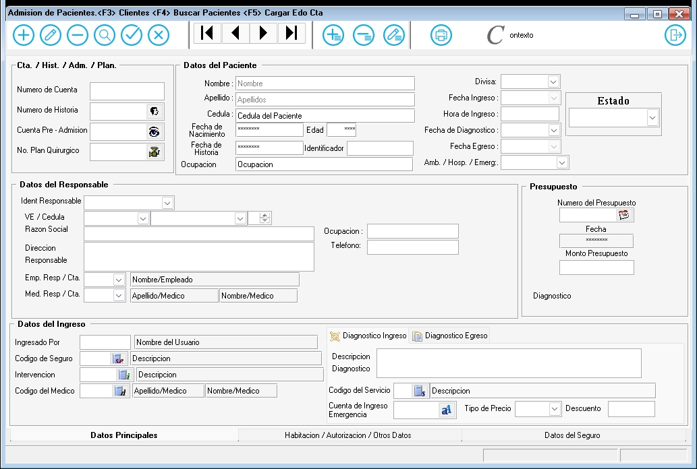

---

### **Documentación para la Admisión de un Paciente**

#### **1. Descripción General**
El formulario de admisión de pacientes es utilizado para registrar la entrada de un paciente a un centro médico. Este formulario captura información esencial sobre el paciente, el servicio requerido, los datos del seguro y los responsables del paciente.

---

#### **2. Campos del Formulario**

##### **2.1. Datos de Ingreso**
- **Código del Servicio**: Código único que identifica el servicio médico requerido.
- **Número de Cuenta**: Número de cuenta asociado al paciente.
- **Número de Historia**: Número de historia clínica del paciente.
- **Número de Admisión**: Número único de admisión.
- **Número de Plan Quirúrgico**: Número del plan quirúrgico si aplica.

##### **2.2. Datos del Paciente**
- **Nombre**: Nombre del paciente.
- **Apellido**: Apellido(s) del paciente.
- **Cédula**: Número de cédula de identidad del paciente.
- **Fecha de Nacimiento**: Fecha de nacimiento del paciente.

##### **2.3. Datos del Seguro**
- **Estado**: Estado del seguro (Activo, Inactivo).
- Cuando el usuario carga la Admision y agrega un codigo de seguro y Graba(F1) se activa automaticamente la pestaña datos seguros
- **Divisa**: Tipo de moneda en la que se maneja el seguro.
- La divisa por defecto es "Bs." y sera la que por defecto se usa.
- **S**: Indicador adicional del seguro (si aplica).

##### **2.4. Datos del Responsable**
- **Cédula**: Número de cédula del responsable.
- **Razón Social**: Nombre o razón social del responsable.
- **Dirección**: Dirección del responsable.
- **Responsable**: Nombre del responsable directo.
- **Emp. Resp. Med. Resp.**: Empresa responsable médica.

##### **2.5. Identificación del Responsable**
- **Teléfono**: Número de teléfono del responsable.
- **Inscripción**: Número de inscripción del responsable.
- **Empleo**: Ocupación del responsable.
- **Nombre del Usuario**: Nombre del usuario que realiza la admisión.

##### **2.6. Datos del Ingreso**
- **Línea de Ingreso**: Tipo de ingreso (Urgente, Programado, etc.).
- **Configuración**: Configuración específica del ingreso.
  - **Descripción**: Descripción del ingreso.
  - **Ingreso**: Fecha y hora de ingreso.
  - **Egreso**: Fecha y hora de egreso.
  - **Podl Diagnóstico**: Diagnóstico preliminar.
  - **Servicio**: Servicio médico requerido.
  - **Drogio del Medico**: Medicamentos recetados.
  - **Análisis/Medico**: Análisis o estudios médicos requeridos.
  - **Técnico Esp.**: Técnico especialista asignado.
  - **Medico Historia**: Médico responsable de la historia clínica.
  - **Enfermedad**: Enfermedad principal.
  - **Ing Un Servicio**: Servicio de ingreso.
  - **Descripción**: Descripción adicional.
  - **Cuenta de Ingreso**: Cuenta asociada al ingreso.
  - **Otro Servicio**: Otros servicios requeridos.
<<<<<<< Updated upstream
<<<<<<< Updated upstream
 =======
  - **Diagnóstico**: Diagnóstico Inicial del Ingreso.
>>>>>>> Stashed changes
=======
  - **Diagnóstico**: Diagnóstico Inicial del Ingreso.
>>>>>>> Stashed changes

---

#### **3. Instrucciones para Completar el Formulario**

1. **Datos de Ingreso**:
   - Ingrese el código del servicio requerido.
   - Complete el número de cuenta, número de historia, número de admisión y número de plan quirúrgico si aplica.

2. **Datos del Paciente**:
   - Ingrese el nombre, apellido, cédula y fecha de nacimiento del paciente.

3. **Datos del Seguro**:
   - Seleccione el codigo del seguro y el tipo de divisa.

4. **Datos del Responsable**:
   - Ingrese la cédula, razón social, dirección, nombre del responsable y empresa responsable médica.

5. **Identificación del Responsable**:
   - El identificador automaticamente cuando se carga cedula responsable.

6. **Datos del Ingreso**:
   - Seleccione la línea de ingreso y complete la configuración específica del ingreso, incluyendo descripción, fechas de ingreso y egreso, diagnóstico, servicios, medicamentos, análisis, técnico especialista, médico responsable, enfermedad, cuenta de ingreso y otros servicios.

---

#### **4. Validaciones y Restricciones**

- **Campos Obligatorios**: Código del Servicio, Número de Cuenta, Nombre, Apellido, Cédula, Fecha de Nacimiento, Estado del Seguro, Cédula del Responsable, Razón Social, Teléfono, Línea de Ingreso, Descripción, Ingreso, Diagnóstico.
- **Formato de Fecha**: Las fechas deben estar en formato DD/MM/AAAA.
- **Longitud Máxima**:
  - Nombre y Apellido: 100 caracteres.
  - Cédula: 15 caracteres.
  - Razón Social: 200 caracteres.
  - Dirección: 200 caracteres.

---

#### **5. Ejemplo de Interfaz**

---

#### **6. Flujo de Trabajo**

1. El usuario ingresa la información del paciente y los datos de ingreso en los campos correspondientes.
2. El usuario hace clic en "Guardar" para registrar la admisión.
   - Si los campos obligatorios están completos y válidos, la admisión se registra en el sistema.
   - Si hay errores, se muestran mensajes de validación.
3. El usuario puede hacer clic en "Cancelar" para limpiar el formulario y descartar los cambios.

---

#### **7. Pruebas**

- **Caso 1**: Completar todos los campos obligatorios y hacer clic en "Guardar". Resultado esperado: Registro exitoso.
- **Caso 2**: Dejar campos obligatorios vacíos y hacer clic en "Guardar". Resultado esperado: Mensajes de error.
- **Caso 3**: Hacer clic en "Cancelar". Resultado esperado: Limpiar el formulario.

---
