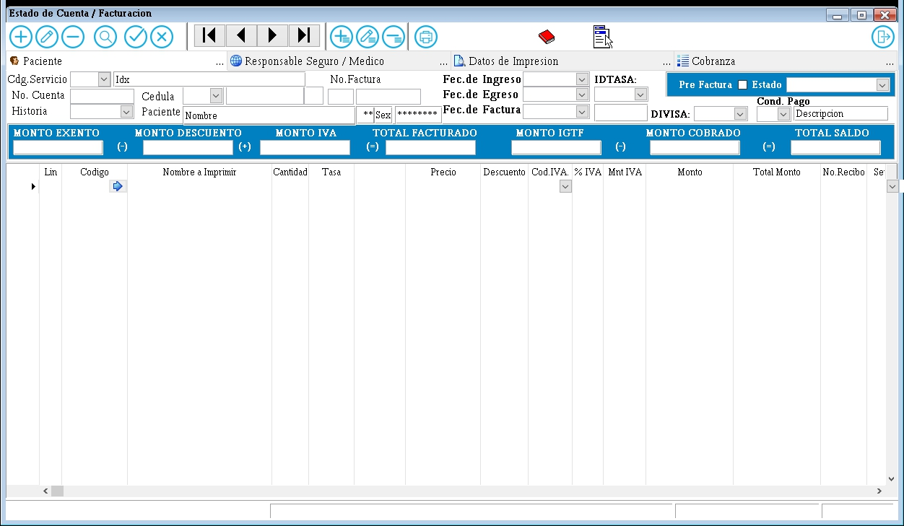

---

### **Documentación para el Formulario de Gestión de Cuentas del Paciente**

#### **1. Descripción General**
El formulario de gestión de cuentas del paciente es utilizado para registrar y gestionar los gastos y honorarios médicos asociados a un paciente. Este formulario permite agregar facturas, calcular montos exentos, descuentos, IVA, y gestionar el saldo total de la cuenta.

---

#### **2. Campos del Formulario**

##### **2.1. Información del Paciente y Responsable**
- **Paciente**: Nombre del paciente.
- **Idx**: Identificador único del paciente.
- **Responsable Seguro / Médico**: Nombre del responsable del seguro o médico.
- **Datos de Impresión**: Información adicional para la impresión de la factura.

##### **2.2. Detalles de la Factura**
- **Código Servicio**: Código del servicio médico.
- **No. Cuenta**: Número de cuenta asociado al paciente.
- **Historia**: Número de historia clínica.
- **No. Factura**: Número de la factura.
- **Fec. de Ingreso**: Fecha de ingreso del paciente.
- **IPTASA**: Tasa aplicada.
- **Pre Factura**: Monto antes de la factura.
- **Estado**: Estado de la factura (Pendiente, Pagada, etc.).
- **Cédula**: Número de cédula del paciente.
- **Fec. de Egreso**: Fecha de egreso del paciente.
- **Fec. de Factura**: Fecha de la factura.
- **Coma. Pago**: Comentarios sobre el pago.
- **Descripción**: Descripción adicional de la factura.

##### **2.3. Montos y Totales**
- **MONTO EXENTO**: Monto exento de impuestos.
- **MONTO DESCUENTO**: Monto de descuento aplicado.
- **MONTO IVA**: Monto del IVA.
- **TOTAL FACTURADO**: Total facturado.
- **MONTO IGTE**: Monto de otros impuestos.
- **MONTO COBRADO**: Monto cobrado.
- **TOTAL SALDO**: Saldo total pendiente.

##### **2.4. Detalles de Recibos**
- **Lín**: Línea de detalle.
- **Código**: Código del servicio o producto.
- **Monito**: Monto individual.
- **Total Monto**: Monto total.
- **No. Recibo**: Número de recibo.
- **Ser**: Serie del recibo.

---

#### **3. Instrucciones para Completar el Formulario**

1. **Información del Paciente y Responsable**:
   - Ingrese el nombre del paciente, el identificador único (Idx), y el nombre del responsable del seguro o médico.
   - Proporcione cualquier información adicional necesaria para la impresión de la factura.

2. **Detalles de la Factura**:
   - Complete el código del servicio, número de cuenta, número de historia clínica, número de factura, fecha de ingreso, tasa aplicada (IPTASA), monto antes de la factura, estado de la factura, cédula del paciente, fecha de egreso, fecha de la factura, comentarios sobre el pago y una descripción adicional.

3. **Montos y Totales**:
   - Ingrese el monto exento, monto de descuento, monto del IVA, total facturado, monto de otros impuestos, monto cobrado y el saldo total pendiente.

4. **Detalles de Recibos**:
   - Proporcione los detalles de cada recibo, incluyendo la línea de detalle, código del servicio o producto, monto individual, monto total, número de recibo y serie del recibo.

---

#### **4. Validaciones y Restricciones**

- **Campos Obligatorios**: Paciente, Idx, Código Servicio, No. Cuenta, No. Factura, Fec. de Ingreso, Estado, Cédula, Fec. de Egreso, Fec. de Factura, MONTO EXENTO, MONTO DESCUENTO, MONTO IVA, TOTAL FACTURADO, MONTO IGTE, MONTO COBRADO, TOTAL SALDO.
- **Formato de Fecha**: Las fechas deben estar en formato DD/MM/AAAA.
- **Longitud Máxima**:
  - Nombre del Paciente: 100 caracteres.
  - Código Servicio: 20 caracteres.
  - No. Cuenta: 15 caracteres.
  - No. Factura: 15 caracteres.
  - Descripción: 200 caracteres.

---

#### **5. Ejemplo de Interfaz**

---

#### **6. Flujo de Trabajo**

1. El usuario ingresa la información del paciente y los detalles de la factura en los campos correspondientes.
2. El usuario ingresa los montos y totales asociados a la factura.
3. El usuario proporciona los detalles de los recibos.
4. El usuario hace clic en "Guardar" para registrar la información.
   - Si los campos obligatorios están completos y válidos, la información se registra en el sistema.
   - Si hay errores, se muestran mensajes de validación.
5. El usuario puede hacer clic en "Cancelar" para limpiar el formulario y descartar los cambios.

---

#### **7. Pruebas**

- **Caso 1**: Completar todos los campos obligatorios y hacer clic en "Guardar". Resultado esperado: Registro exitoso.
- **Caso 2**: Dejar campos obligatorios vacíos y hacer clic en "Guardar". Resultado esperado: Mensajes de error.
- **Caso 3**: Hacer clic en "Cancelar". Resultado esperado: Limpiar el formulario.

---
