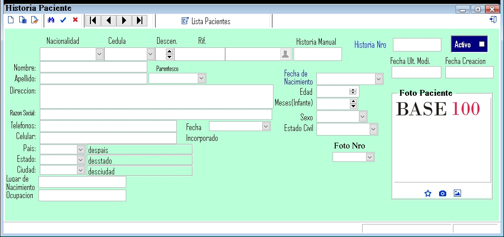

---

### **Documentación para el Registro de un Paciente**

#### **1. Descripción General**
El formulario de registro de pacientes es utilizado para capturar y almacenar información detallada sobre cada paciente. Esta información es esencial para el seguimiento médico, la gestión de historias clínicas y la administración de servicios de salud.

---

#### **2. Campos del Formulario**

##### **2.1. Información Básica del Paciente**
- **Nombre**: Nombre completo del paciente.
- **Apellido**: Apellido(s) del paciente.
- **Fecha de Nacimiento**: Fecha de nacimiento del paciente.
- **Edad**: Edad del paciente.
- **Meses (Infante)**: Edad en meses para pacientes infantiles.
- **Sexo**: Género del paciente (Masculino, Femenino, Otro).
- **Foto Paciente**: Campo para cargar una foto del paciente.

##### **2.2. Información de Identificación**
- **Nacionalidad**: Nacionalidad del paciente.
- **Cédula**: Número de cédula de identidad del paciente.
- **RIF**: Registro de Información Fiscal (si aplica).
- **Historia Manual**: Número de historia clínica manual (si existe).
- **Historia Nro**: Número de historia clínica electrónica.
- **Activo**: Indicador de si el paciente está activo en el sistema.

##### **2.3. Información de Contacto y Ubicación**
- **Dirección**: Dirección de residencia del paciente.
- **Estado**: Estado o provincia de residencia.
- **Ciudad**: Ciudad de residencia.
- **Lugar de Nacimiento**: Lugar donde nació el paciente.

##### **2.4. Información Adicional**
- **Parentesco**: Relación familiar o de parentesco (si aplica).
- **Ocupación**: Profesión u ocupación del paciente.
- **Fecha Creación**: Fecha en que se registró al paciente en el sistema.
- **Fecha Modificación**: Fecha de la última modificación del registro.

---

#### **3. Instrucciones para Completar el Formulario**

1. **Nombre y Apellido**: Ingrese el nombre completo del paciente.
2. **Fecha de Nacimiento**: Seleccione la fecha de nacimiento del calendario.
3. **Edad**: La edad se calculará automáticamente basándose en la fecha de nacimiento.
4. **Meses (Infante)**: Si el paciente es un infante, ingrese la edad en meses.
5. **Sexo**: Seleccione el género del paciente.
6. **Foto Paciente**: Cargue una foto reciente del paciente.
7. **Nacionalidad**: Seleccione la nacionalidad del paciente.
8. **Cédula**: Ingrese el número de cédula del paciente.
9. **RIF**: Si aplica, ingrese el RIF del paciente.
10. **Historia Manual**: Si existe, ingrese el número de historia clínica manual.
11. **Historia Nro**: Ingrese el número de historia clínica electrónica.
12. **Activo**: Marque esta casilla si el paciente está activo en el sistema.
13. **Dirección**: Ingrese la dirección completa del paciente.
14. **Estado y Ciudad**: Seleccione el estado y la ciudad de residencia.
15. **Lugar de Nacimiento**: Ingrese el lugar de nacimiento del paciente.
16. **Parentesco**: Si aplica, seleccione el parentesco del paciente.
17. **Ocupación**: Ingrese la ocupación del paciente.
18. **Fecha Creación y Modificación**: Estas fechas se registrarán automáticamente.

---

#### **4. Validaciones y Restricciones**

- **Campos Obligatorios**: Nombre, Apellido, Fecha de Nacimiento, Sexo, Cédula, Dirección, Estado, Ciudad.
- **Formato de Fecha**: La fecha de nacimiento debe estar en formato DD/MM/AAAA.
- **Longitud Máxima**:
  - Nombre y Apellido: 100 caracteres.
  - Cédula: 15 caracteres.
  - RIF: 20 caracteres.
  - Dirección: 200 caracteres.

---

#### **5. Ejemplo de Interfaz**

---

#### **6. Flujo de Trabajo**

1. El usuario ingresa la información del paciente en los campos correspondientes.
2. El usuario hace clic en "Guardar" para registrar al paciente.
   - Si los campos obligatorios están completos y válidos, el paciente se registra en el sistema.
   - Si hay errores, se muestran mensajes de validación.
3. El usuario puede hacer clic en "Cancelar" para limpiar el formulario y descartar los cambios.

---

#### **7. Pruebas**

- **Caso 1**: Completar todos los campos obligatorios y hacer clic en "Guardar". Resultado esperado: Registro exitoso.
- **Caso 2**: Dejar campos obligatorios vacíos y hacer clic en "Guardar". Resultado esperado: Mensajes de error.
- **Caso 3**: Hacer clic en "Cancelar". Resultado esperado: Limpiar el formulario.

---
