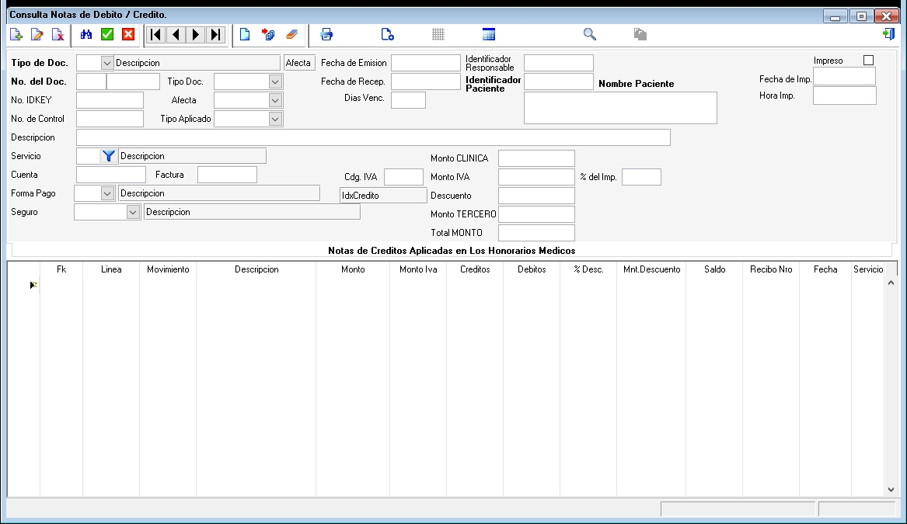

---

### **Documentación para el Formulario de Consulta de Notas de Débito/Crédito**

#### **1. Descripción General**
El formulario de Consulta de Notas de Débito/Crédito permite a los usuarios buscar, visualizar y reimprimir notas de débito y crédito asociadas a pacientes, facturas y servicios médicos. Estas notas son utilizadas para ajustar montos en las cuentas de los pacientes, ya sea para corregir errores, aplicar descuentos o realizar otros ajustes financieros. El formulario también permite filtrar y consultar notas específicas por tipo de documento, fecha, paciente, servicio, entre otros criterios.

---

#### **2. Campos del Formulario**

##### **2.1. Información del Documento**
- **Tipo de Doc.**: Tipo de documento (Nota de Débito o Nota de Crédito).
- **Descripción**: Descripción del documento.
- **Afecta**: Indica qué aspecto afecta el documento (factura, cuenta, etc.).
- **Fecha de Emisión**: Fecha en que se emitió el documento.
- **Identificador**: Identificador único del documento.
- **Responsable**: Nombre del responsable que emitió el documento.
- **Nombre Paciente**: Nombre del paciente asociado al documento.

##### **2.2. Número del Documento**
- **Tipo Doc.**: Tipo de documento relacionado (factura, recibo, etc.).
- **Fecha de Recog.**: Fecha de recogida del documento.
- **Fecha de Precio**: Fecha asociada al precio o monto.
- **Número**: Número del documento.
- **Fecha de Imp.**: Fecha de impresión del documento.

##### **2.3. Información Adicional**
- **No. DKEY**: Número de clave única asociada al documento.
- **Días Vero.**: Días de verificación o validez del documento.
- **Paciente**: Nombre del paciente asociado.
- **Hora Imp.**: Hora de impresión del documento.
- **No. de Control**: Número de control del documento.
- **Tipo Aplicado**: Tipo de ajuste aplicado (descuento, incremento, etc.).

##### **2.4. Descripción del Servicio**
- **Servicio**: Servicio médico asociado al documento.
- **Descripción**: Descripción detallada del servicio.
- **Monto CLINICA**: Monto asociado a la clínica.

##### **2.5. Información de Cuenta**
- **Factura**: Número de factura asociada.
- **Cdp, IVA**: Código y monto del IVA.
- **Monto IVA**: Monto del IVA aplicado.
- **% del Imp.**: Porcentaje del impuesto aplicado.

##### **2.6. Forma de Pago**
- **Descripción**: Descripción de la forma de pago.
- **Id&Credito**: Identificador de crédito asociado.
- **Descuento**: Monto de descuento aplicado.

##### **2.7. Información del Seguro**
- **Descripción**: Descripción del seguro asociado.
- **Monto TERCERO**: Monto cubierto por un tercero (seguro).

##### **2.8. Total MONTO**
- **Total MONTO**: Monto total de la nota de débito/crédito.

##### **2.9. Notas de Crédito Aplicadas en los Honorarios Médicos**
- **Fk**: Clave foránea asociada.
- **Línea**: Línea de detalle.
- **Movimiento**: Tipo de movimiento (crédito o débito).
- **Descripción**: Descripción del movimiento.
- **Monto**: Monto asociado.
- **Monto Iva**: Monto del IVA.
- **Creditos**: Créditos aplicados.
- **Debitos**: Débitos aplicados.
- **% Desc.**: Porcentaje de descuento.
- **Min.Descuento**: Descuento mínimo aplicado.
- **Saldo**: Saldo pendiente.
- **Recho Nto**: Número de recibo asociado.
- **Fecha**: Fecha del movimiento.
- **Servicio**: Servicio asociado.

---

#### **3. Instrucciones para Completar el Formulario**

1. **Filtros de Búsqueda**:
   - Seleccione el **Tipo de Doc.** (Nota de Débito o Crédito).
   - Ingrese el **Identificador** o **Número del Doc.** para buscar una nota específica.
   - Filtre por **Fecha de Emisión**, **Paciente**, **Servicio**, o **Responsable**.

2. **Visualización de Detalles**:
   - Una vez seleccionada la nota, el sistema mostrará los detalles completos, incluyendo montos, descripciones, y servicios asociados.

3. **Reimpresión**:
   - Para reimprimir una nota, seleccione la nota deseada y haga clic en el botón de **Reimprimir**.

---

#### **4. Validaciones y Restricciones**

- **Campos Obligatorios**: Tipo de Doc., Identificador, Fecha de Emisión.
- **Formato de Fecha**: Las fechas deben estar en formato DD/MM/AAAA.
- **Longitud Máxima**:
  - Descripción: 200 caracteres.
  - Nombre Paciente: 100 caracteres.
  - Número del Doc.: 20 caracteres.

---

#### **5. Ejemplo de Interfaz**

---

#### **6. Flujo de Trabajo**

1. **Búsqueda**:
   - El usuario ingresa los criterios de búsqueda (tipo de documento, identificador, fecha, etc.).
   - El sistema muestra las notas que coinciden con los criterios.

2. **Visualización**:
   - El usuario selecciona una nota para ver sus detalles completos.

3. **Reimpresión**:
   - El usuario selecciona una nota y hace clic en **Reimprimir** para generar una copia impresa.

---

#### **7. Pruebas**

- **Caso 1**: Buscar una nota de crédito por identificador. Resultado esperado: Mostrar detalles de la nota.
- **Caso 2**: Reimprimir una nota de débito. Resultado esperado: Generar una copia impresa.
- **Caso 3**: Buscar notas por fecha de emisión. Resultado esperado: Mostrar todas las notas emitidas en esa fecha.

---
