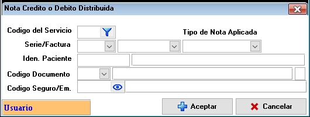

### **Documentación para el Formulario de Creación de Notas de Crédito/Débito Distribuidas**

#### **1. Descripción General**
El formulario de **Notas de Crédito/Débito Distribuidas** permite crear notas de crédito o débito asociadas a facturas existentes. Estas notas pueden aplicarse de manera distribuida, es decir, seleccionando los ítems específicos de la factura sobre los cuales se desea realizar el ajuste. Además, el formulario permite agregar nuevos ítems a la factura mediante una nota de débito. Este proceso es útil para corregir errores, aplicar descuentos, o realizar ajustes financieros en las facturas de los pacientes.

---

#### **2. Campos del Formulario**

##### **2.1. Información de la Factura**
- **Código del Servicio**: Código único que identifica el servicio médico asociado a la factura.
- **Série/Factura**: Número de serie o número de la factura a la que se aplicará la nota de crédito/débito.
- **Idén. Paciente**: Identificador único del paciente asociado a la factura.

##### **2.2. Información del Documento**
- **Código Documento**: Código único que identifica el documento (nota de crédito o débito).
- **Código Seguro/Em.**: Código del seguro o empresa asociada al paciente (si aplica).

##### **2.3. Tipo de Nota**
- **Tipo de Nota Aplicada**: Selección del tipo de nota a aplicar (Crédito o Débito).

##### **2.4. Botones de Acción**
- **Aceptar**: Confirma la creación de la nota de crédito/débito.
- **Cancelar**: Cancela la operación y cierra el formulario sin guardar cambios.

---

#### **3. Instrucciones para Completar el Formulario**

1. **Selección de la Factura**:
   - Ingrese el **Código del Servicio** o el número de **Série/Factura** para identificar la factura sobre la cual se aplicará la nota.
   - Proporcione el **Idén. Paciente** para asegurar que la factura corresponde al paciente correcto.

2. **Información del Documento**:
   - Ingrese el **Código Documento** para identificar la nota de crédito/débito.
   - Si aplica, ingrese el **Código Seguro/Em.** asociado al paciente.

3. **Tipo de Nota**:
   - Seleccione el **Tipo de Nota Aplicada** (Crédito o Débito) según el ajuste que desee realizar.

4. **Selección de Ítems**:
   - Seleccione los ítems de la factura sobre los cuales desea aplicar la nota de crédito/débito.
   - Si es necesario, agregue un nuevo ítem a la factura mediante una nota de débito.

5. **Confirmación**:
   - Haga clic en **Aceptar** para confirmar la creación de la nota.
   - Si desea cancelar la operación, haga clic en **Cancelar**.

---

#### **4. Validaciones y Restricciones**

- **Campos Obligatorios**: Código del Servicio, Série/Factura, Idén. Paciente, Código Documento, Tipo de Nota Aplicada.
- **Formato de Código**: Los códigos deben ser alfanuméricos y cumplir con la longitud máxima permitida.
- **Longitud Máxima**:
  - Código del Servicio: 20 caracteres.
  - Série/Factura: 15 caracteres.
  - Idén. Paciente: 15 caracteres.
  - Código Documento: 20 caracteres.
  - Código Seguro/Em.: 20 caracteres.

---

#### **5. Ejemplo de Interfaz**

---

#### **6. Flujo de Trabajo**

1. **Búsqueda de la Factura**:
   - El usuario ingresa el **Código del Servicio** o **Série/Factura** y el **Idén. Paciente** para localizar la factura.

2. **Selección de Ítems**:
   - El usuario selecciona los ítems de la factura sobre los cuales desea aplicar la nota de crédito/débito.
   - Si es necesario, el usuario agrega un nuevo ítem mediante una nota de débito.

3. **Confirmación**:
   - El usuario hace clic en **Aceptar** para generar la nota.
   - Si el usuario hace clic en **Cancelar**, se descartan los cambios y se cierra el formulario.

---

#### **7. Pruebas**

- **Caso 1**: Crear una nota de crédito sobre una factura existente. Resultado esperado: La nota se genera correctamente y se aplica a los ítems seleccionados.
- **Caso 2**: Agregar un nuevo ítem a la factura mediante una nota de débito. Resultado esperado: El nuevo ítem se agrega a la factura y la nota de débito se genera correctamente.
- **Caso 3**: Cancelar la operación antes de guardar. Resultado esperado: El formulario se cierra sin guardar cambios.

---
